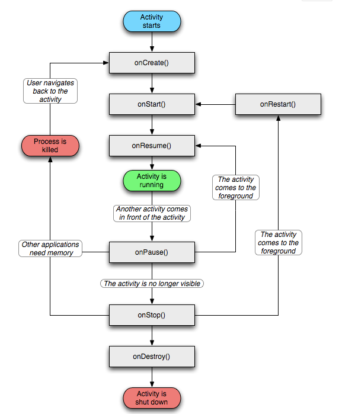
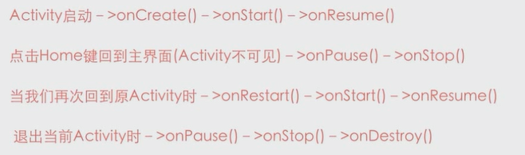

#### 一，四种状态与生命周期

running / paused / stopped / killed

#### 进程优先级

前台 / 可见 / 服务 / 后台 / 空

#### Android任务栈/启动模式

1，standard 每次启动activity都会重新创建一个新的实例，走生命周期，加到任务栈

2，singletop 栈顶复用

3，singletask 栈内复用。会回调onNewIntent方法，上面的activity会被销毁。

4，singleInstance 有且只有一个实例，并且独占任务栈

#### scheme跳转协议

