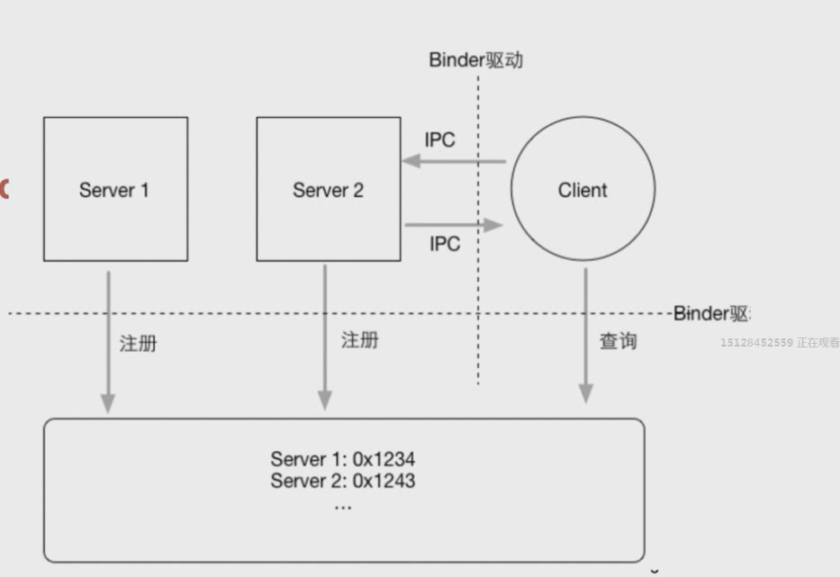
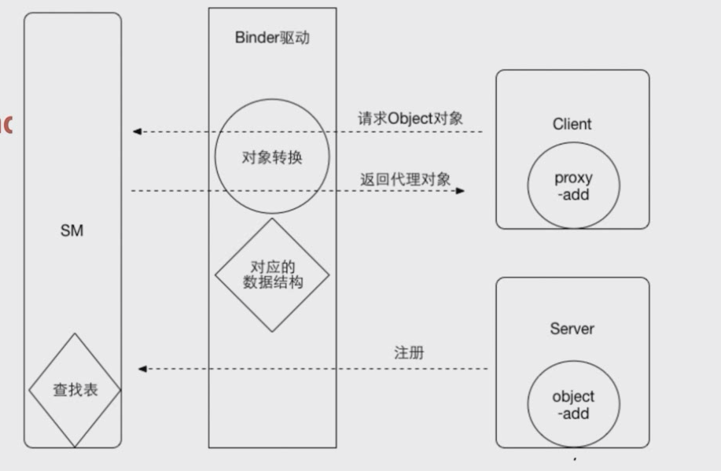
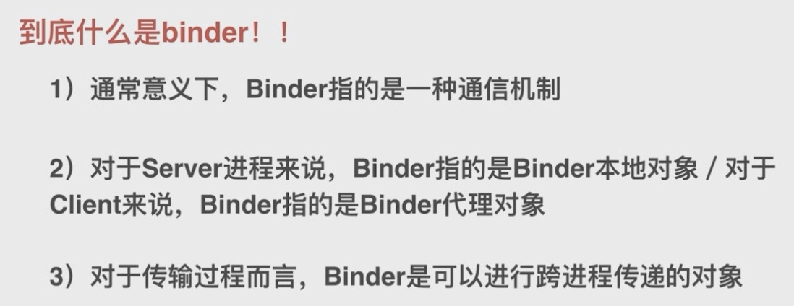
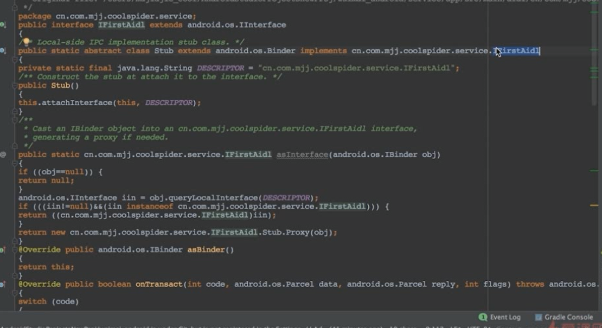
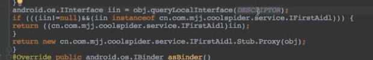
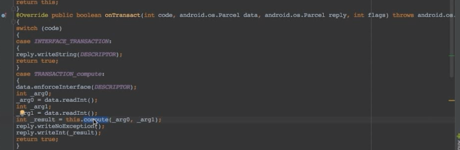

## Linux内核的基础知识：

1，进程隔离/虚拟地址空间

2，系统调用 （app只能访问特定内容，也可以通过系统api调用内核程序访问相关内容）

3，binder驱动

## 为什么使用binder

1，Linux内核拥有很多跨进程通信

2，性能优化。比linux的管道，socket等效率更好

3，安全：传统的跨进程通信没有进行严格的身份验证，只有上层架构才进行身份验证。binder协议本身就支持通信双方进行身份校验。binder身份校验也是android权限模型的基础

### 通信模型

客户端持有的是服务端的一个代理。里面的方法执行是代理调用内核执行的。

### aidl

编译工具会自动生成一个Stub抽象的静态内部类，继承了binder和实现了自己定义的跨进程方法。说明他是个binder的本地对象，它具备服务端承若的传递数据的能力。抽象类所以实现方法要自己实现，这是一个策略模式。

同进程使用本地对象，否则使用代理对象

跨进程传递的是编号

