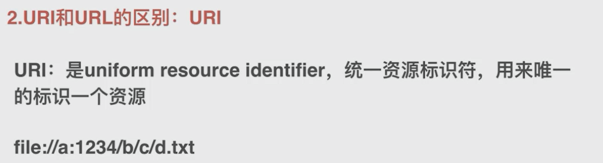

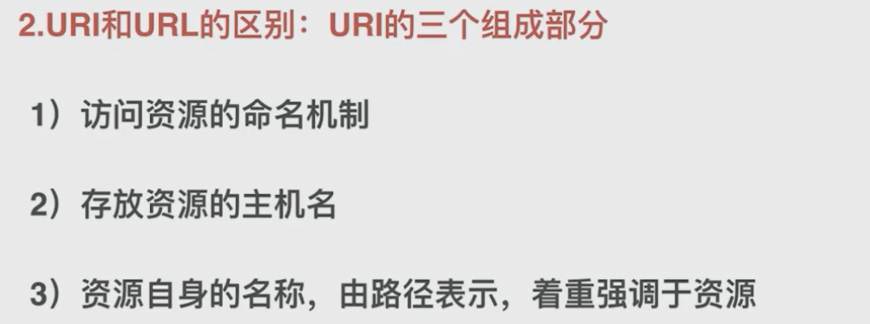

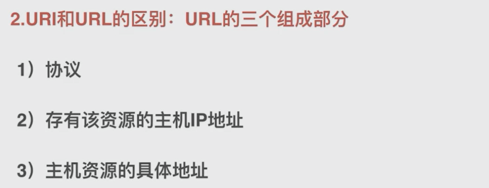

#### http特点：

1，简单快速：只需要请求方法和路径就可以获得路径，因为协议简单使得服务端要求小，处理快。

2，无连接。一次连接处理一件事情，处理完就断开

3，无状态：对以前处理的事物是没有记忆的

#### request/response

charles抓包工具

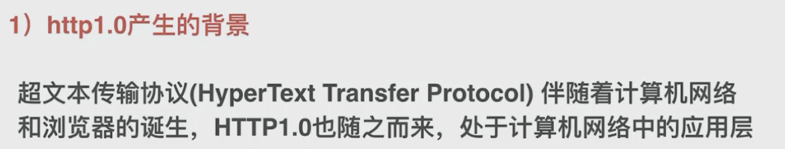

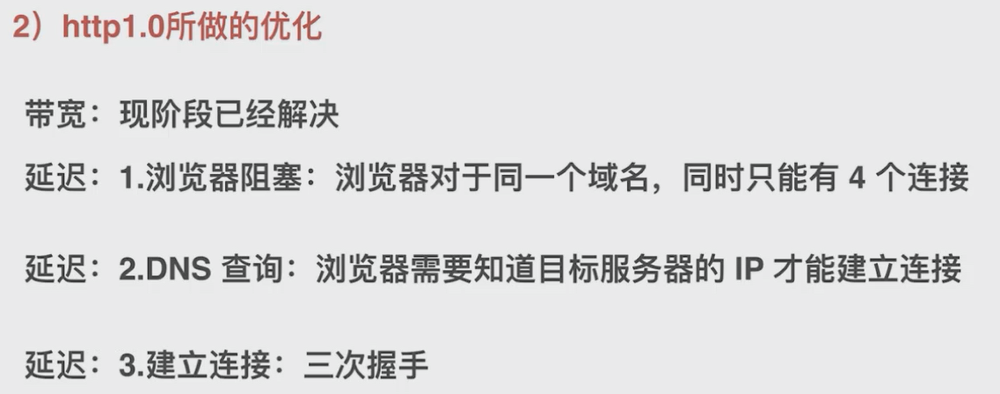

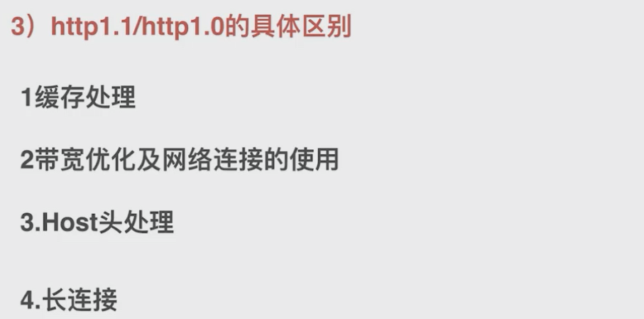

1.1 支持了keepalive，来弥补多次创建连接产生的延迟，但是使用多了同样会给服务端带来大量性能压力

1,1 传输数据时，内容都是明文，无法验证对方的身份。

header里携带的内容过大。

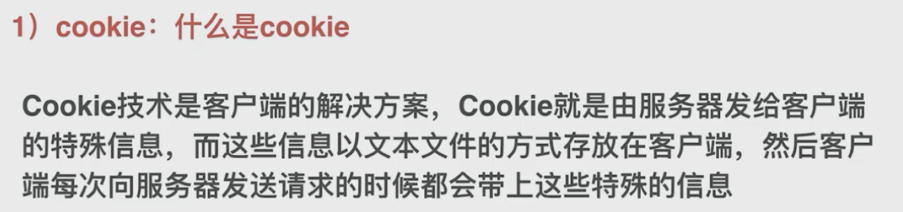

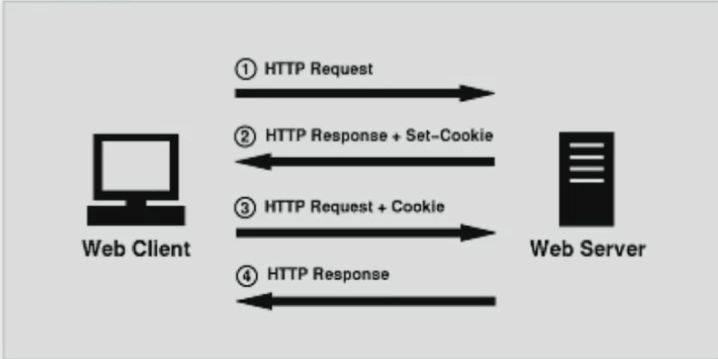

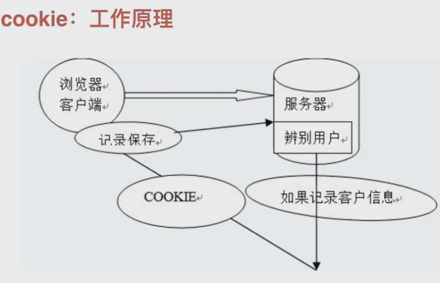

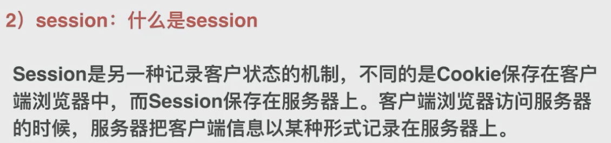

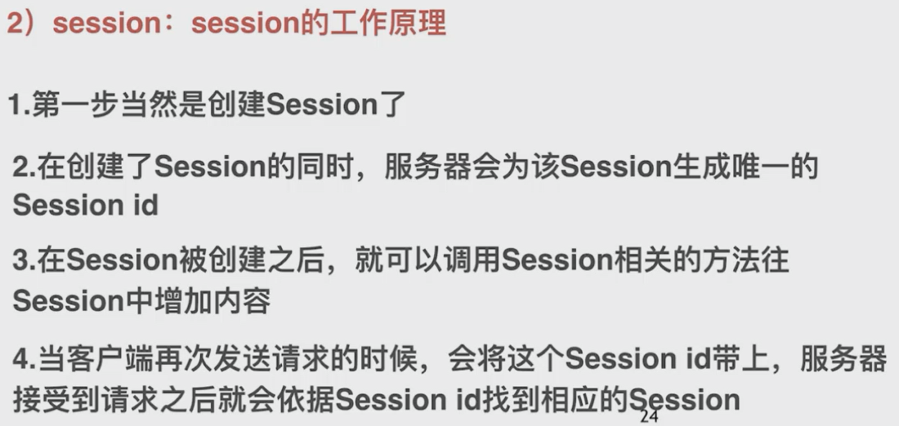

# HTTPS

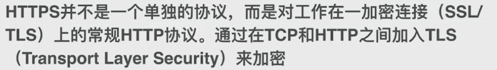

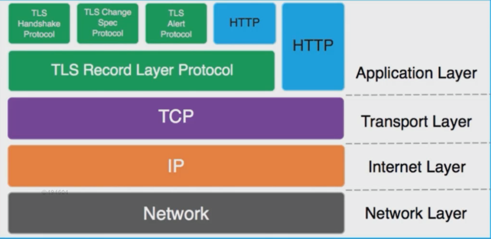

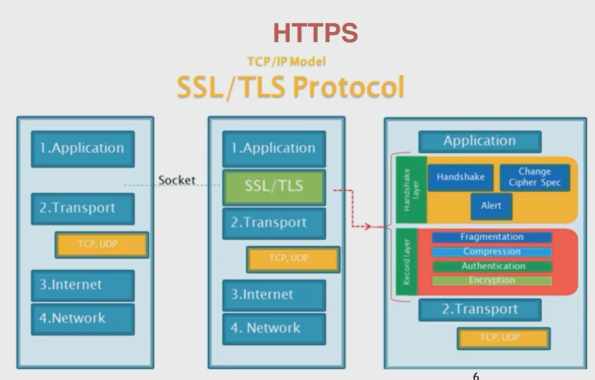

https传输速度：

1，通信慢，增加了SSL/TLS通信

2，消耗资源，SSL必须进行加密处理

## 密码学原理

对称加密：加密用的秘钥和解密用的秘钥是同样的

不对称加密：不一样，私有秘钥：一方保管。

公有秘钥：双方公有

数字证书：

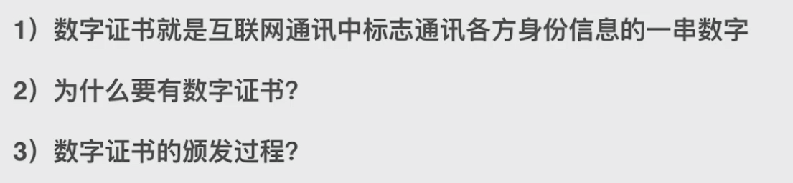

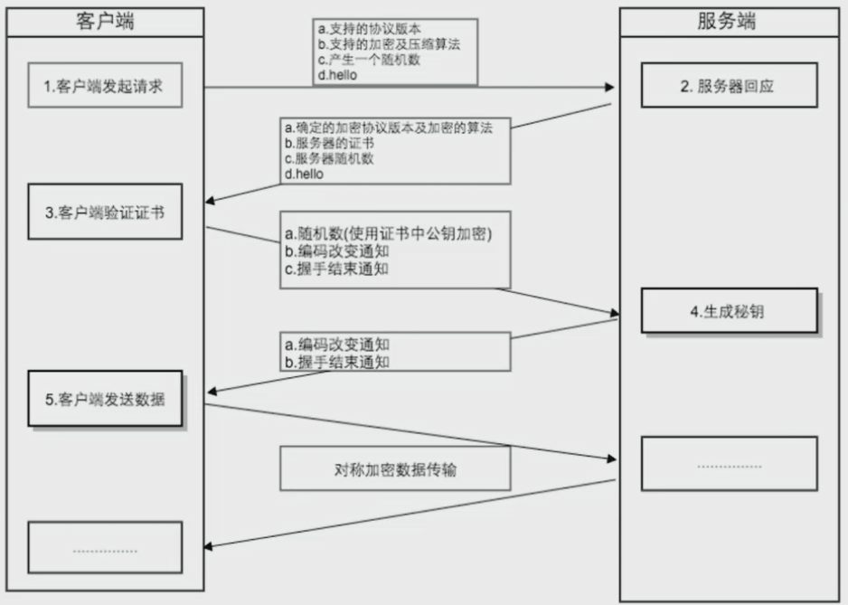

