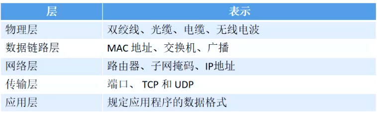
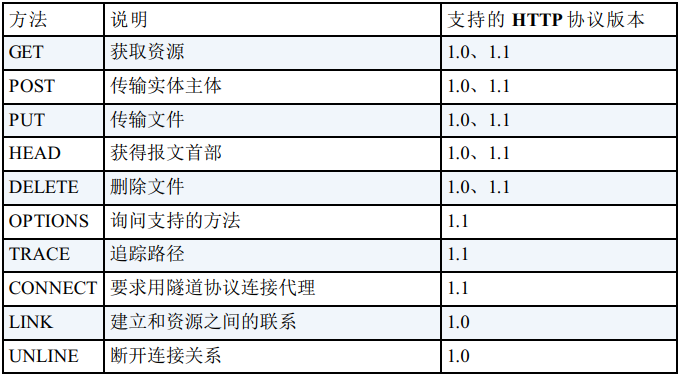

# 一，网络原理

## OSI模型

OSI（Open System Interconnect）开放式系统互联。是ISO国际标准化联盟1985年研究的网络互联模型。推荐所有公司都使用这样的规范来控制网络，这样所有公司都有相同的规范，就可以互联了。


**不同层的不同协议5层模型**




## 不同介质代表的0和1

**电线：**高电平代表1，低电平代表0

**光纤：**光纤中是用光信号来传递信息的。目前用的光源有激光二极管和发光二极管（短距离传输用）。对信息进行模数转换成数字信号，再进行编码，在光纤中传送。**就是用光的断续来传输0和1**

**无线电：**和调制方式有关，不同的调制方式无线信号表示0，1的方式不同。比如可以通过星座图上的相位点，可以根据脉冲的极性，可以根据帧率，等等

数字信号，抗干扰性强，没有噪声积累现象，能够实现长距离高质量的传送。数字信号除了频分多路(FDMA)外还有时分多路(TDMA)和码分多路（CDMA）实现无线电频率资源的充分利用

## 不同标准对应字节长度

**GB-231280**编码为2个字节包含了20902个汉字，其编码范围是0x8140-0xfefe

**GB18030-2000**(GBK2K)在GBK基础上进一步扩展了汉字，增加了藏，蒙等少数民族的字形。编码是变长的，其二字节部分与GBK兼容；四字节部分是扩充的字形，字位，其编码范围是首字节0x81-0xfe，二字节0x30-0x39，三字节0x81-0xfe，四字节0x30-0x39

**Unicode**范围一般所用为\U0000-\UFFFF，对于CJK EXT B区汉字，范围大于\U20000

**UTF**：按其基本长度所用位数分为UTF-8/16/32。其中：

**UTF-8**是变长编码，每个Unicode代码点按照不同范围，可以有1-3字节的不同长度。

**UTF-16**长度相对固定，只要不大于\U20000范围的字节，每个Unicode代码点使用2字节表示，超出部分使用2个UTF-16即4个字节表示。按照高低位字节顺序，又分为UTF-16BE/UTF-16LE。

**UTF-32**长度始终固定，每个Unicode代码点使用4字节表示。按照高低位字节顺序，又分为UTF-32BE/UTF-32LE。


## 网络连接类型

**单工**：通信过程任意时刻，信息只能从一方A传到另一方B。比如：无线广播。

**半双工：**任意时刻，信息既可以从A传到B，又能从B传到A，但只能一个方向上的传输存在，称为办双工传输。**比如http**

**全双工：**任意时刻，线路上存在A到B和B到A的双向信号传输。比如：socket


## 长短链接

**短链接**：客户端请求数据完就关闭链接，下次请求数据需要重新建立连接

**长连接**：建立连接，数据传递完之后一段时间内保持连接不断，需要传递数据的时候复用之前的链接。一段时间内没有数据传输则关闭

**http1.0默认短链接，http1.1默认长连接**

可以通过“Connection:Keep-Alive”来配置

问题：那多长时间后关闭？自动关闭还是主动关闭？


# Http/Https

Http（HyperText Transfer Protocol）超文本传输协议，基于TCP。

| http | https             |
| ---- | ----------------- |
| HTTP | HTTP              |
|      | <u>SSL or TLS</u> |
| TCP  | TCP               |
| IP   | IP                |


## HTTP报文格式


## Http请求的方式


## Http请求的流程


## 状态码分类

| 状态码 | 名称                            | 描述                                                         |
| ------ | ------------------------------- | ------------------------------------------------------------ |
| 100    | Continue                        | 继续。客户端应继续其请求                                     |
| 101    | Switching Protocols             | 切换协议。服务器根据客户端的请求切换协议。只能切换到更高级的协议，例如，切换到HTTP的新版本协议 |
| 200    | OK                              | 请求成功。一般用于GET与POST请求                              |
| 201    | Created                         | 已创建。成功请求并创建了新的资源                             |
| 202    | Accepted                        | 已接受。已经接受请求，但未处理完成                           |
| 203    | Non-Authoritative Information   | 非授权信息。请求成功。但返回的meta信息不在原始的服务器，而是一个副本 |
| 204    | No Content                      | 无内容。服务器成功处理，但未返回内容。在未更新网页的情况下，可确保浏览器继续显示当前文档 |
| 205    | Reset Content                   | 重置内容。服务器处理成功，用户终端（例如：浏览器）应重置文档视图。可通过此返回码清除浏览器的表单域 |
| 206    | Partial Content                 | 部分内容。服务器成功处理了部分GET请求                        |
| 300    | Multiple Choices                | 多种选择。请求的资源可包括多个位置，相应可返回一个资源特征与地址的列表用于用户终端（例如：浏览器）选择 |
| 301    | Moved Permanently               | 永久移动。请求的资源已被永久的移动到新URI，返回信息会包括新的URI，浏览器会自动定向到新URI。今后任何新的请求都应使用新的URI代替 |
| 302    | Found                           | 临时移动。与301类似。但资源只是临时被移动。客户端应继续使用原有URI |
| 303    | See Other                       | 查看其它地址。与301类似。使用GET和POST请求查看               |
| 304    | Not Modified                    | 未修改。所请求的资源未修改，服务器返回此状态码时，不会返回任何资源。客户端通常会缓存访问过的资源，通过提供一个头信息指出客户端希望只返回在指定日期之后修改的资源 |
| 305    | Use Proxy                       | 使用代理。所请求的资源必须通过代理访问                       |
| 306    | Unused                          | 已经被废弃的HTTP状态码                                       |
| 307    | Temporary Redirect              | 临时重定向。与302类似。使用GET请求重定向                     |
| 400    | Bad Request                     | 客户端请求的语法错误，服务器无法理解                         |
| 401    | Unauthorized                    | 请求要求用户的身份认证                                       |
| 402    | Payment Required                | 保留，将来使用                                               |
| 403    | Forbidden                       | 服务器理解请求客户端的请求，但是拒绝执行此请求               |
| 404    | Not Found                       | 服务器无法根据客户端的请求找到资源（网页）。通过此代码，网站设计人员可设置"您所请求的资源无法找到"的个性页面 |
| 405    | Method Not Allowed              | 客户端请求中的方法被禁止                                     |
| 406    | Not Acceptable                  | 服务器无法根据客户端请求的内容特性完成请求                   |
| 407    | Proxy Authentication Required   | 请求要求代理的身份认证，与401类似，但请求者应当使用代理进行授权 |
| 408    | Request Time-out                | 服务器等待客户端发送的请求时间过长，超时                     |
| 409    | Conflict                        | 服务器完成客户端的PUT请求是可能返回此代码，服务器处理请求时发生了冲突 |
| 410    | Gone                            | 客户端请求的资源已经不存在。410不同于404，如果资源以前有现在被永久删除了可使用410代码，网站设计人员可通过301代码指定资源的新位置 |
| 411    | Length Required                 | 服务器无法处理客户端发送的不带Content-Length的请求信息       |
| 412    | Precondition Failed             | 客户端请求信息的先决条件错误                                 |
| 413    | Request Entity Too Large        | 由于请求的实体过大，服务器无法处理，因此拒绝请求。为防止客户端的连续请求，服务器可能会关闭连接。如果只是服务器暂时无法处理，则会包含一个Retry-After的响应信息 |
| 414    | Request-URI Too Large           | 请求的URI过长（URI通常为网址），服务器无法处理               |
| 415    | Unsupported Media Type          | 服务器无法处理请求附带的媒体格式                             |
| 416    | Requested range not satisfiable | 客户端请求的范围无效                                         |
| 417    | Expectation Failed              | 服务器无法满足Expect的请求头信息                             |
| 500    | Internal Server Error           | 服务器内部错误，无法完成请求                                 |
| 501    | Not Implemented                 | 服务器不支持请求的功能，无法完成请求                         |
| 502    | Bad Gateway                     | 充当网关或代理的服务器，从远端服务器接收到了一个无效的请求   |
| 503    | Service Unavailable             | 由于超载或系统维护，服务器暂时的无法处理客户端的请求。延时的长度可包含在服务器的Retry-After头信息中 |
| 504    | Gateway Time-out                | 充当网关或代理的服务器，未及时从远端服务器获取请求           |
| 505    | HTTP Version not supported      | 服务器不支持请求的HTTP协议的版本，无法完成处理               |


 

## 请求头


## 响应头


## **Cookie 、Session、Token**

1 ，都是用来做持久化处理的，目的就是让客户端和服务端相互认识。**Http请求默认是不持久的没有状态的**，谁也不认识谁

2 ，Cookie: 是存放在客户端的信息，这个信息是来**自于服务器返回的信息**，

**下次**请求带过去，如果用户离开网站后，如果Cookie已过期一般是会被清除的。如果Cookie没过期下次访问网站还是会带过去。（相对危险）

3 ，Session: 是存放在服务器上面的客户端临时信息，用户离开网站是会被清除的。（相对安全，耗资源）

4 ，Token（App）"令牌"：用户身份的验证，有点类似于 Cookie  ，相对来说更安全，一般流程：

​	4.1 客户端像服务端申请 Token

​	4.2 服务端收到请求，会去验证用户信息,签发一个 Token 给客户端，自己保存 Token

​	4.3 客户端收到 Token 会保存起来，每次请求带上 Token 

​	4.4 服务器收到其他请求，会去验证客户端的 Token , 如果成功返回数据，不成功啥都不给

 


## Http1.0和Http1.1的区别

**Http缺点：**

**一，数据是没有加密传输，可能遭遇窃听**

Http明文传输的，TCP/IP协议是可以被窃听的，无法保证数据不被泄漏。抓包，嗅探器都可以窃取信息。


**二，不验证通信方的身份，可能会遭遇伪装**

HTTP协议中的请求和响应不会对通信方进行确认。也就是说“服务器是否就是发送请求中URI真正指定的主机，返回的响应是否真的返回到实际提出请求的客户端”等类似信息。

（1）任何人都可以发起请求

HTTP协议本身非常简单，不论谁发送过来的请求都会返回响应，因此不确认通信方，会存在各种隐患：


（2）查看对手的证书

通过SSL证书可以验证对方信息


**三， 无法验证报文的完整性（准确定），可能会遭遇篡改**


Https = Http + 加密 + 验证 + 完整


#### http特点：

1，简单快速：只需要请求方法和路径就可以获得路径，因为协议简单使得服务端要求小，处理快。

2，无连接。一次连接处理一件事情，处理完就断开

3，无状态：对以前处理的事物是没有记忆的

**区别**

1，支持的方法不同



2，端口：Http (80)  Https (443)

3，持久化，管线化

持久化使得多数请求以管线化方式发送称为可能，不需要等待响应亦可直接发送下一个请求


 

## Http 1.x 和 Http 2.0 的区别

1 Http 2.0 采用二进制格式而非文本格式

2 Http 2.0 支持完全的多路复用

3 Http 2.0 使用报头压缩，降低开销

4 Http 2.0  让服务器将响应主动推送给客户端，（带内容推送，不带内容推送的通知）


## Http瓶颈

1，一条连接上只可发送一个请求。
2，请求只能从客户端开始。 客户端不可以接收除响应以外的指令。
3，请求 / 响应首部未经压缩就发送。 首部信息越多延迟越大。
4，发送冗长的首部。 每次互相发送相同的首部造成的浪费较多。

5，可任意选择数据压缩格式。 非强制压缩发送  


 

 以前的http通信

### Ajax 的解决方法

Ajax（Asynchronous JavaScript and XML， 异 步 JavaScript 与 XML技术） 是一种有效利用 JavaScript 和 DOM（Document Object Model， 文档对象模型） 的操作， 以达到局部 Web 页面替换加载的异步通信手段。 和以前的同步通信相比， 由于它只更新一部分页面， 响应中传输的数据量会因此而减少， 这一优点显而易见。
Ajax 的核心技术是名为 XMLHttpRequest 的 API， **通过 JavaScript 脚本语言的调用就能和服务器进行 HTTP 通信**。 借由这种手段， 就能从已加载完毕的 Web 页面上发起请求， 只更新局部页面。**而利用 Ajax 实时地从服务器获取内容， 有可能会导致大量请求产生**。 另外， Ajax 仍未解决 HTTP 协议本身存在的问题。  


图： Ajax 通信

### Comet 的解决方法

一旦服务器端有内容更新了， Comet 不会让请求等待， 而是直接给客户端返回响应。 这是一种通过延迟应答， 模拟实现服务器端向客户端推送（Server Push） 的功能。
通常， 服务器端接收到请求， 在处理完毕后就会立即返回响应， 但为了实现推送功能， **Comet 会先将响应置于挂起状态，** 当服务器端有内容更新时， 再返回该响应。 因此， 服务器端一旦有更新， 就可以立即反馈给客户端。
内容上虽然可以做到实时更新， 但为了保留响应， 一次连接的持续时间也变长了。 期间， 为了维持连接会消耗更多的资源。 另外， Comet也仍未解决 HTTP 协议本身存在的问题  


### SPDY的目标

陆续出现的 Ajax 和 Comet 等提高易用性的技术， 一定程度上使 HTTP得到了改善， 但 HTTP 协议本身的限制也令人有些束手无策。 为了进行根本性的改善， 需要有一些协议层面上的改动。
处于持续开发状态中的 SPDY 协议， 正是为了在**协议级别**消除 HTTP所遭遇的瓶颈  


### SPDY的设计与功能

SPDY 没有完全改写 HTTP 协议， **而是在 TCP/IP 的应用层与运输层之间通过新加会话层的形式运作**。 同时， 考虑到安全性问题， SPDY 规定通信中使用 SSL。
SPDY 以会话层的形式加入， 控制对数据的流动， 但还是采用 HTTP建立通信连接。 因此， 可照常使用 HTTP 的 GET 和 POST 等方 法、
Cookie 以及 HTTP 报文等。

使用 SPDY 后， HTTP 协议额外获得以下功能。
**多路复用流**
通过单一的 TCP 连接， 可以无限制处理多个 HTTP 请求。 所有请求的处理都在一条 TCP 连接上完成， 因此 TCP 的处理效率得到提高。
**赋予请求优先级**
SPDY 不仅可以无限制地并发处理请求， 还可以给请求逐个分配优先级顺序。 这样主要是为了在发送多个请求时， 解决因带宽低而导致响应变慢的问题。
**压缩 HTTP 首部**
压缩 HTTP 请求和响应的首部。 这样一来， 通信产生的数据包数量和发送的字节数就更少了。
**推送功能**
支持服务器主动向客户端推送数据的功能。 这样， 服务器可直接发送数据， 而不必等待客户端的请求。
**服务器提示功能**
服务器可以主动提示客户端请求所需的资源。 由于在客户端发现资源之前就可以获知资源的存在， 因此在资源已缓存等情况下， 可以避免发送不必要的请求。  


因为 SPDY 基本上只是将单个域名（ IP 地址） 的通信多路复用， 所以当一个 Web 网站上使用多个域名下的资源， 改善效果就会受到限
制。
SPDY 的确是一种可有效消除 HTTP 瓶颈的技术， 但很多 Web 网站存在的问题并非仅仅是由 HTTP 瓶颈所导致。 对 Web 本身的速度提
升， 还应该从其他可细致钻研的地方入手， 比如改善 Web 内容的编写方式等。  


## WebSocket  

WebSocket， 即 Web 浏览器与 Web 服务器之间**全双工通信**标准。 其中， WebSocket 协议由 IETF 定为标准， WebSocket API 由 W3C 定为标准。 仍在开发中的 WebSocket 技术主要是为了解决 Ajax 和 Comet里 XMLHttpRequest 附带的缺陷所引起的问题。


## 期盼已久的 HTTP/2.0  


# OKHTTP

1，支持HTTP/2并允许对同一主机的所有请求共享一个套接字

2，通过连接池,减少了请求延迟

3，默认通过GZip压缩数据

4，响应缓存，避免了重复请求的网络

5，请求失败自动重试主机的其他ip，自动重定向

## 调用流程


**OkHttp请求过程中最少只需要接触OkHttpClient、Request、Call、Response，但是框架内部进行大量的逻辑处理。**

**所有的逻辑大部分集中在拦截器中，但是在进入拦截器之前还需要依靠分发器来调配请求任务。**

**分发器**：内部维护队列与线程池，完成请求调配；

**拦截器**：五大默认拦截器完成整个请求过程。


## socket连接池复用机制

### 连接池

如果使用ThreadPoolExecutor也可以配置执行线程数和等待队列，但是等是不可控制的。因此自己维护一套执行，等待队列。


ConnectionPool：连接池复用socket

excutor : 线程池，用来检测闲置socket并对其进行清理。

connections : connection缓存池。Deque是一个双端列表，支持在头尾插入元素，这里用作LIFO（后进先出）堆栈，多用于缓存数据。

routeDatabase ：用来记录连接失败router

### 缓存操作

ConnectionPool提供对Deque<RealConnection>进行操作的方法分别为put、get、connectionBecameIdle、evictAll几个操作。分别对应放入连接、获取连接、移除连接、移除所有连接操作

### 分发器：异步请求工作流程


1、同时运行的队列数 必须小于配置的64个 && 同时访问同一个服务器域名，不能超过5个

2、运行队列和等待队列

3、ArrayDeque双端队列

当调用removeLast()方法时，会调用pollLast()方法，在这个方法中使用了tail属性，ArrayDeque维护了尾部元素，因此删除时不需要像ArrayList那样每次都copy一份


问题: 如何决定将请求放入ready还是running？

问题: 从ready移动running的条件是什么？

问题: 分发器线程池的工作行为？

### 线程池


当一个任务通过execute(Runnable)方法添加到线程池时：

线程数量小于corePoolSize，新建线程(核心)来处理被添加的任务；

线程数量大于等于 corePoolSize，存在空闲线程，使用空闲线程执行新任务；

线程数量大于等于 corePoolSize，不存在空闲线程，新任务被添加到等待队列，添加成功则等待空闲线程，添加失败：

​      线程数量小于maximumPoolSize，新建线程执行新任务；

​      线程数量等于maximumPoolSize，拒绝此任务。


### 连接池

ConnectionPool：连接池复用socket

excutor : 线程池，用来检测闲置socket并对其进行清理。

connections : connection缓存池。Deque是一个双端列表，支持在头尾插入元素，这里用作LIFO（后进先出）堆栈，多用于缓存数据。

routeDatabase ：用来记录连接失败router


## HTTP协议重定向与缓存处理

### HTTP重定向

重定向(Redirect)就是通过各种方法将各种网络请求重新定个方向转到其它位置（如：网页重定向、域名的重定向、路由选择的变化也是对数据报文经由路径的一种重定向）

1、永久重定向

   **这种重定向操作是永久性的。它表示原** **URL** **不应再被使用，而应该优先选用新的** **URL。搜索引擎机器人会在遇到该状态码时触发更新操作，在其索引库中修改与该资源相关的** **URL 。**


2、临时重定向

   **有时候请求的资源无法从其标准地址访问，但是却可以从另外的地方访问。在这种情况下可以使用临时重定向。搜索引擎不会记录该新的、临时的链接。在创建、更新或者删除资源的时候，临时重定向也可以用于显示临时性的进度页面。**


3、特殊重定向

​    **使页面跳转到本地缓存的版本当中,是一种手工重定向**


### 缓存处理

缓存的使用场景很多，通过它可以将数据通过一定的规则存储起来，再次请求数据的时候就可以快速从缓存中读取了，缓存有以下优势。

1，减少对服务器请求的次数，减轻服务器的负载

2，加快了本地响应速度，提高体验

3，提供无网模式下的浏览体验，没有网络的情况下也能显示内容


**HTTP缓存机制**

1，强制缓存

2，对比缓存


### 缓存拦截器


## 高并发请求队列：任务分发


### Dispatcher分发器

对于同步请求，分发器只记录请求，用于判断IdleRunnable是否需要执行，在RealCall的execute()方法

对于异步请求，向分发器中提交请求：在RealCall的enqueue()方法


问题: 如何决定将请求放入ready还是running？

   A: 如果当前正在请求数不小于64放入ready；如果小于64，但是已经存在同一域名主机的请求5个放入ready！

问题: 从running移动ready的条件是什么？

   A: 每个请求执行完成就会从running移除，同时进行第一步相同逻辑的判断，决定是否移动！

问题: 分发器线程池的工作行为？

   A：无等待，最大并发


**原理**


当一个任务通过execute(Runnable)方法添加到线程池时：

线程数量小于corePoolSize，新建线程(核心)来处理被添加的任务；

线程数量大于等于 corePoolSize，存在空闲线程，使用空闲线程执行新任务；

线程数量大于等于 corePoolSize，不存在空闲线程，新任务被添加到等待队列，添加成功则等待空闲线程，添加失败：

​      线程数量小于maximumPoolSize，新建线程执行新任务；

​      线程数量等于maximumPoolSize，拒绝此任务。 


### 获得响应

在请求需要执行时，通过 getResponseWithInterceptorChain 获得请求的结果: Response

```java
Response getResponseWithInterceptorChain() throws IOException {   
    // Build a full stack of interceptors.    
 List<Interceptor> interceptors = new ArrayList<>();              interceptors.addAll(client.interceptors());    interceptors.add(retryAndFollowUpInterceptor);    
    interceptors.add(new BridgeInterceptor(client.cookieJar()));    
    interceptors.add(new CacheInterceptor(client.internalCache()));    
    interceptors.add(new ConnectInterceptor(client));    
    if (!forWebSocket) {        
        interceptors.addAll(client.networkInterceptors());   
    }    
    interceptors.add(new CallServerInterceptor(forWebSocket));    
    Interceptor.Chain chain = new RealInterceptorChain(interceptors, null, null, null, 0,            originalRequest, this, eventListener, client.connectTimeoutMillis(),            client.readTimeoutMillis(), client.writeTimeoutMillis());    
    return chain.proceed(originalRequest);}

```


### 执行流程


## 责任链模式拦截器设计

为请求创建了一个接收者对象的链，在处理请求的时候执行过滤(各司其职)。


责任链上的处理者负责处理请求，客户只需要将请求发送到责任链即可，无须关心请求的处理细节和请求的传递，所以职责链将请求的发送者和请求的处理者解耦了。


### 拦截器vs责任链

1、重试拦截器在交出(交给下一个拦截器)之前，负责判断用户是否取消了请求；在获得了结果之后，会根据响应码判断是否需要重定向，如果满足条件那么就会重启执行所有拦截器。

2、桥接拦截器在交出之前，负责将HTTP协议必备的请求头加入其中(如：Host)并添加一些默认的行为(如：GZIP压缩)；在获得了结果后，调用保存cookie接口并解析GZIP数据。

3、缓存拦截器顾名思义，交出之前读取并判断是否使用缓存；获得结果后判断是否缓存。

4、连接拦截器在交出之前，负责找到或者新建一个连接，并获得对应的socket流；在获得结果后不进行额外的处理。

5、请求服务器拦截器进行真正的与服务器的通信，向服务器发送数据，解析读取的响应数据。


