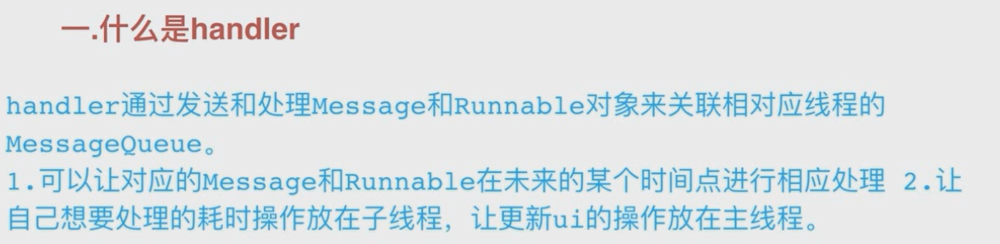
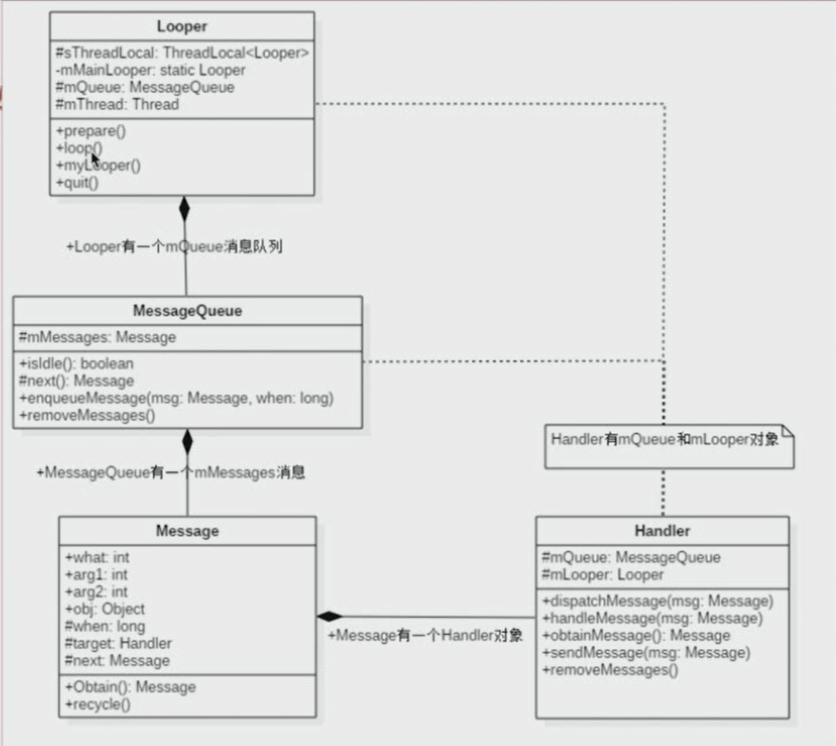
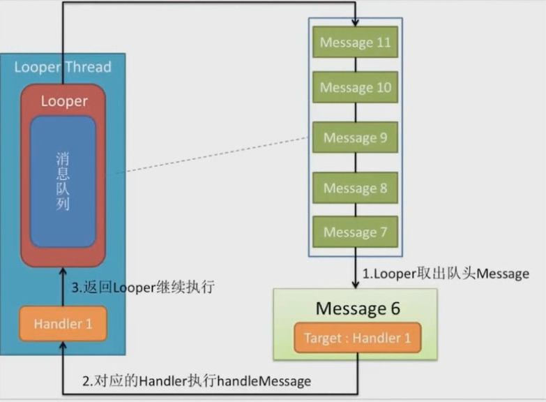
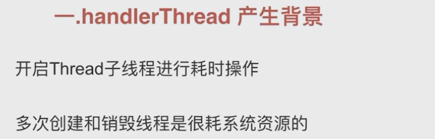
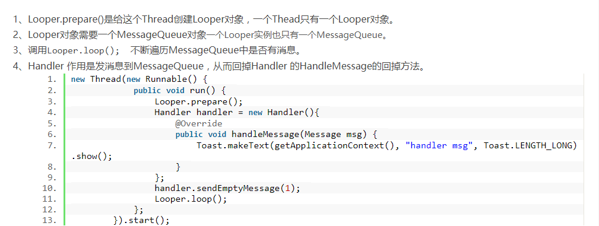
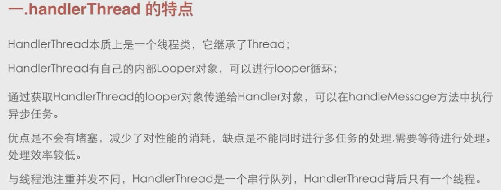
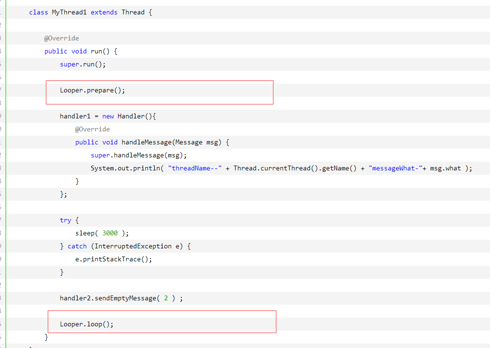

```java
 public Handler(Callback callback, boolean async) {
        if (FIND_POTENTIAL_LEAKS) {
            final Class<? extends Handler> klass = getClass();
            if ((klass.isAnonymousClass() || klass.isMemberClass() || klass.isLocalClass()) &&
                    (klass.getModifiers() & Modifier.STATIC) == 0) {
                Log.w(TAG, "The following Handler class should be static or leaks might occur: " +
                    klass.getCanonicalName());
            }
        }

        mLooper = Looper.myLooper();
        if (mLooper == null) {
            throw new RuntimeException(
                "Can't create handler inside thread " + Thread.currentThread()
                        + " that has not called Looper.prepare()");
        }
        mQueue = mLooper.mQueue;
        mCallback = callback;
        mAsynchronous = async;
    }
```

handler构造方法中关联looper和messageQueue。

1，**子线程直接使用handler报错**  ，往下看因为没有threadlocal set没有执行


```
	/**
     * Return the Looper object associated with the current thread.  Returns
     * null if the calling thread is not associated with a Looper.
     */
    public static @Nullable Looper myLooper() {
        return sThreadLocal.get();
    }
```

ThreadLocal具备这样的特质：不同的线程访问同一个threadlocal，不管是set，get方法，他们对threadlocal操作仅限于线程内部。怎么做到的？

这就是为什么handler通过threadlocal来保存looper对象，可以是每个线程有单独唯一的looper。

handler什么时候关联threadlocal？

```
    public static void prepareMainLooper() {
        prepare(false);
        synchronized (Looper.class) {
            if (sMainLooper != null) {
                throw new IllegalStateException("The main Looper has already been prepared.");
            }
            sMainLooper = myLooper();
        }
    }


***************************************************

    public static void prepare() {
        prepare(true);
    }

    private static void prepare(boolean quitAllowed) {
        if (sThreadLocal.get() != null) {
            throw new RuntimeException("Only one Looper may be created per thread");
        }
        sThreadLocal.set(new Looper(quitAllowed));
    }
    
    
```

创建了一个looper对象，并把这个对象设置给了threadlocal，保证每个线程looper唯一性。

至此，handler和looper，messagequene关联起来了

**这里调用了Looper的prepare方法去初始化了一个Looper并保存了起来，而且，还把这个Looper赋值给了sMainLooper变量，Looper中有个getMainLooper返回的就是这个sMainLooper，这也就是使用 Looper.getMainLooper() == Looper.myLooper()来判断是否是主线程的由来**


```
  public static void loop() {
        final Looper me = myLooper();
        if (me == null) {
            throw new RuntimeException("No Looper; Looper.prepare() wasn't called on this thread.");
        }
        final MessageQueue queue = me.mQueue;

        // Make sure the identity of this thread is that of the local process,
        // and keep track of what that identity token actually is.
        Binder.clearCallingIdentity();
        final long ident = Binder.clearCallingIdentity();

        // Allow overriding a threshold with a system prop. e.g.
        // adb shell 'setprop log.looper.1000.main.slow 1 && stop && start'
        final int thresholdOverride =
                SystemProperties.getInt("log.looper."
                        + Process.myUid() + "."
                        + Thread.currentThread().getName()
                        + ".slow", 0);

        boolean slowDeliveryDetected = false;

        for (;;) {  其实是个for循环的处理消息 ，进行消息分发
            Message msg = queue.next(); // might block
            if (msg == null) {
                // No message indicates that the message queue is quitting.
                return;
            }

            // This must be in a local variable, in case a UI event sets the logger
            final Printer logging = me.mLogging;
            if (logging != null) {
                logging.println(">>>>> Dispatching to " + msg.target + " " +
                        msg.callback + ": " + msg.what);
            }

            final long traceTag = me.mTraceTag;
            long slowDispatchThresholdMs = me.mSlowDispatchThresholdMs;
            long slowDeliveryThresholdMs = me.mSlowDeliveryThresholdMs;
            if (thresholdOverride > 0) {
                slowDispatchThresholdMs = thresholdOverride;
                slowDeliveryThresholdMs = thresholdOverride;
            }
            final boolean logSlowDelivery = (slowDeliveryThresholdMs > 0) && (msg.when > 0);
            final boolean logSlowDispatch = (slowDispatchThresholdMs > 0);

            final boolean needStartTime = logSlowDelivery || logSlowDispatch;
            final boolean needEndTime = logSlowDispatch;

            if (traceTag != 0 && Trace.isTagEnabled(traceTag)) {
                Trace.traceBegin(traceTag, msg.target.getTraceName(msg));
            }

            final long dispatchStart = needStartTime ? SystemClock.uptimeMillis() : 0;
            final long dispatchEnd;
            try {
            	
            	
                msg.target.dispatchMessage(msg);
                dispatchEnd = needEndTime ? SystemClock.uptimeMillis() : 0;
            } finally {
                if (traceTag != 0) {
                    Trace.traceEnd(traceTag);
                }
            }
            if (logSlowDelivery) {
                if (slowDeliveryDetected) {
                    if ((dispatchStart - msg.when) <= 10) {
                        Slog.w(TAG, "Drained");
                        slowDeliveryDetected = false;
                    }
                } else {
                    if (showSlowLog(slowDeliveryThresholdMs, msg.when, dispatchStart, "delivery",
                            msg)) {
                        // Once we write a slow delivery log, suppress until the queue drains.
                        slowDeliveryDetected = true;
                    }
                }
            }
            if (logSlowDispatch) {
                showSlowLog(slowDispatchThresholdMs, dispatchStart, dispatchEnd, "dispatch", msg);
            }

            if (logging != null) {
                logging.println("<<<<< Finished to " + msg.target + " " + msg.callback);
            }

            // Make sure that during the course of dispatching the
            // identity of the thread wasn't corrupted.
            final long newIdent = Binder.clearCallingIdentity();
            if (ident != newIdent) {
                Log.wtf(TAG, "Thread identity changed from 0x"
                        + Long.toHexString(ident) + " to 0x"
                        + Long.toHexString(newIdent) + " while dispatching to "
                        + msg.target.getClass().getName() + " "
                        + msg.callback + " what=" + msg.what);
            }

            msg.recycleUnchecked();
        }
    }
    
```

**msg.target 是个handler 。通过handler发送消息到消息队列，而消息队列又将消息回传给handler处理**

```
   /**
     * Handle system messages here.
     */
    public void dispatchMessage(Message msg) {
        if (msg.callback != null) {
            handleCallback(msg);
        } else {
            if (mCallback != null) {
                if (mCallback.handleMessage(msg)) {
                    return;
                }
            }
            handleMessage(msg);
        }
    }
```



**为什么主线程不用调用 Looper.prepare()？？**

一个app的入口位于ActivityThread.java的main方法：

```
public static void main(String[] args) {
    ...
    Looper.prepareMainLooper();
    ...
    ActivityThread thread = new ActivityThread();
    thread.attach(false, startSeq);
    if (sMainThreadHandler == null) {
        sMainThreadHandler = thread.getHandler();
    }
    if (false) {
        Looper.myLooper().setMessageLogging(new
                LogPrinter(Log.DEBUG, "ActivityThread"));
    }
    // End of event ActivityThreadMain.
    Trace.traceEnd(Trace.TRACE_TAG_ACTIVITY_MANAGER);
    Looper.loop();
    throw new RuntimeException("Main thread loop unexpectedly exited");
}
```


**在app启动时，系统会调用Looper.prepareMainLooper()以sThreaLocal为key，Looper为value保存到主线程中，而我们新建主线程Handler的时候，Handler的构造函数会调用Looper.myLooper从sThreadLocal中get出一个Looper，因为为同一个线程，而sThreadLocal又是同一个变量，自然能正确的获取到在ActivityThread.java中初始化好的全局唯一的Looper对象了，而在希望创建一个跑在其他线程的Handler的时候，我们并没有事先将这个线程的Looper给保存到当前线程中中，所以需要调用Looper.prepare来初始化**


 


### HandlerThread






#### handlerThread是什么

handler+thread+looper 

是一个thread内部有looper，可以进行looper循环




```
/**
 * Handy class for starting a new thread that has a looper. The looper can then be 
 * used to create handler classes. Note that start() must still be called.
 */
public class HandlerThread extends Thread {
    int mPriority;
    int mTid = -1;
    Looper mLooper;
    private @Nullable Handler mHandler;

    public HandlerThread(String name) {
        super(name);
        mPriority = Process.THREAD_PRIORITY_DEFAULT;
    }
    
  
    public HandlerThread(String name, int priority) {
        super(name);
        mPriority = priority;
    }
    
 
    protected void onLooperPrepared() {
    }

    @Override
    public void run() {
        mTid = Process.myTid();
        Looper.prepare();
        synchronized (this) {
            mLooper = Looper.myLooper();
            notifyAll();
        }
        Process.setThreadPriority(mPriority);
        onLooperPrepared();
        Looper.loop();
        mTid = -1;
    }
    

    public Looper getLooper() {
        if (!isAlive()) {
            return null;
        }
        
        // If the thread has been started, wait until the looper has been created.
        synchronized (this) {
            while (isAlive() && mLooper == null) {
                try {
                    wait();
                } catch (InterruptedException e) {
                }
            }
        }
        return mLooper;
    }

    /**
     * @return a shared {@link Handler} associated with this thread
     * @hide
     */
    @NonNull
    public Handler getThreadHandler() {
        if (mHandler == null) {
            mHandler = new Handler(getLooper());
        }
        return mHandler;
    }

    public boolean quit() {
        Looper looper = getLooper();
        if (looper != null) {
            looper.quit();
            return true;
        }
        return false;
    }


    public boolean quitSafely() {
        Looper looper = getLooper();
        if (looper != null) {
            looper.quitSafely();
            return true;
        }
        return false;
    }

    /**
     * Returns the identifier of this thread. See Process.myTid().
     */
    public int getThreadId() {
        return mTid;
    }
}
```


使用，普通方法：



handlerthread

```
public class MainActivity extends AppCompatActivity {

    private HandlerThread myHandlerThread ;
    private Handler handler ;

    @Override
    protected void onCreate(Bundle savedInstanceState) {
        super.onCreate(savedInstanceState);
        setContentView(R.layout.activity_main);

        //创建一个线程,线程名字：handler-thread
        myHandlerThread = new HandlerThread( "handler-thread") ;
        //开启一个线程
        myHandlerThread.start();
        //在这个线程中创建一个handler对象
        handler = new Handler( myHandlerThread.getLooper() ){
            @Override
            public void handleMessage(Message msg) {
                super.handleMessage(msg);
                //这个方法是运行在 handler-thread 线程中的 ，可以执行耗时操作
                Log.d( "handler " , "消息： " + msg.what + "  线程： " + Thread.currentThread().getName()  ) ;

            }
        };

        //在主线程给handler发送消息
        handler.sendEmptyMessage( 1 ) ;

        new Thread(new Runnable() {
            @Override
            public void run() {
             //在子线程给handler发送数据
             handler.sendEmptyMessage( 2 ) ;
            }
        }).start() ;

    }

    @Override
    protected void onDestroy() {
        super.onDestroy();

        //释放资源
        myHandlerThread.quit() ;
    }
}
```


- **HandlerThread将loop转到子线程中处理，说白了就是将分担MainLooper的工作量，降低了主线程的压力，使主界面更流畅。**
- **开启一个线程起到多个线程的作用。处理任务是串行执行，按消息发送顺序进行处理。HandlerThread本质是一个线程，在线程内部，代码是串行处理的。**
- **但是由于每一个任务都将以队列的方式逐个被执行到，一旦队列中有某个任务执行时间过长，那么就会导致后续的任务都会被延迟处理。**
- **HandlerThread拥有自己的消息队列，它不会干扰或阻塞UI线程。**
- **对于网络IO操作，HandlerThread并不适合，因为它只有一个线程，还得排队一个一个等着**


