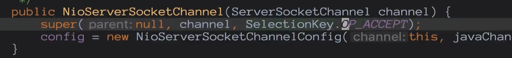

[TOC]


netty是什么


## channel

对应socket


## NioEventLoop 对应 Thread

```
  @Override
    protected void run() {
        int selectCnt = 0;
        for (;;) {
```

相当于while(true)服务端一直等待连接（case SelectStrategy.SELECT:）或者客户端循环不断的读数据。

NioEventLoop 起了两个线程，监听客户端连接线程，数据读写线程。


ByteBuf 对应 io bytes

Pipeline 对应逻辑链

ChannelHandler 对应逻辑处理块


#### channel的创建

**问题：服务端socket在哪里初始化？**

**问题：在哪里accept连接**


创建服务端channel


初始化服务端channel


注册selector


端口绑定


从 ChannelFuture f = b.bind(8888).sync(); 进入ServerBootstrap bind方法

```
public ChannelFuture bind(SocketAddress localAddress) {
        this.validate();
        return this.doBind((SocketAddress)ObjectUtil.checkNotNull(localAddress, "localAddress"));
    }

    private ChannelFuture doBind(final SocketAddress localAddress) {
        final ChannelFuture regFuture = this.initAndRegister();
        final Channel channel = regFuture.channel();
        if (regFuture.cause() != null) {
            return regFuture;
        } else if (regFuture.isDone()) {
            ChannelPromise promise = channel.newPromise();
            doBind0(regFuture, channel, localAddress, promise);
            return promise;
        } else {
            final AbstractBootstrap.PendingRegistrationPromise promise = new AbstractBootstrap.PendingRegistrationPromise(channel);
            regFuture.addListener(new ChannelFutureListener() {
                public void operationComplete(ChannelFuture future) throws Exception {
                    Throwable cause = future.cause();
                    if (cause != null) {
                        promise.setFailure(cause);
                    } else {
                        promise.registered();
                        AbstractBootstrap.doBind0(regFuture, channel, localAddress, promise);
                    }

                }
            });
            return promise;
        }
    }

```

在 initAndRegister 方法中

```
final ChannelFuture initAndRegister() {
        Channel channel = null;

        try {
            channel = this.channelFactory.newChannel();
            this.init(channel);
        } catch (Throwable var3) {
            if (channel != null) {
                channel.unsafe().closeForcibly();
                return (new DefaultChannelPromise(channel, GlobalEventExecutor.INSTANCE)).setFailure(var3);
            }

            return (new DefaultChannelPromise(new FailedChannel(), GlobalEventExecutor.INSTANCE)).setFailure(var3);
        }

        ChannelFuture regFuture = this.config().group().register(channel);
        if (regFuture.cause() != null) {
            if (channel.isRegistered()) {
                channel.close();
            } else {
                channel.unsafe().closeForcibly();
            }
        }

        return regFuture;
    }
```

channelFactory.newChannel(); 创建

```
/**
 * @deprecated Use {@link io.netty.channel.ChannelFactory} instead.
 */
@Deprecated
public interface ChannelFactory<T extends Channel> {
    /**
     * Creates a new channel.
     */
    T newChannel();
}
这是个接口
```

回到上面的  channel = this.channelFactory.newChannel();  这个factory在赋值的？

我们在初始化serverChannel的时候

```
 ServerBootstrap b = new ServerBootstrap();
            b.group(bossGroup, workerGroup)
                    .channel(NioServerSocketChannel.class)
                    
                    ---
                    
public B channel(Class<? extends C> channelClass) {
        return this.channelFactory((io.netty.channel.ChannelFactory)(new ReflectiveChannelFactory((Class)ObjectUtil.checkNotNull(channelClass, "channelClass"))));
    }
    
    
```

```
public class ReflectiveChannelFactory<T extends Channel> implements ChannelFactory<T> {
    private final Constructor<? extends T> constructor;

    public ReflectiveChannelFactory(Class<? extends T> clazz) {
        ObjectUtil.checkNotNull(clazz, "clazz");

        try {
            this.constructor = clazz.getConstructor();
        } catch (NoSuchMethodException var3) {
            throw new IllegalArgumentException("Class " + StringUtil.simpleClassName(clazz) + " does not have a public non-arg constructor", var3);
        }
    }

    public T newChannel() {
        try {
            return (Channel)this.constructor.newInstance();
        } catch (Throwable var2) {
            throw new ChannelException("Unable to create Channel from class " + this.constructor.getDeclaringClass(), var2);
        }
    }

    public String toString() {
        return StringUtil.simpleClassName(ReflectiveChannelFactory.class) + '(' + StringUtil.simpleClassName(this.constructor.getDeclaringClass()) + ".class)";
    }
}
```


这里通过反射把传递过来的NioServerSocketChannel.class 调用它的构造函数。

为啥这么设计？

**构造函数做了什么呢？**


**1,newSocket:构造方法里面直接调用的就是newSocket**

```Java
public NioServerSocketChannel() {
    this(newSocket(DEFAULT_SELECTOR_PROVIDER));
}
```

```
private static final SelectorProvider DEFAULT_SELECTOR_PROVIDER = SelectorProvider.provider();

这里的SelectProvider是Java类。package java.nio.channels.spi
```

```
private static java.nio.channels.ServerSocketChannel newSocket(SelectorProvider provider) {
    try {
        return provider.openServerSocketChannel();
    } catch (IOException var2) {
        throw new ChannelException("Failed to open a server socket.", var2);
    }
}
```

创建出来的是Java类ServerSocketChannel  （package java.nio.channels）

**2，NioServerSocketChannelConfig**

构造方法

```
public NioServerSocketChannel(java.nio.channels.ServerSocketChannel channel) {
    super((Channel)null, channel, 16);
    this.config = new NioServerSocketChannel.NioServerSocketChannelConfig(this, this.javaChannel().socket());
}
```

```
protected java.nio.channels.ServerSocketChannel javaChannel() {
    return (java.nio.channels.ServerSocketChannel)super.javaChannel();
}
```

这里把Java的serverSocket当做构造方法参数传递进来，后面获取，设置服务端参数用的就是这个config。

**3，调用父类构造函数**

```
AbstractNioChannel
protected AbstractNioChannel(Channel parent, SelectableChannel ch, int readInterestOp) {
        super(parent);
        this.ch = ch;
        this.readInterestOp = readInterestOp;

        try {
            ch.configureBlocking(false);//设置服务端非阻塞模式
        } catch (IOException var7) {
            try {
                ch.close();
            } catch (IOException var6) {
                logger.warn("Failed to close a partially initialized socket.", var6);
            }

            throw new ChannelException("Failed to enter non-blocking mode.", var7);
        }
    }
    
```

**4，AbstractNioChannel 创建id,unsafe,pipeline**

继续父类的构造

```
protected AbstractChannel(Channel parent) {
    this.parent = parent;
    this.id = this.newId();//channel 的唯一标识
    this.unsafe = this.newUnsafe();//对应tcp读写的一个类
    this.pipeline = this.newChannelPipeline();//后面会涉及到的一个非常重要的组件
}
```

## 初始化channel


上面initAndRegister方法中 newChannel之后就是init();

```
abstract void init(Channel var1) throws Exception;
```

在ServerBootstrap中

```
void init(Channel channel) {
//拿到用户配置的option，通过config配置进去
    setChannelOptions(channel, this.newOptionsArray(), logger);
    //设置属性
    setAttributes(channel, this.newAttributesArray());
    ChannelPipeline p = channel.pipeline();
    final EventLoopGroup currentChildGroup = this.childGroup;
    final ChannelHandler currentChildHandler = this.childHandler;
    final Entry<ChannelOption<?>, Object>[] currentChildOptions = newOptionsArray(this.childOptions);
    final Entry<AttributeKey<?>, Object>[] currentChildAttrs = newAttributesArray(this.childAttrs);
    
    //配置pipeline
    p.addLast(new ChannelHandler[]{new ChannelInitializer<Channel>() {
        public void initChannel(final Channel ch) {
            final ChannelPipeline pipeline = ch.pipeline();
            
            //把用户配置的handler添加进来
            ChannelHandler handler = ServerBootstrap.this.config.handler();
            if (handler != null) {
                pipeline.addLast(new ChannelHandler[]{handler});
            }

            ch.eventLoop().execute(new Runnable() {
                public void run() {
                
                //添加一个默认的handler 
                    pipeline.addLast(new ChannelHandler[]{new ServerBootstrap.ServerBootstrapAcceptor(ch, currentChildGroup, currentChildHandler, currentChildOptions, currentChildAttrs)});
                }
            });
        }
    }});
}
```

```
static void setChannelOptions(Channel channel, Entry<ChannelOption<?>, Object>[] options, InternalLogger logger) {
    Entry[] var3 = options;
    int var4 = options.length;

    for(int var5 = 0; var5 < var4; ++var5) {
        Entry<ChannelOption<?>, Object> e = var3[var5];
        setChannelOption(channel, (ChannelOption)e.getKey(), e.getValue(), logger);
    }

}

private static void setChannelOption(Channel channel, ChannelOption<?> option, Object value, InternalLogger logger) {
    try {
        if (!channel.config().setOption(option, value)) {
            logger.warn("Unknown channel option '{}' for channel '{}'", option, channel);
        }
    } catch (Throwable var5) {
        logger.warn("Failed to set channel option '{}' with value '{}' for channel '{}'", new Object[]{option, value, channel, var5});
    }

}
```

```
static void setAttributes(Channel channel, Entry<AttributeKey<?>, Object>[] attrs) {
    Entry[] var2 = attrs;
    int var3 = attrs.length;

    for(int var4 = 0; var4 < var3; ++var4) {
        Entry<AttributeKey<?>, Object> e = var2[var4];
        AttributeKey<Object> key = (AttributeKey)e.getKey();
        channel.attr(key).set(e.getValue());
    }

}
```

问题：这里配置的option和attribute都有啥，有什么不同的

保存用户自定义的属性，通过这些属性创建一个连接接入器，当新连接到来accept的时候都会使用这些属性对新的连接做一些配置

## 注册selector

创建完后就是要把这些channel注册到轮询器中

```
initAndRegister 方法中
ChannelFuture regFuture = this.config().group().register(channel);

会调用到 AbstractChannel.java 中的
 public final void register(EventLoop eventLoop, final ChannelPromise promise) {
            ObjectUtil.checkNotNull(eventLoop, "eventLoop");
            if (AbstractChannel.this.isRegistered()) {
                promise.setFailure(new IllegalStateException("registered to an event loop 																already"));
            } else if (!AbstractChannel.this.isCompatible(eventLoop)) {
                promise.setFailure(new IllegalStateException("incompatible event loop 												type: " + eventLoop.getClass().getName()));
            } else {
                AbstractChannel.this.eventLoop = eventLoop;
                if (eventLoop.inEventLoop()) {
                    this.register0(promise);
                } else {
                    try {
                        eventLoop.execute(new Runnable() {
                            public void run() {
                                AbstractUnsafe.this.register0(promise);
                            }
                        });
                    } catch (Throwable var4) {
                        AbstractChannel.logger.warn("Force-closing a channel whose registration task was not accepted by an event loop: {}", AbstractChannel.this, var4);
                        this.closeForcibly();
                        AbstractChannel.this.closeFuture.setClosed();
                        this.safeSetFailure(promise, var4);
                    }
                }

            }
        }
        
```


```
private void register0(ChannelPromise promise) {
    try {
        if (!promise.setUncancellable() || !this.ensureOpen(promise)) {
            return;
        }

        boolean firstRegistration = this.neverRegistered;
        AbstractChannel.this.doRegister();
        this.neverRegistered = false;
        AbstractChannel.this.registered = true;
        AbstractChannel.this.pipeline.invokeHandlerAddedIfNeeded();
        this.safeSetSuccess(promise);
        AbstractChannel.this.pipeline.fireChannelRegistered();
        if (AbstractChannel.this.isActive()) {
            if (firstRegistration) {
                AbstractChannel.this.pipeline.fireChannelActive();
            } else if (AbstractChannel.this.config().isAutoRead()) {
                this.beginRead();
            }
        }
    } catch (Throwable var3) {
        this.closeForcibly();
        AbstractChannel.this.closeFuture.setClosed();
        this.safeSetFailure(promise, var3);
    }

}
```

我们这是NIO，所以在AbstractNioChannel中

```
protected void doRegister() throws Exception {
    boolean selected = false;

    while(true) {
        try {
            this.selectionKey = this.javaChannel().register(this.eventLoop().unwrappedSelector(), 0, this);
            return;
        } catch (CancelledKeyException var3) {
            if (selected) {
                throw var3;
            }

            this.eventLoop().selectNow();
            selected = true;
        }
    }
}
```

这里的javaChannel()是上面讲到的jdk创建服务端的channel。

调用jdk的register，第二个参数表示关心什么事件，0表示不关心任何事件，只是把channel绑定到selector上去。

```
register0 中
                AbstractChannel.this.pipeline.invokeHandlerAddedIfNeeded();

                AbstractChannel.this.pipeline.fireChannelRegistered();
对应的是用户代码ServerHandler中的回调方法：
handlerAdded()和channelRegistered()

```

## 端口绑定


readIfIsAutoRead方法：将之前注册到seclect上的事件重新绑定为accept事件，

这样有新连接进来selector就会轮询到new accept事件。最终将这个连接交给netty处理。

```
private static void doBind0(final ChannelFuture regFuture, final Channel channel, final SocketAddress localAddress, final ChannelPromise promise) {
    channel.eventLoop().execute(new Runnable() {
        public void run() {
            if (regFuture.isSuccess()) {
                channel.bind(localAddress, promise).addListener(ChannelFutureListener.CLOSE_ON_FAILURE);
            } else {
                promise.setFailure(regFuture.cause());
            }

        }
    });
}
```

最终到 NioServerSocketChannel

```
protected void doBind(SocketAddress localAddress) throws Exception {
    if (PlatformDependent.javaVersion() >= 7) {
        this.javaChannel().bind(localAddress, this.config.getBacklog());
    } else {
        this.javaChannel().socket().bind(localAddress, this.config.getBacklog());
    }

}
```

绑定成功之后进入DefaultChannelPipeline

```
public void channelActive(ChannelHandlerContext ctx) {
    ctx.fireChannelActive();//传递事件
    this.readIfIsAutoRead();
}

 public Channel read() {
        this.pipeline.read();
        return this;
    }
    
    AbstractChannelHandlerContext
    
 public ChannelHandlerContext read() {
        AbstractChannelHandlerContext next = this.findContextOutbound(16384);
        EventExecutor executor = next.executor();
        if (executor.inEventLoop()) {
            next.invokeRead();
        } else {
            AbstractChannelHandlerContext.Tasks tasks = next.invokeTasks;
            if (tasks == null) {
                next.invokeTasks = tasks = new AbstractChannelHandlerContext.Tasks(next);
            }

            executor.execute(tasks.invokeReadTask);
        }

        return this;
    }
    
    后面会传递到 AbstractChannel中的beginRead方法
    
    public final void beginRead() {
            this.assertEventLoop();
            if (AbstractChannel.this.isActive()) {
                try {
                    AbstractChannel.this.doBeginRead();
                } catch (final Exception var2) {
                    this.invokeLater(new Runnable() {
                        public void run() {
                            AbstractChannel.this.pipeline.fireExceptionCaught(var2);
                        }
                    });
                    this.close(this.voidPromise());
                }

            }
        }
        
        熟悉的Java操作
 protected void doBeginRead() throws Exception {
        SelectionKey selectionKey = this.selectionKey;
        if (selectionKey.isValid()) {
            this.readPending = true;
            int interestOps = selectionKey.interestOps();
//            interestOps之前用的是0，所以会进入
            if ((interestOps & this.readInterestOp) == 0) {
            //或 相当于增加了一个选项
                selectionKey.interestOps(interestOps | this.readInterestOp);
            }

        }
    }
        
```

这里readinterstop 就是在nioserver构造时保存的



总结：当端口完成绑定之后，会触发一个active事件，这个active事件会调用到channel的一个read事件，服务端的read事件相当于读一个新的连接。


## NioEventLoop

**问题：默认情况下，netty服务端起多少个线程？何时启动?**

**问题：netty是如何解决jdk空轮询bug的？**

**问题：netty是如何保证异步串行无锁化？**


### 创建


一直跟进NioEventLoopGroup的构造方法到MultithreadEventLoopGroup类中的

```
private static final int DEFAULT_EVENT_LOOP_THREADS = Math.max(1, SystemPropertyUtil.getInt("io.netty.eventLoopThreads", NettyRuntime.availableProcessors() * 2));

protected MultithreadEventLoopGroup(int nThreads, Executor executor, Object... args) {
    super(nThreads == 0 ? DEFAULT_EVENT_LOOP_THREADS : nThreads, executor, args);
}
```

```
protected MultithreadEventExecutorGroup(int nThreads, Executor executor, EventExecutorChooserFactory chooserFactory, Object... args) {
    this.terminatedChildren = new AtomicInteger();
    this.terminationFuture = new DefaultPromise(GlobalEventExecutor.INSTANCE);
    if (nThreads <= 0) {
        throw new IllegalArgumentException(String.format("nThreads: %d (expected: > 0)", nThreads));
    } else {
        if (executor == null) {
        //创建线程选择器
            executor = new ThreadPerTaskExecutor(this.newDefaultThreadFactory());
        }

        this.children = new EventExecutor[nThreads];

        int j;
        for(int i = 0; i < nThreads; ++i) {
            boolean success = false;
            boolean var18 = false;

            try {
                var18 = true;
                //创建NioEventLooper
                
                this.children[i] = this.newChild((Executor)executor, args);
                success = true;
                var18 = false;
            } catch (Exception var19) {
                throw new IllegalStateException("failed to create a child event loop", var19);
            } finally {
                if (var18) {
                    if (!success) {
                        int j;
                        for(j = 0; j < i; ++j) {
                            this.children[j].shutdownGracefully();
                        }

                        for(j = 0; j < i; ++j) {
                            EventExecutor e = this.children[j];

                            try {
                                while(!e.isTerminated()) {
                                    e.awaitTermination(2147483647L, TimeUnit.SECONDS);
                                }
                            } catch (InterruptedException var20) {
                                Thread.currentThread().interrupt();
                                break;
                            }
                        }
                    }

                }
            }

            if (!success) {
                for(j = 0; j < i; ++j) {
                    this.children[j].shutdownGracefully();
                }

                for(j = 0; j < i; ++j) {
                    EventExecutor e = this.children[j];

                    try {
                        while(!e.isTerminated()) {
                            e.awaitTermination(2147483647L, TimeUnit.SECONDS);
                        }
                    } catch (InterruptedException var22) {
                        Thread.currentThread().interrupt();
                        break;
                    }
                }
            }
        }
		//创建选择器
        this.chooser = chooserFactory.newChooser(this.children);
        FutureListener<Object> terminationListener = new FutureListener<Object>() {
            public void operationComplete(Future<Object> future) throws Exception {
                if (MultithreadEventExecutorGroup.this.terminatedChildren.incrementAndGet() == MultithreadEventExecutorGroup.this.children.length) {
                    MultithreadEventExecutorGroup.this.terminationFuture.setSuccess((Object)null);
                }

            }
        };
        EventExecutor[] var24 = this.children;
        j = var24.length;

        for(int var26 = 0; var26 < j; ++var26) {
            EventExecutor e = var24[var26];
            e.terminationFuture().addListener(terminationListener);
        }

        Set<EventExecutor> childrenSet = new LinkedHashSet(this.children.length);
        Collections.addAll(childrenSet, this.children);
        this.readonlyChildren = Collections.unmodifiableSet(childrenSet);
    }
}
```


#### ThreadPerTaskExecutor

1，每次执行任务都会创建一个线程实体

```
public final class ThreadPerTaskExecutor implements Executor {
    private final ThreadFactory threadFactory;

    public ThreadPerTaskExecutor(ThreadFactory threadFactory) {
        this.threadFactory = (ThreadFactory)ObjectUtil.checkNotNull(threadFactory, "threadFactory");
    }

    public void execute(Runnable command) {
        this.threadFactory.newThread(command).start();
    }
}
```

2，NioEventLoop线程命名规则 nioEventLoop-1-xx

```
public DefaultThreadFactory(Class<?> poolType, boolean daemon, int priority) {
    this(toPoolName(poolType), daemon, priority);
}
```

```
public static String toPoolName(Class<?> poolType) {
    ObjectUtil.checkNotNull(poolType, "poolType");
    String poolName = StringUtil.simpleClassName(poolType);
    switch(poolName.length()) {
    case 0:
        return "unknown";
    case 1:
        return poolName.toLowerCase(Locale.US);
    default:
        return Character.isUpperCase(poolName.charAt(0)) && Character.isLowerCase(poolName.charAt(1)) ? Character.toLowerCase(poolName.charAt(0)) + poolName.substring(1) : poolName;
    }
}
```

```
public DefaultThreadFactory(String poolName, boolean daemon, int priority, ThreadGroup threadGroup) {
    this.nextId = new AtomicInteger();
    ObjectUtil.checkNotNull(poolName, "poolName");
    if (priority >= 1 && priority <= 10) {
        this.prefix = poolName + '-' + poolId.incrementAndGet() + '-';
        this.daemon = daemon;
        this.priority = priority;
        this.threadGroup = threadGroup;
    } else {
        throw new IllegalArgumentException("priority: " + priority + " (expected: Thread.MIN_PRIORITY <= priority <= Thread.MAX_PRIORITY)");
    }
}
```

```
public Thread newThread(Runnable r) {
    Thread t = this.newThread(FastThreadLocalRunnable.wrap(r), this.prefix + this.nextId.incrementAndGet());

    try {
        if (t.isDaemon() != this.daemon) {
            t.setDaemon(this.daemon);
        }

        if (t.getPriority() != this.priority) {
            t.setPriority(this.priority);
        }
    } catch (Exception var4) {
    }

    return t;
}
```

```
protected Thread newThread(Runnable r, String name) {
    return new FastThreadLocalThread(this.threadGroup, r, name);
}

FastThreadLocalThread extends Thread

```


#### newchild()

1，保存线程执行器ThreadPerTaskExecutor

2，创建一个MpscQueue

3，创建一个selector


```
protected EventLoop newChild(Executor executor, Object... args) throws Exception {
    EventLoopTaskQueueFactory queueFactory = args.length == 4 ? (EventLoopTaskQueueFactory)args[3] : null;
    return new NioEventLoop(this, executor, (SelectorProvider)args[0], ((SelectStrategyFactory)args[1]).newSelectStrategy(), (RejectedExecutionHandler)args[2], queueFactory);
}
```

```
NioEventLoop.SelectorTuple selectorTuple = this.openSelector();
```

chooserFactory.newChooser()

chooser的作用是给新连接绑定nioeventlooper

对应的是

```
public EventExecutor next() {
    return this.chooser.next();
}
```


第一个连接进来使用第一个NioEventLoop绑定，第n个连接进来使用第n个NioEventLoop绑定...第n+1个连接进来使用第n+1个NioEventLoop绑定。


### 启动

#### NioEventLoop启动触发器

1，服务端启动绑定端口


```
private static void doBind0(final ChannelFuture regFuture, final Channel channel, final SocketAddress localAddress, final ChannelPromise promise) {
    channel.eventLoop().execute(new Runnable() {
        public void run() {
            if (regFuture.isSuccess()) {
                channel.bind(localAddress, promise).addListener(ChannelFutureListener.CLOSE_ON_FAILURE);
            } else {
                promise.setFailure(regFuture.cause());
            }

        }
    });
}
```

这里的 eventLoop方法就是服务端启动的时候register上去的。

SingleThreadEventExecutor 

```
public void execute(Runnable task) {
    ObjectUtil.checkNotNull(task, "task");
    this.execute(task, !(task instanceof LazyRunnable) && this.wakesUpForTask(task));
}
```

```
private void execute(Runnable task, boolean immediate) {
    boolean inEventLoop = this.inEventLoop();
    this.addTask(task);
    if (!inEventLoop) {
        this.startThread();
        if (this.isShutdown()) {
            boolean reject = false;

            try {
                if (this.removeTask(task)) {
                    reject = true;
                }
            } catch (UnsupportedOperationException var6) {
            }

            if (reject) {
                reject();
            }
        }
    }

    if (!this.addTaskWakesUp && immediate) {
        this.wakeup(inEventLoop);
    }

}
```


2，新连接接入通过chooser绑定要给NioEventLoop


### 执行逻辑

NioEventLoop执行：SingleThreadEventExecutor.this.run();


NioEventLoop的run方法

```
@Override
protected void run() {
    int selectCnt = 0;
    for (;;) {
        try {
            int strategy;
            try {
                strategy = selectStrategy.calculateStrategy(selectNowSupplier, hasTasks());
                switch (strategy) {
                case SelectStrategy.CONTINUE:
                    continue;

                case SelectStrategy.BUSY_WAIT:
                    // fall-through to SELECT since the busy-wait is not supported with NIO

                case SelectStrategy.SELECT:
                    long curDeadlineNanos = nextScheduledTaskDeadlineNanos();
                    if (curDeadlineNanos == -1L) {
                        curDeadlineNanos = NONE; // nothing on the calendar
                    }
                    nextWakeupNanos.set(curDeadlineNanos);
                    try {
                        if (!hasTasks()) {
                            strategy = select(curDeadlineNanos);
                        }
                    } finally {
                        // This update is just to help block unnecessary selector wakeups
                        // so use of lazySet is ok (no race condition)
                        nextWakeupNanos.lazySet(AWAKE);
                    }
                    // fall through
                default:
                }
            } catch (IOException e) {
                // If we receive an IOException here its because the Selector is messed up. Let's rebuild
                // the selector and retry. https://github.com/netty/netty/issues/8566
                rebuildSelector0();
                selectCnt = 0;
                handleLoopException(e);
                continue;
            }

            selectCnt++;
            cancelledKeys = 0;
            needsToSelectAgain = false;
            final int ioRatio = this.ioRatio;
            boolean ranTasks;
            if (ioRatio == 100) {
                try {
                    if (strategy > 0) {
                        processSelectedKeys();
                    }
                } finally {
                    // Ensure we always run tasks.
                    ranTasks = runAllTasks();
                }
            } else if (strategy > 0) {
                final long ioStartTime = System.nanoTime();
                try {
                    processSelectedKeys();
                } finally {
                    // Ensure we always run tasks.
                    final long ioTime = System.nanoTime() - ioStartTime;
                    ranTasks = runAllTasks(ioTime * (100 - ioRatio) / ioRatio);
                }
            } else {
                ranTasks = runAllTasks(0); // This will run the minimum number of tasks
            }

            if (ranTasks || strategy > 0) {
                if (selectCnt > MIN_PREMATURE_SELECTOR_RETURNS && logger.isDebugEnabled()) {
                    logger.debug("Selector.select() returned prematurely {} times in a row for Selector {}.",
                            selectCnt - 1, selector);
                }
                selectCnt = 0;
            } else if (unexpectedSelectorWakeup(selectCnt)) { // Unexpected wakeup (unusual case)
                selectCnt = 0;
            }
        } catch (CancelledKeyException e) {
            // Harmless exception - log anyway
            if (logger.isDebugEnabled()) {
                logger.debug(CancelledKeyException.class.getSimpleName() + " raised by a Selector {} - JDK bug?",
                        selector, e);
            }
        } catch (Error e) {
            throw (Error) e;
        } catch (Throwable t) {
            handleLoopException(t);
        } finally {
            // Always handle shutdown even if the loop processing threw an exception.
            try {
                if (isShuttingDown()) {
                    closeAll();
                    if (confirmShutdown()) {
                        return;
                    }
                }
            } catch (Error e) {
                throw (Error) e;
            } catch (Throwable t) {
                handleLoopException(t);
            }
        }
    }
}
```


