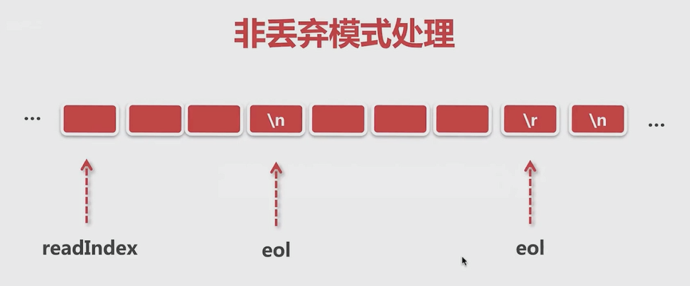
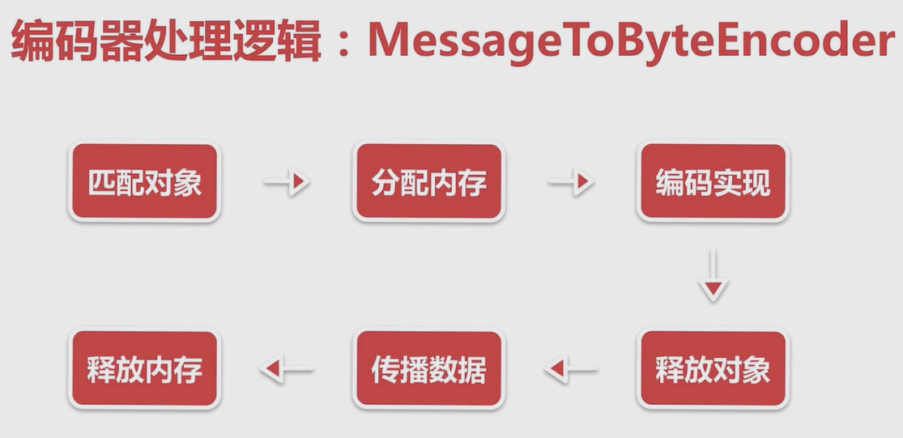

[TOC]


netty是什么


普通写法：

```java
public class Server {

    private ServerSocket serverSocket;

    public Server(int port) {
        try {
            this.serverSocket = new ServerSocket(port);
            System.out.println("服务端启动成功，端口:" + port);
        } catch (IOException exception) {
            System.out.println("服务端启动失败");
        }
    }

    public void start() {
        new Thread(new Runnable() {
            @Override
            public void run() {
                doStart();
            }
        }).start();
    }

    private void doStart() {
        while (true) {
            try {
                Socket client = serverSocket.accept();
                new ClientHandler(client).start();
            } catch (IOException e) {
                System.out.println("服务端异常");
            }
        }
    }
}
```

```java
public class ClientHandler {

    public static final int MAX_DATA_LEN = 1024;
    private final Socket socket;

    public ClientHandler(Socket socket) {
        this.socket = socket;
    }

    public void start() {
        System.out.println("新客户端接入");
        new Thread(new Runnable() {
            @Override
            public void run() {
                doStart();
            }
        }).start();
    }

    private void doStart() {
        try {
            InputStream inputStream = socket.getInputStream();
            while (true) {
                byte[] data = new byte[MAX_DATA_LEN];
                int len;
                while ((len = inputStream.read(data)) != -1) {
                    String message = new String(data, 0, len);
                    System.out.println("客户端传来消息: " + message);
                    socket.getOutputStream().write(data);
                }

            }


        } catch (IOException e) {
            e.printStackTrace();
        }
    }
}
```

```java
public class ServerBoot {

    private static final int PORT = 8000;

    public static void main(String[] args) {
        Server server = new Server(PORT);
        server.start();
    }

}
```

```java
public class Client {
    private static final String HOST = "127.0.0.1";
    private static final int PORT = 8000;
    private static final int SLEEP_TIME = 5000;

    public static void main(String[] args) throws IOException {
        final Socket socket = new Socket(HOST, PORT);

        new Thread(new Runnable() {
            @Override
            public void run() {
                System.out.println("客户端启动成功!");
                while (true) {
                    try {
                        String message = "hello world";
                        System.out.println("客户端发送数据: " + message);
                        socket.getOutputStream().write(message.getBytes());
                    } catch (Exception e) {
                        System.out.println("写数据出错!");
                    }
                    sleep();
                }


            }
        }).start();

    }

    private static void sleep() {
        try {
            Thread.sleep(SLEEP_TIME);
        } catch (InterruptedException e) {
            e.printStackTrace();
        }
    }
}
```


## channel

对应socket


## NioEventLoop 对应 Thread，并监听连接

```
  @Override
    protected void run() {
        int selectCnt = 0;
        for (;;) {
```

相当于while(true)服务端一直等待连接（case SelectStrategy.SELECT:）或者客户端循环不断的读数据。

NioEventLoop 起了两个线程，监听客户端连接线程，数据读写线程。


ByteBuf 对应 io bytes

Pipeline 对应逻辑链

ChannelHandler 对应逻辑处理块


# 服务端


## channel的创建

### **问题：服务端socket在哪里初始化？**

### **问题：在哪里accept连接**

demo

```java
        EventLoopGroup bossGroup = new NioEventLoopGroup(1);
        EventLoopGroup workerGroup = new NioEventLoopGroup();

        try {
            ServerBootstrap b = new ServerBootstrap();
            b.group(bossGroup, workerGroup)
                    .channel(NioServerSocketChannel.class)
                    .childOption(ChannelOption.TCP_NODELAY, true)
                    .childAttr(AttributeKey.newInstance("childAttr"), "childAttrValue")
                    .handler(new ServerHandler())
                    .childHandler(new ChannelInitializer<SocketChannel>() {
                        @Override
                        public void initChannel(SocketChannel ch) {
//                            ch.pipeline().addLast(new AuthHandler());


                        }
                    });

            ChannelFuture f = b.bind(8888).sync();

            f.channel().closeFuture().sync();
        } finally {
            bossGroup.shutdownGracefully();
            workerGroup.shutdownGracefully();
        }
```


```java
public class ServerHandler extends ChannelInboundHandlerAdapter {
    @Override
    public void channelActive(ChannelHandlerContext ctx) {
        System.out.println("channelActive");
    }

    @Override
    public void channelRegistered(ChannelHandlerContext ctx) {
        System.out.println("channelRegistered");
    }

    @Override
    public void handlerAdded(ChannelHandlerContext ctx) {
        System.out.println("handlerAdded");
    }

    @Override
    public void channelRead(final ChannelHandlerContext ctx, Object msg) throws Exception {
        super.channelRead(ctx, msg);

        new Thread(new Runnable() {
            @Override
            public void run() {
                // 耗时的操作
                String result = loadFromDB();

                ctx.channel().writeAndFlush(result);
                ctx.executor().schedule(new Runnable() {
                    @Override
                    public void run() {
                        // ...
                    }
                }, 1, TimeUnit.SECONDS);

            }
        }).start();
    }

    private String loadFromDB() {
        return "hello world!";
    }
}
```

### 步骤1：创建服务端channel


### 步骤2：初始化服务端channel


### 步骤3：注册selector


## 步骤4：端口绑定


从 ChannelFuture f = b.bind(8888).sync(); 进入ServerBootstrap bind方法

```
public ChannelFuture bind(SocketAddress localAddress) {
        this.validate();
        return this.doBind((SocketAddress)ObjectUtil.checkNotNull(localAddress, "localAddress"));
    }

    private ChannelFuture doBind(final SocketAddress localAddress) {
        final ChannelFuture regFuture = this.initAndRegister();
        final Channel channel = regFuture.channel();
        if (regFuture.cause() != null) {
            return regFuture;
        } else if (regFuture.isDone()) {
            ChannelPromise promise = channel.newPromise();
            doBind0(regFuture, channel, localAddress, promise);
            return promise;
        } else {
            final AbstractBootstrap.PendingRegistrationPromise promise = new AbstractBootstrap.PendingRegistrationPromise(channel);
            regFuture.addListener(new ChannelFutureListener() {
                public void operationComplete(ChannelFuture future) throws Exception {
                    Throwable cause = future.cause();
                    if (cause != null) {
                        promise.setFailure(cause);
                    } else {
                        promise.registered();
                        AbstractBootstrap.doBind0(regFuture, channel, localAddress, promise);
                    }

                }
            });
            return promise;
        }
    }

```

在 initAndRegister 方法中

```
final ChannelFuture initAndRegister() {
        Channel channel = null;

        try {
            channel = this.channelFactory.newChannel();
            this.init(channel);
        } catch (Throwable var3) {
            if (channel != null) {
                channel.unsafe().closeForcibly();
                return (new DefaultChannelPromise(channel, GlobalEventExecutor.INSTANCE)).setFailure(var3);
            }

            return (new DefaultChannelPromise(new FailedChannel(), GlobalEventExecutor.INSTANCE)).setFailure(var3);
        }

        ChannelFuture regFuture = this.config().group().register(channel);
        if (regFuture.cause() != null) {
            if (channel.isRegistered()) {
                channel.close();
            } else {
                channel.unsafe().closeForcibly();
            }
        }

        return regFuture;
    }
```

channelFactory.newChannel(); 创建

```
/**
 * @deprecated Use {@link io.netty.channel.ChannelFactory} instead.
 */
@Deprecated
public interface ChannelFactory<T extends Channel> {
    /**
     * Creates a new channel.
     */
    T newChannel();
}
这是个接口
```

回到上面的  channel = this.channelFactory.newChannel();  这个factory在赋值的？

我们在初始化serverChannel的时候

```
 ServerBootstrap b = new ServerBootstrap();
            b.group(bossGroup, workerGroup)
                    .channel(NioServerSocketChannel.class)
                    
                    ---
                    
public B channel(Class<? extends C> channelClass) {
        return this.channelFactory((io.netty.channel.ChannelFactory)(new ReflectiveChannelFactory((Class)ObjectUtil.checkNotNull(channelClass, "channelClass"))));
    }
    
    
```

```
public class ReflectiveChannelFactory<T extends Channel> implements ChannelFactory<T> {
    private final Constructor<? extends T> constructor;

    public ReflectiveChannelFactory(Class<? extends T> clazz) {
        ObjectUtil.checkNotNull(clazz, "clazz");

        try {
            this.constructor = clazz.getConstructor();
        } catch (NoSuchMethodException var3) {
            throw new IllegalArgumentException("Class " + StringUtil.simpleClassName(clazz) + " does not have a public non-arg constructor", var3);
        }
    }

    public T newChannel() {
        try {
            return (Channel)this.constructor.newInstance();
        } catch (Throwable var2) {
            throw new ChannelException("Unable to create Channel from class " + this.constructor.getDeclaringClass(), var2);
        }
    }

    public String toString() {
        return StringUtil.simpleClassName(ReflectiveChannelFactory.class) + '(' + StringUtil.simpleClassName(this.constructor.getDeclaringClass()) + ".class)";
    }
}
```


这里通过反射把传递过来的NioServerSocketChannel.class 调用它的构造函数。

为啥这么设计？

**构造函数做了什么呢？**


**1,newSocket:构造方法里面直接调用的就是newSocket**

```Java
public NioServerSocketChannel() {
    this(newSocket(DEFAULT_SELECTOR_PROVIDER));
}
```

```
private static final SelectorProvider DEFAULT_SELECTOR_PROVIDER = SelectorProvider.provider();

这里的SelectProvider是Java类。package java.nio.channels.spi
```

```
private static java.nio.channels.ServerSocketChannel newSocket(SelectorProvider provider) {
    try {
        return provider.openServerSocketChannel();
    } catch (IOException var2) {
        throw new ChannelException("Failed to open a server socket.", var2);
    }
}
```

创建出来的是Java类ServerSocketChannel  （package java.nio.channels）

**2，NioServerSocketChannelConfig**

构造方法

```
public NioServerSocketChannel(java.nio.channels.ServerSocketChannel channel) {
    super((Channel)null, channel, 16);
    this.config = new NioServerSocketChannel.NioServerSocketChannelConfig(this, this.javaChannel().socket());
}
```

```
protected java.nio.channels.ServerSocketChannel javaChannel() {
    return (java.nio.channels.ServerSocketChannel)super.javaChannel();
}
```

这里把Java的serverSocket当做构造方法参数传递进来，后面获取，设置服务端参数用的就是这个config。

**3，调用父类构造函数**

```
AbstractNioChannel
protected AbstractNioChannel(Channel parent, SelectableChannel ch, int readInterestOp) {
        super(parent);
        this.ch = ch;
        this.readInterestOp = readInterestOp;

        try {
            ch.configureBlocking(false);//设置服务端非阻塞模式
        } catch (IOException var7) {
            try {
                ch.close();
            } catch (IOException var6) {
                logger.warn("Failed to close a partially initialized socket.", var6);
            }

            throw new ChannelException("Failed to enter non-blocking mode.", var7);
        }
    }
    
```

**4，AbstractNioChannel 创建id,unsafe,pipeline**

继续父类的构造

```
protected AbstractChannel(Channel parent) {
    this.parent = parent;
    this.id = this.newId();//channel 的唯一标识
    this.unsafe = this.newUnsafe();//对应tcp读写的一个类
    this.pipeline = this.newChannelPipeline();//后面会涉及到的一个非常重要的组件
}
```

## 初始化channel


上面initAndRegister方法中 newChannel之后就是init();

```
abstract void init(Channel var1) throws Exception;
```

在ServerBootstrap中

```
void init(Channel channel) {
//拿到用户配置的option，通过config配置进去
    setChannelOptions(channel, this.newOptionsArray(), logger);
    //设置属性
    setAttributes(channel, this.newAttributesArray());
    ChannelPipeline p = channel.pipeline();
    final EventLoopGroup currentChildGroup = this.childGroup;
    final ChannelHandler currentChildHandler = this.childHandler;
    final Entry<ChannelOption<?>, Object>[] currentChildOptions = newOptionsArray(this.childOptions);
    final Entry<AttributeKey<?>, Object>[] currentChildAttrs = newAttributesArray(this.childAttrs);
    
    //配置pipeline
    p.addLast(new ChannelHandler[]{new ChannelInitializer<Channel>() {
        public void initChannel(final Channel ch) {
            final ChannelPipeline pipeline = ch.pipeline();
            
            //把用户配置的handler添加进来
            ChannelHandler handler = ServerBootstrap.this.config.handler();
            if (handler != null) {
                pipeline.addLast(new ChannelHandler[]{handler});
            }

            ch.eventLoop().execute(new Runnable() {
                public void run() {
                
                //添加一个默认的handler 
                    pipeline.addLast(new ChannelHandler[]{new ServerBootstrap.ServerBootstrapAcceptor(ch, currentChildGroup, currentChildHandler, currentChildOptions, currentChildAttrs)});
                }
            });
        }
    }});
}
```

```
static void setChannelOptions(Channel channel, Entry<ChannelOption<?>, Object>[] options, InternalLogger logger) {
    Entry[] var3 = options;
    int var4 = options.length;

    for(int var5 = 0; var5 < var4; ++var5) {
        Entry<ChannelOption<?>, Object> e = var3[var5];
        setChannelOption(channel, (ChannelOption)e.getKey(), e.getValue(), logger);
    }

}

private static void setChannelOption(Channel channel, ChannelOption<?> option, Object value, InternalLogger logger) {
    try {
        if (!channel.config().setOption(option, value)) {
            logger.warn("Unknown channel option '{}' for channel '{}'", option, channel);
        }
    } catch (Throwable var5) {
        logger.warn("Failed to set channel option '{}' with value '{}' for channel '{}'", new Object[]{option, value, channel, var5});
    }

}
```

```
static void setAttributes(Channel channel, Entry<AttributeKey<?>, Object>[] attrs) {
    Entry[] var2 = attrs;
    int var3 = attrs.length;

    for(int var4 = 0; var4 < var3; ++var4) {
        Entry<AttributeKey<?>, Object> e = var2[var4];
        AttributeKey<Object> key = (AttributeKey)e.getKey();
        channel.attr(key).set(e.getValue());
    }

}
```

问题：这里配置的option和attribute都有啥，有什么不同的

保存用户自定义的属性，通过这些属性创建一个连接接入器，当新连接到来accept的时候都会使用这些属性对新的连接做一些配置

## 注册selector

创建完后就是要把这些channel注册到轮询器中

```
initAndRegister 方法中
ChannelFuture regFuture = this.config().group().register(channel);

会调用到 AbstractChannel.java 中的
 public final void register(EventLoop eventLoop, final ChannelPromise promise) {
            ObjectUtil.checkNotNull(eventLoop, "eventLoop");
            if (AbstractChannel.this.isRegistered()) {
                promise.setFailure(new IllegalStateException("registered to an event loop 																already"));
            } else if (!AbstractChannel.this.isCompatible(eventLoop)) {
                promise.setFailure(new IllegalStateException("incompatible event loop 												type: " + eventLoop.getClass().getName()));
            } else {
                AbstractChannel.this.eventLoop = eventLoop;
                if (eventLoop.inEventLoop()) {
                    this.register0(promise);
                } else {
                    try {
                        eventLoop.execute(new Runnable() {
                            public void run() {
                                AbstractUnsafe.this.register0(promise);
                            }
                        });
                    } catch (Throwable var4) {
                        AbstractChannel.logger.warn("Force-closing a channel whose registration task was not accepted by an event loop: {}", AbstractChannel.this, var4);
                        this.closeForcibly();
                        AbstractChannel.this.closeFuture.setClosed();
                        this.safeSetFailure(promise, var4);
                    }
                }

            }
        }
        
```


```
private void register0(ChannelPromise promise) {
    try {
        if (!promise.setUncancellable() || !this.ensureOpen(promise)) {
            return;
        }

        boolean firstRegistration = this.neverRegistered;
        AbstractChannel.this.doRegister();
        this.neverRegistered = false;
        AbstractChannel.this.registered = true;
        AbstractChannel.this.pipeline.invokeHandlerAddedIfNeeded();
        this.safeSetSuccess(promise);
        AbstractChannel.this.pipeline.fireChannelRegistered();
        if (AbstractChannel.this.isActive()) {
            if (firstRegistration) {
                AbstractChannel.this.pipeline.fireChannelActive();
            } else if (AbstractChannel.this.config().isAutoRead()) {
                this.beginRead();
            }
        }
    } catch (Throwable var3) {
        this.closeForcibly();
        AbstractChannel.this.closeFuture.setClosed();
        this.safeSetFailure(promise, var3);
    }

}
```

我们这是NIO，所以在AbstractNioChannel中

```
protected void doRegister() throws Exception {
    boolean selected = false;

    while(true) {
        try {
            this.selectionKey = this.javaChannel().register(this.eventLoop().unwrappedSelector(), 0, this);
            return;
        } catch (CancelledKeyException var3) {
            if (selected) {
                throw var3;
            }

            this.eventLoop().selectNow();
            selected = true;
        }
    }
}
```

这里的javaChannel()是上面讲到的jdk创建服务端的channel。

调用jdk的register，第二个参数表示关心什么事件，0表示不关心任何事件，只是把channel绑定到selector上去。

```
register0 中
                AbstractChannel.this.pipeline.invokeHandlerAddedIfNeeded();

                AbstractChannel.this.pipeline.fireChannelRegistered();
对应的是用户代码ServerHandler中的回调方法：
handlerAdded()和channelRegistered()

```

## 端口绑定


readIfIsAutoRead方法：将之前注册到seclect上的事件重新绑定为accept事件，

这样有新连接进来selector就会轮询到new accept事件。最终将这个连接交给netty处理。

```
private static void doBind0(final ChannelFuture regFuture, final Channel channel, final SocketAddress localAddress, final ChannelPromise promise) {
    channel.eventLoop().execute(new Runnable() {
        public void run() {
            if (regFuture.isSuccess()) {
                channel.bind(localAddress, promise).addListener(ChannelFutureListener.CLOSE_ON_FAILURE);
            } else {
                promise.setFailure(regFuture.cause());
            }

        }
    });
}
```

最终到 NioServerSocketChannel

```
protected void doBind(SocketAddress localAddress) throws Exception {
    if (PlatformDependent.javaVersion() >= 7) {
        this.javaChannel().bind(localAddress, this.config.getBacklog());
    } else {
        this.javaChannel().socket().bind(localAddress, this.config.getBacklog());
    }

}
```

绑定成功之后进入DefaultChannelPipeline

```
public void channelActive(ChannelHandlerContext ctx) {
    ctx.fireChannelActive();//传递事件
    this.readIfIsAutoRead();
}

 public Channel read() {
        this.pipeline.read();
        return this;
    }
    
    AbstractChannelHandlerContext
    
 public ChannelHandlerContext read() {
        AbstractChannelHandlerContext next = this.findContextOutbound(16384);
        EventExecutor executor = next.executor();
        if (executor.inEventLoop()) {
            next.invokeRead();
        } else {
            AbstractChannelHandlerContext.Tasks tasks = next.invokeTasks;
            if (tasks == null) {
                next.invokeTasks = tasks = new AbstractChannelHandlerContext.Tasks(next);
            }

            executor.execute(tasks.invokeReadTask);
        }

        return this;
    }
    
    后面会传递到 AbstractChannel中的beginRead方法
    
    public final void beginRead() {
            this.assertEventLoop();
            if (AbstractChannel.this.isActive()) {
                try {
                    AbstractChannel.this.doBeginRead();
                } catch (final Exception var2) {
                    this.invokeLater(new Runnable() {
                        public void run() {
                            AbstractChannel.this.pipeline.fireExceptionCaught(var2);
                        }
                    });
                    this.close(this.voidPromise());
                }

            }
        }
        
        熟悉的Java操作
 protected void doBeginRead() throws Exception {
        SelectionKey selectionKey = this.selectionKey;
        if (selectionKey.isValid()) {
            this.readPending = true;
            int interestOps = selectionKey.interestOps();
//            interestOps之前用的是0，所以会进入
            if ((interestOps & this.readInterestOp) == 0) {
            //或 相当于增加了一个选项
                selectionKey.interestOps(interestOps | this.readInterestOp);
            }

        }
    }
        
```

这里readinterstop 就是在nioserver构造时保存的


总结：当端口完成绑定之后，会触发一个active事件，这个active事件会调用到channel的一个read事件，服务端的read事件相当于读一个新的连接。


## NioEventLoop

**问题：默认情况下，netty服务端起多少个线程？何时启动?**

**问题：netty是如何解决jdk空轮询bug的？**

**问题：netty是如何保证异步串行无锁化？**


### 创建


一直跟进NioEventLoopGroup的构造方法到MultithreadEventLoopGroup类中的

```
private static final int DEFAULT_EVENT_LOOP_THREADS = Math.max(1, SystemPropertyUtil.getInt("io.netty.eventLoopThreads", NettyRuntime.availableProcessors() * 2));

protected MultithreadEventLoopGroup(int nThreads, Executor executor, Object... args) {
    super(nThreads == 0 ? DEFAULT_EVENT_LOOP_THREADS : nThreads, executor, args);
}
```

```java
protected MultithreadEventExecutorGroup(int nThreads, Executor executor, EventExecutorChooserFactory chooserFactory, Object... args) {
    this.terminatedChildren = new AtomicInteger();
    this.terminationFuture = new DefaultPromise(GlobalEventExecutor.INSTANCE);
    if (nThreads <= 0) {
        throw new IllegalArgumentException(String.format("nThreads: %d (expected: > 0)", nThreads));
    } else {
        if (executor == null) {
        //创建线程选择器
            executor = new ThreadPerTaskExecutor(this.newDefaultThreadFactory());
        }

        this.children = new EventExecutor[nThreads];

        int j;
        for(int i = 0; i < nThreads; ++i) {
            boolean success = false;
            boolean var18 = false;

            try {
                var18 = true;
                //创建NioEventLooper
                
                this.children[i] = this.newChild((Executor)executor, args);
                success = true;
                var18 = false;
            } catch (Exception var19) {
                throw new IllegalStateException("failed to create a child event loop", var19);
            } finally {
                if (var18) {
                    if (!success) {
                        int j;
                        for(j = 0; j < i; ++j) {
                            this.children[j].shutdownGracefully();
                        }

                        for(j = 0; j < i; ++j) {
                            EventExecutor e = this.children[j];

                            try {
                                while(!e.isTerminated()) {
                                    e.awaitTermination(2147483647L, TimeUnit.SECONDS);
                                }
                            } catch (InterruptedException var20) {
                                Thread.currentThread().interrupt();
                                break;
                            }
                        }
                    }

                }
            }

            if (!success) {
                for(j = 0; j < i; ++j) {
                    this.children[j].shutdownGracefully();
                }

                for(j = 0; j < i; ++j) {
                    EventExecutor e = this.children[j];

                    try {
                        while(!e.isTerminated()) {
                            e.awaitTermination(2147483647L, TimeUnit.SECONDS);
                        }
                    } catch (InterruptedException var22) {
                        Thread.currentThread().interrupt();
                        break;
                    }
                }
            }
        }
		//创建选择器
        this.chooser = chooserFactory.newChooser(this.children);
        FutureListener<Object> terminationListener = new FutureListener<Object>() {
            public void operationComplete(Future<Object> future) throws Exception {
                if (MultithreadEventExecutorGroup.this.terminatedChildren.incrementAndGet() == MultithreadEventExecutorGroup.this.children.length) {
                    MultithreadEventExecutorGroup.this.terminationFuture.setSuccess((Object)null);
                }

            }
        };
        EventExecutor[] var24 = this.children;
        j = var24.length;

        for(int var26 = 0; var26 < j; ++var26) {
            EventExecutor e = var24[var26];
            e.terminationFuture().addListener(terminationListener);
        }

        Set<EventExecutor> childrenSet = new LinkedHashSet(this.children.length);
        Collections.addAll(childrenSet, this.children);
        this.readonlyChildren = Collections.unmodifiableSet(childrenSet);
    }
}
```


#### ThreadPerTaskExecutor

1，每次执行任务都会创建一个线程实体

```
public final class ThreadPerTaskExecutor implements Executor {
    private final ThreadFactory threadFactory;

    public ThreadPerTaskExecutor(ThreadFactory threadFactory) {
        this.threadFactory = (ThreadFactory)ObjectUtil.checkNotNull(threadFactory, "threadFactory");
    }

    public void execute(Runnable command) {
        this.threadFactory.newThread(command).start();
    }
}
```

2，NioEventLoop线程命名规则 nioEventLoop-1-xx

```
public DefaultThreadFactory(Class<?> poolType, boolean daemon, int priority) {
    this(toPoolName(poolType), daemon, priority);
}
```

```
public static String toPoolName(Class<?> poolType) {
    ObjectUtil.checkNotNull(poolType, "poolType");
    String poolName = StringUtil.simpleClassName(poolType);
    switch(poolName.length()) {
    case 0:
        return "unknown";
    case 1:
        return poolName.toLowerCase(Locale.US);
    default:
        return Character.isUpperCase(poolName.charAt(0)) && Character.isLowerCase(poolName.charAt(1)) ? Character.toLowerCase(poolName.charAt(0)) + poolName.substring(1) : poolName;
    }
}
```

```
public DefaultThreadFactory(String poolName, boolean daemon, int priority, ThreadGroup threadGroup) {
    this.nextId = new AtomicInteger();
    ObjectUtil.checkNotNull(poolName, "poolName");
    if (priority >= 1 && priority <= 10) {
        this.prefix = poolName + '-' + poolId.incrementAndGet() + '-';
        this.daemon = daemon;
        this.priority = priority;
        this.threadGroup = threadGroup;
    } else {
        throw new IllegalArgumentException("priority: " + priority + " (expected: Thread.MIN_PRIORITY <= priority <= Thread.MAX_PRIORITY)");
    }
}
```

```
public Thread newThread(Runnable r) {
    Thread t = this.newThread(FastThreadLocalRunnable.wrap(r), this.prefix + this.nextId.incrementAndGet());

    try {
        if (t.isDaemon() != this.daemon) {
            t.setDaemon(this.daemon);
        }

        if (t.getPriority() != this.priority) {
            t.setPriority(this.priority);
        }
    } catch (Exception var4) {
    }

    return t;
}
```

```
protected Thread newThread(Runnable r, String name) {
    return new FastThreadLocalThread(this.threadGroup, r, name);
}

FastThreadLocalThread extends Thread

```


#### newchild()

1，保存线程执行器ThreadPerTaskExecutor

2，创建一个MpscQueue

3，创建一个selector


```
protected EventLoop newChild(Executor executor, Object... args) throws Exception {
    EventLoopTaskQueueFactory queueFactory = args.length == 4 ? (EventLoopTaskQueueFactory)args[3] : null;
    return new NioEventLoop(this, executor, (SelectorProvider)args[0], ((SelectStrategyFactory)args[1]).newSelectStrategy(), (RejectedExecutionHandler)args[2], queueFactory);
}
```

```
NioEventLoop.SelectorTuple selectorTuple = this.openSelector();
```

chooserFactory.newChooser()

chooser的作用是给新连接绑定nioeventlooper

对应的是

```
public EventExecutor next() {
    return this.chooser.next();
}
```


第一个连接进来使用第一个NioEventLoop绑定，第n个连接进来使用第n个NioEventLoop绑定...第n+1个连接进来使用第n+1个NioEventLoop绑定。


### 启动

#### NioEventLoop启动触发器

1，服务端启动绑定端口


```
private static void doBind0(final ChannelFuture regFuture, final Channel channel, final SocketAddress localAddress, final ChannelPromise promise) {
    channel.eventLoop().execute(new Runnable() {
        public void run() {
            if (regFuture.isSuccess()) {
                channel.bind(localAddress, promise).addListener(ChannelFutureListener.CLOSE_ON_FAILURE);
            } else {
                promise.setFailure(regFuture.cause());
            }

        }
    });
}
```

这里的 eventLoop方法就是服务端启动的时候register上去的。

SingleThreadEventExecutor 

```
public void execute(Runnable task) {
    ObjectUtil.checkNotNull(task, "task");
    this.execute(task, !(task instanceof LazyRunnable) && this.wakesUpForTask(task));
}
```

```
private void execute(Runnable task, boolean immediate) {
    boolean inEventLoop = this.inEventLoop();
    this.addTask(task);
    if (!inEventLoop) {
        this.startThread();
        if (this.isShutdown()) {
            boolean reject = false;

            try {
                if (this.removeTask(task)) {
                    reject = true;
                }
            } catch (UnsupportedOperationException var6) {
            }

            if (reject) {
                reject();
            }
        }
    }

    if (!this.addTaskWakesUp && immediate) {
        this.wakeup(inEventLoop);
    }

}
```


2，新连接接入通过chooser绑定要给NioEventLoop


### 执行逻辑

NioEventLoop执行：SingleThreadEventExecutor.this.run();


NioEventLoop的run方法

```
@Override
protected void run() {
    int selectCnt = 0;
    for (;;) {
        try {
            int strategy;
            try {
                strategy = selectStrategy.calculateStrategy(selectNowSupplier, hasTasks());
                switch (strategy) {
                case SelectStrategy.CONTINUE:
                    continue;

                case SelectStrategy.BUSY_WAIT:
                    // fall-through to SELECT since the busy-wait is not supported with NIO

                case SelectStrategy.SELECT:
                    long curDeadlineNanos = nextScheduledTaskDeadlineNanos();
                    if (curDeadlineNanos == -1L) {
                        curDeadlineNanos = NONE; // nothing on the calendar
                    }
                    nextWakeupNanos.set(curDeadlineNanos);
                    try {
                        if (!hasTasks()) {
                            strategy = select(curDeadlineNanos);
                        }
                    } finally {
                        // This update is just to help block unnecessary selector wakeups
                        // so use of lazySet is ok (no race condition)
                        nextWakeupNanos.lazySet(AWAKE);
                    }
                    // fall through
                default:
                }
            } catch (IOException e) {
                // If we receive an IOException here its because the Selector is messed up. Let's rebuild
                // the selector and retry. https://github.com/netty/netty/issues/8566
                rebuildSelector0();
                selectCnt = 0;
                handleLoopException(e);
                continue;
            }

            selectCnt++;
            cancelledKeys = 0;
            needsToSelectAgain = false;
            final int ioRatio = this.ioRatio;
            boolean ranTasks;
            if (ioRatio == 100) {
                try {
                    if (strategy > 0) {
                        processSelectedKeys();
                    }
                } finally {
                    // Ensure we always run tasks.
                    ranTasks = runAllTasks();
                }
            } else if (strategy > 0) {
                final long ioStartTime = System.nanoTime();
                try {
                    processSelectedKeys();
                } finally {
                    // Ensure we always run tasks.
                    final long ioTime = System.nanoTime() - ioStartTime;
                    ranTasks = runAllTasks(ioTime * (100 - ioRatio) / ioRatio);
                }
            } else {
                ranTasks = runAllTasks(0); // This will run the minimum number of tasks
            }

            if (ranTasks || strategy > 0) {
                if (selectCnt > MIN_PREMATURE_SELECTOR_RETURNS && logger.isDebugEnabled()) {
                    logger.debug("Selector.select() returned prematurely {} times in a row for Selector {}.",
                            selectCnt - 1, selector);
                }
                selectCnt = 0;
            } else if (unexpectedSelectorWakeup(selectCnt)) { // Unexpected wakeup (unusual case)
                selectCnt = 0;
            }
        } catch (CancelledKeyException e) {
            // Harmless exception - log anyway
            if (logger.isDebugEnabled()) {
                logger.debug(CancelledKeyException.class.getSimpleName() + " raised by a Selector {} - JDK bug?",
                        selector, e);
            }
        } catch (Error e) {
            throw (Error) e;
        } catch (Throwable t) {
            handleLoopException(t);
        } finally {
            // Always handle shutdown even if the loop processing threw an exception.
            try {
                if (isShuttingDown()) {
                    closeAll();
                    if (confirmShutdown()) {
                        return;
                    }
                }
            } catch (Error e) {
                throw (Error) e;
            } catch (Throwable t) {
                handleLoopException(t);
            }
        }
    }
}
```


# 6-1 pipeline概述

大动脉，负责读写事件传播


### 问题1：netty是如何判断ChannelHandler类型的？

调用i、pipeline添加一个节点的时候，netty会通过instanceof来判断当前节点是inbound类型还是outbound类型。

### 问题2：对于ChannelHandler的添加应该遵循什么样的顺序？

inbound事件的传播和添加handler的顺序正相关。outbound事件的传播和添加handler的顺序反相关。


### 问题3：用户手动触发事件传播，不同的触发方式有什么区别？

通过channel触发一个事件的时候。inbound事件从head开始传播，outbound事件从tail开始传播


如果在当前节点触发一个读或者写事件。如果是读就会从当前节点传递到最后一个inboundhandler节点。如果是写就会从当前节点传往前传递到第一个outboundhandler


## pipeline初始化

### pipeline在创建channel的时候被创建

```java
protected AbstractChannel(Channel parent) {
    this.parent = parent;
    this.id = this.newId();
    this.unsafe = this.newUnsafe();
    this.pipeline = this.newChannelPipeline();
}
```

```java
protected DefaultChannelPipeline(Channel channel) {
    this.channel = (Channel)ObjectUtil.checkNotNull(channel, "channel");
    this.succeededFuture = new SucceededChannelFuture(channel, (EventExecutor)null);
    this.voidPromise = new VoidChannelPromise(channel, true);
    this.tail = new DefaultChannelPipeline.TailContext(this);
    this.head = new DefaultChannelPipeline.HeadContext(this);
    this.head.next = this.tail;
    this.tail.prev = this.head;
}
```


### pipeline节点数据结构：channelHandlerContext


```java
public interface ChannelHandlerContext extends AttributeMap, ChannelInboundInvoker, ChannelOutboundInvoker {
    Channel channel();

    EventExecutor executor();

    String name();

    ChannelHandler handler();

    boolean isRemoved();

    ChannelHandlerContext fireChannelRegistered();

    ChannelHandlerContext fireChannelUnregistered();

    ChannelHandlerContext fireChannelActive();

    ChannelHandlerContext fireChannelInactive();

    ChannelHandlerContext fireExceptionCaught(Throwable var1);

    ChannelHandlerContext fireUserEventTriggered(Object var1);

    ChannelHandlerContext fireChannelRead(Object var1);

    ChannelHandlerContext fireChannelReadComplete();

    ChannelHandlerContext fireChannelWritabilityChanged();

    ChannelHandlerContext read();

    ChannelHandlerContext flush();

    ChannelPipeline pipeline();

    ByteBufAllocator alloc();

    /** @deprecated */
    @Deprecated
    <T> Attribute<T> attr(AttributeKey<T> var1);

    /** @deprecated */
    @Deprecated
    <T> boolean hasAttr(AttributeKey<T> var1);
}
```

```
public interface ChannelInboundInvoker {//输入事件传递
    ChannelInboundInvoker fireChannelRegistered();

    ChannelInboundInvoker fireChannelUnregistered();

    ChannelInboundInvoker fireChannelActive();

    ChannelInboundInvoker fireChannelInactive();

    ChannelInboundInvoker fireExceptionCaught(Throwable var1);

    ChannelInboundInvoker fireUserEventTriggered(Object var1);

    ChannelInboundInvoker fireChannelRead(Object var1);

    ChannelInboundInvoker fireChannelReadComplete();

    ChannelInboundInvoker fireChannelWritabilityChanged();
}
```


```java
public interface ChannelOutboundInvoker { //输出事件传递
    ChannelFuture bind(SocketAddress var1);

    ChannelFuture connect(SocketAddress var1);

    ChannelFuture connect(SocketAddress var1, SocketAddress var2);

    ChannelFuture disconnect();

    ChannelFuture close();

    ChannelFuture deregister();

    ChannelFuture bind(SocketAddress var1, ChannelPromise var2);

    ChannelFuture connect(SocketAddress var1, ChannelPromise var2);

    ChannelFuture connect(SocketAddress var1, SocketAddress var2, ChannelPromise var3);

    ChannelFuture disconnect(ChannelPromise var1);

    ChannelFuture close(ChannelPromise var1);

    ChannelFuture deregister(ChannelPromise var1);

    ChannelOutboundInvoker read();

    ChannelFuture write(Object var1);

    ChannelFuture write(Object var1, ChannelPromise var2);

    ChannelOutboundInvoker flush();

    ChannelFuture writeAndFlush(Object var1, ChannelPromise var2);

    ChannelFuture writeAndFlush(Object var1);

    ChannelPromise newPromise();

    ChannelProgressivePromise newProgressivePromise();

    ChannelFuture newSucceededFuture();

    ChannelFuture newFailedFuture(Throwable var1);

    ChannelPromise voidPromise();
}
```


### pipeline中的两大哨兵：head和tail

```java
this.tail = new DefaultChannelPipeline.TailContext(this);
this.head = new DefaultChannelPipeline.HeadContext(this);
```


```java
final class TailContext extends AbstractChannelHandlerContext implements ChannelInboundHandler {
    TailContext(DefaultChannelPipeline pipeline) {
        super(pipeline, (EventExecutor)null, DefaultChannelPipeline.TAIL_NAME, true, false);
        this.setAddComplete();
    }
    
    //从传递过来的参数来看，这是个inbound处理器
        AbstractChannelHandlerContext(DefaultChannelPipeline pipeline, EventExecutor executor, String name, boolean inbound, boolean outbound) {
            
            //head是个outbound处理器
            
                HeadContext(DefaultChannelPipeline pipeline) {
            super(pipeline, (EventExecutor)null, DefaultChannelPipeline.HEAD_NAME, false, true);
            this.unsafe = pipeline.channel().unsafe();
            this.setAddComplete();
        }
```


## 添加删除ChannelHandler


## 事件和异常的传播


inbound从head开始，outbound从tail开始


异常节点从开始发生异常的节点开始往下知道tail节点


# 7-1 内存分配概述


负责从底层io读数据到byteBuf，在给到应用程序。或者从应用程序把数据封装成ByteBuf再给到底层IO

### 问题1：netty内存的类别有哪些 ？

  按3个维度分


### 问题2：如何减少多内存分配之间的竞争


说白了就是threadlocal原理


### 问题3：不同大小的内存是如何进行分配的


netty使用了 内存，缓存，二叉树，位图 等方法优化了内存分配


## 7-2 ByteBuf结构以及重要api


read 读相应数据并偏移指针；

write 写数据并偏移指针；

set  修改数据，指针不偏移

markWriteIndex 标记，读数据

resetWriteIndex  还原到标记的地方。配合使用可以读写数据，指针不偏移


## 7-3 ByteBuf分类


### 1，Pooled和Unpooled 

Pooled ：从预先分配好的内存中取一块给应用程序

Unpooled：直接调用系统api分配一块内存。


### 2，Unsafe和非Unsafe

jdk中的Unsafe直接可以拿到对象的内存地址，基于这个地址可以进行一些读写操作。非Unsafe就是无法通过jdk的unsafe接口进行一些操作


### 3，Heap和Direct

heap直接在堆上分配，direct调用jdk的api进行分配，分配的内存不受jvm控制，不会参与GC，需要手动释放。


Unpooled类中

```
public static ByteBuf directBuffer(int initialCapacity) {
    return ALLOC.directBuffer(initialCapacity);
}
```

调用jdk的


## 7-4 内存分配器ByteBufAllocator分析

```java


public abstract class AbstractByteBufAllocator implements ByteBufAllocator {
    static final int DEFAULT_INITIAL_CAPACITY = 256;
    static final int DEFAULT_MAX_CAPACITY = 2147483647;
    static final int DEFAULT_MAX_COMPONENTS = 16;
    static final int CALCULATE_THRESHOLD = 4194304;
    private final boolean directByDefault;
    private final ByteBuf emptyBuf;

    protected static ByteBuf toLeakAwareBuffer(ByteBuf buf) {
        ResourceLeakTracker leak;
        switch(ResourceLeakDetector.getLevel()) {
        case SIMPLE:
            leak = AbstractByteBuf.leakDetector.track(buf);
            if (leak != null) {
                buf = new SimpleLeakAwareByteBuf((ByteBuf)buf, leak);
            }
            break;
        case ADVANCED:
        case PARANOID:
            leak = AbstractByteBuf.leakDetector.track(buf);
            if (leak != null) {
                buf = new AdvancedLeakAwareByteBuf((ByteBuf)buf, leak);
            }
        }

        return (ByteBuf)buf;
    }

    protected static CompositeByteBuf toLeakAwareBuffer(CompositeByteBuf buf) {
        ResourceLeakTracker leak;
        switch(ResourceLeakDetector.getLevel()) {
        case SIMPLE:
            leak = AbstractByteBuf.leakDetector.track(buf);
            if (leak != null) {
                buf = new SimpleLeakAwareCompositeByteBuf((CompositeByteBuf)buf, leak);
            }
            break;
        case ADVANCED:
        case PARANOID:
            leak = AbstractByteBuf.leakDetector.track(buf);
            if (leak != null) {
                buf = new AdvancedLeakAwareCompositeByteBuf((CompositeByteBuf)buf, leak);
            }
        }

        return (CompositeByteBuf)buf;
    }

    protected AbstractByteBufAllocator() {
        this(false);
    }

    protected AbstractByteBufAllocator(boolean preferDirect) {
        this.directByDefault = preferDirect && PlatformDependent.hasUnsafe();
        this.emptyBuf = new EmptyByteBuf(this);
    }

    public ByteBuf buffer() {
        return this.directByDefault ? this.directBuffer() : this.heapBuffer();
    }

    public ByteBuf buffer(int initialCapacity) {
        return this.directByDefault ? this.directBuffer(initialCapacity) : this.heapBuffer(initialCapacity);
    }

    public ByteBuf buffer(int initialCapacity, int maxCapacity) {
        return this.directByDefault ? this.directBuffer(initialCapacity, maxCapacity) : this.heapBuffer(initialCapacity, maxCapacity);
    }

    public ByteBuf ioBuffer() {
        return PlatformDependent.hasUnsafe() ? this.directBuffer(256) : this.heapBuffer(256);
    }

    public ByteBuf ioBuffer(int initialCapacity) {
        return PlatformDependent.hasUnsafe() ? this.directBuffer(initialCapacity) : this.heapBuffer(initialCapacity);
    }

    public ByteBuf ioBuffer(int initialCapacity, int maxCapacity) {
        return PlatformDependent.hasUnsafe() ? this.directBuffer(initialCapacity, maxCapacity) : this.heapBuffer(initialCapacity, maxCapacity);
    }

    public ByteBuf heapBuffer() {
        return this.heapBuffer(256, 2147483647);
    }

    public ByteBuf heapBuffer(int initialCapacity) {
        return this.heapBuffer(initialCapacity, 2147483647);
    }

    public ByteBuf heapBuffer(int initialCapacity, int maxCapacity) {
        if (initialCapacity == 0 && maxCapacity == 0) {
            return this.emptyBuf;
        } else {
            validate(initialCapacity, maxCapacity);
            return this.newHeapBuffer(initialCapacity, maxCapacity);
        }
    }

    public ByteBuf directBuffer() {
        return this.directBuffer(256, 2147483647);
    }

    public ByteBuf directBuffer(int initialCapacity) {
        return this.directBuffer(initialCapacity, 2147483647);
    }

    public ByteBuf directBuffer(int initialCapacity, int maxCapacity) {
        if (initialCapacity == 0 && maxCapacity == 0) {
            return this.emptyBuf;
        } else {
            validate(initialCapacity, maxCapacity);
            return this.newDirectBuffer(initialCapacity, maxCapacity);
        }
    }

    public CompositeByteBuf compositeBuffer() {
        return this.directByDefault ? this.compositeDirectBuffer() : this.compositeHeapBuffer();
    }

    public CompositeByteBuf compositeBuffer(int maxNumComponents) {
        return this.directByDefault ? this.compositeDirectBuffer(maxNumComponents) : this.compositeHeapBuffer(maxNumComponents);
    }

    public CompositeByteBuf compositeHeapBuffer() {
        return this.compositeHeapBuffer(16);
    }

    public CompositeByteBuf compositeHeapBuffer(int maxNumComponents) {
        return toLeakAwareBuffer(new CompositeByteBuf(this, false, maxNumComponents));
    }

    public CompositeByteBuf compositeDirectBuffer() {
        return this.compositeDirectBuffer(16);
    }

    public CompositeByteBuf compositeDirectBuffer(int maxNumComponents) {
        return toLeakAwareBuffer(new CompositeByteBuf(this, true, maxNumComponents));
    }

    private static void validate(int initialCapacity, int maxCapacity) {
        if (initialCapacity < 0) {
            throw new IllegalArgumentException("initialCapacity: " + initialCapacity + " (expected: 0+)");
        } else if (initialCapacity > maxCapacity) {
            throw new IllegalArgumentException(String.format("initialCapacity: %d (expected: not greater than maxCapacity(%d)", initialCapacity, maxCapacity));
        }
    }

    protected abstract ByteBuf newHeapBuffer(int var1, int var2);

    protected abstract ByteBuf newDirectBuffer(int var1, int var2);

    public String toString() {
        return StringUtil.simpleClassName(this) + "(directByDefault: " + this.directByDefault + ')';
    }

    public int calculateNewCapacity(int minNewCapacity, int maxCapacity) {
        if (minNewCapacity < 0) {
            throw new IllegalArgumentException("minNewCapacity: " + minNewCapacity + " (expected: 0+)");
        } else if (minNewCapacity > maxCapacity) {
            throw new IllegalArgumentException(String.format("minNewCapacity: %d (expected: not greater than maxCapacity(%d)", minNewCapacity, maxCapacity));
        } else {
            int threshold = 4194304;
            if (minNewCapacity == 4194304) {
                return 4194304;
            } else {
                int newCapacity;
                if (minNewCapacity > 4194304) {
                    newCapacity = minNewCapacity / 4194304 * 4194304;
                    if (newCapacity > maxCapacity - 4194304) {
                        newCapacity = maxCapacity;
                    } else {
                        newCapacity += 4194304;
                    }

                    return newCapacity;
                } else {
                    for(newCapacity = 64; newCapacity < minNewCapacity; newCapacity <<= 1) {
                    }

                    return Math.min(newCapacity, maxCapacity);
                }
            }
        }
    }
}
```


## 7-5 UnPooledByteBufAllocator分析


```java
public final class UnpooledByteBufAllocator extends AbstractByteBufAllocator implements ByteBufAllocatorMetricProvider {
    private final UnpooledByteBufAllocator.UnpooledByteBufAllocatorMetric metric;
    private final boolean disableLeakDetector;
    private final boolean noCleaner;
    public static final UnpooledByteBufAllocator DEFAULT = new UnpooledByteBufAllocator(PlatformDependent.directBufferPreferred());

    public UnpooledByteBufAllocator(boolean preferDirect) {
        this(preferDirect, false);
    }

    public UnpooledByteBufAllocator(boolean preferDirect, boolean disableLeakDetector) {
        this(preferDirect, disableLeakDetector, PlatformDependent.useDirectBufferNoCleaner());
    }

    public UnpooledByteBufAllocator(boolean preferDirect, boolean disableLeakDetector, boolean tryNoCleaner) {
        super(preferDirect);
        this.metric = new UnpooledByteBufAllocator.UnpooledByteBufAllocatorMetric();
        this.disableLeakDetector = disableLeakDetector;
        this.noCleaner = tryNoCleaner && PlatformDependent.hasUnsafe() && PlatformDependent.hasDirectBufferNoCleanerConstructor();
    }
	//分配堆内存
    protected ByteBuf newHeapBuffer(int initialCapacity, int maxCapacity) {
        return (ByteBuf)(PlatformDependent.hasUnsafe() ? new UnpooledByteBufAllocator.InstrumentedUnpooledUnsafeHeapByteBuf(this, initialCapacity, maxCapacity) : new UnpooledByteBufAllocator.InstrumentedUnpooledHeapByteBuf(this, initialCapacity, maxCapacity));
    }

    protected ByteBuf newDirectBuffer(int initialCapacity, int maxCapacity) {
        Object buf;
        if (PlatformDependent.hasUnsafe()) {
            buf = this.noCleaner ? new UnpooledByteBufAllocator.InstrumentedUnpooledUnsafeNoCleanerDirectByteBuf(this, initialCapacity, maxCapacity) : new UnpooledByteBufAllocator.InstrumentedUnpooledUnsafeDirectByteBuf(this, initialCapacity, maxCapacity);
        } else {
            buf = new UnpooledByteBufAllocator.InstrumentedUnpooledDirectByteBuf(this, initialCapacity, maxCapacity);
        }

        return (ByteBuf)(this.disableLeakDetector ? buf : toLeakAwareBuffer((ByteBuf)buf));
    }

    public CompositeByteBuf compositeHeapBuffer(int maxNumComponents) {
        CompositeByteBuf buf = new CompositeByteBuf(this, false, maxNumComponents);
        return this.disableLeakDetector ? buf : toLeakAwareBuffer(buf);
    }

    public CompositeByteBuf compositeDirectBuffer(int maxNumComponents) {
        CompositeByteBuf buf = new CompositeByteBuf(this, true, maxNumComponents);
        return this.disableLeakDetector ? buf : toLeakAwareBuffer(buf);
    }

    public boolean isDirectBufferPooled() {
        return false;
    }

    public ByteBufAllocatorMetric metric() {
        return this.metric;
    }

    void incrementDirect(int amount) {
        this.metric.directCounter.add((long)amount);
    }

    void decrementDirect(int amount) {
        this.metric.directCounter.add((long)(-amount));
    }

    void incrementHeap(int amount) {
        this.metric.heapCounter.add((long)amount);
    }

    void decrementHeap(int amount) {
        this.metric.heapCounter.add((long)(-amount));
    }

    private static final class UnpooledByteBufAllocatorMetric implements ByteBufAllocatorMetric {
        final LongCounter directCounter;
        final LongCounter heapCounter;

        private UnpooledByteBufAllocatorMetric() {
            this.directCounter = PlatformDependent.newLongCounter();
            this.heapCounter = PlatformDependent.newLongCounter();
        }

        public long usedHeapMemory() {
            return this.heapCounter.value();
        }

        public long usedDirectMemory() {
            return this.directCounter.value();
        }

        public String toString() {
            return StringUtil.simpleClassName(this) + "(usedHeapMemory: " + this.usedHeapMemory() + "; usedDirectMemory: " + this.usedDirectMemory() + ')';
        }
    }

    private static final class InstrumentedUnpooledDirectByteBuf extends UnpooledDirectByteBuf {
        InstrumentedUnpooledDirectByteBuf(UnpooledByteBufAllocator alloc, int initialCapacity, int maxCapacity) {
            super(alloc, initialCapacity, maxCapacity);
        }

        protected ByteBuffer allocateDirect(int initialCapacity) {
            ByteBuffer buffer = super.allocateDirect(initialCapacity);
            ((UnpooledByteBufAllocator)this.alloc()).incrementDirect(buffer.capacity());
            return buffer;
        }

        protected void freeDirect(ByteBuffer buffer) {
            int capacity = buffer.capacity();
            super.freeDirect(buffer);
            ((UnpooledByteBufAllocator)this.alloc()).decrementDirect(capacity);
        }
    }

    private static final class InstrumentedUnpooledUnsafeDirectByteBuf extends UnpooledUnsafeDirectByteBuf {
        InstrumentedUnpooledUnsafeDirectByteBuf(UnpooledByteBufAllocator alloc, int initialCapacity, int maxCapacity) {
            super(alloc, initialCapacity, maxCapacity);
        }

        protected ByteBuffer allocateDirect(int initialCapacity) {
            ByteBuffer buffer = super.allocateDirect(initialCapacity);
            ((UnpooledByteBufAllocator)this.alloc()).incrementDirect(buffer.capacity());
            return buffer;
        }

        protected void freeDirect(ByteBuffer buffer) {
            int capacity = buffer.capacity();
            super.freeDirect(buffer);
            ((UnpooledByteBufAllocator)this.alloc()).decrementDirect(capacity);
        }
    }

    private static final class InstrumentedUnpooledUnsafeNoCleanerDirectByteBuf extends UnpooledUnsafeNoCleanerDirectByteBuf {
        InstrumentedUnpooledUnsafeNoCleanerDirectByteBuf(UnpooledByteBufAllocator alloc, int initialCapacity, int maxCapacity) {
            super(alloc, initialCapacity, maxCapacity);
        }

        protected ByteBuffer allocateDirect(int initialCapacity) {
            ByteBuffer buffer = super.allocateDirect(initialCapacity);
            ((UnpooledByteBufAllocator)this.alloc()).incrementDirect(buffer.capacity());
            return buffer;
        }

        ByteBuffer reallocateDirect(ByteBuffer oldBuffer, int initialCapacity) {
            int capacity = oldBuffer.capacity();
            ByteBuffer buffer = super.reallocateDirect(oldBuffer, initialCapacity);
            ((UnpooledByteBufAllocator)this.alloc()).incrementDirect(buffer.capacity() - capacity);
            return buffer;
        }

        protected void freeDirect(ByteBuffer buffer) {
            int capacity = buffer.capacity();
            super.freeDirect(buffer);
            ((UnpooledByteBufAllocator)this.alloc()).decrementDirect(capacity);
        }
    }

    private static final class InstrumentedUnpooledHeapByteBuf extends UnpooledHeapByteBuf {
        InstrumentedUnpooledHeapByteBuf(UnpooledByteBufAllocator alloc, int initialCapacity, int maxCapacity) {
            super(alloc, initialCapacity, maxCapacity);
        }

        byte[] allocateArray(int initialCapacity) {
            byte[] bytes = super.allocateArray(initialCapacity);
            ((UnpooledByteBufAllocator)this.alloc()).incrementHeap(bytes.length);
            return bytes;
        }

        void freeArray(byte[] array) {
            int length = array.length;
            super.freeArray(array);
            ((UnpooledByteBufAllocator)this.alloc()).decrementHeap(length);
        }
    }

    private static final class InstrumentedUnpooledUnsafeHeapByteBuf extends UnpooledUnsafeHeapByteBuf {
        InstrumentedUnpooledUnsafeHeapByteBuf(UnpooledByteBufAllocator alloc, int initialCapacity, int maxCapacity) {
            super(alloc, initialCapacity, maxCapacity);
        }

        byte[] allocateArray(int initialCapacity) {
            byte[] bytes = super.allocateArray(initialCapacity);
            ((UnpooledByteBufAllocator)this.alloc()).incrementHeap(bytes.length);
            return bytes;
        }

        void freeArray(byte[] array) {
            int length = array.length;
            super.freeArray(array);
            ((UnpooledByteBufAllocator)this.alloc()).decrementHeap(length);
        }
    }
}
```


```java
public class UnpooledHeapByteBuf extends AbstractReferenceCountedByteBuf {
    private final ByteBufAllocator alloc;
    byte[] array;
    private ByteBuffer tmpNioBuf;

    public UnpooledHeapByteBuf(ByteBufAllocator alloc, int initialCapacity, int maxCapacity) {
        super(maxCapacity);
        ObjectUtil.checkNotNull(alloc, "alloc");
        if (initialCapacity > maxCapacity) {
            throw new IllegalArgumentException(String.format("initialCapacity(%d) > maxCapacity(%d)", initialCapacity, maxCapacity));
        } else {
            this.alloc = alloc;
            //
            this.setArray(this.allocateArray(initialCapacity));
            //重置读写指针
            this.setIndex(0, 0);
        }
    }
    
    
    
```

```java
byte[] allocateArray(int initialCapacity) {
    return new byte[initialCapacity];//直接new的
}
	//直接赋值

  private void setArray(byte[] initialArray) {
        this.array = initialArray;
        this.tmpNioBuf = null;
    }
```

unsafe getbyte 

```
final class UnsafeByteBufUtil {
    private static final boolean UNALIGNED = PlatformDependent.isUnaligned();
    private static final byte ZERO = 0;

    static byte getByte(long address) {
        return PlatformDependent.getByte(address);
    }
```

```java
static byte getByte(long address) {
    return UNSAFE.getByte(address);
}
```

非unsafe是通过数据下标获取，偏移指针

unsafe要快一点，直接通过内存地址操作


## 7-6 PooledByteBufAllocator概述


分配pooled内存的步骤

1，首先在线程私有变量poolthreadcache维护了一个缓存空间，先从这里查找之前使用过现在被释放的，有就拿来用

2，没有就利用算法从预先分配好的空间 取一块用

 


## 7-7 directArena分配direct内存的流程

### 第一步：从对象池里面拿到pooledbytebuf进行复用


```java
PooledByteBufAllocator.java

protected ByteBuf newDirectBuffer(int initialCapacity, int maxCapacity) {
    //拿到线程的cache
    PoolThreadCache cache = threadCache.get();
    PoolArena<ByteBuffer> directArena = cache.directArena;

    final ByteBuf buf;
    if (directArena != null) {
        buf = directArena.allocate(cache, initialCapacity, maxCapacity);
    } else {
        buf = PlatformDependent.hasUnsafe() ?
                UnsafeByteBufUtil.newUnsafeDirectByteBuf(this, initialCapacity, maxCapacity) :
                new UnpooledDirectByteBuf(this, initialCapacity, maxCapacity);
    }

    return toLeakAwareBuffer(buf);
}
```

```java
PooledByteBuf<T> allocate(PoolThreadCache cache, int reqCapacity, int maxCapacity) {
    PooledByteBuf<T> buf = this.newByteBuf(maxCapacity);
    //分配
    this.allocate(cache, buf, reqCapacity);
    return buf;
}
```

### 第二步：从缓存中进行内存分配

### 第三步：从内存堆中进行内存分配


## 7-8 内存规格的介绍


## 7-14 ByteBuf的回收


**连续的内存段加到缓存**

**标记连续的内存区段未使用**

**ByteBuf加到对象池**


# netty解码

### 问题1：解码器抽象的解码过程


### 问题2：netty有哪些拆箱即用的解码器


## 8-2  抽象解码器ByteToMessageDecoder

### 步骤1：累加字节流

```java
public void channelRead(ChannelHandlerContext ctx, Object msg) throws Exception {
    if (msg instanceof ByteBuf) {
        CodecOutputList out = CodecOutputList.newInstance();
        try {
            ByteBuf data = (ByteBuf) msg;
            first = cumulation == null;
            if (first) {//第一次读数据，直接赋值
                cumulation = data;
            } else {//自加  不够就扩容
                cumulation = cumulator.cumulate(ctx.alloc(), cumulation, data);
            }
            //这个方法最终调用到抽象方法  protected abstract void decode(ChannelHandlerContext ctx, ByteBuf in, List<Object> out) throws Exception; 由子类实现
 
            callDecode(ctx, cumulation, out);
        } catch (DecoderException e) {
            throw e;
        } catch (Throwable t) {
            throw new DecoderException(t);
        } finally {
            if (cumulation != null && !cumulation.isReadable()) {
                numReads = 0;
                cumulation.release();
                cumulation = null;
            } else if (++ numReads >= discardAfterReads) {
                // We did enough reads already try to discard some bytes so we not risk to see a OOME.
                // See https://github.com/netty/netty/issues/4275
                numReads = 0;
                discardSomeReadBytes();
            }

            int size = out.size();
            decodeWasNull = !out.insertSinceRecycled();
            //向下传播
            fireChannelRead(ctx, out, size);
            out.recycle();
        }
    } else {
        ctx.fireChannelRead(msg);
    }
}
```


### 步骤2：调用子类的decode方法进行解析


### 步骤3：将解析到的bytebuf向下传播


## 8-3 基于固定长度解码器分析


```java
public class FixedLengthFrameDecoder extends ByteToMessageDecoder {
    private final int frameLength;

    public FixedLengthFrameDecoder(int frameLength) {
        if (frameLength <= 0) {
            throw new IllegalArgumentException("frameLength must be a positive integer: " + frameLength);
        } else {
            this.frameLength = frameLength;
        }
    }

    protected final void decode(ChannelHandlerContext ctx, ByteBuf in, List<Object> out) throws Exception {
        Object decoded = this.decode(ctx, in);
        if (decoded != null) {
            //添加到out中，继续传播
            out.add(decoded);
        }

    }

    protected Object decode(ChannelHandlerContext ctx, ByteBuf in) throws Exception {
        return in.readableBytes() < this.frameLength ? null : in.readRetainedSlice(this.frameLength);
    }
}
```


## 8-4 行解码器分析


```java
public class LineBasedFrameDecoder extends ByteToMessageDecoder {
    //最大长度，超过这个长度，可能会进入丢弃
    private final int maxLength;
    private final boolean failFast;//true 超过最大长度的时候是否立即抛出异常
    private final boolean stripDelimiter;//解析出的数据是否带换行符
    private boolean discarding;//是否进入丢弃模式 
    private int discardedBytes;//丢弃了多少个字节
    private int offset;

    public LineBasedFrameDecoder(int maxLength) {
        this(maxLength, true, false);
    }

    public LineBasedFrameDecoder(int maxLength, boolean stripDelimiter, boolean failFast) {
        this.maxLength = maxLength;
        this.failFast = failFast;
        this.stripDelimiter = stripDelimiter;
    }

    protected final void decode(ChannelHandlerContext ctx, ByteBuf in, List<Object> out) throws Exception {
        Object decoded = this.decode(ctx, in);
        if (decoded != null) {
            out.add(decoded);
        }

    }

    protected Object decode(ChannelHandlerContext ctx, ByteBuf buffer) throws Exception {
        int eol = this.findEndOfLine(buffer);//找行的结尾
        int length;
        int length;
        if (!this.discarding) {
            if (eol >= 0) {
                length = eol - buffer.readerIndex();
                int delimLength = buffer.getByte(eol) == 13 ? 2 : 1;
                if (length > this.maxLength) {
                    buffer.readerIndex(eol + delimLength);
                    this.fail(ctx, length);
                    return null;
                } else {
                    ByteBuf frame;
                    if (this.stripDelimiter) {
                        frame = buffer.readRetainedSlice(length);
                        //跳过换行符，解析下一个数据
                        buffer.skipBytes(delimLength);
                    } else {
                        frame = buffer.readRetainedSlice(length + delimLength);
                    }

                    return frame;
                }
            } else {
                //非丢弃模式下没找到换行符
                length = buffer.readableBytes();
                if (length > this.maxLength) {//超过最大了还没有换行符
                    this.discardedBytes = length;
                    buffer.readerIndex(buffer.writerIndex());
                    this.discarding = true;//丢弃
                    this.offset = 0;
                    if (this.failFast) {
                        this.fail(ctx, "over " + this.discardedBytes);
                    }
                }

                return null;
            }
        } else {
            //丢弃模式  读指针移动到换行符下一个，进行下一个读取
            if (eol >= 0) {
                length = this.discardedBytes + eol - buffer.readerIndex();
                length = buffer.getByte(eol) == 13 ? 2 : 1;
                buffer.readerIndex(eol + length);
                this.discardedBytes = 0;
                this.discarding = false;
                if (!this.failFast) {
                    this.fail(ctx, length);
                }
            } else {
                this.discardedBytes += buffer.readableBytes();
                buffer.readerIndex(buffer.writerIndex());
            }

            return null;
        }
    }

    private void fail(ChannelHandlerContext ctx, int length) {
        this.fail(ctx, String.valueOf(length));
    }

    private void fail(ChannelHandlerContext ctx, String length) {
        ctx.fireExceptionCaught(new TooLongFrameException("frame length (" + length + ") exceeds the allowed maximum (" + this.maxLength + ')'));
    }

    private int findEndOfLine(ByteBuf buffer) {
        int totalLength = buffer.readableBytes();
        int i = buffer.forEachByte(buffer.readerIndex() + this.offset, totalLength - this.offset, ByteProcessor.FIND_LF);
        if (i >= 0) {
            this.offset = 0;
            if (i > 0 && buffer.getByte(i - 1) == 13) {
                --i;
            }
        } else {
            this.offset = totalLength;
        }

        return i;
    }
}
```




## 8-5 基于分隔符解码器分析【itjc8.com】


```java
public class DelimiterBasedFrameDecoder extends ByteToMessageDecoder {
    private final ByteBuf[] delimiters;
    private final int maxFrameLength;
    private final boolean stripDelimiter;
    private final boolean failFast;
    private boolean discardingTooLongFrame;
    private int tooLongFrameLength;
    private final LineBasedFrameDecoder lineBasedDecoder;

    public DelimiterBasedFrameDecoder(int maxFrameLength, ByteBuf delimiter) {
        this(maxFrameLength, true, delimiter);
    }

    public DelimiterBasedFrameDecoder(int maxFrameLength, boolean stripDelimiter, ByteBuf delimiter) {
        this(maxFrameLength, stripDelimiter, true, delimiter);
    }

    public DelimiterBasedFrameDecoder(int maxFrameLength, boolean stripDelimiter, boolean failFast, ByteBuf delimiter) {
        this(maxFrameLength, stripDelimiter, failFast, delimiter.slice(delimiter.readerIndex(), delimiter.readableBytes()));
    }

    public DelimiterBasedFrameDecoder(int maxFrameLength, ByteBuf... delimiters) {
        this(maxFrameLength, true, delimiters);
    }

    public DelimiterBasedFrameDecoder(int maxFrameLength, boolean stripDelimiter, ByteBuf... delimiters) {
        this(maxFrameLength, stripDelimiter, true, delimiters);
    }

    public DelimiterBasedFrameDecoder(int maxFrameLength, boolean stripDelimiter, boolean failFast, ByteBuf... delimiters) {
        validateMaxFrameLength(maxFrameLength);
        if (delimiters == null) {
            throw new NullPointerException("delimiters");
        } else if (delimiters.length == 0) {
            throw new IllegalArgumentException("empty delimiters");
        } else {
            if (isLineBased(delimiters) && !this.isSubclass()) {
                
                //如果分隔符是换行符，那么后续就是用行处理器进行处理
                this.lineBasedDecoder = new LineBasedFrameDecoder(maxFrameLength, stripDelimiter, failFast);
                this.delimiters = null;
            } else {
                this.delimiters = new ByteBuf[delimiters.length];

                for(int i = 0; i < delimiters.length; ++i) {
                    ByteBuf d = delimiters[i];
                    validateDelimiter(d);
                    this.delimiters[i] = d.slice(d.readerIndex(), d.readableBytes());
                }

                this.lineBasedDecoder = null;
            }

            this.maxFrameLength = maxFrameLength;
            this.stripDelimiter = stripDelimiter;
            this.failFast = failFast;
        }
    }

    private static boolean isLineBased(ByteBuf[] delimiters) {
        if (delimiters.length != 2) {
            return false;
        } else {
            ByteBuf a = delimiters[0];
            ByteBuf b = delimiters[1];
            if (a.capacity() < b.capacity()) {
                a = delimiters[1];
                b = delimiters[0];
            }

            return a.capacity() == 2 && b.capacity() == 1 && a.getByte(0) == 13 && a.getByte(1) == 10 && b.getByte(0) == 10;
        }
    }

    private boolean isSubclass() {
        return this.getClass() != DelimiterBasedFrameDecoder.class;
    }

    protected final void decode(ChannelHandlerContext ctx, ByteBuf in, List<Object> out) throws Exception {
        Object decoded = this.decode(ctx, in);
        if (decoded != null) {
            out.add(decoded);
        }

    }

    protected Object decode(ChannelHandlerContext ctx, ByteBuf buffer) throws Exception {
        if (this.lineBasedDecoder != null) {
            return this.lineBasedDecoder.decode(ctx, buffer);
        } else {
            int minFrameLength = 2147483647;
            ByteBuf minDelim = null;
            ByteBuf[] var5 = this.delimiters;
            int var6 = var5.length;

            int tooLongFrameLength;
            for(tooLongFrameLength = 0; tooLongFrameLength < var6; ++tooLongFrameLength) {
                //找到最小分隔符
                ByteBuf delim = var5[tooLongFrameLength];
                int frameLength = indexOf(buffer, delim);
                if (frameLength >= 0 && frameLength < minFrameLength) {
                    minFrameLength = frameLength;
                    minDelim = delim;
                }
            }

            if (minDelim != null) {//已经找到分隔符
                int minDelimLength = minDelim.capacity();
                //是否处于丢弃模式，第一次false
                if (this.discardingTooLongFrame) {
                    this.discardingTooLongFrame = false;
                    buffer.skipBytes(minFrameLength + minDelimLength);
                    tooLongFrameLength = this.tooLongFrameLength;
                    this.tooLongFrameLength = 0;
                    if (!this.failFast) {
                        this.fail((long)tooLongFrameLength);
                    }

                    return null;
                } else if (minFrameLength > this.maxFrameLength) {
                    buffer.skipBytes(minFrameLength + minDelimLength);
                    this.fail((long)minFrameLength);
                    return null;
                } else {
                    ByteBuf frame;
                    if (this.stripDelimiter) {
                        frame = buffer.readRetainedSlice(minFrameLength);
                        buffer.skipBytes(minDelimLength);
                    } else {
                        frame = buffer.readRetainedSlice(minFrameLength + minDelimLength);
                    }

                    return frame;
                }
            } else {
                if (!this.discardingTooLongFrame) {
                    if (buffer.readableBytes() > this.maxFrameLength) {
                        this.tooLongFrameLength = buffer.readableBytes();
                        buffer.skipBytes(buffer.readableBytes());
                        this.discardingTooLongFrame = true;
                        if (this.failFast) {
                            this.fail((long)this.tooLongFrameLength);
                        }
                    }
                } else {
                    this.tooLongFrameLength += buffer.readableBytes();
                    buffer.skipBytes(buffer.readableBytes());
                }

                return null;
            }
        }
    }

    private void fail(long frameLength) {
        if (frameLength > 0L) {
            throw new TooLongFrameException("frame length exceeds " + this.maxFrameLength + ": " + frameLength + " - discarded");
        } else {
            throw new TooLongFrameException("frame length exceeds " + this.maxFrameLength + " - discarding");
        }
    }

    private static int indexOf(ByteBuf haystack, ByteBuf needle) {
        for(int i = haystack.readerIndex(); i < haystack.writerIndex(); ++i) {
            int haystackIndex = i;

            int needleIndex;
            for(needleIndex = 0; needleIndex < needle.capacity() && haystack.getByte(haystackIndex) == needle.getByte(needleIndex); ++needleIndex) {
                ++haystackIndex;
                if (haystackIndex == haystack.writerIndex() && needleIndex != needle.capacity() - 1) {
                    return -1;
                }
            }

            if (needleIndex == needle.capacity()) {
                return i - haystack.readerIndex();
            }
        }

        return -1;
    }

    private static void validateDelimiter(ByteBuf delimiter) {
        if (delimiter == null) {
            throw new NullPointerException("delimiter");
        } else if (!delimiter.isReadable()) {
            throw new IllegalArgumentException("empty delimiter");
        }
    }

    private static void validateMaxFrameLength(int maxFrameLength) {
        if (maxFrameLength <= 0) {
            throw new IllegalArgumentException("maxFrameLength must be a positive integer: " + maxFrameLength);
        }
    }
}
```


分隔符百度源码解析


# 编码器

### 问题1：如何把对象变成字节流，最终写到socket底层

write方法和flush方法 如果endoer没有复写write方法会传递到head的wirte方法，调用unsafe执行写操作


## 9-2 writeAndFlush()抽象步骤


### 步骤1：从tail节点开始往前传播

```java
AbstractChannel.java

public ChannelFuture writeAndFlush(Object msg) {
    return this.pipeline.writeAndFlush(msg);
}
```

```java
public final ChannelFuture writeAndFlush(Object msg) {
    return this.tail.writeAndFlush(msg);//从tail节点开始
}

```

```java
private void write(Object msg, boolean flush, ChannelPromise promise) {
    AbstractChannelHandlerContext next = this.findContextOutbound();
    Object m = this.pipeline.touch(msg, next);
    EventExecutor executor = next.executor();
    if (executor.inEventLoop()) {//如果是当前线程执行，就直接执行
        if (flush) {
            next.invokeWriteAndFlush(m, promise);
        } else {
            next.invokeWrite(m, promise);
        }
    } else {//否则就加入到task队列中
        Object task;
        if (flush) {
            task = AbstractChannelHandlerContext.WriteAndFlushTask.newInstance(next, m, promise);
        } else {
            task = AbstractChannelHandlerContext.WriteTask.newInstance(next, m, promise);
        }

        safeExecute(executor, (Runnable)task, promise, m);
    }

}
```

```java
private void invokeWriteAndFlush(Object msg, ChannelPromise promise) {
    if (this.invokeHandler()) {
        this.invokeWrite0(msg, promise);
        this.invokeFlush0();
    } else {
        this.writeAndFlush(msg, promise);
    }

}
```


### 步骤2：逐个调用channelhandler的write方法


```java
private void invokeWrite0(Object msg, ChannelPromise promise) {
    try {
        ((ChannelOutboundHandler)this.handler()).write(this, msg, promise);
    } catch (Throwable var4) {
        notifyOutboundHandlerException(var4, promise);
    }

}
```


### 步骤3：逐个调用channelhandler的flush方法


## 9-3 抽象编码器MessageToByteEncode




```java
public void write(ChannelHandlerContext ctx, Object msg, ChannelPromise promise) throws Exception {
    ByteBuf buf = null;

    try {
        //当前encode是否能处理该对象
        if (this.acceptOutboundMessage(msg)) {
            I cast = msg;
            //分配内存
            buf = this.allocateBuffer(ctx, msg, this.preferDirect);

            try {
                //调用子类的自定义编码实现
                this.encode(ctx, cast, buf);
            } finally {
                //释放原始对象
                ReferenceCountUtil.release(msg);
            }

            if (buf.isReadable()) {
                //继续传播 最终传到head节点
                ctx.write(buf, promise);
            } else {
                buf.release();
                ctx.write(Unpooled.EMPTY_BUFFER, promise);
            }

            buf = null;
        } else {
            //不能处理就往下继续传播
            ctx.write(msg, promise);
        }
    } catch (EncoderException var17) {
        throw var17;
    } catch (Throwable var18) {
        throw new EncoderException(var18);
    } finally {
        //释放内存
        if (buf != null) {
            buf.release();
        }

    }

}
```


## 9-4 写buffer队列

write方法最终会传到head节点

```java
public void write(ChannelHandlerContext ctx, Object msg, ChannelPromise promise) throws Exception {
    this.unsafe.write(msg, promise);
}
```

```java
public final void write(Object msg, ChannelPromise promise) {
    this.assertEventLoop();
    ChannelOutboundBuffer outboundBuffer = this.outboundBuffer;
    if (outboundBuffer == null) {
        this.safeSetFailure(promise, AbstractChannel.WRITE_CLOSED_CHANNEL_EXCEPTION);
        ReferenceCountUtil.release(msg);
    } else {
        int size;
        try {
            //第一步：direct化bytebuf
            msg = AbstractChannel.this.filterOutboundMessage(msg);
            size = AbstractChannel.this.pipeline.estimatorHandle().size(msg);
            if (size < 0) {
                size = 0;
            }
        } catch (Throwable var6) {
            this.safeSetFailure(promise, var6);
            ReferenceCountUtil.release(msg);
            return;
        }
		//第二部：插入写数据队列
        outboundBuffer.addMessage(msg, size, promise);
    }
}
```

```java
protected final Object filterOutboundMessage(Object msg) {
    if (msg instanceof ByteBuf) {
        ByteBuf buf = (ByteBuf)msg;
        return buf.isDirect() ? msg : this.newDirectBuffer(buf);
    } else if (msg instanceof FileRegion) {
        return msg;
    } else {
        throw new UnsupportedOperationException("unsupported message type: " + StringUtil.simpleClassName(msg) + EXPECTED_TYPES);
    }
}
```

## 9-5 刷新buffer队列


```java
public final void flush() {
    this.assertEventLoop();
    ChannelOutboundBuffer outboundBuffer = this.outboundBuffer;
    if (outboundBuffer != null) {
        outboundBuffer.addFlush();
        this.flush0();
    }
}
```

```java
public void addFlush() {
    ChannelOutboundBuffer.Entry entry = this.unflushedEntry;
    if (entry != null) {
        if (this.flushedEntry == null) {
            this.flushedEntry = entry;
        }

        do {
            ++this.flushed;
            if (!entry.promise.setUncancellable()) {
                int pending = entry.cancel();
                this.decrementPendingOutboundBytes((long)pending, false, true);
            }

            entry = entry.next;
        } while(entry != null);

        this.unflushedEntry = null;
    }

}
```

```  
AbstractNioByteChannel  doWrite 方法


                    for(int i = writeSpinCount - 1; i >= 0; --i) {
                        long localFlushedAmount = this.doWriteFileRegion(region);
                        if (localFlushedAmount == 0L) {
                            setOpWrite = true;
                            break;
                        }

                        flushedAmount += localFlushedAmount;
                        if (region.transferred() >= region.count()) {
                            done = true;
                            break;
                        }
                    }
                    
       自旋写数据
```

# 10-1 性能优化工具类概述


## 10-2 FastThreadLocal的使用


# netty设计模式


## 策略模式在netty

策略（Strategy）模式的定义：该模式定义了一系列算法，并将每个算法封装起来，使它们可以相互替换，且算法的变化不会影响使用算法的客户。策略模式属于对象行为模式，它通过对算法进行封装，把使用算法的责任和算法的实现分割开来，并委派给不同的对象对这些算法进行管理。

策略模式的主要优点如下。

1. 多重条件语句不易维护，而使用策略模式可以避免使用多重条件语句，如 if...else 语句、switch...case 语句。
2. 策略模式提供了一系列的可供重用的算法族，恰当使用继承可以把算法族的公共代码转移到父类里面，从而避免重复的代码。
3. 策略模式可以提供相同行为的不同实现，客户可以根据不同时间或空间要求选择不同的。
4. 策略模式提供了对开闭原则的完美支持，可以在不修改原代码的情况下，灵活增加新算法。
5. 策略模式把算法的使用放到环境类中，而算法的实现移到具体策略类中，实现了二者的分离。


其主要缺点如下。

1. 客户端必须理解所有策略算法的区别，以便适时选择恰当的算法类。
2. 策略模式造成很多的策略类，增加维护难度。

## 策略模式的结构与实现

策略模式是准备一组算法，并将这组算法封装到一系列的策略类里面，作为一个抽象策略类的子类。策略模式的重心不是如何实现算法，而是如何组织这些算法，从而让程序结构更加灵活，具有更好的维护性和扩展性，现在我们来分析其基本结构和实现方法。

#### 1. 模式的结构

策略模式的主要角色如下。

1. 抽象策略（Strategy）类：定义了一个公共接口，各种不同的算法以不同的方式实现这个接口，环境角色使用这个接口调用不同的算法，一般使用接口或抽象类实现。
2. 具体策略（Concrete Strategy）类：实现了抽象策略定义的接口，提供具体的算法实现。
3. 环境（Context）类：持有一个策略类的引用，最终给客户端调用。


```java
public class StrategyPattern {
    public static void main(String[] args) {
        Context c = new Context();
        Strategy s = new ConcreteStrategyA();
        c.setStrategy(s);
        c.strategyMethod();
        System.out.println("-----------------");
        s = new ConcreteStrategyB();
        c.setStrategy(s);
        c.strategyMethod();
    }
}

//抽象策略类
interface Strategy {
    public void strategyMethod();    //策略方法
}

//具体策略类A
class ConcreteStrategyA implements Strategy {
    public void strategyMethod() {
        System.out.println("具体策略A的策略方法被访问！");
    }
}

//具体策略类B
class ConcreteStrategyB implements Strategy {
    public void strategyMethod() {
        System.out.println("具体策略B的策略方法被访问！");
    }
}

//环境类
class Context {
    private Strategy strategy;

    public Strategy getStrategy() {
        return strategy;
    }

    public void setStrategy(Strategy strategy) {
        this.strategy = strategy;
    }

    public void strategyMethod() {
        strategy.strategyMethod();
    }
}
```

```java
DefaultEventExecutorChooserFactory.java


public final class DefaultEventExecutorChooserFactory implements EventExecutorChooserFactory {
    public static final DefaultEventExecutorChooserFactory INSTANCE = new DefaultEventExecutorChooserFactory();

    private DefaultEventExecutorChooserFactory() {
    }

    public EventExecutorChooser newChooser(EventExecutor[] executors) {
        return (EventExecutorChooser)(isPowerOfTwo(executors.length) ? new DefaultEventExecutorChooserFactory.PowerOfTwoEventExecutorChooser(executors) : new DefaultEventExecutorChooserFactory.GenericEventExecutorChooser(executors));
    }

    private static boolean isPowerOfTwo(int val) {
        return (val & -val) == val;
    }

    private static final class GenericEventExecutorChooser implements EventExecutorChooser {
        private final AtomicInteger idx = new AtomicInteger();
        private final EventExecutor[] executors;

        GenericEventExecutorChooser(EventExecutor[] executors) {
            this.executors = executors;
        }

        public EventExecutor next() {
            return this.executors[Math.abs(this.idx.getAndIncrement() % this.executors.length)];
        }
    }

    private static final class PowerOfTwoEventExecutorChooser implements EventExecutorChooser {
        private final AtomicInteger idx = new AtomicInteger();
        private final EventExecutor[] executors;

        PowerOfTwoEventExecutorChooser(EventExecutor[] executors) {
            this.executors = executors;
        }

        public EventExecutor next() {
            return this.executors[this.idx.getAndIncrement() & this.executors.length - 1];
        }
    }
}

```

```java
public interface EventExecutorChooserFactory {
    EventExecutorChooserFactory.EventExecutorChooser newChooser(EventExecutor[] var1);

    public interface EventExecutorChooser {
        EventExecutor next();
    }
}
```


## 装饰者模式在Netty

## 装饰器模式的定义与特点

装饰器（Decorator）模式的定义：指在不改变现有对象结构的情况下，动态地给该对象增加一些职责（即增加其额外功能）的模式，它属于对象结构型模式。

装饰器模式的主要优点有：

- 装饰器是继承的有力补充，比继承灵活，在不改变原有对象的情况下，动态的给一个对象扩展功能，即插即用
- 通过使用不用装饰类及这些装饰类的排列组合，可以实现不同效果
- 装饰器模式完全遵守开闭原则


其主要缺点是：装饰器模式会增加许多子类，过度使用会增加程序得复杂性。

## 装饰器模式的结构与实现

通常情况下，扩展一个类的功能会使用继承方式来实现。但继承具有静态特征，耦合度高，并且随着扩展功能的增多，子类会很膨胀。如果使用组合关系来创建一个包装对象（即装饰对象）来包裹真实对象，并在保持真实对象的类结构不变的前提下，为其提供额外的功能，这就是装饰器模式的目标。下面来分析其基本结构和实现方法。

#### 1. 模式的结构

装饰器模式主要包含以下角色。

1. 抽象构件（Component）角色：定义一个抽象接口以规范准备接收附加责任的对象。
2. 具体构件（ConcreteComponent）角色：实现抽象构件，通过装饰角色为其添加一些职责。
3. 抽象装饰（Decorator）角色：继承抽象构件，并包含具体构件的实例，可以通过其子类扩展具体构件的功能。
4. 具体装饰（ConcreteDecorator）角色：实现抽象装饰的相关方法，并给具体构件对象添加附加的责任。


装饰器模式的结构图如图 1 所示。


图1 装饰器模式的结构图


```java
package decorator;

public class DecoratorPattern {
    public static void main(String[] args) {
        Component p = new ConcreteComponent();
        p.operation();
        System.out.println("---------------------------------");
        Component d = new ConcreteDecorator(p);
        d.operation();
    }
}

//抽象构件角色
interface Component {
    public void operation();
}

//具体构件角色
class ConcreteComponent implements Component {
    public ConcreteComponent() {
        System.out.println("创建具体构件角色");
    }

    public void operation() {
        System.out.println("调用具体构件角色的方法operation()");
    }
}

//抽象装饰角色
class Decorator implements Component {
    private Component component;

    public Decorator(Component component) {
        this.component = component;
    }

    public void operation() {
        component.operation();
    }
}

//具体装饰角色
class ConcreteDecorator extends Decorator {
    public ConcreteDecorator(Component component) {
        super(component);
    }

    public void operation() {
        super.operation();
        addedFunction();
    }

    public void addedFunction() {
        System.out.println("为具体构件角色增加额外的功能addedFunction()");
    }
}
```


```java
class WrappedByteBuf extends ByteBuf {
    protected final ByteBuf buf;

    protected WrappedByteBuf(ByteBuf buf) {
        if (buf == null) {
            throw new NullPointerException("buf");
        } else {
            this.buf = buf;
        }
    }

    public final boolean hasMemoryAddress() {
        return this.buf.hasMemoryAddress();
    }

    public final long memoryAddress() {
        return this.buf.memoryAddress();
    }

    public final int capacity() {
        return this.buf.capacity();
    }

    public ByteBuf capacity(int newCapacity) {
        this.buf.capacity(newCapacity);
        return this;
    }
```

## 观察者模式在netty


## 迭代器模式在netty

在现实生活以及程序设计中，经常要访问一个聚合对象中的各个元素，如“[数据结构](http://c.biancheng.net/data_structure/)”中的链表遍历，通常的做法是将链表的创建和遍历都放在同一个类中，但这种方式不利于程序的扩展，如果要更换遍历方法就必须修改程序源代码，这违背了 “开闭原则”。

既然将遍历方法封装在聚合类中不可取，那么聚合类中不提供遍历方法，将遍历方法由用户自己实现是否可行呢？答案是同样不可取，因为这种方式会存在两个缺点：

1. 暴露了聚合类的内部表示，使其数据不安全；
2. 增加了客户的负担。


“迭代器模式”能较好地克服以上缺点，它在客户访问类与聚合类之间插入一个迭代器，这分离了聚合对象与其遍历行为，对客户也隐藏了其内部细节，且满足“单一职责原则”和“开闭原则”，如 [Java](http://c.biancheng.net/java/) 中的 Collection、List、Set、Map 等都包含了迭代器。

迭代器模式在生活中应用的比较广泛，比如：物流系统中的传送带，不管传送的是什么物品，都会被打包成一个个箱子，并且有一个统一的二维码。这样我们不需要关心箱子里是什么，在分发时只需要一个个检查发送的目的地即可。再比如，我们平时乘坐交通工具，都是统一刷卡或者刷脸进站，而不需要关心是男性还是女性、是残疾人还是正常人等信息。

## 模式的定义与特点

迭代器（Iterator）模式的定义：提供一个对象来顺序访问聚合对象中的一系列数据，而不暴露聚合对象的内部表示。迭代器模式是一种对象行为型模式，其主要优点如下。

1. 访问一个聚合对象的内容而无须暴露它的内部表示。
2. 遍历任务交由迭代器完成，这简化了聚合类。
3. 它支持以不同方式遍历一个聚合，甚至可以自定义迭代器的子类以支持新的遍历。
4. 增加新的聚合类和迭代器类都很方便，无须修改原有代码。
5. 封装性良好，为遍历不同的聚合结构提供一个统一的接口。


其主要缺点是：增加了类的个数，这在一定程度上增加了系统的复杂性。

在日常开发中，我们几乎不会自己写迭代器。除非需要定制一个自己实现的数据结构对应的迭代器，否则，开源框架提供的 API 完全够用。

## 模式的结构与实现

迭代器模式是通过将聚合对象的遍历行为分离出来，抽象成迭代器类来实现的，其目的是在不暴露聚合对象的内部结构的情况下，让外部代码透明地访问聚合的内部数据。现在我们来分析其基本结构与实现方法。

#### 1. 模式的结构

迭代器模式主要包含以下角色。

1. 抽象聚合（Aggregate）角色：定义存储、添加、删除聚合对象以及创建迭代器对象的接口。
2. 具体聚合（ConcreteAggregate）角色：实现抽象聚合类，返回一个具体迭代器的实例。
3. 抽象迭代器（Iterator）角色：定义访问和遍历聚合元素的接口，通常包含 hasNext()、first()、next() 等方法。
4. 具体迭代器（Concretelterator）角色：实现抽象迭代器接口中所定义的方法，完成对聚合对象的遍历，记录遍历的当前位置。


其结构图如图 1 所示。


图1 迭代器模式的结构图


```java
package net.biancheng.c.iterator;

import java.util.*;

public class IteratorPattern {
    public static void main(String[] args) {
        Aggregate ag = new ConcreteAggregate();
        ag.add("中山大学");
        ag.add("华南理工");
        ag.add("韶关学院");
        System.out.print("聚合的内容有：");
        Iterator it = ag.getIterator();
        while (it.hasNext()) {
            Object ob = it.next();
            System.out.print(ob.toString() + "\t");
        }
        Object ob = it.first();
        System.out.println("\nFirst：" + ob.toString());
    }
}

//抽象聚合
interface Aggregate {
    public void add(Object obj);

    public void remove(Object obj);

    public Iterator getIterator();
}

//具体聚合
class ConcreteAggregate implements Aggregate {
    private List<Object> list = new ArrayList<Object>();

    public void add(Object obj) {
        list.add(obj);
    }

    public void remove(Object obj) {
        list.remove(obj);
    }

    public Iterator getIterator() {
        return (new ConcreteIterator(list));
    }
}

//抽象迭代器
interface Iterator {
    Object first();

    Object next();

    boolean hasNext();
}

//具体迭代器
class ConcreteIterator implements Iterator {
    private List<Object> list = null;
    private int index = -1;

    public ConcreteIterator(List<Object> list) {
        this.list = list;
    }

    public boolean hasNext() {
        if (index < list.size() - 1) {
            return true;
        } else {
            return false;
        }
    }

    public Object first() {
        index = 0;
        Object obj = list.get(index);
        ;
        return obj;
    }

    public Object next() {
        Object obj = null;
        if (this.hasNext()) {
            obj = list.get(++index);
        }
        return obj;
    }
}
```


## 责任链在netty


## 模式的定义与特点

责任链（Chain of Responsibility）模式的定义：为了避免请求发送者与多个请求处理者耦合在一起，于是将所有请求的处理者通过前一对象记住其下一个对象的引用而连成一条链；当有请求发生时，可将请求沿着这条链传递，直到有对象处理它为止。

注意：责任链模式也叫职责链模式。

在责任链模式中，客户只需要将请求发送到责任链上即可，无须关心请求的处理细节和请求的传递过程，请求会自动进行传递。所以责任链将请求的发送者和请求的处理者解耦了。

责任链模式是一种对象行为型模式，其主要优点如下。

1. 降低了对象之间的耦合度。该模式使得一个对象无须知道到底是哪一个对象处理其请求以及链的结构，发送者和接收者也无须拥有对方的明确信息。
2. 增强了系统的可扩展性。可以根据需要增加新的请求处理类，满足开闭原则。
3. 增强了给对象指派职责的灵活性。当工作流程发生变化，可以动态地改变链内的成员或者调动它们的次序，也可动态地新增或者删除责任。
4. 责任链简化了对象之间的连接。每个对象只需保持一个指向其后继者的引用，不需保持其他所有处理者的引用，这避免了使用众多的 if 或者 if···else 语句。
5. 责任分担。每个类只需要处理自己该处理的工作，不该处理的传递给下一个对象完成，明确各类的责任范围，符合类的单一职责原则。


其主要缺点如下。

1. 不能保证每个请求一定被处理。由于一个请求没有明确的接收者，所以不能保证它一定会被处理，该请求可能一直传到链的末端都得不到处理。
2. 对比较长的职责链，请求的处理可能涉及多个处理对象，系统性能将受到一定影响。
3. 职责链建立的合理性要靠客户端来保证，增加了客户端的复杂性，可能会由于职责链的错误设置而导致系统出错，如可能会造成循环调用。

## 模式的结构与实现

通常情况下，可以通过数据链表来实现职责链模式的[数据结构](http://c.biancheng.net/data_structure/)。

#### 1. 模式的结构

职责链模式主要包含以下角色。

1. 抽象处理者（Handler）角色：定义一个处理请求的接口，包含抽象处理方法和一个后继连接。
2. 具体处理者（Concrete Handler）角色：实现抽象处理者的处理方法，判断能否处理本次请求，如果可以处理请求则处理，否则将该请求转给它的后继者。
3. 客户类（Client）角色：创建处理链，并向链头的具体处理者对象提交请求，它不关心处理细节和请求的传递过程。


责任链模式的本质是解耦请求与处理，让请求在处理链中能进行传递与被处理；理解责任链模式应当理解其模式，而不是其具体实现。责任链模式的独到之处是将其节点处理者组合成了链式结构，并允许节点自身决定是否进行请求处理或转发，相当于让请求流动起来。

其结构图如图 1 所示。客户端可按图 2 所示设置责任链。


图1 责任链模式的结构图


图2 责任链


```javascript
package chainOfResponsibility;

public class ChainOfResponsibilityPattern {
    public static void main(String[] args) {
        //组装责任链
        Handler handler1 = new ConcreteHandler1();
        Handler handler2 = new ConcreteHandler2();
        handler1.setNext(handler2);
        //提交请求
        handler1.handleRequest("two");
    }
}

//抽象处理者角色
abstract class Handler {
    private Handler next;

    public void setNext(Handler next) {
        this.next = next;
    }

    public Handler getNext() {
        return next;
    }

    //处理请求的方法
    public abstract void handleRequest(String request);
}

//具体处理者角色1
class ConcreteHandler1 extends Handler {
    public void handleRequest(String request) {
        if (request.equals("one")) {
            System.out.println("具体处理者1负责处理该请求！");
        } else {
            if (getNext() != null) {
                getNext().handleRequest(request);
            } else {
                System.out.println("没有人处理该请求！");
            }
        }
    }
}

//具体处理者角色2
class ConcreteHandler2 extends Handler {
    public void handleRequest(String request) {
        if (request.equals("two")) {
            System.out.println("具体处理者2负责处理该请求！");
        } else {
            if (getNext() != null) {
                getNext().handleRequest(request);
            } else {
                System.out.println("没有人处理该请求！");
            }
        }
    }
}
```


