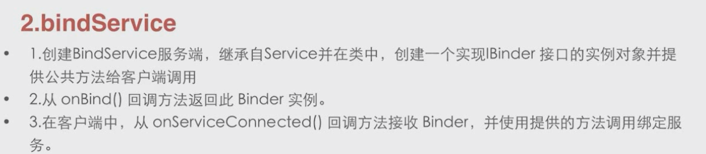
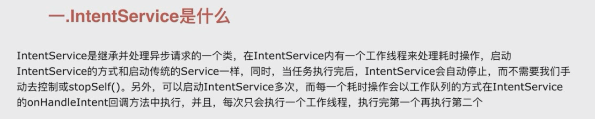

service是一种可以在后台执行长时间运行操而没有界面的应用组件

服务和后台的概念不要混淆，Android的service翻译成服务并不是在后面默默工作的后台概念。

和thread也是毫无关系，thread可以做耗时操作，service不能





### IntentService

```

public abstract class IntentService extends Service {
    private volatile Looper mServiceLooper;
    private volatile ServiceHandler mServiceHandler;
    private String mName;
    private boolean mRedelivery;

    private final class ServiceHandler extends Handler {
        public ServiceHandler(Looper looper) {
            super(looper);
        }

        @Override
        public void handleMessage(Message msg) {
            onHandleIntent((Intent)msg.obj);
            stopSelf(msg.arg1);
        }
    }

    /**
     * Creates an IntentService.  Invoked by your subclass's constructor.
     *
     * @param name Used to name the worker thread, important only for debugging.
     */
    public IntentService(String name) {
        super();
        mName = name;
    }

  
    public void setIntentRedelivery(boolean enabled) {
        mRedelivery = enabled;
    }

    @Override
    public void onCreate() {
        // TODO: It would be nice to have an option to hold a partial wakelock
        // during processing, and to have a static startService(Context, Intent)
        // method that would launch the service & hand off a wakelock.

        super.onCreate();
        HandlerThread thread = new HandlerThread("IntentService[" + mName + "]");
        thread.start();

        mServiceLooper = thread.getLooper();
        mServiceHandler = new ServiceHandler(mServiceLooper);
    }

    @Override
    public void onStart(@Nullable Intent intent, int startId) {
        Message msg = mServiceHandler.obtainMessage();
        msg.arg1 = startId;
        msg.obj = intent;
        mServiceHandler.sendMessage(msg);
    }
 
    @Override
    public int onStartCommand(@Nullable Intent intent, int flags, int startId) {
        onStart(intent, startId);
        return mRedelivery ? START_REDELIVER_INTENT : START_NOT_STICKY;
    }

    @Override
    public void onDestroy() {
        mServiceLooper.quit();
    }

   
    @Override
    @Nullable
    public IBinder onBind(Intent intent) {
        return null;
    }

    
    @WorkerThread
    protected abstract void onHandleIntent(@Nullable Intent intent);
}

```




