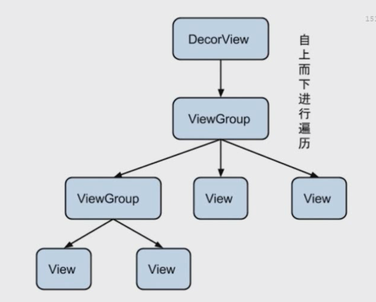
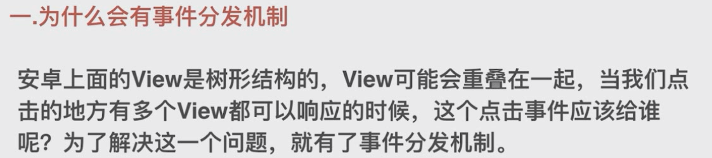
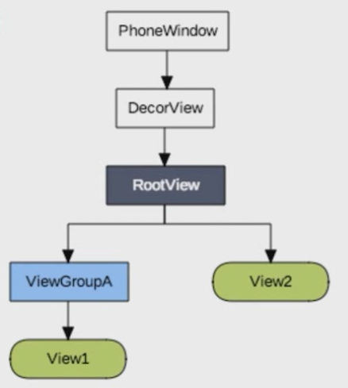
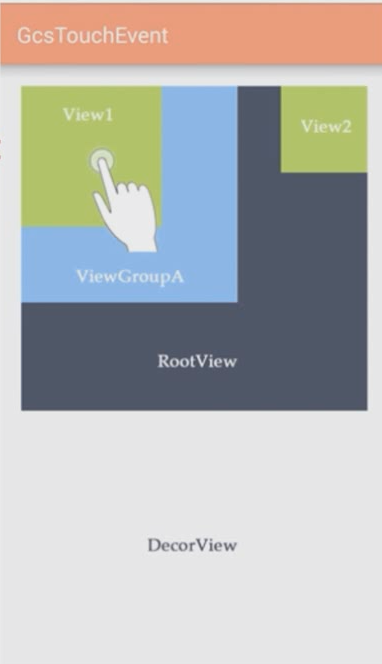
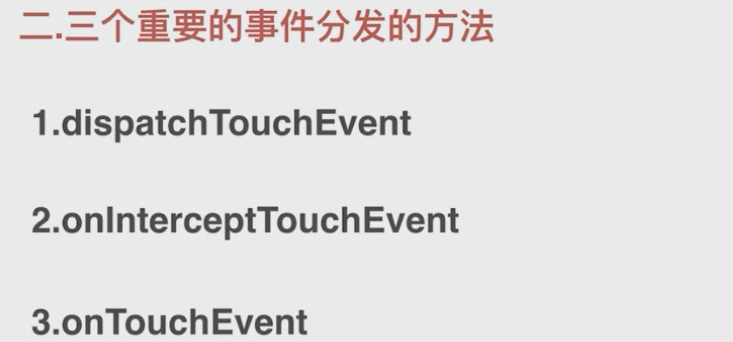
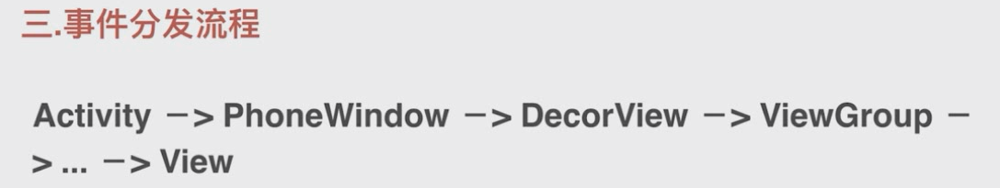
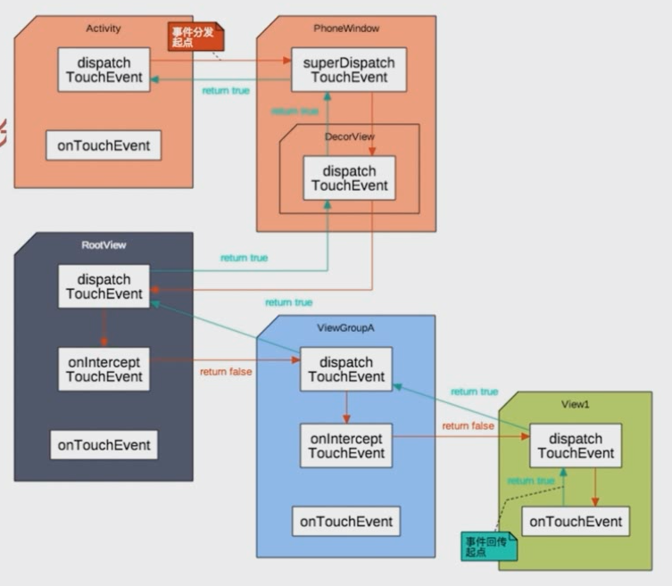
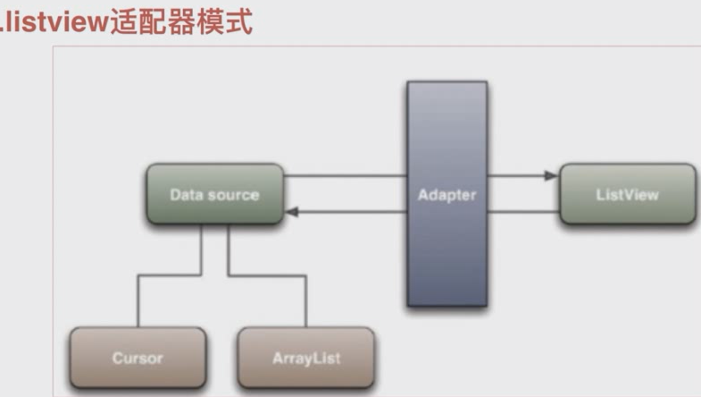
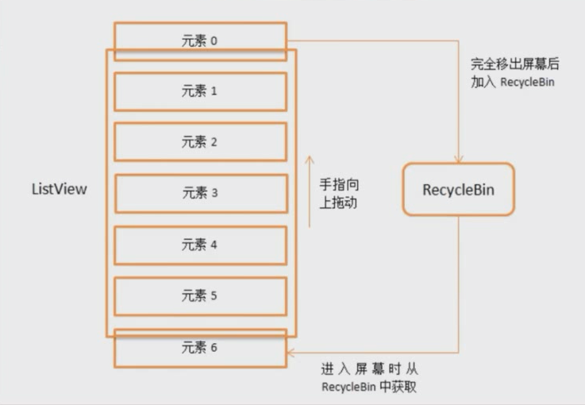

### View树的绘制流程

measure -> layout -> draw

#### measure

从上而下递归进行

1,ViewGroup.LayoutParams 

2，MeasureSpec

3,

### 事件分发

标题和主题颜色显示在DecorView.

Phonewindow作为Window（抽象类）的唯一实现类，是view的事件管理容器

DecorView 是 Phonewindow的内部类。为什么这么设计？

activity 没有 onInterceptTouchEvent 拦截事件功能，如果activity具备这个功能，那么没有view能响应，这个功能加进来没有意义

#### listview

#### RecycleBin(View 回收利用)机制

