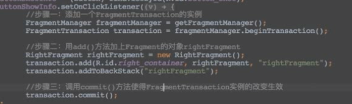
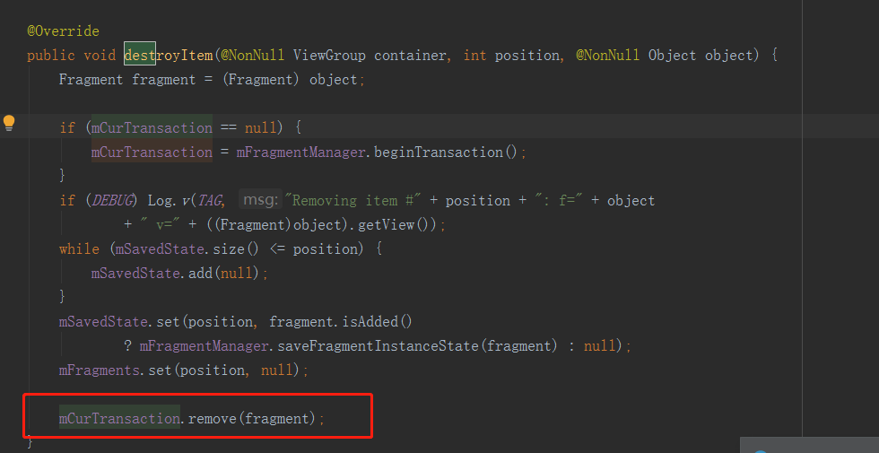
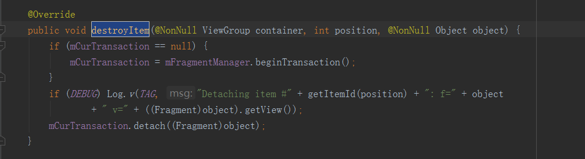
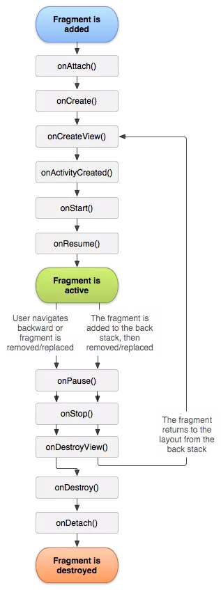
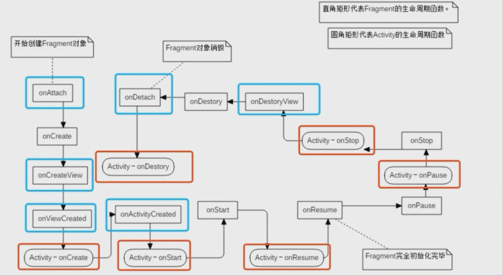
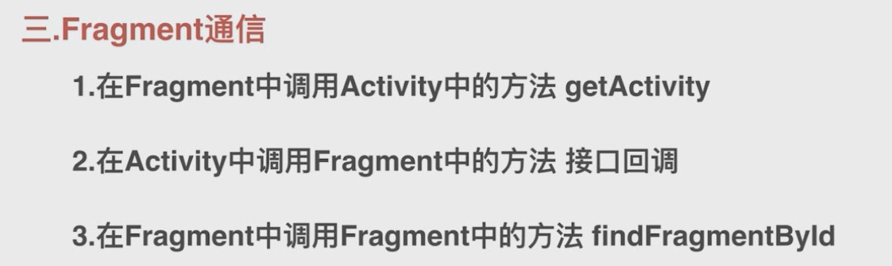

### fragment 加载到activity中的两种方式

1，静态加载：将fragment添加到activity布局中

2，动态加载：在activity中添加fragment

### FragmentPagerAdapter  和  FragmentStatePagerAdapter 区别

主要区别是destroyItem

FragmentStatePagerAdapter ：直接remove，适用于fragment较多的情况

FragmentPagerAdapter：fragment没有被销毁，只是和transaction解绑而已。内存还在，适用于内存较少的情况

### 生命周期

### FragmentManager的replace，add，remove方法

