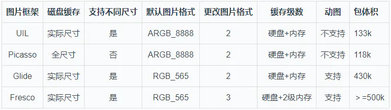

# Glide缓存特点

glide如何加载GIF图片的

glide中额lrucache以及实现

glide缓存的弱引用。在Android中还有哪些应用。

glide做了哪些内存优化

如何设计一个图片库？深挖glide，如果图片没有设置有效期，如何保证缓存被更新？加载，缓存，LRU算法。

太大的图片怎么加载优化？

还未下载怎么知道大小，长宽？

listview图片错位的原因

一张图片100*100在内存中的大小


从来源到显示整个过程分析：

1，数据来源：内存，网络，磁盘

​     因为涉及到网络：所以还要考虑类似Rxjava线程切换。或者自动识别是网络就切换到线程池执行。

​    太大了是否需要压缩

2，缓存机制

 3，显示是否需要压缩，自动切换到主线程执行


从研发角度分析：

适配大多数图片显示控件，listview，recycleview等。不要出现滑动的时候各种显示问题

补充一个我自己思考漏掉的地方：生命周期，OOM问题！！！


从用户角度看：省流量，不卡顿，快速流畅


需要考虑哪些问题？
首先，梳理一下必要的图片加载框架的需求：

异步加载：线程池
切换线程：Handler，没有争议吧
缓存：LruCache、DiskLruCache
防止OOM：软引用、LruCache、图片压缩、Bitmap像素存储位置
内存泄露：注意ImageView的正确引用，生命周期管理
列表滑动加载的问题：加载错乱、队满任务过多问题
当然，还有一些不是必要的需求，例如加载动画等。

异步加载：
线程池，多少个？

缓存一般有三级，内存缓存、硬盘、网络。

2个，读内存和硬盘可以放在一个线程池，网络需要另外一个线程池，网络也可以采用Okhttp内置的线程池。

Glide使用了三个线程池，不考虑动画的话就是两个。

 

```java
public final class GlideBuilder {
  ...
  private GlideExecutor sourceExecutor; //加载源文件的线程池，包括网络加载
  private GlideExecutor diskCacheExecutor; //加载硬盘缓存的线程池
  ...
  private GlideExecutor animationExecutor; //动画线程池


```


切换线程
图片异步加载成功，需要在主线程去更新ImageView，

无论是RxJava、EventBus，还是Glide，只要是想从子线程切换到Android主线程，都离不开Handler。

看下Glide 相关源码： 

```java
    class EngineJob<R> implements DecodeJob.Callback<R>,Poolable {
      private static final EngineResourceFactory DEFAULT_FACTORY = new EngineResourceFactory();
      //创建Handler
      private static final Handler MAIN_THREAD_HANDLER =
          new Handler(Looper.getMainLooper(), new MainThreadCallback());


```


缓存
弱引用+LruCache+DiskLruCache

防止OOM
1.软引用
强引用： 普通变量都属于强引用，比如 private Context context;
软应用： SoftReference，在发生OOM之前，垃圾回收器会回收SoftReference引用的对象。
弱引用： WeakReference，发生GC的时候，垃圾回收器会回收WeakReference中的对象。
虚引用： 为一个对象设置虚引用关联的唯一目的就是能在这个对象被收集器回收时收到一个系统通知。

方法1:软应用
如果一个对象只具有软引用，那么如果内存空间足够，垃圾回收器就不会回收它；如果内存空间不足了，就会回收这些对象的内存。只要垃圾回收器没有回收它，该对象就可以被程序使用。
软引用可用来实现内存敏感的高速缓存。软引用可以和一个引用队列（ReferenceQueue）联合使用，如果软引用所引用的对象被垃圾回收，Java虚拟机就会把这个软引用加入到与之关联的引用队列中。

使用场景：LeakCanary

jdk中直接内存的回收就用到虚引用，由于jvm自动内存管理的范围是堆内存，而直接内存是在堆内存之外（其实是内存映射文件，自行去理解虚拟内存空间的相关概念），所以直接内存的分配和回收都是有Unsafe类去操作，java在申请一块直接内存之后，会在堆内存分配一个对象保存这个堆外内存的引用，这个对象被垃圾收集器管理，一旦这个对象被回收，相应的用户线程会收到通知并对直接内存进行清理工作。

android中非静态handler为什么会造成内存泄漏？
当一个android主线程被创建的时候，同时会有一个Looper对象被创建，而这个Looper对象会实现一个MessageQueue(消息队列)，当我们创建一个handler对象时，而handler的作用就是放入和取出消息从这个消息队列中，每当我们通过handler将一个msg放入消息队列时，这个msg就会持有一个handler对象的引用。
因此当Activity被结束后，这个msg在被取出来之前，这msg会继续存活，但是这个msg持有handler的引用，而handler在Activity中创建，会持有Activity的引用，因而当Activity结束后，Activity对象并不能够被gc回收，因而出现内存泄漏

但是为什么为static类型就会解决这个问题呢？
因为在java中所有非静态的对象都会持有当前类的强引用，而静态对象则只会持有当前类的弱引用。
声明为静态后，handler将会持有一个Activity的弱引用，而弱引用会很容易被gc回收，这样就能解决Activity结束后，gc却无法回收的情况。

或者是activity销毁时候清空队列里的消息，即在activity的onDestroy对handler中message进行removeCallbacksAndMessages

回到图片框架，软引用的设计就是应用于会发生OOM的场景，大内存对象如Bitmap，可以通过 SoftReference 修饰，防止大对象造成OOM，看下这段代码

```java
    private static LruCache<String, SoftReference<Bitmap>> mLruCache = new LruCache<String, SoftReference<Bitmap>>(10 * 1024){
        @Override
        protected int sizeOf(String key, SoftReference<Bitmap> value) {
            //默认返回1，这里应该返回Bitmap占用的内存大小，单位：K

            //Bitmap被回收了，大小是0
            if (value.get() == null){
                return 0;
            }
            return value.get().getByteCount() /1024;
        }
    };


```


方法2:onLowMemory
当内存不足的时候，Activity、Fragment会调用onLowMemory方法，可以在这个方法里去清除缓存，Glide使用的就是这一种方式来防止OOM。

 

```java
//Glide
public void onLowMemory() {
    clearMemory();
}

public void clearMemory() {
    // Engine asserts this anyway when removing resources, fail faster and consistently
    Util.assertMainThread();
    // memory cache needs to be cleared before bitmap pool to clear re-pooled Bitmaps too. See #687.
    memoryCache.clearMemory();
    bitmapPool.clearMemory();
    arrayPool.clearMemory();
  }

```


方法3：从Bitmap 像素存储位置考虑
虚拟机的内存划分主要有5部分：
虚拟机栈
本地方法栈
程序计数器
方法区
堆

对象的分配一般都是在堆中，堆是JVM中最大的一块内存，OOM一般都是发生在堆中。

Bitmap 之所以占内存大不是因为对象本身大，而是因为Bitmap的像素数据， Bitmap的像素数据大小 = 宽 * 高 * 1像素占用的内存。

Bitmap使用 RGB_565 格式，则1像素占用 2 byte，ARGB_8888 格式则占4 byte。
Glide内存开销是Picasso的一半，就是因为默认Bitmap格式不同。

如果 BitmapFactory.Options 中指定 inJustDecodeBounds 为true，则为原图宽高，如果是false，则是缩放后的宽高。所以我们一般可以通过压缩来减小Bitmap像素占用内存。

Android 3.0到8.0 之间Bitmap像素数据存在Java堆，而8.0之后像素数据存到native堆中
主要两个步骤：
1.申请内存，创建native层Bitmap,native层的Bitmap数据（像素数据）是存在native堆中

2.创建java 层Bitmap
通过JNI创建Java层Bitmap对象

8.0 的Bitmap创建就两个点：
1.创建native层Bitmap，在native堆申请内存。
2.通过JNI创建java层Bitmap对象，这个对象在java堆中分配内存。
像素数据是存在native层Bitmap，也就是证明8.0的Bitmap像素数据存在native堆中。

7.0 像素内存的分配是这样的：
1.通过JNI调用java层创建一个数组
2.然后创建native层Bitmap，把数组的地址传进去。
由此说明，7.0 的Bitmap像素数据是放在java堆的。

说说final、finally、finalize 的关系
finalize：垃圾回收器确认这个对象没有其它地方引用到它的时候，会调用这个对象的finalize方法，子类可以重写这个方法，做一些释放资源的操作。

在6.0以前，Bitmap 就是通过这个finalize 方法来释放native层对象的。
在Bitmap构造方法创建了一个 BitmapFinalizer类，重写finalize 方法，在java层Bitmap被回收的时候，BitmapFinalizer 对象也会被回收，finalize 方法肯定会被调用，在里面释放native层Bitmap对象。

```java
Bitmap(long nativeBitmap, byte[] buffer, int width, int height, int density,
            boolean isMutable, boolean requestPremultiplied,
            byte[] ninePatchChunk, NinePatch.InsetStruct ninePatchInsets) {
        ...
        mNativePtr = nativeBitmap;
        //1.创建 BitmapFinalizer
        mFinalizer = new BitmapFinalizer(nativeBitmap);
        int nativeAllocationByteCount = (buffer == null ? getByteCount() : 0);
        mFinalizer.setNativeAllocationByteCount(nativeAllocationByteCount);
}

 private static class BitmapFinalizer {
        private long mNativeBitmap;

        // Native memory allocated for the duration of the Bitmap,
        // if pixel data allocated into native memory, instead of java byte[]
        private int mNativeAllocationByteCount;

        BitmapFinalizer(long nativeBitmap) {
            mNativeBitmap = nativeBitmap;
        }

        public void setNativeAllocationByteCount(int nativeByteCount) {
            if (mNativeAllocationByteCount != 0) {
                VMRuntime.getRuntime().registerNativeFree(mNativeAllocationByteCount);
            }
            mNativeAllocationByteCount = nativeByteCount;
            if (mNativeAllocationByteCount != 0) {
                VMRuntime.getRuntime().registerNativeAllocation(mNativeAllocationByteCount);
            }
        }

        @Override
        public void finalize() {
            try {
                super.finalize();
            } catch (Throwable t) {
                // Ignore
            } finally {
                //2.就是这里了，
                setNativeAllocationByteCount(0);
                nativeDestructor(mNativeBitmap);
                mNativeBitmap = 0;
            }
        }
    }


```


6.0 之后做了一些变化，BitmapFinalizer 没有了，被NativeAllocationRegistry取代。

例如 8.0 Bitmap构造方法

```java
    Bitmap(long nativeBitmap, int width, int height, int density,
            boolean isMutable, boolean requestPremultiplied,
            byte[] ninePatchChunk, NinePatch.InsetStruct ninePatchInsets) {

        ...
        mNativePtr = nativeBitmap;
        long nativeSize = NATIVE_ALLOCATION_SIZE + getAllocationByteCount();
        //  创建NativeAllocationRegistry这个类，调用registerNativeAllocation 方法
        NativeAllocationRegistry registry = new NativeAllocationRegistry(
            Bitmap.class.getClassLoader(), nativeGetNativeFinalizer(), nativeSize);
        registry.registerNativeAllocation(this, nativeBitmap);
    }

```


不管是BitmapFinalizer 还是NativeAllocationRegistry，目的都是在java层Bitmap被回收的时候，将native层Bitmap对象也回收掉。 一般情况下我们无需手动调用recycle方法，由GC去盘它即可。

Android 8.0 之后Bitmap像素内存放在native堆，Bitmap导致OOM的问题基本不会在8.0以上设备出现了（没有内存泄漏的情况下）

Fresco 的优点是：“在5.0以下(最低2.3)系统，Fresco将图片放到一个特别的内存区域(Ashmem区)” 这个Ashmem区是一块匿名共享内存，Fresco 将Bitmap像素放到共享内存去了，共享内存是属于native堆内存。

4.4以下，Fresco 使用匿名共享内存来保存Bitmap数据，首先将图片数据拷贝到匿名共享内存中，然后使用Fresco自己写的加载Bitmap的方法。

Fresco对不同Android版本使用不同的方式去加载Bitmap，至于4.4-5.0，5.0-8.0，8.0 以上，对应另外三个解码器

ImageView 内存泄露
修改也比较简单粗暴，将ImageView用WeakReference修饰就完事了。
例如在界面退出的时候，我们除了希望ImageView被回收，同时希望加载图片的任务可以取消，队未执行的任务可以移除。

Glide的做法是监听生命周期回调，看 RequestManager 这个类

 

```java
public void onDestroy() {
    targetTracker.onDestroy();
    for (Target<?> target : targetTracker.getAll()) {
      //清理任务
      clear(target);
    }
    targetTracker.clear();
    requestTracker.clearRequests();
    lifecycle.removeListener(this);
    lifecycle.removeListener(connectivityMonitor);
    mainHandler.removeCallbacks(addSelfToLifecycle);
    glide.unregisterRequestManager(this);
  }

```


在Activity/fragment 销毁的时候，取消图片加载任务

列表加载问题
图片错乱
由于RecyclerView或者LIstView的复用机制，网络加载图片开始的时候ImageView是第一个item的，加载成功之后ImageView由于复用可能跑到第10个item去了，在第10个item显示第一个item的图片肯定是错的。

常规的做法是给ImageView设置tag，tag一般是图片地址，更新ImageView之前判断tag是否跟url一致。

线程池任务过多
列表滑动，会有很多图片请求，如果是第一次进入，没有缓存，那么队列会有很多任务在等待。所以在请求网络图片之前，需要判断队列中是否已经存在该任务，存在则不加到队列去。


# 鸿洋 https://blog.csdn.net/lmj623565791/article/details/41874561


完全解析

1、关于图片的压缩
不管是从网络还是本地的图片，加载都需要进行压缩，然后显示：

用户要你压缩显示，会给我们什么？一个imageview，一个path，我们的职责就是压缩完成后显示上去。

1、本地图片的压缩

## a、获得imageview想要显示的大小

想要压缩，我们第一步应该是获得imageview想要显示的大小，没大小肯定没办法压缩？

那么如何获得imageview想要显示的大小呢？

/**
	 * 根据ImageView获适当的压缩的宽和高
	 * 
	 * @param imageView
	 * @return
	 */
	public static ImageSize getImageViewSize(ImageView imageView)
	{

```java
	ImageSize imageSize = new ImageSize();
	DisplayMetrics displayMetrics = imageView.getContext().getResources()
			.getDisplayMetrics();
 
	LayoutParams lp = imageView.getLayoutParams();
 
	int width = imageView.getWidth();// 获取imageview的实际宽度
	if (width <= 0)
	{
		width = lp.width;// 获取imageview在layout中声明的宽度
	}
	if (width <= 0)
	{
		// width = imageView.getMaxWidth();// 检查最大值
		width = getImageViewFieldValue(imageView, "mMaxWidth");
	}
	if (width <= 0)
	{
		width = displayMetrics.widthPixels;
	}
 
	int height = imageView.getHeight();// 获取imageview的实际高度
	if (height <= 0)
	{
		height = lp.height;// 获取imageview在layout中声明的宽度
	}
	if (height <= 0)
	{
		height = getImageViewFieldValue(imageView, "mMaxHeight");// 检查最大值
	}
	if (height <= 0)
	{
		height = displayMetrics.heightPixels;
	}
	imageSize.width = width;
	imageSize.height = height;
 
	return imageSize;
}
 
public static class ImageSize
{
	int width;
	int height;
}
```


可以看到，我们拿到imageview以后：
首先企图通过getWidth获取显示的宽；有些时候，这个getWidth返回的是0；

那么我们再去看看它有没有在布局文件中书写宽；

如果布局文件中也没有精确值，那么我们再去看看它有没有设置最大值；

如果最大值也没设置，那么我们只有拿出我们的终极方案，使用我们的屏幕宽度；

总之，不能让它任性，我们一定要拿到一个合适的显示值。

可以看到这里或者最大宽度，我们用的反射，而不是getMaxWidth()；维萨呢，因为getMaxWidth竟然要API 16，我也是醉了；为了兼容性，我们采用反射的方案。反射的代码就不贴了。

## b、设置合适的inSampleSize

我们获得想要显示的大小，为了什么，还不是为了和图片的真正的宽高做比较，拿到一个合适的inSampleSize，去对图片进行压缩么。 

```java
// 获得图片的宽和高，并不把图片加载到内存中
		BitmapFactory.Options options = new BitmapFactory.Options();
		options.inJustDecodeBounds = true;
		BitmapFactory.decodeFile(path, options);
```

这三行就成功获取图片真正的宽和高了，存在我们的options里面；


然后我们就可以happy的去计算inSampleSize了：


```java
/**
	 * 根据需求的宽和高以及图片实际的宽和高计算SampleSize
	 * 
	 * @param options
	 * @param width
	 * @param height
	 * @return
	 */
	public static int caculateInSampleSize(Options options, int reqWidth,
			int reqHeight)
	{
		int width = options.outWidth;
		int height = options.outHeight;
 
		int inSampleSize = 1;
 
		if (width > reqWidth || height > reqHeight)
		{
			int widthRadio = Math.round(width * 1.0f / reqWidth);
			int heightRadio = Math.round(height * 1.0f / reqHeight);
 
			inSampleSize = Math.max(widthRadio, heightRadio);
		}
 
		return inSampleSize;
	}
```


options里面存了实际的宽和高；reqWidth和reqHeight就是我们之前得到的想要显示的大小；经过比较，得到一个合适的inSampleSize;


有了inSampleSize:

```java
options.inSampleSize = ImageSizeUtil.caculateInSampleSize(options,
				width, height);
 
		// 使用获得到的InSampleSize再次解析图片
		options.inJustDecodeBounds = false;
		Bitmap bitmap = BitmapFactory.decodeFile(path, options);
		return bitmap;
```


经过这几行，就完成图片的压缩了。


上述是本地图片的压缩，那么如果是网络图片呢？

## 2、网络图片的压缩

**a、直接下载存到sd卡，然后采用本地的压缩方案。这种方式当前是在硬盘缓存开启的情况下，如果没有开启呢？**

**b、使用BitmapFactory.decodeStream(is, null, opts);**


```java
/**
	 * 根据url下载图片在指定的文件
	 * 
	 * @param urlStr
	 * @param file
	 * @return
	 */
	public static Bitmap downloadImgByUrl(String urlStr, ImageView imageview)
	{
		FileOutputStream fos = null;
		InputStream is = null;
		try
		{
			URL url = new URL(urlStr);
			HttpURLConnection conn = (HttpURLConnection) url.openConnection();
			is = new BufferedInputStream(conn.getInputStream());
			is.mark(is.available());
			
			Options opts = new Options();
			opts.inJustDecodeBounds = true;
			Bitmap bitmap = BitmapFactory.decodeStream(is, null, opts);
			
			//获取imageview想要显示的宽和高
			ImageSize imageViewSize = ImageSizeUtil.getImageViewSize(imageview);
			opts.inSampleSize = ImageSizeUtil.caculateInSampleSize(opts,
					imageViewSize.width, imageViewSize.height);
			
			opts.inJustDecodeBounds = false;
			is.reset();
			bitmap = BitmapFactory.decodeStream(is, null, opts);
 
			conn.disconnect();
			return bitmap;
 
		} catch (Exception e)
		{
			e.printStackTrace();
		} finally
		{
			try
			{
				if (is != null)
					is.close();
			} catch (IOException e)
			{
			}
 
			try
			{
				if (fos != null)
					fos.close();
			} catch (IOException e)
			{
			}
		}
 
		return null;
 
	}
```


基本和本地压缩差不多，也是两次取样，当然需要注意一点，我们的is进行了包装，以便可以进行reset()；直接返回的is是不能使用两次的。
到此，图片压缩说完了。

2、图片加载框架的架构
我们的图片压缩加载完了，那么就应该放入我们的LruCache，然后设置到我们的ImageView上。

好了，接下来我们来说说我们的这个框架的架构；

1、单例，包含一个LruCache用于管理我们的图片；

2、任务队列，我们每来一次加载图片的请求，我们会封装成Task存入我们的TaskQueue;

3、包含一个后台线程，这个线程在第一次初始化实例的时候启动，然后会一直在后台运行；任务呢？还记得我们有个任务队列么，有队列存任务，得有人干活呀；所以，当每来一次加载图片请求的时候，我们同时发一个消息到后台线程，后台线程去使用线程池去TaskQueue去取一个任务执行；

4、调度策略；3中说了，后台线程去TaskQueue去取一个任务，这个任务不是随便取的，有策略可以选择，一个是FIFO，一个是LIFO，我倾向于后者。

好了，基本就这些结构，接下来看我们具体的实现。

3、具体的实现

1、构造方法 


```java
public static ImageLoader getInstance(int threadCount, Type type)
	{
		if (mInstance == null)
		{
			synchronized (ImageLoader.class)
			{
				if (mInstance == null)
				{
					mInstance = new ImageLoader(threadCount, type);
				}
			}
		}
		return mInstance;
	}
```

 这个就不用说了，重点看我们的构造方法

```java
/**
 * 图片加载类
 * 
 * @author zhy
 * 
 */
public class ImageLoader
{
	private static ImageLoader mInstance;
 
	/**
	 * 图片缓存的核心对象
	 */
	private LruCache<String, Bitmap> mLruCache;
	/**
	 * 线程池
	 */
	private ExecutorService mThreadPool;
	private static final int DEAFULT_THREAD_COUNT = 1;
	/**
	 * 队列的调度方式
	 */
	private Type mType = Type.LIFO;
	/**
	 * 任务队列
	 */
	private LinkedList<Runnable> mTaskQueue;
	/**
	 * 后台轮询线程
	 */
	private Thread mPoolThread;
	private Handler mPoolThreadHandler;
	/**
	 * UI线程中的Handler
	 */
	private Handler mUIHandler;
 
	private Semaphore mSemaphorePoolThreadHandler = new Semaphore(0);
	private Semaphore mSemaphoreThreadPool;
 
	private boolean isDiskCacheEnable = true;
 
	private static final String TAG = "ImageLoader";
 
	public enum Type
	{
		FIFO, LIFO;
	}
 
	private ImageLoader(int threadCount, Type type)
	{
		init(threadCount, type);
	}
 
	/**
	 * 初始化
	 * 
	 * @param threadCount
	 * @param type
	 */
	private void init(int threadCount, Type type)
	{
		initBackThread();
 
		// 获取我们应用的最大可用内存
		int maxMemory = (int) Runtime.getRuntime().maxMemory();
		int cacheMemory = maxMemory / 8;
		mLruCache = new LruCache<String, Bitmap>(cacheMemory)
		{
			@Override
			protected int sizeOf(String key, Bitmap value)
			{
				return value.getRowBytes() * value.getHeight();
			}
 
		};
 
		// 创建线程池
		mThreadPool = Executors.newFixedThreadPool(threadCount);
		mTaskQueue = new LinkedList<Runnable>();
		mType = type;
		mSemaphoreThreadPool = new Semaphore(threadCount);
	}
 
	/**
	 * 初始化后台轮询线程
	 */
	private void initBackThread()
	{
		// 后台轮询线程
		mPoolThread = new Thread()
		{
			@Override
			public void run()
			{
				Looper.prepare();
				mPoolThreadHandler = new Handler()
				{
					@Override
					public void handleMessage(Message msg)
					{
						// 线程池去取出一个任务进行执行
						mThreadPool.execute(getTask());
						try
						{
							mSemaphoreThreadPool.acquire();
						} catch (InterruptedException e)
						{
						}
					}
				};
				// 释放一个信号量
				mSemaphorePoolThreadHandler.release();
				Looper.loop();
			};
		};
 
		mPoolThread.start();
	}
```


在贴构造的时候，顺便贴出所有的成员变量；
在构造中我们调用init，init中可以设置后台加载图片线程数量和加载策略；init中首先初始化后台线程initBackThread(),可以看到这个后台线程，实际上是个Looper最终在那不断的loop，我们还初始化了一个mPoolThreadHandler用于发送消息到此线程；

接下来就是初始化mLruCache  ， mThreadPool ，mTaskQueue 等；

## 2、loadImage

构造完成以后，当然是使用了，用户调用loadImage传入(final String path, final ImageView imageView,final boolean isFromNet)就可以完成本地或者网络图片的加载。 


```java
/**
	 * 根据path为imageview设置图片
	 * 
	 * @param path
	 * @param imageView
	 */
	public void loadImage(final String path, final ImageView imageView,
			final boolean isFromNet)
	{
		imageView.setTag(path);
		if (mUIHandler == null)
		{
			mUIHandler = new Handler()
			{
				public void handleMessage(Message msg)
				{
					// 获取得到图片，为imageview回调设置图片
					ImgBeanHolder holder = (ImgBeanHolder) msg.obj;
					Bitmap bm = holder.bitmap;
					ImageView imageview = holder.imageView;
					String path = holder.path;
					// 将path与getTag存储路径进行比较
					if (imageview.getTag().toString().equals(path))
					{
						imageview.setImageBitmap(bm);
					}
				};
			};
		}
 
		// 根据path在缓存中获取bitmap
		Bitmap bm = getBitmapFromLruCache(path);
 
		if (bm != null)
		{
			refreashBitmap(path, imageView, bm);
		} else
		{
			addTask(buildTask(path, imageView, isFromNet));
		}
 
	}
```


首先我们为imageview.setTag；然后初始化一个mUIHandler，不用猜，这个mUIHandler用户更新我们的imageview，因为这个方法肯定是主线程调用的。
然后调用：getBitmapFromLruCache(path);根据path在缓存中获取bitmap；如果找到那么直接去设置我们的图片； 

```java
private void refreashBitmap(final String path, final ImageView imageView,
			Bitmap bm)
	{
		Message message = Message.obtain();
		ImgBeanHolder holder = new ImgBeanHolder();
		holder.bitmap = bm;
		holder.path = path;
		holder.imageView = imageView;
		message.obj = holder;
		mUIHandler.sendMessage(message);
	}
```


可以看到，如果找到图片，则直接使用UIHandler去发送一个消息，当然了携带了一些必要的参数，然后UIHandler的handleMessage中完成图片的设置；
handleMessage中拿到path,bitmap,imageview；记得必须要：

// 将path与getTag存储路径进行比较
 if (imageview.getTag().toString().equals(path))
 {
 imageview.setImageBitmap(bm);
 }

否则会造成图片混乱。

如果没找到，则通过buildTask去新建一个任务，在addTask到任务队列。

buildTask就比较复杂了，因为还涉及到本地和网络，所以我们先看addTask代码： 

```java
private synchronized void addTask(Runnable runnable)
	{
		mTaskQueue.add(runnable);
		// if(mPoolThreadHandler==null)wait();
		try
		{
			if (mPoolThreadHandler == null)
				mSemaphorePoolThreadHandler.acquire();
		} catch (InterruptedException e)
		{
		}
		mPoolThreadHandler.sendEmptyMessage(0x110);
	}
```

很简单，就是runnable加入TaskQueue，与此同时使用mPoolThreadHandler（这个handler还记得么，用于和我们后台线程交互。）去发送一个消息给后台线程，叫它去取出一个任务执行；具体代码：

```java
mPoolThreadHandler = new Handler()
				{
					@Override
					public void handleMessage(Message msg)
					{
						// 线程池去取出一个任务进行执行
						mThreadPool.execute(getTask());
```

直接使用mThreadPool线程池，然后使用getTask去取一个任务。

```java
/**
	 * 从任务队列取出一个方法
	 * 
	 * @return
	 */
	private Runnable getTask()
	{
		if (mType == Type.FIFO)
		{
			return mTaskQueue.removeFirst();
		} else if (mType == Type.LIFO)
		{
			return mTaskQueue.removeLast();
		}
		return null;
	}
```


getTask代码也比较简单，就是根据Type从任务队列头或者尾进行取任务。


现在你会不会好奇，任务里面到底什么代码？其实我们也就剩最后一段代码了buildTask

```java
/**
	 * 根据传入的参数，新建一个任务
	 * 
	 * @param path
	 * @param imageView
	 * @param isFromNet
	 * @return
	 */
	private Runnable buildTask(final String path, final ImageView imageView,
			final boolean isFromNet)
	{
		return new Runnable()
		{
			@Override
			public void run()
			{
				Bitmap bm = null;
				if (isFromNet)
				{
					File file = getDiskCacheDir(imageView.getContext(),
							md5(path));
					if (file.exists())// 如果在缓存文件中发现
					{
						Log.e(TAG, "find image :" + path + " in disk cache .");
						bm = loadImageFromLocal(file.getAbsolutePath(),
								imageView);
					} else
					{
						if (isDiskCacheEnable)// 检测是否开启硬盘缓存
						{
							boolean downloadState = DownloadImgUtils
									.downloadImgByUrl(path, file);
							if (downloadState)// 如果下载成功
							{
								Log.e(TAG,
										"download image :" + path
												+ " to disk cache . path is "
												+ file.getAbsolutePath());
								bm = loadImageFromLocal(file.getAbsolutePath(),
										imageView);
							}
						} else
						// 直接从网络加载
						{
							Log.e(TAG, "load image :" + path + " to memory.");
							bm = DownloadImgUtils.downloadImgByUrl(path,
									imageView);
						}
					}
				} else
				{
					bm = loadImageFromLocal(path, imageView);
				}
				// 3、把图片加入到缓存
				addBitmapToLruCache(path, bm);
				refreashBitmap(path, imageView, bm);
				mSemaphoreThreadPool.release();
			}
 
			
		};
	}
	
	private Bitmap loadImageFromLocal(final String path,
			final ImageView imageView)
	{
		Bitmap bm;
		// 加载图片
		// 图片的压缩
		// 1、获得图片需要显示的大小
		ImageSize imageSize = ImageSizeUtil.getImageViewSize(imageView);
		// 2、压缩图片
		bm = decodeSampledBitmapFromPath(path, imageSize.width,
				imageSize.height);
		return bm;
	}
```

```

```

我们新建任务，说明在内存中没有找到缓存的bitmap；我们的任务就是去根据path加载压缩后的bitmap返回即可，然后加入LruCache，设置回调显示。
首先我们判断是否是网络任务？

如果是，首先去硬盘缓存中找一下，（硬盘中文件名为：根据path生成的md5为名称）。

如果硬盘缓存中没有，那么去判断是否开启了硬盘缓存：

 开启了的话：下载图片，使用loadImageFromLocal本地加载图片的方式进行加载（压缩的代码前面已经详细说过）；

         如果没有开启：则直接从网络获取（压缩获取的代码，前面详细说过）；

如果不是网络图片：直接loadImageFromLocal本地加载图片的方式进行加载


经过上面，就获得了bitmap；然后加入addBitmapToLruCache，refreashBitmap回调显示图片。 

```java
/**
	 * 将图片加入LruCache
	 * 
	 * @param path
	 * @param bm
	 */
	protected void addBitmapToLruCache(String path, Bitmap bm)
	{
		if (getBitmapFromLruCache(path) == null)
		{
			if (bm != null)
				mLruCache.put(path, bm);
		}
	}
```

不过有些地方需要注意：就是在代码中，你会看到一些信号量的身影：

第一个：mSemaphorePoolThreadHandler = new Semaphore(0); 用于控制我们的mPoolThreadHandler的初始化完成，我们在使用mPoolThreadHandler会进行判空，如果为null，会通过mSemaphorePoolThreadHandler.acquire()进行阻塞；当mPoolThreadHandler初始化结束，我们会调用.release();解除阻塞。

第二个：mSemaphoreThreadPool = new Semaphore(threadCount);这个信号量的数量和我们加载图片的线程个数一致；每取一个任务去执行，我们会让信号量减一；每完成一个任务，会让信号量+1，再去取任务；目的是什么呢？为什么当我们的任务到来时，如果此时在没有空闲线程，任务则一直添加到TaskQueue中，当线程完成任务，可以根据策略去TaskQueue中去取任务，只有这样，我们的LIFO才有意义。


到此，我们的图片加载框架就结束了，你可以尝试下加载本地，或者去加载网络大量的图片，拼一拼加载速度~~~ 


# Glide源码分析

mode：数据来源 可以url也可以是本地路径或者资源id等。都会封装好

 

data：变成数据，类似inputsream

Resource：将data解码成相对资源，比如bitmap

TransformedResource：变换后的资源

TranscodeResource ：转码后的资源

Target ： 显示目标


```java
Glide.with(this.getApplicationContext()).load("https://img1.baidu.com/it/u=3985559179,324515920&fm=26&fmt=auto&gp=0.jpg").into(img);

Glide.with(getApplicationContext())
        .load("url")//指定URL
        .placeholder(R.mipmap.ic_launcher)//图片未加载前显示的图片
        .error(R.mipmap.ic_launcher)//图片加载失败显示的图片
        .override(300,300)//指定图片的尺寸
        .fitCenter()//指定图片缩放类型
        .centerCrop()
        .skipMemoryCache(true)//跳过内存缓存
        .crossFade(1000)//设置渐变式显示的时间
        .diskCacheStrategy(DiskCacheStrategy.NONE)//跳过磁盘缓存
        .diskCacheStrategy(DiskCacheStrategy.SOURCE)//仅仅只缓存原来的全分辨率的图像
        .diskCacheStrategy(DiskCacheStrategy.RESULT)//仅仅缓存最终的图像
        .diskCacheStrategy(DiskCacheStrategy.ALL)//缓存所有版本的图像
        .priority(Priority.HIGH)//执行优先级。glide会尽可能处理这些请求
        .into(img);
```


```java
public static RequestManager with(Context context) {
    RequestManagerRetriever retriever = RequestManagerRetriever.get();
    return retriever.get(context);
}


/**
 * A collection of static methods for creating new {@link com.bumptech.glide.RequestManager}s or retrieving existing
 * ones from activities and fragment.
 */
public class RequestManagerRetriever implements Handler.Callback {
    
    
     public static RequestManagerRetriever get() {
        return INSTANCE;
    }
     private static final RequestManagerRetriever INSTANCE = new RequestManagerRetriever();
    
```

```java
RequestManager用来处理请求的管理类     RequestManagerRetriever 创建RequestManager的类
    

public RequestManager get(Context context) {
        if (context == null) {
            throw new IllegalArgumentException("You cannot start a load on a null Context");
        } else if (Util.isOnMainThread() && !(context instanceof Application)) {
            if (context instanceof FragmentActivity) {
                return get((FragmentActivity) context);
            } else if (context instanceof Activity) {
                return get((Activity) context);
            } else if (context instanceof ContextWrapper) {
                return get(((ContextWrapper) context).getBaseContext());
            }
        }
		//传的appcation调这个
    
        return getApplicationManager(context);
    }

传入activity的时候是怎么处理的呢？
       public static boolean isOnBackgroundThread() {
        return !isOnMainThread();
    }
 public static boolean isOnMainThread() {
        return Looper.myLooper() == Looper.getMainLooper();
    }


    
      @TargetApi(Build.VERSION_CODES.HONEYCOMB)
    public RequestManager get(Activity activity) {
        if (Util.isOnBackgroundThread() || Build.VERSION.SDK_INT < Build.VERSION_CODES.HONEYCOMB) {
            //转换为application
            return get(activity.getApplicationContext());
        } else {
            assertNotDestroyed(activity);
            android.app.FragmentManager fm = activity.getFragmentManager();
            return fragmentGet(activity, fm);
        }
    }


	//判断activity是否destroy了
    @TargetApi(Build.VERSION_CODES.JELLY_BEAN_MR1)
    private static void assertNotDestroyed(Activity activity) {
        if (Build.VERSION.SDK_INT >= Build.VERSION_CODES.JELLY_BEAN_MR1 && activity.isDestroyed()) {
            throw new IllegalArgumentException("You cannot start a load for a destroyed activity");
        }
    }


  @TargetApi(Build.VERSION_CODES.HONEYCOMB)
    RequestManager fragmentGet(Context context, android.app.FragmentManager fm) {
        RequestManagerFragment current = getRequestManagerFragment(fm);
        RequestManager requestManager = current.getRequestManager();
        if (requestManager == null) {
            requestManager = new RequestManager(context, current.getLifecycle(), current.getRequestManagerTreeNode());
            
            //这里将空的fragment和requestManager进行了绑定。一一对应关系
            current.setRequestManager(requestManager);
        }
        return requestManager;
    }
这里很重要的一点通过创建一个空的fragment来监听组件的生命周期。 不同的生命周期处理防止很多异常。
    


```

```java
这个就是单例模式，获取对象
    

private RequestManager getApplicationManager(Context context) {
    // Either an application context or we're on a background thread.
    if (applicationManager == null) {
        synchronized (this) {
            if (applicationManager == null) {
                // Normally pause/resume is taken care of by the fragment we add to the fragment or activity.
                // However, in this case since the manager attached to the application will not receive lifecycle
                // events, we must force the manager to start resumed using ApplicationLifecycle.
                applicationManager = new RequestManager(context.getApplicationContext(),
                        new ApplicationLifecycle(), new EmptyRequestManagerTreeNode());
            }
        }
    }

    return applicationManager;
}
```

怎么进行生命周期的监听的呢？？ https://www.cnblogs.com/Android-Alvin/p/12626986.html

```java
/**
 * An interface for listener to {@link android.app.Fragment} and {@link android.app.Activity} lifecycle events.
 */
public interface LifecycleListener {

    /**
     * Callback for when {@link android.app.Fragment#onStart()}} or {@link android.app.Activity#onStart()} is called.
     */
    void onStart();

    /**
     * Callback for when {@link android.app.Fragment#onStop()}} or {@link android.app.Activity#onStop()}} is called.
     */
    void onStop();

    /**
     * Callback for when {@link android.app.Fragment#onDestroy()}} or {@link android.app.Activity#onDestroy()} is
     * called.
     */
    void onDestroy();
}
```

```java
/**
 * An interface for listening to Activity/Fragment lifecycle events.
 */
public interface Lifecycle {
    /**
     * Adds the given listener to the set of listeners managed by this Lifecycle implementation.
     */
    void addListener(LifecycleListener listener);
}
```

```java
/**
 * A {@link com.bumptech.glide.manager.Lifecycle} implementation for tracking and notifying listeners of
 * {@link android.app.Fragment} and {@link android.app.Activity} lifecycle events.
 */
class ActivityFragmentLifecycle implements Lifecycle {
    private final Set<LifecycleListener> lifecycleListeners =
            Collections.newSetFromMap(new WeakHashMap<LifecycleListener, Boolean>());
    private boolean isStarted;
    private boolean isDestroyed;

    /**
     * Adds the given listener to the list of listeners to be notified on each lifecycle event.
     *
     * <p>
     *     The latest lifecycle event will be called on the given listener synchronously in this method. If the
     *     activity or fragment is stopped, {@link LifecycleListener#onStop()}} will be called, and same for onStart and
     *     onDestroy.
     * </p>
     *
     * <p>
     *     Note - {@link com.bumptech.glide.manager.LifecycleListener}s that are added more than once will have their
     *     lifecycle methods called more than once. It is the caller's responsibility to avoid adding listeners
     *     multiple times.
     * </p>
     */
    @Override
    public void addListener(LifecycleListener listener) {
        lifecycleListeners.add(listener);

        if (isDestroyed) {
            listener.onDestroy();
        } else if (isStarted) {
            listener.onStart();
        } else {
            listener.onStop();
        }
    }

    void onStart() {
        isStarted = true;
        for (LifecycleListener lifecycleListener : Util.getSnapshot(lifecycleListeners)) {
            lifecycleListener.onStart();
        }
    }

    void onStop() {
        isStarted = false;
        for (LifecycleListener lifecycleListener : Util.getSnapshot(lifecycleListeners)) {
            lifecycleListener.onStop();
        }
    }

    void onDestroy() {
        isDestroyed = true;
        for (LifecycleListener lifecycleListener : Util.getSnapshot(lifecycleListeners)) {
            lifecycleListener.onDestroy();
        }
    }
}
```

```java
/**
 * A view-less {@link android.app.Fragment} used to safely store an {@link com.bumptech.glide.RequestManager} that
 * can be used to start, stop and manage Glide requests started for targets the fragment or activity this fragment is a
 * child of.
 *
 * @see com.bumptech.glide.manager.SupportRequestManagerFragment
 * @see com.bumptech.glide.manager.RequestManagerRetriever
 * @see com.bumptech.glide.RequestManager
 */
@TargetApi(Build.VERSION_CODES.HONEYCOMB)
public class RequestManagerFragment extends Fragment {
    private final ActivityFragmentLifecycle lifecycle;
    private final RequestManagerTreeNode requestManagerTreeNode = new FragmentRequestManagerTreeNode();
    private RequestManager requestManager;
    private final HashSet<RequestManagerFragment> childRequestManagerFragments
        = new HashSet<RequestManagerFragment>();
    private RequestManagerFragment rootRequestManagerFragment;

    public RequestManagerFragment() {
        this(new ActivityFragmentLifecycle());
    }

    // For testing only.
    @SuppressLint("ValidFragment")
    RequestManagerFragment(ActivityFragmentLifecycle lifecycle) {
        this.lifecycle = lifecycle;
    }

    /**
     * Sets the current {@link com.bumptech.glide.RequestManager}.
     *
     * @param requestManager The request manager to use.
     */
    public void setRequestManager(RequestManager requestManager) {
        this.requestManager = requestManager;
    }

    ActivityFragmentLifecycle getLifecycle() {
        return lifecycle;
    }

    /**
     * Returns the current {@link com.bumptech.glide.RequestManager} or null if none exists.
     */
    public RequestManager getRequestManager() {
        return requestManager;
    }

    public RequestManagerTreeNode getRequestManagerTreeNode() {
        return requestManagerTreeNode;
    }

    private void addChildRequestManagerFragment(RequestManagerFragment child) {
        childRequestManagerFragments.add(child);
    }

    private void removeChildRequestManagerFragment(RequestManagerFragment child) {
        childRequestManagerFragments.remove(child);
    }

    /**
     * Returns the set of fragments that this RequestManagerFragment's parent is a parent to. (i.e. our parent is
     * the fragment that we are annotating).
     */
    @TargetApi(Build.VERSION_CODES.JELLY_BEAN_MR1)
    public Set<RequestManagerFragment> getDescendantRequestManagerFragments() {
        if (rootRequestManagerFragment == this) {
            return Collections.unmodifiableSet(childRequestManagerFragments);
        } else if (rootRequestManagerFragment == null || Build.VERSION.SDK_INT < Build.VERSION_CODES.JELLY_BEAN_MR1) {
            // Pre JB MR1 doesn't allow us to get the parent fragment so we can't introspect hierarchy, so just
            // return an empty set.
            return Collections.emptySet();
        } else {
            HashSet<RequestManagerFragment> descendants = new HashSet<RequestManagerFragment>();
            for (RequestManagerFragment fragment
                    : rootRequestManagerFragment.getDescendantRequestManagerFragments()) {
                if (isDescendant(fragment.getParentFragment())) {
                    descendants.add(fragment);
                }
            }
            return Collections.unmodifiableSet(descendants);
        }
    }

    /**
     * Returns true if the fragment is a descendant of our parent.
     */
    @TargetApi(Build.VERSION_CODES.JELLY_BEAN_MR1)
    private boolean isDescendant(Fragment fragment) {
        Fragment root = this.getParentFragment();
        while (fragment.getParentFragment() != null) {
            if (fragment.getParentFragment() == root) {
                return true;
            }
            fragment = fragment.getParentFragment();
        }
        return false;
    }

    @Override
    public void onAttach(Activity activity) {
        super.onAttach(activity);
        rootRequestManagerFragment = RequestManagerRetriever.get()
                .getRequestManagerFragment(getActivity().getFragmentManager());
        if (rootRequestManagerFragment != this) {
            rootRequestManagerFragment.addChildRequestManagerFragment(this);
        }
    }

    @Override
    public void onDetach() {
        super.onDetach();
        if (rootRequestManagerFragment != null) {
            rootRequestManagerFragment.removeChildRequestManagerFragment(this);
            rootRequestManagerFragment = null;
        }
    }

    @Override
    public void onStart() {
        super.onStart();
        lifecycle.onStart();
    }

    @Override
    public void onStop() {
        super.onStop();
        lifecycle.onStop();
    }

    @Override
    public void onDestroy() {
        super.onDestroy();
        lifecycle.onDestroy();
    }

    @Override
    public void onTrimMemory(int level) {
        // If an activity is re-created, onTrimMemory may be called before a manager is ever set.
        // See #329.
        if (requestManager != null) {
            requestManager.onTrimMemory(level);
        }
    }

    @Override
    public void onLowMemory() {
        // If an activity is re-created, onLowMemory may be called before a manager is ever set.
        // See #329.
        if (requestManager != null) {
            requestManager.onLowMemory();
        }
    }

    private class FragmentRequestManagerTreeNode implements RequestManagerTreeNode {
        @Override
        public Set<RequestManager> getDescendants() {
            Set<RequestManagerFragment> descendantFragments = getDescendantRequestManagerFragments();
            HashSet<RequestManager> descendants =
                new HashSet<RequestManager>(descendantFragments.size());
            for (RequestManagerFragment fragment : descendantFragments) {
                if (fragment.getRequestManager() != null) {
                    descendants.add(fragment.getRequestManager());
                }
            }
            return descendants;
        }
    }
}
```


## load方法


```java
public DrawableTypeRequest<String> load(String string) {
    return (DrawableTypeRequest<String>) fromString().load(string);
}

DrawableTypeRequest  加载图片的所有request请求 
    fromString 会调用到
    
```

```java
private <T> DrawableTypeRequest<T> loadGeneric(Class<T> modelClass) {
    //创建了两个modeloader 。
    ModelLoader<T, InputStream> streamModelLoader = Glide.buildStreamModelLoader(modelClass, context);
    ModelLoader<T, ParcelFileDescriptor> fileDescriptorModelLoader =
            Glide.buildFileDescriptorModelLoader(modelClass, context);
    if (modelClass != null && streamModelLoader == null && fileDescriptorModelLoader == null) {
        throw new IllegalArgumentException("Unknown type " + modelClass + ". You must provide a Model of a type for"
                + " which there is a registered ModelLoader, if you are using a custom model, you must first call"
                + " Glide#register with a ModelLoaderFactory for your custom model class");
    }

    return optionsApplier.apply(
            new DrawableTypeRequest<T>(modelClass, streamModelLoader, fileDescriptorModelLoader, context,
                    glide, requestTracker, lifecycle, optionsApplier));
}
```

```
DrawableTypeRequest
 
    public BitmapTypeRequest<ModelType> asBitmap() {
        return optionsApplier.apply(new BitmapTypeRequest<ModelType>(this, streamModelLoader,
                fileDescriptorModelLoader, optionsApplier));
    }
 
    public GifTypeRequest<ModelType> asGif() {
        return optionsApplier.apply(new GifTypeRequest<ModelType>(this, streamModelLoader, optionsApplier));
    }
```


```
@Override
public DrawableRequestBuilder<ModelType> load(ModelType model) {
    super.load(model);
    return this;
}


GenericRequestBuilder  
```

## into方法

```java
public Target<TranscodeType> into(ImageView view) {
    Util.assertMainThread();
    if (view == null) {
        throw new IllegalArgumentException("You must pass in a non null View");
    }

    if (!isTransformationSet && view.getScaleType() != null) {
        switch (view.getScaleType()) {
            case CENTER_CROP:
                applyCenterCrop();
                break;
            case FIT_CENTER:
            case FIT_START:
            case FIT_END:
                applyFitCenter();
                break;
            //$CASES-OMITTED$
            default:
                // Do nothing.
        }
    }

    return into(glide.buildImageViewTarget(view, transcodeClass));
}
```

```java
/**
 * Set the target the resource will be loaded into.
 *
 * @see Glide#clear(com.bumptech.glide.request.target.Target)
 *
 * @param target The target to load the resource into.
 * @return The given target.
 */
public <Y extends Target<TranscodeType>> Y into(Y target) {
    Util.assertMainThread();
    if (target == null) {
        throw new IllegalArgumentException("You must pass in a non null Target");
    }
    if (!isModelSet) {
        throw new IllegalArgumentException("You must first set a model (try #load())");
    }

    Request previous = target.getRequest();
	//删除旧的request
    if (previous != null) {
        previous.clear();
        requestTracker.removeRequest(previous);
        previous.recycle();
    }
	//绑定新的request
    Request request = buildRequest(target);
    target.setRequest(request);
    lifecycle.addListener(target);
    requestTracker.runRequest(request);

    return target;
}
```

做3件事：
1，创建加载图片需要的request

2，在之前要把之前target绑定的ruquest删除，绑定新的request

3，发送request，交给requestTracker


```java
@Override
public void setRequest(Request request) {
    setTag(request);
}

//防止图片错位

    private void setTag(Object tag) {
        if (tagId == null) {
            isTagUsedAtLeastOnce = true;
            view.setTag(tag);
        } else {
            view.setTag(tagId, tag);
        }
    }
```


```java
/**
 * Starts tracking the given request.
 */
public void runRequest(Request request) {
    requests.add(request);//加到集合中
    if (!isPaused) {	//没有正在进行的请求
        request.begin();
    } else {            //直接加入到请求列表中
        pendingRequests.add(request);
    }
}
```

```java
@Override
public void begin() {
    startTime = LogTime.getLogTime();
    if (model == null) {
        onException(null);
        return;
    }

    status = Status.WAITING_FOR_SIZE;
    
    //判断前面是否调用了override 指定长，宽
    if (Util.isValidDimensions(overrideWidth, overrideHeight)) {
        onSizeReady(overrideWidth, overrideHeight);
    } else {
        //重新计算宽高
        target.getSize(this);
    }

    if (!isComplete() && !isFailed() && canNotifyStatusChanged()) {
        //占位图片
        target.onLoadStarted(getPlaceholderDrawable());
    }
    if (Log.isLoggable(TAG, Log.VERBOSE)) {
        logV("finished run method in " + LogTime.getElapsedMillis(startTime));
    }
}
```

```
public void getSize(SizeReadyCallback cb) {
    int currentWidth = getViewWidthOrParam();
    int currentHeight = getViewHeightOrParam();
    if (isSizeValid(currentWidth) && isSizeValid(currentHeight)) {
        cb.onSizeReady(currentWidth, currentHeight);
    } else {
        // We want to notify callbacks in the order they were added and we only expect one or two callbacks to
        // be added a time, so a List is a reasonable choice.
        
        //还未测量完毕，添加到observer进行事件监听
        
        if (!cbs.contains(cb)) {
            cbs.add(cb);
        }
        if (layoutListener == null) {
            final ViewTreeObserver observer = view.getViewTreeObserver();
            layoutListener = new SizeDeterminerLayoutListener(this);
            observer.addOnPreDrawListener(layoutListener);
        }
    }
}
```

```java
public void onSizeReady(int width, int height) {
    if (Log.isLoggable(TAG, Log.VERBOSE)) {
        logV("Got onSizeReady in " + LogTime.getElapsedMillis(startTime));
    }
    if (status != Status.WAITING_FOR_SIZE) {
        return;
    }
    status = Status.RUNNING;

    width = Math.round(sizeMultiplier * width);
    height = Math.round(sizeMultiplier * height);
	
    //modelLoader 从数据源中获取原始数据，一般是inputstream
    ModelLoader<A, T> modelLoader = loadProvider.getModelLoader();
    final DataFetcher<T> dataFetcher = modelLoader.getResourceFetcher(model, width, height);

    if (dataFetcher == null) {
        onException(new Exception("Failed to load model: \'" + model + "\'"));
        return;
    }
    //解码工具，负责将原始数据解码成相应文件流。比如将inputstream解码成bitmap
    ResourceTranscoder<Z, R> transcoder = loadProvider.getTranscoder();
    if (Log.isLoggable(TAG, Log.VERBOSE)) {
        logV("finished setup for calling load in " + LogTime.getElapsedMillis(startTime));
    }
    loadedFromMemoryCache = true;
    loadStatus = engine.load(signature, width, height, dataFetcher, loadProvider, transformation, transcoder,
            priority, isMemoryCacheable, diskCacheStrategy, this);
    loadedFromMemoryCache = resource != null;
    if (Log.isLoggable(TAG, Log.VERBOSE)) {
        logV("finished onSizeReady in " + LogTime.getElapsedMillis(startTime));
    }
}
```

```java
public <T, Z, R> LoadStatus load(Key signature, int width, int height, DataFetcher<T> fetcher,
        DataLoadProvider<T, Z> loadProvider, Transformation<Z> transformation, ResourceTranscoder<Z, R> transcoder,
        Priority priority, boolean isMemoryCacheable, DiskCacheStrategy diskCacheStrategy, ResourceCallback cb) {
    Util.assertMainThread();
    long startTime = LogTime.getLogTime();

    final String id = fetcher.getId();
    EngineKey key = keyFactory.buildKey(id, signature, width, height, loadProvider.getCacheDecoder(),
            loadProvider.getSourceDecoder(), transformation, loadProvider.getEncoder(),
            transcoder, loadProvider.getSourceEncoder());
	/**
	* 保存最近使用过，但当前不再使用的
	* 内部使用的是linkhashmap，当大小到达一定程度的时候会通过lru算法清除
	
	
	首先在内存中查看是否有缓存
	*/
    EngineResource<?> cached = loadFromCache(key, isMemoryCacheable);
    if (cached != null) {
        cb.onResourceReady(cached);
        if (Log.isLoggable(TAG, Log.VERBOSE)) {
            logWithTimeAndKey("Loaded resource from cache", startTime, key);
        }
        return null;
    }
	/**
	    private final Map<Key, WeakReference<EngineResource<?>>> activeResources;
	* 保存当前正在使用的engineResource对象；
	如果内存中没有就在正在使用的缓存中查找
	*/
    EngineResource<?> active = loadFromActiveResources(key, isMemoryCacheable);
    if (active != null) {
        cb.onResourceReady(active);
        if (Log.isLoggable(TAG, Log.VERBOSE)) {
            logWithTimeAndKey("Loaded resource from active resources", startTime, key);
        }
        return null;
    }

    EngineJob current = jobs.get(key);
    if (current != null) {
        current.addCallback(cb);
        if (Log.isLoggable(TAG, Log.VERBOSE)) {
            logWithTimeAndKey("Added to existing load", startTime, key);
        }
        return new LoadStatus(cb, current);
    }

    EngineJob engineJob = engineJobFactory.build(key, isMemoryCacheable);
    DecodeJob<T, Z, R> decodeJob = new DecodeJob<T, Z, R>(key, width, height, fetcher, loadProvider, transformation,
            transcoder, diskCacheProvider, diskCacheStrategy, priority);
    EngineRunnable runnable = new EngineRunnable(engineJob, decodeJob, priority);
    jobs.put(key, engineJob);
    engineJob.addCallback(cb);
    engineJob.start(runnable);

    if (Log.isLoggable(TAG, Log.VERBOSE)) {
        logWithTimeAndKey("Started new load", startTime, key);
    }
    return new LoadStatus(cb, engineJob);
}
```

glide缓存，

内存：LruCache 近期最少使用 和   弱引用 两种


磁盘：


写入流程：

```
@Override
public void onResourceReady(final Resource<?> resource) {
    this.resource = resource;
    //主线程handler发送
    MAIN_THREAD_HANDLER.obtainMessage(MSG_COMPLETE, this).sendToTarget();
}
```

```java
private void handleResultOnMainThread() {
    
    //任务取消回收资源
    if (isCancelled) {
        resource.recycle();
        return;
    } else if (cbs.isEmpty()) {
        throw new IllegalStateException("Received a resource without any callbacks to notify");
    }
    engineResource = engineResourceFactory.build(resource, isCacheable);
    hasResource = true;

    // Hold on to resource for duration of request so we don't recycle it in the middle of notifying if it
    // synchronously released by one of the callbacks.
    engineResource.acquire();
    listener.onEngineJobComplete(key, engineResource);

    for (ResourceCallback cb : cbs) {
        if (!isInIgnoredCallbacks(cb)) {
            engineResource.acquire();
            cb.onResourceReady(engineResource);
        }
    }
    // Our request is complete, so we can release the resource.
    engineResource.release();
}
```

```java
@Override
public void onEngineJobComplete(Key key, EngineResource<?> resource) {
    Util.assertMainThread();
    // A null resource indicates that the load failed, usually due to an exception.
    if (resource != null) {
        resource.setResourceListener(key, this);
		//写入弱应用缓存
        if (resource.isCacheable()) {
            activeResources.put(key, new ResourceWeakReference(key, resource, getReferenceQueue()));
        }
    }
    // TODO: should this check that the engine job is still current?
    jobs.remove(key);
}
```

```java
void acquire() {
    if (isRecycled) {
        throw new IllegalStateException("Cannot acquire a recycled resource");
    }
    if (!Looper.getMainLooper().equals(Looper.myLooper())) {
        throw new IllegalThreadStateException("Must call acquire on the main thread");
    }
    //记录图片应用次数，当变为0的时候 没有图片在使用，放进lru缓存
    ++acquired;
}
```

```java
@Override
public void onResourceReleased(Key cacheKey, EngineResource resource) {
    Util.assertMainThread();
    activeResources.remove(cacheKey);
    if (resource.isCacheable()) {
        //不再使用则放进lru缓存中
        cache.put(cacheKey, resource);
    } else {
        resourceRecycler.recycle(resource);
    }
}
```


https://www.jianshu.com/p/89ab4f415bf8





###### 图片格式

不论采用哪个框架，同一张图片其显示质量取决于图片在内存中的格式，与框架无关。这四个框架都支持配置图片格式。格式清晰度从高到低如下：

> **ARGB_8888  >RGB_565 > ARGB_4444 >ALPHA_8**

附：在这对图片格式做一个简单介绍：其中 A，代表透明度；R，代表 Red， 红色；G，代表 Green，绿色；B，代表 Blue，蓝色。

- **ALPHA_8**，代表像素只有透明度信息，没有颜色信息，一个像素占 8 bit，即 1 Byte。
- **RGB_565**，代表像素只有颜色信息，没有透明度信息，其中 R 占用 5 bit，G 占用 6 bit，B 占用 5 bit，一个像素大小为 5+6+5=16 bit ，即 2 Byte。
- **ARGB_4444**，代表像素既有透明度信息，也有颜色信息，其中 A 占用 4 bit，R 占用 4 bit，G 占用 4 bit，B 占用 4 bit，一个像素大小为 4+4+4+4=16 bit ，即 2 Byte。
- **ARGB_8888**，代表像素既有透明度信息，也有颜色信息，其中 A 占用 8 bit，R 占用 8 bit，G 占用 8 bit，B 占用 8 bit，一个像素大小为 8+8+8+8=32 bit ，即 4 Byte。


##  Glide 系列（二） Glide简单使用

```java
Glide.with(context).load(url).into(imageView);
```

如上是一行最简单的图片加载代码，涉及的三个函数是Glide的核心。
 第一个函数：with，参数为各种context，可传入Activity，Fragment等对象，这里传入的Context不同会影响图片加载的生命周期，比如传入一个activity，那当这个activity的onPause的时候会停止加载，onReusme时再恢复加载。
 第二个函数：load，参数为定位图片资源的路径，有多种重载参数，如图片地址的Uri对象，int类型的本地资源id，本地图片的文件对象及指向assets、raw、本地存储等路径下图片的String类型。
 第三个函数：into，参数为一个ImageView或Taget对象，Taget对象可以理解为一个回调，这块下面单独介绍。

 

```css
Glide.with(context)
     .load(url)
     .placeholder(R.drawable.ic_launcher_background)
     .error(R.mipmap.ic_launcher)
     .fallback(R.mipmap.ic_launcher_round);
```

如上是三个设置占位图的函数：placeholder为设置图片加载前占位图；error为设置加载出错后占位图；fallback为设置load函数传入null时的占位图，需要注意的是，这几个函数的参数类型只能为int的资源id或者Drawable类型，因为占位图使用本地资源是更恰当的。

 

```css
Glide.with(this)
     .load(url)
     .override(300,100);
     .fitCenter()
     .centerCrop()
```

override可以直接指定图片大小；fitCenter可以根据imageview的大小按比例缩小图片，让图片完全显示出来，但是如果图片宽高比和imageview不同，就会造成imageview留白；centerCrop可以根据imageview大小按比例放大图片，让图片完全充满imageview，如果图片宽高比和imageview不同就会显示不全。需要注意的是，Glide这些函数设置的是图片的大小，只是会根据imageview的大小进行计算，但是最终展示效果是计算后的图片和imageview的scanType再次叠加的效果。比如调用fitCenter函数将图片进行了缩小，但是imageview的scanType是fitXY，那缩小后的图片依然会拉伸铺满整个imageview。

 

```css
 Glide.with(this)
      .load(url)
      .crossFade(300)
      .animate(R.anim.move)
      .dontAnimate();
```

Glide默认使用crossFade动画，时间是300毫秒，当然可以设置其他时间；animate函数可以传入自定义动画，参数为Animator，Animation或者动画资源id；dontAnimate为不使用任何动画。


 

```dart
DrawableRequestBuilder requestBuilder = Glide.with(this).load(url);
Glide.with(this)
      .load(url)
      .thumbnail(0.1f)
      .thumbnail(requestBuilder)
```

当图片比较大，不能很快加载，或者像listview等快速浏览控件中展示，或者网络比较慢的时候大图需要长时间下载等情况，我们可以使用缩略图先进行大概展示，等原图完全加载到内存再高清展示。缩略图跟占位图的差别：1 缩略图一般是原图的低品质图，是原图已在本地后进行提取的，2 缩略图可以从网络动态加载，展位图只能是本地资源。


 缩略图函数thumbnail有两个重载函数，1 参数为浮点型，代表缩略图取原图大小的百分比，0.1f即原图大小*0.1，在原图比较大的时候会先显示一个其十分之一大小的低品质图；2 参数类型为DrawableRequestBuilder ，缩略图从网络下载，当原图太大需要长时间下载，则可以先加载一个小图。总之可以理解缩略图为一种更好的占位图，让我们预先了解到原图的梗概


 

```css
Glide.with(this)
     .load(url)
     .asGif()
     .into(imageView);
```

https://www.jianshu.com/p/be6d053e2b6b