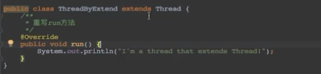
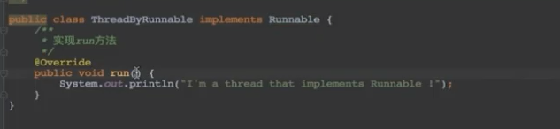
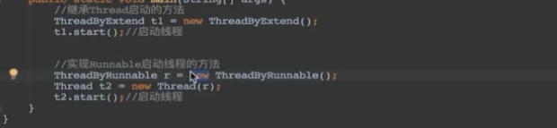
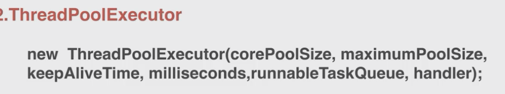

2.thread/runable

1，继承Thread类

2，实现Runable接口

调用start后线程并不是执行状态，而是可执行状态，何时执行由操作系统决定。

实现Runnable接口相对于继承Thread类来说，有如下的显著优势： 
1 .适合多个相同代码的线程去处理同一个资源的情况 
2.可以避免由于java的单继承特性带来的局限 
3.增强了程序的健壮性，代码能够被多个线程共享，代码与数据时独立的 

简单的来说，就是继承和实现接口的区别。 
1、当使用继承的时候，主要是为了不必重新开发，并且在不必了解实现细节的情况下拥有 了父类我所需要的特征。它也有一个很大的缺点，那就是如果我们的类已经从一个类继承（如小程序必须继承自 Applet 类），则无法再继承 Thread 类， 
2、java只能单继承，因此如果是采用继承Thread的方法，那么在以后进行代码重构的时候可能会遇到问题，因为你无法继承别的类了，在其他的方面，两者之间并没什么太大的区别。 
3、implement Runnable是面向接口，扩展性等方面比extends Thread好。 
4、使用 Runnable 接口来实现多线程使得我们能够在一个类中包容所有的代码，有利于封装，它的缺点在于，我们只能使用一套代码，若想创建多个线程并使各个线程执行不同的代码，则仍必须额外创建类，如果这样的话，在大多数情况下也许还不如直接用多个类分别继承 Thread 来得紧凑。

### start方法和run方法区别

> 1。**start**():
>
>   先来看看Java API中对于该方法的介绍：
>
>    使该线程开始执行；Java 虚拟机调用该线程的 `run` 方法。
>
>    结果是两个线程并发地运行；当前线程（从调用返回给 `start` 方法）和另一个线程（执行其 `run` 方法）。
>
>    多次启动一个线程是非法的。特别是当线程已经结束执行后，不能再重新启动。
>
> 用start方法来启动线程，真正实现了多线程运行，这时无需等待run方法体中的代码执行完毕而直接继续执行后续的代码。通过调用Thread类的 start()方法来启动一个线程，这时此线程处于就绪（可运行）状态，并没有运行，一旦得到cpu时间片，就开始执行run()方法，这里的run()方法 称为线程体，它包含了要执行的这个线程的内容，Run方法运行结束，此线程随即终止。

> 2。**run**():
>
> 同样先看看Java API中对该方法的介绍：
>
>    如果该线程是使用独立的 `Runnable` 运行对象构造的，则调用该 `Runnable` 对象的 `run` 方法；否则，该方法不执行任何操作并返回。
>
> `  Thread` 的子类应该重写该方法。
>
> run()方法只是类的一个普通方法而已，如果直接调用Run方法，程序中依然只有主线程这一个线程，其程序执行路径还是只有一条，还是要顺序执行，还是要等待run方法体执行完毕后才可继续执行下面的代码，这样就没有达到写线程的目的。

> 3。总结：
>
> 调用start方法方可启动线程，而run方法只是thread类中的一个普通方法调用，还是在主线程里执行。

### 线程池

各个参数

corePoolSize：线程池基本大小

