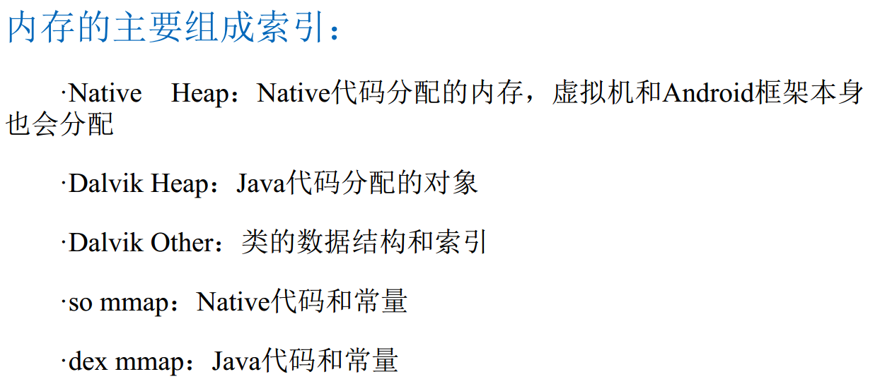

 

# anr

应用程序的响应性是由Activity Manager 和 WindowManager系统服务监听的。

问题：原理是什么？


# OOM

当前占用的内存加上我们申请的内存资源超过了 Dalvik虚拟机的最大内存限制就会抛出的Out of memory异常

**内存溢出/内存抖动/内存泄漏**


bitmapFactory的方法都是通过jni方法实现的，所以bitmap加载到内存是包含了Java和C两部分的

bitmap对象可以由虚拟机释放，但是c那部分的资源虚拟机是无法释放的，必须调用recycle来释放。


#### bitmap recycle

```
 /**
     * Free the native object associated with this bitmap, and clear the
     * reference to the pixel data. This will not free the pixel data synchronously;
     * it simply allows it to be garbage collected if there are no other references.
     * The bitmap is marked as "dead", meaning it will throw an exception if
     * getPixels() or setPixels() is called, and will draw nothing. This operation
     * cannot be reversed, so it should only be called if you are sure there are no
     * further uses for the bitmap. This is an advanced call, and normally need
     * not be called, since the normal GC process will free up this memory when
     * there are no more references to this bitmap.
     */
    public void recycle() {
        if (!mRecycled && mNativePtr != 0) {
            if (nativeRecycle(mNativePtr)) {
                // return value indicates whether native pixel object was actually recycled.
                // false indicates that it is still in use at the native level and these
                // objects should not be collected now. They will be collected later when the
                // Bitmap itself is collected.
                mNinePatchChunk = null;
            }
            mRecycled = true;
        }
    }
```

会释放和bitmap有关的native对象，同时会清理数据对象的引用。并不是立即清理，只是通知垃圾回收器。不可逆操作。可以不主动调用，垃圾回收期会处理。

#### LRU

最近最少使用


#### UI卡顿

60fps -> 16ms

overdraw 大量重叠


#### 内存泄漏

常见内存泄漏：

1，单例

2，匿名内部类

3，handler

4，避免使用static变量（如果进程常驻，那么会增加进程的内存使用，且容易被回收）

5，资源未关闭造成的内存泄漏

6，Asynctask造成的内存泄漏


#### 内存管理

 


# 启动优化


根据启动流程，所以优化主要集中在 Application 的onCreate 和 加载XML 和 Activity onCreate

resume 。就是生命周期加上加载xml

## 黑白屏问题


伪优化：提高体验，其实时间没缩短

白屏    <style name="AppTheme" parent="Theme.AppCompat.Light">

原因是：找到一个父类name="Platform.AppCompat.Light"中定义了
<item name="android:windowBackground">用来控制黑白屏

黑屏    <style name="AppTheme">（在以前的老版本上有效，现在的版本默认使用透明处理了）


解决办法：
1.在自己的

<style name="AppTheme" parent="Theme.AppCompat.Light">

</style>

中加入windowsbackground
2.设置windowbackground为透明的 

```java
 <item name="android:windowIsTranslucent">true</item>
```

但这2种方法会有个问题，所有的activity启动都会显示
3.单独做成一个主题

<style name="AppTheme.Launcher">
        <item name="android:windowBackground">@drawable/bg</item>
    </style>
```java
<style name="AppTheme.Launcher1">
    <item name="android:windowBackground">@drawable/bg</item>
</style>
<style name="AppTheme.Launcher2">
    <item name="android:windowBackground">@drawable/bg</item>
</style>
```
再在功能清单中的单独activity下设置
<activity   android:theme="@style/AppTheme.Launcher"
然后在程序中使用setTheme(R.style.AppTheme);
让APP中所有的activity还是使用以前的样式，这样做就只有启动时才使用自己的样式

QQ中的用法   

```JAVA
<item name="android:windowDisablePreview">true</item>
<item name="android:windowBackground">@null</item>
```


## 启动时间查看

1.冷启动：当启动应用时，后台没有该应用的进程，这时系统会重新创建一个新的进程分配给该应用，这个启动方式就是冷启动。

2.热启动：当启动应用时，后台已有该应用的进程（例：按back键/home键，应用虽然会退出，但是该应用的进程是依然会保留在后台，可进入任务列表查看），所以在已有进程的情况下，这种启动会从已有的进程中来启动应用，这个方式叫热启动。


 冷启动：冷启动后系统会重新创建一个新的进程分配给它，所以先创建和初始化Application类，再创建和初始化MainActivity类（包括一系列的测量、布局、绘制），最后经过渲染显示在app界面。
 热启动：热启动因为会从已有的进程中来启动，所以热启动就不会走Application这步了，而是直接走MainActivity（包括一系列的测量、布局、绘制），所以热启动的过程只需要创建和初始化一个MainActivity就行了，而不必创建和初始化Application，因为一个应用从新进程的创建到进程的销毁，Application只会初始化一次。


 


AM路径
E:\tools\android-src\android-6.0.1_r1\frameworks\base\cmds\am\src\com\android\commands\am


Am.java   946行开始打印启动时间信息
其中一个result对象，在871行初始化 result = mAm.startActivityAndWait(。。。）
在这个初始化时就已经进行了时间的计算：
在android-src\android-6.0.1_r1\frameworks\base\services\core\java\com\android\server\am\ActivityRecord.java文件中计算
void windowsDrawnLocked() --->reportLaunchTimeLocked(SystemClock.uptimeMillis())中完成时间的统计;


4.4以前    adb shell am start -W com.lqr.wechat/com.lqr.wechat.activity.SplashActivity

4.4版本以后Logcat 输入Display筛选系统日志  不过滤信息No Filters


**ThisTime:最后一个启动的Activity的启动耗时；**
**TotalTime:自己的所有Activity的启动耗时；**
**WaitTime: ActivityManagerService启动App的Activity时的总时间（包括当前Activity的onPause()和自己Activity的启动）。**

1）ThisTime:一般和TotalTime时间一样，除非在应用启动时开了一个透明的Activity预先处理一些事再显示出主Activity，这样将比TotalTime小。
 2）TotalTime:应用的启动时间，包括创建进程+Application初始化+Activity初始化到界面显示。
 3）WaitTime:一般比TotalTime大点，包括系统影响的耗时。


 


## TRACE工具分析代码执行时间


Debug.startMethodTracing(filePath);     中间为需要统计执行时间的代码
Debug.stopMethodTracing();


优化方案：
1.开线程     没建handler    没操作UI   对异步要求不高
2.懒加载     用到的时候再初始化，如网络，数据库操作


可以选择线程，不同模式，也可以点进去看 具体时间


# UI绘制优化


**60Hz 刷新频率由来**

12 fps ：由于人类眼睛的特殊生理结构，如果所看画面之帧率高于每秒约 10-12 帧的时候，就会
认为是连贯的
24 fps ：有声电影的拍摄及播放帧率均为每秒 24 帧，对一般人而言已算可接受
30 fps ：早期的高动态电子游戏，帧率少于每秒 30 帧的话就会显得不连贯，这是因为没有动态模
糊使流畅度降低
60 fps 在与手机交互过程中，如触摸和反馈 60 帧以下人是能感觉出来的。 60 帧以上不能察觉
变化当帧率低于 60 fps 时感觉的画面的卡顿和迟滞现象  

Android 系统每隔 16ms 发出 VSYNC 信号 (1000ms/60=16.66ms) ，触发对 UI 进行渲染， 如果每次渲染都成功这样就能够达到流畅的画面所需要的 60fps ，为了能够实现 60fps ，这意味着计算渲染的大多数操作都必须在 16ms 内完成。


16 毫秒的时间主要被两件事情所占用
第一件：将 UI 对象转换为一系列多边形和纹理（ 1 ）（？）
第二件： CPU 传递处理数据到 GPU 。所以很明显，我们要缩短
这两部分的时间，也就是说需要尽量减少对象转换的次数，以及上
传数据的次数 （？ 布局 自定义）


  

如何减少这两部分的时间 以至于在 16ms 完成呢  

CPU 减少 xml 转换成对象的时间
GPU 减少重复绘制的时间


## 过度绘制优化（主要减少GPU工作量）


### 查看方法：

开发者选项-》Profile GPU rendering/调试GPU过度绘制

### 处理方法：

1，减少背景重复 。注意主题中的设置，非业务需要，不要去设置背景。

2.使用裁减减少控件之间的重合部分

3，Android7.0之后系统做出的优化  ：invalidate()不再执行测量和布局动作


## 布局的优化（主要减少CPU工作量）


### 常用工具：

1，Android/sdk/tools/bin/ui    automator   viewer.bat

2，Android\sdk\tools\monitor.bat

3，Device Monitor窗口中Hierarchy view 。  

**三个点也是代表着View的Measure, Layout和Draw。**
**绿: 表示该View的此项性能比该View Tree中超过50%的View都要快；例如,代表Measure的是绿点,意味着这个视图的测量时间快于树中的视图对象的50%。**
**黄: 表示该View的此项性能比该View Tree中超过50%的View都要慢；** 
**红: 表示该View的此项性能是View Tree中最慢的；。**


注意点：
1.能在一个平面显示的内容，尽量只用一个容器
2.尽可能把相同的容器合并merge
3.能复用的代码，用include处理，可以减少GPU重复工作


这个工具可以方便查看整个布局


# 内存优化

LeakCanary  

LeakInspector

虚引用

```
public static void main(String[] args) {
    //虚引用不会影响到对象的生命周期，但能让程序员知道该对象什么时候被回收
    Object object = new Object();

    ReferenceQueue referenceQueue = new ReferenceQueue();
    //GC 把对象回收之后，该对象的信息（不是直接存对象）会被保存到该队列中
    PhantomReference<Object> phantomReference = new PhantomReference<>(object,referenceQueue);

    System.out.println("回收前 object "+object);
    System.out.println("回收前 phantomReference "+phantomReference.get());
    System.out.println("回收前 referenceQueue "+referenceQueue.poll());
    object = null;
    System.gc();
    try {
        Thread.sleep(3000);
    } catch (InterruptedException e) {
        e.printStackTrace();
    }

    System.out.println("回收后 object "+object);
    System.out.println("回收后 phantomReference "+phantomReference.get());
    System.out.println("回收后 referenceQueue "+referenceQueue.poll());
}
```


弱引用

```
Object object = new Object();

ReferenceQueue referenceQueue = new ReferenceQueue();
//软引用
WeakReference<Object> weakReference = new WeakReference<>(object,referenceQueue);

System.out.println("回收前 object "+object);
System.out.println("回收前 weakReference "+weakReference.get());
System.out.println("回收前 referenceQueue "+referenceQueue.poll());
object = null;
System.gc();
try {
    Thread.sleep(3000);
} catch (InterruptedException e) {
    e.printStackTrace();
}

System.out.println("回收后 object "+object);
System.out.println("回收后 weakReference "+weakReference.get());
System.out.println("回收后 referenceQueue "+referenceQueue.poll());
```


和虚引用的区别是，引用能够get到数据。弱应用不仅仅能够知道数据被回收了，还是直接通过get拿来用。这个虚引用没啥用啊，连直接拿来用都不行


## 工具：

Android Device Monitor  

MAT hprof

系统的资源类占据了很大一部分的内存， 而其余的前几名也往往是
系统类。 这是由于从虚拟机角度不会区分系统框架和应用自身的对象，
后面的1.4.3节会详细说明出现这种现象的原因。
为了去除这部分对分析的干扰， 我们在用AndroidSDK提供的hprofconv转换时需要增加一个参数：
hprof-conv [-z] <infile><outfile>
-z: exclude non-app heaps, such as Zygote  


在各类场景中， 经常作为测试重点的有：
·包含了图片显示的界面。
·网络传输大量数据。
·需要缓存数据的场景。  


案例：

当新功能的代码合入后， 我们发现应用启动后的内存增长超过了2MB， 这可大大超出了所有人的预期，一定是有什么地方出了严重的问题  

如果某个新功能的代码都在同一个package下， 那么就可以使用MAT的过滤功能来验证这部分代码是否使用了内存，  


在以上排查中， 我们确实发现了一些问题， 但将一些不用的对象清理后再执行测试， 总体内存并没有明显减少。 现在看来， Dalvik Heap里分配的内存并没有增加许多， 说明问题是不能只在Dalivk Heap里就能解决的， 也许是别的部分出现了问题？ 接下面我们就继续深挖下去。  


经过上一轮的优化， 在内存监视器里新版本的Heap内存表现已经比较好了， 新功能只消耗了几万字节到几十万字节内存。 但是要注意的是， Heap内存并不是应用的全部， 我们在设置或其他管理工具里看到的应用内存大小是应用整个进程的内存使用量。 也有可能出现Heap部分完全没有增长而其他部分增长的情况。
要观察进程的内存使用情况， 就需要用到其他的观测工具，Android里最常用于观察进程内存的方法就是dumpsys meminfo<packagename|pid>命令  


左边Pss列的数据标识进程各部分对真实物理内存的消耗， 左下角的TOTAL值就是我们在各种管理工具里看到的应用内存消耗。
而Android Studio等工具里显示的内存值， 在这里是Dalvik Heap Alloc部分。 根据以上的数据， 我们可以看到Dalvik Heap和Heap Alloc不是相等的， 而且除了Dalvik Heap之外， 还有其他很多部分也会消耗内存。  


这时候就会发现问题了， Heap Alloc没增加多少， 但Dalvik HeapPss增加了许多。 而其他部分基本保持不变或有少量增长。 可见问题还是出现在Dalvik Heap部分， 但只靠检查分配的对象是看不出来问题的。  


**Dalvik Heap内部机制**  

1） DVM使用mmap系统调用从系统分配大块内存作为Java Heap。
根据系统机制， 如果分类的内存尚未真正使用， 就不计入PrivateDirty和Pss。 例如图1-8所示， Heap Size/Alloc很多， 但大部分是共享的， 实际使用的较少。 所以反映到PrivateDirty/Pss里的内存并不多  


2） 新建对象之后， 由于要向对应的地址写入数据， 内核开始真正分配该地址对应的4KB物理内存页面  

3） 运行一段时间后， 开始垃圾回收（GC） ， 有些对象被回收了，有些会一直存在， 如图1-10所示。  

4） 在GC时， 有可能会进行trim， 即将空闲的物理页面释放回系统， 表现为PrivateDirty/Pss下降。   


在了解DVM分配释放内存的机制后， 根据dumpsys观察到的现象，猜测可能出现了页利用率问题（页内碎片）  

这种情况下可能会产生的问题是， 整页的4KB内存中可能只有一个
小对象， 但统计PrivateDirty/Pss时还是按4KB计算  


在猜测了可能的问题后， 需要验证是否如猜测原因所致， 由于MAT的对象实例数据中有地址和大小信息， 我们先从MAT中导出数据。
在MAT中列出所有对象实例： list_objects java.*， 然后选中所有数据并导出为csv格式， 如下所示：  


左边是利用率低的页面， 右边是利用率高的页面。 如果发现利用率低的页面数目增加， 说明
小对象碎片的数量增加了。  


图
1-16显示了类似情况下数组的分配范围， 可见数组中每个成员的
内存地址都是不连续的， 并且相隔很远。 这种情况下就会消耗很多个物
理内存页面， 增加Heap Free， 造成例子中的问题。  


经验：

MAT是探索Java堆并发现问题的好帮手， 能够迅速发现常见的图片和大数组等问题。 但MAT也不是万能的， 比如这个问题的数据就隐藏在对象的地址中。
·对Android测试经验来说， 可能容易找到的是应用代码及框架的各种测试经验和指导， 底层以及涉及性能的测试经验并不太多。 这方面可以借鉴Linux系统的测试经验， 了解内核及进程相关的知识， 熟悉常用工具。
·内存分配的最小单位是页面， 通常为4KB。

对于开发人员， 以下两个经验也许能有帮助：
·尽量不要在循环中创建很多临时变量。
·可以将大型的循环拆散、 分段或者按需执行。  


**进阶： 内存原理**  

在Ashmem及COW（Copy-On-Write） 机制的基础上， Android进程最明显的内存特征是与zygote共享内存。 为了加快启动速度及节约内存， Android应用的进程都是由zygote fork出来的。 由于zygote已经载入了完整的Dalvik虚拟机和Android应用框架的代码， fork出的进程和zygote共享同一块内存， 这样就节约了每个进程单独载入的时间和内存。 应用进程只需载入自己的Dalvik字节码及资源就可以开始工作。  


综上所述， 一个在运行的Android应用进程会包含以下几个部分：
·Dalvik虚拟机代码（共享内存）
·应用框架的代码（共享内存）
·应用框架的资源（共享内存）
·应用框架的so库（共享内存）
·应用的代码（私有内存）
·应用的资源（私有内存）
·应用的so库（私有内存）
·堆内存， 其他部分（共享/私有  ）


**smaps**  

由于Android底层基于Linux内核， 进程内存信息也和Linux一致， 所以Dalvik Heap之外的信息都能够从/proc/<pid>/smaps中取得。
在smaps中， 列出了进程的各个内存区域， 并根据分配的不同用途做标识， 以下是root用户使用cat/proc/<pid>/smaps的一个例子  


dumpsys统计各个内存块的Pss、 Shared_Dirty、 Private_Dirty等值，
并按以下原则进行了归并：
·/dev/ashmem/dalvik-heap和/dev/ashmem/dalvik-zygote归为Dalvik Heap。
·其他以/dev/ashmem/dalvik-开头的内存区域归为Dalvik Other。
·Ashmem对应/dev/ashmem/下所有不以dalvik-开头的内存区域。
·Other dev对应的是以/dev下其他的内存区域。
·文件的mmap按已知的几个扩展名分类， 其余的归为Other Mmap。
·其他部分， 如[stack]、 [malloc]、 Unknown等。
了解了dumpsys的方法后， 我们可以自己解析smaps， 看看归并前各
项的内存都是多少。 这样能够得到比dumpsys更详细的信息， 有助于分
析一些问题  


Dalvik内存分为多个区域， meminfo统计的是所有区域累加的值  


Dalvik_Heap——包括dalvik-heap和dalvik-zygote。 堆内存， 所有的
Java对象实例都放在这里。
·LinearAlloc——包括dalvik-LinearAlloc。 线性分配器， 虚拟机存放
载入类的函数信息， 随着dex里的函数数量而增加。 著名的65535个函数
的限制就是从这里来的。
·Accounting——包括dalvik-aux-structure、 dalvik-bitmap、 dalvikcard-table。 这部分内存主要做标记和指针表使用。 dalvik-aux-structure随
着类及方法数目而增大， dalvik-bitmap随着dalvik-heap的增大而增大。
·Code_Cache——包括dalvik-jit-code-cache。 jit编译代码后的缓存，
随着代码复杂度的增加变大。
由于堆内存部分往往是应用消耗内存最多的地方， 在内存优化中，
最常见的方法就是减少Dalvik Heap中创建的对象， 能够直接减少Dalvik
Heap， 并间接减少Accounting部分。 减少代码会直接减少运行辅助部
分  


**mmap**  

系统会将一些文件mmap到内存中， 对各个文件进行mmap的时机及
大小比较复杂。 dex_mmap是其中主要的内容  


应用的dex会占据较大的空间， 并且随着代码增加使得dex文件变
大， 占用的内存也会增加。 减小dex的（相当于减少代码） 尺寸能够降
低这部分内存占用， 同时也会减少dalvik部分的内存  

**zygote共享内存机制**  

由于虚拟机运行时并不区分某个对象实例是Android框架共享的还是应用独有的， Heap Alloc统计的是由虚拟机分配的所有应用实例的内
存， 所以会将应用从zygote共享的部分也算进去， 于是Heap Alloc值总是比实际物理内存使用值要大。

Heap Alloc虽然反映了Java代码分配的内存， 但存在框架造成的失真。 除此之外， 进程还有许多其他部分也需要使用内存。 为了准确了解
应用消耗的内存， 我们要从进程角度而不是虚拟机角度来进行观察。
Pss表示进程实际使用的物理内存， 是由私有内存加上按比例分担计算的各进程共享内存得到的值。 例如， 如果有三个进程都使用了一个
消耗30KB内存的so库， 那么每个进程在计算这部分Pss值的时候， 只会计算10KB。 总的计算公式是：
Dalvik Pss内存=私有内存Private Dirty+（共享内存Shared Dirty/共享的进程数）
从实际含义来讲， Private Dirty部分存放的是应用新建（new） 出来的对象实例， 是每个应用所独有的， 不会再共享。 Shared Dirty部分主要
是zygote加载的Android框架部分， 会被所有Android应用进程共享。 通常进程数的值在10~50的范围内。
Pss是一个非常有用的数值， 如果系统中所有进程的Pss相加， 所得和即为系统占用内存的总和。 但要注意的是， 进程的Pss并不代表进程
结束后系统能够回收的内存大小  


所以多进程挂掉一个后，进程可以占用内存增加。因为没人替他分担


VSS ：Virtual Set Size  虚集合大小

RSS：Resident Set Size 常驻集合大小

PSS：Proportional Set Size 比例集合大小

USS：Unique Set Size 独占集合大小


RSS与PSS相似，也包含进程共享内存，但RSS并么有把共享内存平均到使用的进程头上。以至于所有进程的RSS相加会超过物理内存很多，

VSS是虚拟地址，他的上限与进程的可访问地址空间有关，与内存使用关系不大，至于是file或者map内存对应的可能是一个文件或者硬盘，或者一个其他的设备。与进程使用的内存关系不大。

PSS,USS最大的不同在于“共享内存”。USS不包含进程间共享的内存，而PSS包含。这也造成了USS因为缺少共享内存，所有进程的USS相加要小于物理内存

PSS要注意的是由于另一个进程退出，导致共享内存变大。


### meminfo

dumpsys meminfo  

参数 -a 打印所有进程

--oom 按照OOM adj值排序

process ：可以是进程名也可以是进程id


Procstats

PSS*时长


MAT


LeakCanary  源码

LeakInspector

这块是重点啊


案例1：Activity泄漏

单例泄漏，WifiManager 等getSystemService

匿名内部类  handler 

a 匿名内部类、非静态内部类都会隐性持有外部类引用，而静态内部类和匿名类的静态实例是不会持有外部类引用的。

b 遇到生命周期比activity长的情形，内存泄漏一定是个隐患。

c 尽量新建一个文件定义类亦或者利用弱引用拿到外部类引用。


**图片优化**

Bitmap.Config 用于配置Bitmap用怎样的像素格式进行存储，这会影响质量（色深），也能影响显示半透明，透明颜色。

ALPHA_8 ：只有透明通道

ARGB_4444：指令太差，建议更换ARGB_8888

ARGB_8888：每个像素4个字节

RGB_565：每个字节使用2字节，只有RGB通道被解码--红色5位，绿色6位，蓝色5位。

ARGB_8888 是 RG_565的2倍，4.5Android版本默认是ARGB_8888，所以如果是缩略图不要求高清的话可以只用RGB_565来显示。降低内存


案例2：图片发错资源目录也存在内存问题

问题：内存常驻

策略：使用Drawable.createFromStream

如果在对应密度有图片就加载，否则就按照当前密度“就近”获取图片资源。  比如一张低密度放在高密度手机显示就会被按照倍数大小缩放该图片，将他加入内存。

解决方案：

1，抓不住你放在哪个目录，就尽量问设计人员要高品质图片然后往高密度目录下放，这样在低密度屏上 放大倍数 是小于1的，在保证画质的前提下，内存是可控的。

拿不准的图片，使用Drawable.createFromStream替换 getResources().getDrawable来加载，绕过Android以上这套适配机制。


获取宽高比 缩放

bitmap尽量使用inBitmap

建议使用SparseMap或者ArrayMap

建议 StringBuilder重用


### 一个类的内存消耗  

Foo f = new Foo();  


虚拟机在执行到这步时会做什么呢？
第一步是loadClass操作， 将类信息从dex文件加载进内存：
1） 读取.dex mmap中class对应的数据。
2） 分配native-heap和dalvik-heap内存创建class对象。
3） 分配dalvik-LinearAlloc存放class数据。
4） 分配dalvik-aux-structure存放class数据。
第二步是new instance操作， 创建对象实例：
1） 执行.dex mmap中<clinit>和<init>的代码。
2） 分配dalvik-heap创建class对象实例。
在这个过程中， 可能还会分配dalvik-bitmap和jit-code-cache内存。
如果class Foo引用了其他类型， 那就还需要先按照同样的逻辑创建被引
用的class。 由此可见， 在创建一个类实例的每一步都需要消耗内存。 我
们接下来大概计算一下new操作需要消耗的内存。
根据Dalvik虚拟机的代码， 能够得知class根据类成员和函数的数目
分配LinearAlloc和aux-structure的多少， 以及class本身及函数需要的字节
数。 我们再根据一个应用中所有class的总量进行平均计算， 得到以下一
组数据。
第一步是loadClass操作， 加载类信息：
·.dex mmap（class def+class data） :载入一个类需要先读取259字节
的mmap。
·dalvik-LinearAlloc:在LinearAlloc区域分配437字节， 存放类静态数
据。
·dalvik-aux-structure:在aux区域分配88字节， 存放各种指针。
第二步是new instance操作， 创建对象实例：
·.dex mmap（code） ： 为了执行类构造函数， 还需要读取252字节的
mmap。
·dalvik-heap:根据类的具体内容而变化。
可见在创建对象实例的操作中， Dalvik Other和.Dex Mmap部分就各
需要约500字节的内存空间。 但是考虑到4KB页面的问题， 由于这些内
存并不是连续分布的， 所以可能需要分配多个4KB页面。 当然由于很多
类会在一起使用， 使得实际的页面值不会那么多。
以我们举例的应用为例， 总共有7042个类， 启动后载入了1522个
类， 这时侯应用的.dex mmap内存消耗大约是5MB， 平均后约为3.4KB。
Dalvik Other的部分会少一些， 但依然是远远超出需要使用的大小  


### dex文件优化  


简而言之， 为了节约空间， dex将原先在各个class文件中重复的信息集中放置在一起， 并以索引和指针的形式支持快速访问。 虚拟机能够
通过索引表在Data区域中找到需要的信息。
下面我们看一个访问字符串的例子。 在dex文件结构中， 读取字符串需要先到StringIdList中查表， 然后根据查到的地址到Data区读取内
容。 StringIdList的数据结构如下：

```
struct DexStringId {
u4 stringDataOff;
};
```

现在我们模拟虚拟机读取一个字符串， 来观察内存的消耗。 假设有一个字符串的id=6728， 对应的地址就会是112+6728=6990。 因此虚拟机
首先根据string ID读取0x006990-0x006994的内容， 此时系统会加载0x006000~0x006fff的整页内存， 从Pss角度来看， 会增加4KB。
虚拟机读到的内容是stringDataOff=0x531ed4， 随后虚拟机会继续从0x531ed4读取字符串内容， 假设字符串长度是45字节， 则虚拟机会读取
0x531ed4~0x531f04的内容， 但此时系统也必须加载0x531000~0x531fff的整页内存， 从Pss角度来看， 会再次增加4KB。
由此可见， 在有些情况下， 虚拟机读取data区的一个数据， 就至少要消耗8KB物理内存。 如果多次读取的分散在文件各处的数据， 就可能
会以4KB的倍数快速消耗内存。
Android SDK提供了dexdump工具来观察dex文件内容， 我们以此工
具来看看dex的数据内容：

```
dexdump classes.dex
Processing 'classes.dex'...
Opened 'classes.dex', DEX version '035'
Class #0 header:
...
Class #0 -
Class descriptor : 'Laaa/aaa;'
...
Class #1 -
Class descriptor : 'Laaa/bbb;'
...
Class #2 -
Class descriptor : 'Lbbb/ccc;'
```

...
根据对dex数据的观察， 我们发现dex文件中数据基本是按类名的字母顺序进行排列的， 这样同样包名的类会排在一起。 但在实际程序执行
中， 同一个package下的类并不会全部一起调用， 而是和很多其他package下的类进行交互， 但mmap加载了整个页面， 可能会有很多无用
数据。 为了减少这样的情况， 我们在生成文件时要尽量将使用到的数据内容排布在一起。 在APK的编译流程中， Proguard混淆工具正好是能够
对类名进行修改的， 可以根据程序运行的逻辑， 将那些会互相调用的类改为同一个package名， 这样就可以使它们的数据排布在一起。
以上表数据为例， Class的排列顺序是aaa/aaa、 aaa/bbb、 bbb/ccc。假设我们的应用运行逻辑是aaa/aaa、 bbb/ccc， 而aaa/bbb在某些特殊时候
才能用到。 但在当前的排列情况下， 加载了aaa/aaa和bbb/ccc就必然要加载aaa/bbb。 我们可以用Proguard等工具来控制类名， 将aaa/bbb等不常用
的类放在后面， 则aaa/bbb平时就不会加载。  


**经验总结**
根据上述的流程， 我们探讨了Dalvik Other和.dex mmap部分的内存， 大致搞清楚了它们被消耗的机制， 以及一些能够减少消耗的方法。
经验如下：
·在优化内存时， 不只有堆内存， 还有其他许多类型的内存能够进行分析和优化。
·dex文件有很多优化空间。 在仔细统计并调整了dex文件的顺序后， 往往能够节约1MB以上的mmap内存。
·引入SDK库和调用新的系统API时需要考虑成本。 有可能一些不常用的功能会导致大量的内存消耗。 这时有可能需要多进程方案， 将这些
影响内存的操作放入临时进程执行  





### 测试经验：

·MAT是探索Java堆并发现问题的好帮手， 能够迅速发现常见的图片和大数组等问题。
·仅靠MAT提供的功能也不是万能的， 比如内存碎片问题就隐藏在对象的地址中。
·要测试非Dalvik部分， 有必要了解Linux的进程和内存原理、 内存共享机制， 熟悉常用命令行工具。
·内存分配的最小单位是页面， 通常为4KB， 这个限制往往会引发各种碎片问题。
·碎片不仅仅是Dalvik内存， 包括各种文件的mmap也有可能产生碎片。

### 性能优化：

·尽量不要在循环中创建很多临时变量。
·可以将大型的循环拆散、 分段或者按需执行。
·引入SDK库和调用新的系统API时需要考虑成本。 有可能一些不常用的功能会导致大量的消耗。 这时候有可能需要多进程方案， 将这些影
响内存的操作放入临时进程执行。
·除了Dalvik堆内存， 还有其他类型的内存在了解了原理后也能够进行分析和优化。
·dex文件有很多优化空间。 在仔细统计并调整了dex文件的顺序后， 往往能够节约1MB以上的mmap内存  


## 内存泄漏

产生的原因：一个长生命周期的对象持有一个短生命周期对象的引用通俗讲就是该回收的对象，因为引用问题没有被回收，最终会产生OOM

### Android Profiler的使用

在图型用户界面上选择要分析的一段内存，右键export出来 

Allocations:  动态分配对象个数

Deallocation：解除分配的对象个数

Total count :对象的总数

Shallow Size：对象本身占用的内存大小

Retained Size：GC回收能收走的内存大小


可以按包查看每个 类占用多少个字节


内存泄漏了右边还可以看到调用栈信息

可以看到哪些对象是否多余


好多东西可以看啊


怎么知道泄漏点在哪里？

可以选择一段 dump the heap 然后export导出


# 图片优化初体验


# 电量优化

CPU gps 4g  屏幕 外设


电量测试，就是测试移动设备电量消耗快慢的一种测试方法。一般用平均电流来衡量电量消耗速度。平均电流越小，说明设备使用时间越长。但是平均电流多大才说明不耗电却没有一个统一标准。


软件测试：利用系统工具导出分析报告

硬件是：利用硬件设备测试被测设备的电流，统计一段时间内(使用某个功能模块)的平均电流值。

## 【例2-1】 分析CPU频率与电量消耗的关系  

通过测试数据发现， 在CPU空闲的情况下， CPU频率对耗电的影响几乎是忽略不计的， 因此在系统空闲的时候对手机强制降频是不能节电的（单核的情况下， 在多核的情况下场景会更加复杂） ；

 在CPU使用率30%的情况下， 手机达到800MHz以后手机的功耗随CPU频率增加的幅度增加， 这时候可以考虑适当降低CPU频率获得更好的功耗控制；

 在CPU使用达到50%， 手机的功耗已经和频率成直线增加， 这时候降低CPU频率增加CPU使用率， 并不一定会给手机功耗带来很好的成效； 所以在选择降频节能方法时， 要充分考虑CPU频率和使用率带来的是真的省电还是徒劳无功  


## 【例2-2】 分析手机屏幕背景色与功耗的关系  


由以上的数据可知SLCD屏幕同图片耗电最亮是最暗的2~3倍， 建议在亮度选择的时候使用适当的亮度； Super AMOLED最高亮度时全黑比全白节电60%， 建议应用UI尽量采用深色调。  


## 优化方法一： CPU时间片  

当应用退到后台运行时， 尽量减少应用的主动运行。
当检测到CPU时间片消耗异常时， 深入线程分析： 通过获取运行过程中线程的CPU时间片消耗， 去抓取消耗时间片异常的线程， 通过线程去定位相应代码逻辑。
使用DDMS的traceview工具： 获取进程运行过程的traceview， 定位CPU占用率异常的方法。  


## 优化方法二： wake lock  

前台运行时， 不要去注册wake lock。 此时注册没有任何意义， 却会被计算到应用电量消耗中。
后台运行时， 在保证业务需要的前提下， 应尽量减少注册wakelock。
降低对系统的唤醒频率。 使用partial wake lock代替full wake lock，因为屏幕的亮起， 也会消耗手机电量。
在注册后， 也要注意及时释放， 否则锁的持有时间会被一直计算到电量消耗中。  


## 优化方法三： 传感器  


## 在Android 5.0之前，Android应用程序的主线程同时也是一个Open GL线程。但是从Android 5.0之后，Android应用程序的Open GL线程就独立出来了，称为Render Thread


CPU问题无非分3类：

1，CPU资源冗余使用

比如算法太粗糙，明明可以遍历一次却遍历多次。明明解码过的图片还要重复解压，明明int就足够，偏偏要用long，导致cpu运算压力多出4倍

2，CPU资源争抢


# 流畅度评测  

1） 为什么有时候FPS很低， 但是我们却不觉得App卡顿？
2） App停止操作之后， FPS还是一直在变化， 这样的情况是否会影响FPS的准确度  


1） 有时候FPS很低， 我们却感觉不到卡顿， 是因为如果你的App在1s内只有30帧的显示需求， 比如画一个动画只画了0.5秒就画完了， 那么FPS最高也只有30帧/秒， 但这并不代表它是卡顿的。 而如果屏幕根本没有绘制需求， 即屏幕显示的画面是静止的， 那FPS就为0。
2） App停止操作后FPS还一直变化， 是因为屏幕每一帧的合成都是针对手机里的所有进程， 那么即使你的App停止了绘制， 手机里其他进程可能还在绘制， 比如通知栏的各种消息， 这会导致FPS继续变化。 从这里我们也能看出， 在测试的时候， 其他的进程对FPS也是有影响的。  


回顾我们整个优化的过程， 大概能总结成下面的四点：
1） 首先通过SM对App的流畅度进行测试评估。
2） 然后从最简单的App UI层入手， 优化App的UI来提升流畅度。
3） 接着通过lint静态扫描发现一部分代码中存在的性能问题， 然后进行优化。
4） 最后再进一步深入的分析和解决App逻辑层和IO层存在的问题。  

Tracer for OpenGL ES可以记录和分析App每一
帧的绘制过程， 以及列出所有用到的OpenGL ES的绘制函数和耗时， 通
过Tracer for OpenGL ES我们可以很容易地看出App的每一帧是怎么画出
来的， 这样我们就很容易知道过度绘制的区域是怎么形成的。  


Hierarchy Viewer  

1） 没有用的父布局。 没有用的父布局是指没有背景绘制或者没有大小限制的父布局， 这样的父布局不会对UI效果产生任何影响。 我们把没有用的父布局通过<merge/>标签合并来减少UI的层次。
2） 使用线性布局LinearLayout排版导致UI层次变深。 如果有这类问题， 我们就使用相对布局RelativeLayout代替LinearLayout， 减少UI的层次。
3） 不常用的UI被设置成了GONE， 比如error页面， 如果有这类问题， 我们需要用<ViewStub/>标签代替GONE提高UI性能  


＜merge/＞标签： 用于减少View树的层次来优化Android的布局，通过＜merge/＞标签可以把＜merge/＞标签里的UI合到上一层的layout中。
·＜ViewStub/＞标签： 最大的优点是当你需要时才会加载， 使用它并不会影响UI初始化时的性能。 各种不常用的布局像进度条、 显示错误消息等可以使用＜ViewStub/＞标签， 以减少内存使用量， 加快渲染速度。 ＜ViewStub/＞是一个不可见的， 大小为0的View。  


## lint 扫描   SM流畅度

Lint扫描通过静态扫描检查代码的方式， 能够发现在代码中潜在的
问题， 并给出问题的原因和在代码中的位置， 并给出相应的优化建议。  


## 优化App的逻辑层  

在代码逻辑分析部分， Android也为我们提供了两个很好用的工具： Traceview以及Systrace。 我们结合这两个工具用下面的两种思路去分析代码的逻辑：
·找出在主线程耗时较大的函数， 看看是否能够通过优化逻辑去减少API的耗时， 优化的方案大概是缓存某些数据在需要的时候能够更快地加载， 或者把耗时的操作移出主线程， 或者把滑动的过程中出现的耗时操作延时到滑动停止后才开始。
·分析滑动的过程中CPU的工作， 看看是否能让CPU优先执行主线程的工作， 尽量不要被其他线程抢占。  


### 1.Traceview， 寻找卡住主线程的地方

Traceview是Android平台配备的一个很好的性能分析工具。 它可以通过图形界面的方式让我们了解要跟踪程序的性能， 并且能具体到每一个函数的耗时和调用次数。 所以我们用Traceview的时候， 主要关注的就是各个函数对性能的影响。 一般而言， 有两种类型的函数可能会影响到流畅度：
1） 主线程里占用CPU时间（Incl Cpu Time） 很长的函数， 特别要留意在主线程的IO操作（文件IO、 网络IO、 数据库操作等） 。
2） 主线程调用次数（包括被调用和递归调用） 很多的函数  


### 2.Systrace， 获取App运行时线程的信息以及API的执行情况  

Systrace有下面这些优点：
1） 能直观地看到每个线程上面API的调用情况， 包括API的耗时以及API的调用顺序。
2） 能直观地看到每个线程的执行情况， 包括各个线程的状态以及耗时， 并且能够统计CPU里每个线程执行的耗时。
3） 能够通过插入代码的方式， 在Systrace里显示想要查看的API的耗时以及调用关系。  

## 优化App的IO层  

那么应该如何对磁盘IO进行监控？ 我们通过代码注入（hook） 的方式， hook文件打开关闭以及读写的API， 采集磁盘IO的信息， IO信息包括读写的次数、 读写的线程、 读写数据的大小等。 然后通过监控的结果来判断是否存在IO层的问题。
举例来说， 通过监控的结果， 我们可以观察App里是否存在读写内容重复， 是否存在读写次多但是每次写入内容都很小， 主线程是否存在频繁读写等问题  


StrictMode通过策略方式来让你自定义需要检查哪方面的问题。 主要有两中策略， 一个是线程方策略（ThreadPolicy） ， 一个是VM方面的策略（VmPolicy） ：
1） ThreadPolicy主要用于发现在UI线程中是否有读写磁盘的操作，是否有网络操作， 以及检查UI线程中调用的自定义代码是否执行得比较慢。
2） VmPolicy， 主要用于发现内存问题， 比如Activity内存泄露、SQL对象内存泄露、 资源未释放、 能够限定某个类的最大对象数。只要在主线程内配置并启动StrictMode， 它就可以监听主线程的运行情况。 当发现出现重大问题或违背策略规则时， 就会在logcat中提示用户。 


 

最后总结一下我们之前在流畅度优化上的一些经验。
1.布局原则
在Android UI布局过程中， 通过遵守一些惯用、 有效的布局原则，我们可以制作出高效且复用性高的UI， 概括来说包括如下几点：
1） 尽量多使用RelativeLayout和LinearLayout， 不要使用绝对布局Absolute-Layout：
a） 在布局层次一样的情况下， 建议使用LinearLayout代替RelativeLayout， 因为LinearLayout性能要稍高一点。
b） 在完成相对较复杂的布局时， 建议使用RelativeLayout，RelativeLayout可以简单实现LinearLayout嵌套才能实现的布局。
2） 将可复用的组件抽取出来并通过include标签使用。
3） 使用ViewStub标签来加载一些不常用的布局。
4） 动态地inflation view性能要比SetVisiblity性能要好。 当然用VIewStub是最好的选择。
5） 使用merge标签减少布局的嵌套层次。
6） 去掉多余的背景颜色， 减少过度绘制：
a） 对于有多层背景颜色的Layout来说， 留最上面一层的颜色即可， 其他底层的颜色都可以去掉。
b） 对于使用Selector当背景的Layout（比如ListView的Item， 会使用Selector来标记点击， 选择等不同的状态） ， 可以将normal状态的color设置为“@android:color/transparent”， 来解决对应的问题。
7） 使用compound drawables： 包含ImageView和TextView的LinearLayout可以使用compound drawable实现， 这样更高效（注：compound drawables是指包含图片的Textview） 。
8） 内嵌使用包含layout_weight属性的LinearLayout会在绘制时花费昂贵的系统资源， 因为每一个子组件都需要被测量两次。 在使用ListView与GridView的时候这个问题显得尤其重要， 因为子组件会重复被创建， 所以要尽量避免使用Layout_weight  


针对ListView的性能优化
1） 复用convertView： 在getItemView中， 判断convertView是否为空， 如果不为空， 可复用。
2） 异步加载图片， item中如果包含有image， 那么最好异步加载。
3） 快速滑动时不显示图片： 当快速滑动列表时（SCROLL_STATE_FLING） ， item中的图片或获取需要消耗资源的view， 可以不显示出来； 而处于其他两种状态（SCROLL_STATE_IDLE和SCROLL_STATE_TOUCH_SCROLL） ， 则将那些view显示出来。
4） item尽可能地减少使用的控件和布局的层次。 同时要尽可能地复用控件， 这样可以减少ListView的内存使用， 减少滑动时gc次数。ListView的背景色与cacheColorHint设置相同颜色， 可以提高滑动时的渲染性能。
5） getView优化： ListView中getView是性能是关键， 这里要尽可能地优化。 getView方法中不能做复杂的逻辑计算， 特别是数据库和网络访问操作， 否则会严重影响滑动时的性能  


# 网络优化


1 必须分小片传输一个文件（图片） 。  

2 不同类型的移动互联网下的分片初始大小应该有所不同。  

3 在上传一个文件（图片） 的过程中， 应当尽可能动态增大分片大小（例如， 后一片是前一片的N倍） ， 以减少分片数量。 

4  确定每个分片是否要继续增大之前， 要检查网络类型是否发生了变化， 一旦跟前一片传输的网络变得不同， 则新的一片不能继续增大而是转而用新网络类型下的初始分片大小进行传输  

5 分片一旦传输失败， 应当使用该网络下的初始分片大小进行重试。  

6 每个分片都有一定次数的失败重传机会， 当一个分片的所有重传都失败了， 才定义为图片传输失败。  

7 配合后台服务器能力， 待用户手工再次重试失败传输的图片时， 能断点续传  


关于“长连接”： 当时的运营商网络基本都支持HTTP的Keep-alive，通过实验发现， 不仅一张图片的分片可以复用第一分片建立的TCP连
接， 有的时候时间间隔稍短的下一张图片甚至也可以复用上一张图片的连接。 这样就不必担心分片会带来巨大网络开销。
·关于分片大小： 不同网络下的初试分片大小非常难确定， 或者根本就不存在， 但最好根据网络的理论带宽各自取一个较小的经验值（后
文会给出） ； 分片的大小上限则应该存在， 后文讲述的鱼翅核心思想会提到为什么有， 且我们怎么去找。
·关于分片对于速度的影响： 基于上一个问题的答案， 这个问题比较好回答， 就是只要有算法能尽可能快的找到“当前网络下的分片上
限”， 用这个上限值去发送分片， 就能将分片带来的速度下降体验减轻到最低。
·关于分片传输成功率： 根据我们大量实验的结果， 发现移动网络的质量经常会发生的特殊变化（下节会详细讲述这个“特殊”问题） 是传
统的网络超时算法不能适应的， 而这种不适应， 非常容易导致传输超时带来的失败。 所以， 我们把寻找适合移动互联网的“传输超时算法”作为
提升分片传输成功率的关键。
·关于失败重传策略： 还是由于移动互联网质量有时发生的特殊变化， 所以当时失败重传策略的确有优化空间， 下节会讲述如何优化这个点   


弱信号网络  电梯

网络拥塞  地铁

接收窗口，告诉客户端我的池子水有多大。涉及到宽带有没有充分利用，直接影响发送速度。而让窗口太小的原因有：

1，服务器的ReceiverBuffer太小

2，因为慢启动，而包又太小，刚刚连接，慢启动会逐渐放大窗口，没有等放大完，数据就发完了。

3，Window size scaling factor 失效，这里最有可能原因是网络代理，失效的结果就是窗口最大只有65536字节


案例1：发图速度优化

Wireshark的IO Graphs功能，查看tcp连接来自服务器的ACK带的tcp.window_size 接收窗口与网络山未确认的字节数tcp.analysis.bytes_in_flight（没有被服务器用ACK确认接收的，正在飞的数据量）的关系。

可以看出window_size比byte_in_flight大很多，说明客户端发送的数据效率并没有充分利用链路和接收端的接收能力。其中一个原因是，客户端咋应用层做了分片策略，将图片分成小片，调用send方法向内核传送分片，如果分片过小，那么可以说绕过tcp做自己的拥塞控制差不多了。最后把8KB改为32kb后，效率提高了很多。

最好的情况是window_size 和byte_in_flight非常接近，说明客户端充分利用了连接和服务器的处理功能了

服务器RcvBuffer决定滑动窗口大小，因此可以增加RcvBuffer来增加滑动窗口大小，也可以提高速率。


平台回放案例：

服务端也要及时接收，否则客户端堵在网卡中发不出去。如果此时设备还一直发那么会内存溢出。因为app是不知道网卡里面是否累积了数据的。

当然如果是网络的原因导致发布出去也会出现同样的情况，毕竟网络传输视频流肯定没有本地获取视频流来得快。

这个时候就需要做流控。


案例2：弱网情况下  

注意分包上传的确认机制。


## 标准：网络

**避免无效流量消耗：**

避免重复上传和下载

进行压缩

**定时网络请求尽量合并在同一时间进行**  网络状态机，合并请求可以让网络尽量处在低功耗状态

网络请求失败重试必须有明显的结束条件  会导致严重好点和服务器压力过大


**降低流量风险：**

流量兜底能力：发现流量异常会通过后台服务器终止协议交互。这是不让问题恶化的好方法


## 流量优化  


# APK瘦身


对于无用代码， 主要采用的方法就是用UCDetector对整个工程代码进行扫描， 找出引用为0的变量、 方法、 类， 然后根据情况进行处理。
UCDetector（Unnecessary Code Detector） 是Eclipse的一个插件， 可以用来检测Java无用代码， 如没有被引用到的public或protected类、 属性、 方法、 接口以及常量等。  


冗余代码是指重复的代码或经过优化后可以用一段代码量更小的代码替换的代码， 比如完全一样的代码、 重命名标识符后完全一样的代码、 插入或删除语句后完全一样的代码、 重新排列语句后完全一样的代码， 以及结构一样或类似的代码。 好的代码应该降低冗余度， 提高复用率， 这除了能使代码量减少， 还能提高代码可读性。


## 代码混淆  

那么， 代码混淆在我们安装包瘦身中怎么用呢？
Android SDK tools里面集成了一个Proguard工具。 在Proguard的官方
文档里是这么介绍的： Proguard是一个免费的Java类文件压缩、 优化、
混淆和预先验证的工具， 它可以检测和移除未使用的类、 字段、 方法、
属性， 优化字节码并移除未使用的指令， 最后它还能将代码中的类、 字
段、 方法的名字改成简短的、 无意义的名字。
从Proguard工具能够做的事情中可以看出， 它不但可以将代码中的
各种元素名称改得简短， 而且可以移除冗余代码。 所以， 对代码进行
Proguard后， 也可以比较大地减小代码体积（即dex的体积） ， 并且可以
增加代码被反编译的难度， 一定程度上保护了代码的安全。   


## 冗余资源  

 Lint是ADT 16（Android Developer Tools 16） 之后的版本才被引入的。 它通过静态
扫描工程源码， 可以发现工程中潜在的问题。   


Lint项目下面有很多子项， 我们关注的是Unused Resources


## 资源混淆  

们在APK可以看到里面有个resources.arsc文件， 这个文件也是由aapt生成， 文件中保存着资源id和资源key的映射关系。 资源key即是资源的名字， 应用程序就是按照这个映射关系找到资源的。

资源混淆简单来说就是将res/drawable-xhdpi/icon_pic， png变成
res/drawable-xhdpi/f.png， 或我们甚至可以将文件路径也同时混淆， 改成
R/s/f.png。 同时， 还需要修改resources.arsc中的映射关系。
资源混淆能减小安装包的原因如下：
·resources.arsc变小。
·文件信息变小。 由于采用了超短路径， 例如
res/drawable/first_page.png被改为R/o/f.png。
·签名信息会变小。 由于采用了超短路径， 签名过程需要对每个文
件使用SHA1算法生成摘要信息。
需要注意的是， 如果代码是通过getIdentifier方式获得资源， 那么这
些资源需要放置在白名单中。
根据上述的原理， 我们瘦身时采用了脚本工具来对资源进行混淆，
混淆后资源大约减少了200KB， 也是比较有效果的  


## 图片处理  

（1） 图片压缩
对APK安装包来说， 大于5KB的图片就算是比较大的， 95%以上的图片都应该小于5KB。 但是， 一般来说， 为了追求图片完美的效果， 设计师同学给出的图片都是比较大的， 所以图片都有比较大的压缩空间。打包过程中aapt会进行一轮压缩， 即采用crunch做图片的预处理。不过crunch并不是压缩率最好的。 经过压缩对比， 我们最后采用pnggauntlet对非.9（点9） 的图片进行压缩， 而对点9图来说， 由于crunch过程中会去除黑边， 而且用pnggauntlet压缩会造成变形， 所以点9图还
是采用crunch压缩处理。
另外， 我们跟设计师沟通后， 决定在视觉要求不是特别高的场景中， 对于体积比较大的图片（10K以上） ， 采用有损压缩。最终， 在上述方法处理完图片以后， 效果好的时候可以为安装包减少几百KB。 还是相当有效的。  

（2） JPG与PNG的转换
PNG是一种无损格式， JPG是有损格式。 JPG在处理颜色很多的图片时， 根据压缩率的不同， 有时会去掉一些肉眼识别差距较小的中间颜色。 但是PNG对于无损这个基本要求， 会严格保留所有的色彩数。 所以， 在图片尺寸大， 或者色彩数量多（特别是渐变色多） 的时候， PNG的体积会明显大于JPG。
在这种情况下， 我们可以有所取舍。 小尺寸、 色彩数少、 或者有alpha通道透明度的时候， 使用PNG； 大尺寸、 色彩渐变色多的用JPG。对于这一点的处理， 建议跟设计师进行协商， 寻求图片质量和大小的一个折中方案。
另外， 根据我们的经验， 对于可以使用JPG格式的图片， 最好不要从PNG转JPG， 而是让设计师出图时直接出JPG格式的图片， 相对来说， 后者的效果要更好。  


（3） 点9图化  

点9图是Android平台应用软件开发里的一种特殊的图片形式， 扩展
名为.9.png。 点9图的格式相当于把一张PNG图分成了9个部分（九宫
格） ， 分别为4个角、 4条边， 以及一个中间区域。 4个角是不做拉伸
的， 所以还能一直保持圆角的清晰状态， 而2条水平边和垂直边分别只
做水平和垂直拉伸， 所以不会出现边会被拉粗的情况， 只有中间用黑线
指定的区域做拉伸。 其结果就是拉伸时图片不会走样。
Android系统程序对点9图有优化的算法。 使用点9图技术后， 只需
采用一套界面切图去适配不同的分辨率， 减少了图片量， 也就减少了安
装包的大小。 而且我们不需要专门做处理就可以实现其拉伸， 也减少了
代码量和开发工作量。
所以， 这里的瘦身方法就是梳理一下工程里的图片， 可以做成点9
图的就将其做成点9图。  


## 极限压缩zip

我们知道， AndroidApp安装包都是APK的格式。 实际上， APK格式就是zip格式， 只是换了一个后缀名。Android SDK的打包工具apkbuilder采用的是Deflate算法将AndroidApp的代码、 资源等文件进行压缩， 压缩成zip格式， 然后再签名发布。既然APK包本质上就是一种压缩文件， 那么通过改进压缩方式， 我们是不是就能得到更小的APK包呢？    


结合以上过程， 我们可以总结出以下Android打包过程中压缩文件
的过程：
1） aapt工具对工程非asset资源的编译压缩  

aapt对压缩安装包的主要贡献主要在于赋予每一个非assets资源一个ID值， 以便将XML二进制化， 从而节省空间， 以及对图片进行无损压缩。  

2） SignedJarBuilder类对工程的压缩  

SignedJarBuilder类对整个工程包括代码.dex文件和一些可压缩的资
源、 文件进行压缩， 它使用的压缩算法由Java.util.zip类提供。  


## 提高压缩级别  

  由于Java.util.zip类提供用于读写标准ZIP和GZIP文件格式的类， 还
包括使用DEFLATE压缩算法（用于ZIP和GZIP文件格式） 对数据进行压
缩和解压缩的类， 但是， 它采用的压缩级别基本是标准压缩， 该压缩级
别并不高， 所以我们可以考虑使用7z工具对其进行DEFLATE极限压缩
以提高压缩效率。 也就是说， 在不改变Android编译器的情况下， 我们
可以在第二个阶段对整体的压缩进行优化。
以下我们以qqdtest.apk为例， 同样用Deflate压缩算法， 当我们将压
缩级别从标准压缩提高到极限压缩后， APK包的大小也从1.12MB减小
到了1.09MB，  

当然， 上面的操作会破坏签名， 重新压缩后
需要对APK包重新签名。  

需要注意的是， Android平台对APK安装包的解压算法只支持
Deflate算法。 其他的算法如LZMA， 虽然压缩率更好， 但是由于Android
平台默认不支持， 所以如果采用这种算法压缩APK， 会导致APK无法安
装。
当然我们可以引入LZMA解压算法的库到安装包中， 但是这样会使
得App首次安装初始化的时间变长、 解压时需要更多内存。 我们在选取
压缩方案时， 要综合考虑安装包减少的体积、 方案的实现复杂度、 首次
初始化时长、 解压时所消耗的内存等因素， 在这些因素中取得一个平 来的约63.4%（即Android SDK默认打包的压缩率） 减小到约
56.3%  


# 性能实战


木桶理论：cpu 磁盘 网络 内存

IO密集型，CPU密集型

# 磁盘

## 随机读/写

连续 / 随机 I/O

连续 I/O ：指的是本次 I/O 给出的初始扇区地址和上一次 I/O 的结束扇区地址是完全连续或者相隔不多的。反之，如果相差很大，则算作一次随机 I/O。

而发生随机I/O可能是因为磁盘碎片导致磁盘空间不连续，或者当前block空间小于文件大小导致的。

连续 I/O 比随机 I/O 效率高的原因是：在做连续 I/O 的时候，磁头几乎不用换道，或者换道的时间很短；而对于随机 I/O，如果这个 I/O 很多的话，会导致磁头不停地换道，造成效率的极大降低。

**写入放大**（英语：Write amplification，简称**WA**）是[闪存](https://baike.baidu.com/item/闪存)和[固态硬盘](https://baike.baidu.com/item/固态硬盘)（SSD）中一种不良的现象，即实际写入的物理数据量是写入数据量的多倍。 [1] 

由于闪存在可重新写入数据前必须先擦除，而擦除操作的粒度与写入操作相比低得多，执行这些操作就会多次移动（或改写）用户数据和[元数据](https://baike.baidu.com/item/元数据)。因此，要改写数据，就需要读取闪存某些已使用的部分，更新它们，并写入到新的位置，如果新位置在之前已使被用过，还需连同先擦除；由于闪存的这种工作方式，必须擦除改写的闪存部分比新数据实际需要的大得多。此倍增效应会增加请求写入的次数，缩短SSD的寿命，从而减小SSD能可靠运行的时间。增加的写入也会消耗闪存的[带宽](https://baike.baidu.com/item/带宽)，此主要降低SSD的随机写入性能。许多因素会影响SSD的写入放大，一些可以由用户来控制，而另一些则是数据写入和SSD使用的直接结果


工具：Systrace /Strace  STRICTMODE 


案例：重复读取/proc/cpuinfo 

protocol应用中读取车牌号，手机号等

每次打开，关闭或者读，写文件。操作系统都需要从用户态到内核态的切换。这种切换本身是很耗性能的。

需要把数据放在缓存中。


案例：SharePreference 只要最后一次提交commit就行。

平台下发参数，一次commit。 apply 是异步操作，可以代替commit


案例3：Object Output Stream 4000多次写操作

问题：I/O效率低

解决策略：合理使用ByteArrayOutputStream

ObjectOutputStream在序列化时会把每个数据成员进行一次IO操作。  在ObjectOutputStream上面封装一个ByteArrayOutStream ，先将对象序列化后的信息写到缓存区中，然后一次性写到磁盘。


案例4：Buffer太小

问题：IO效率低

策略：合理设置buffer大小，可以减少好几倍耗时

buffer合理变大，读写时减少读**写次数**，**切换内核态**的次数，提高读写效率。 当然不是越大越好，太大导致申请buffer时间边长，反而效率变低。

1，不能超过文件大小

2，根据所挂载目录的block size来确认buffer大小。数据库的pagesize就是这样确认的。具体可见SQLiteGlobal.java的getDefaultPageSize


案例5： ZipInputStream 效率不如 ZipFile 

案例6：重复打开数据库

策略：缓存数据库连接


每次打开耗时不低，io内核


案例7：AUTOINCREMENT

AUTOINCREMENT 是保证主键严格单调递增的（不一定是严格加1，失败的不会复用）。

SQLite创建一个叫sqlite_sequence的内部表来记录该表使用的最大行号。如果指定AUTOINCREMENT来创建表，则sqlite_sequence也随之创建。UPDATE,INSERT,DELETE语句也得修改该表内容，降低整体效率。插入效率耗时一倍以上。


案例8：Bitmap解码

解码Bitmap不要用decodeFile，效率不高

解码Bitmap使用decoceStream，同时传入的文件流为BufferedInputStream

decodeResource同样存在性能问题，请用decodeResourceStream


# 网络

