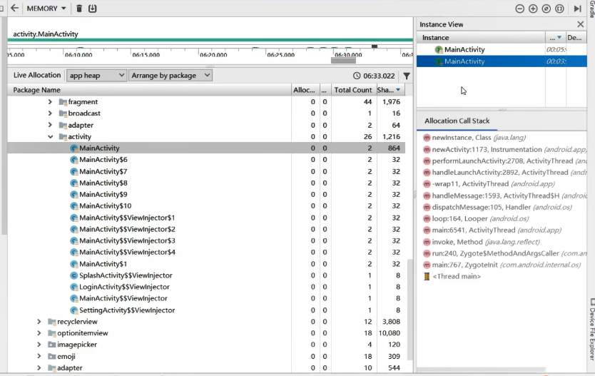

 

> ## ：陈昱全 知乎主页：https://www.zhihu.com/people/chen-yu-quan 

## 前言

想写一篇关于android GC的想法来源于追查一个魅族手机图片滑动卡顿问题，由于不断的GC导致的丢帧卡顿的问题让我们想了很多方案去解决，所以就打算详细的看看内存分配和GC的原理，为什么会不断的GC，GC ALLOC和GC COCURRENT有什么区别，能不能想办法扩大堆内存减少GC的频次等等。

## 1、JVM内存回收机制

#### 1.1 回收算法

##### 标记回收算法（Mark and Sweep GC）

从”GC Roots”集合开始，将内存整个遍历一次，保留所有可以被GC Roots直接或间接引用到的对象，而剩下的对象都当作垃圾对待并回收，这个算法需要中断进程内其它组件的执行并且可能产生内存碎片

##### 复制算法 (Copying）

将现有的内存空间分为两快，每次只使用其中一块，在垃圾回收时将正在使用的内存中的存活对象复制到未被使用的内存块中，之后，清除正在使用的内存块中的所有对象，交换两个内存的角色，完成垃圾回收。

##### 标记-压缩算法 (Mark-Compact)

先需要从根节点开始对所有可达对象做一次标记，但之后，它并不简单地清理未标记的对象，而是将所有的存活对象压缩到内存的一端。之后，清理边界外所有的空间。这种方法既避免了碎片的产生，又不需要两块相同的内存空间，因此，其性价比比较高。

##### 分代

将所有的新建对象都放入称为年轻代的内存区域，年轻代的特点是对象会很快回收，因此，在年轻代就选择效率较高的复制算法。当一个对象经过几次回收后依然存活，对象就会被放入称为老生代的内存空间。对于新生代适用于复制算法，而对于老年代则采取标记-压缩算法。

#### 1.2 复制和标记-压缩算法的区别

乍一看这两个算法似乎并没有多大的区别，都是标记了然后挪到另外的内存地址进行回收，那为什么不同的分代要使用不同的回收算法呢？

**其实2者最大的区别在于前者是用空间换时间后者则是用时间换空间。**

前者的在工作的时候是不没有独立的“mark”与“copy”阶段的，而是合在一起做一个动作，就叫scavenge（或evacuate，或者就叫copy）。也就是说，每发现一个这次收集中尚未访问过的活对象就直接copy到新地方，同时设置forwarding pointer。这样的工作方式就需要多一份空间。

后者在工作的时候则需要分别的mark与compact阶段，mark阶段用来发现并标记所有活的对象，然后compact阶段才移动对象来达到compact的目的。如果compact方式是sliding compaction，则在mark之后就可以按顺序一个个对象“滑动”到空间的某一侧。因为已经先遍历了整个空间里的对象图，知道所有的活对象了，所以移动的时候就可以在同一个空间内而不需要多一份空间。

所以新生代的回收会更快一点，老年代的回收则会需要更长时间，同时压缩阶段是会暂停应用的，所以给我们应该尽量避免对象出现在老年代。

## 2、Dalvik虚拟机

#### 2.1 java堆

Java堆实际上是由一个Active堆和一个Zygote堆组成的，其中，Zygote堆用来管理Zygote进程在启动过程中预加载和创建的各种对象，而Active堆是在Zygote进程fork第一个子进程之前创建的。以后启动的所有应用程序进程是被Zygote进程fork出来的，并都持有一个自己的Dalvik虚拟机。在创建应用程序的过程中，Dalvik虚拟机采用COW策略复制Zygote进程的地址空间。

**COW策略**：一开始的时候（未复制Zygote进程的地址空间的时候），应用程序进程和Zygote进程共享了同一个用来分配对象的堆。当Zygote进程或者应用程序进程对该堆进行写操作时，内核就会执行真正的拷贝操作，使得Zygote进程和应用程序进程分别拥有自己的一份拷贝，这就是所谓的COW。因为copy是十分耗时的，所以必须尽量避免copy或者尽量少的copy。

为了实现这个目的，当创建第一个应用程序进程时，会将已经使用了的那部分堆内存划分为一部分，还没有使用的堆内存划分为另外一部分。前者就称为Zygote堆，后者就称为Active堆。这样只需把zygote堆中的内容复制给应用程序进程就可以了。以后无论是Zygote进程，还是应用程序进程，当它们需要分配对象的时候，都在Active堆上进行。这样就可以使得Zygote堆尽可能少地被执行写操作，因而就可以减少执行写时拷贝的操作。在Zygote堆里面分配的对象其实主要就是Zygote进程在启动过程中预加载的类、资源和对象了。这意味着这些预加载的类、资源和对象可以在Zygote进程和应用程序进程中做到长期共享。这样既能减少拷贝操作，还能减少对内存的需求。

#### 2.2 和GC有关的一些指标

记得我们之前在优化魅族某手机的gc卡顿问题时，发现他很容易触发GC_FOR_MALLOC，这个GC类别后续会说到，是分配对象内存不足时导致的。可是我们又设置了很大的堆Size为什么还会内存不够呢，这里需要了解以下几个概念：分别是Java堆的起始大小（Starting Size）、最大值（Maximum Size）和增长上限值（Growth Limit）。

在启动Dalvik虚拟机的时候，我们可以分别通过**-Xms**、**-Xmx**和**-XX:HeapGrowthLimit**三个选项来指定上述三个值，以上三个值分别表示表示

- **Starting Size：** Dalvik虚拟机启动的时候，会先分配一块初始的堆内存给虚拟机使用。
- **Growth Limit：**是系统给每一个程序的最大堆上限,超过这个上限，程序就会OOM
- **Maximum Size：**不受控情况下的最大堆内存大小，起始就是我们在用largeheap属性的时候，可以从系统获取的最大堆大小

同时除了上面的这个三个指标外，还有几个指标也是值得我们关注的，那就是堆最小空闲值（Min Free）、堆最大空闲值（Max Free）和堆目标利用率（Target Utilization）。假设在某一次GC之后，存活对象占用内存的大小为LiveSize，那么这时候堆的理想大小应该为(LiveSize / U)。但是(LiveSize / U)必须大于等于(LiveSize + MinFree)并且小于等于(LiveSize + MaxFree)，每次GC后垃圾回收器都会尽量让堆的利用率往目标利用率靠拢。所以当我们尝试手动去生成一些几百K的对象，试图去扩大可用堆大小的时候，反而会导致频繁的GC，因为这些对象的分配会导致GC，而GC后会让堆内存回到合适的比例，而我们使用的局部变量很快会被回收理论上存活对象还是那么多，我们的堆大小也会缩减回来无法达到扩充的目的。 与此同时这也是产生CONCURRENT GC的一个因素，后文我们会详细讲到。

#### 2.3 GC的类型

- **GC_FOR_MALLOC**: 表示是在堆上分配对象时内存不足触发的GC。
- **GC_CONCURRENT**: 当我们应用程序的堆内存达到一定量，或者可以理解为快要满的时候，系统会自动触发GC操作来释放内存。
- **GC_EXPLICIT**: 表示是应用程序调用System.gc、VMRuntime.gc接口或者收到SIGUSR1信号时触发的GC。
- **GC_BEFORE_OOM**: 表示是在准备抛OOM异常之前进行的最后努力而触发的GC。

实际上，GC_FOR_MALLOC、GC_CONCURRENT和GC_BEFORE_OOM三种类型的GC都是在分配对象的过程触发的。而并发和非并发GC的区别主要在于前者在GC过程中，有条件地挂起和唤醒非GC线程，而后者在执行GC的过程中，一直都是挂起非GC线程的。并行GC通过有条件地挂起和唤醒非GC线程，就可以使得应用程序获得更好的响应性。但是同时并行GC需要多执行一次标记根集对象以及递归标记那些在GC过程被访问了的对象的操作，所以也需要花费更多的CPU资源。后文在Art的并发和非并发GC中我们也会着重说明下这两者的区别。

#### 2.4 对象的分配和GC触发时机

1. 调用函数dvmHeapSourceAlloc在Java堆上分配指定大小的内存。如果分配成功，那么就将分配得到的地址直接返回给调用者了。函数dvmHeapSourceAlloc在不改变Java堆当前大小的前提下进行内存分配，这是属于轻量级的内存分配动作。
2. 如果上一步内存分配失败，这时候就需要执行一次GC了。不过如果GC线程已经在运行中，即gDvm.gcHeap->gcRunning的值等于true，那么就直接调用函数dvmWaitForConcurrentGcToComplete等到GC执行完成就是了。否则的话，就需要调用函数gcForMalloc来执行一次GC了，参数false表示不要回收软引用对象引用的对象。
3. GC执行完毕后，再次调用函数dvmHeapSourceAlloc尝试轻量级的内存分配操作。如果分配成功，那么就将分配得到的地址直接返回给调用者了。
4. 如果上一步内存分配失败，这时候就得考虑先将Java堆的当前大小设置为Dalvik虚拟机启动时指定的Java堆最大值，再进行内存分配了。这是通过调用函数dvmHeapSourceAllocAndGrow来实现的。
5. 如果调用函数dvmHeapSourceAllocAndGrow分配内存成功，则直接将分配得到的地址直接返回给调用者了。
6. 如果上一步内存分配还是失败，这时候就得出狠招了。再次调用函数gcForMalloc来执行GC。参数true表示要回收软引用对象引用的对象。
7. GC执行完毕，再次调用函数dvmHeapSourceAllocAndGrow进行内存分配。这是最后一次努力了，成功与事都到此为止。

示例图如下：


通过这个流程可以看到，在对象的分配中会导致GC，第一次分配对象失败我们会触发GC但是不回收Soft的引用，如果再次分配还是失败我们就会将Soft的内存也给回收，前者触发的GC是GC_FOR_MALLOC类型的GC，后者是GC_BEFORE_OOM类型的GC。而当内存分配成功后，我们会判断当前的内存占用是否是达到了GC_CONCURRENT的阀值，如果达到了那么又会触发GC_CONCURRENT。

那么这个阀值又是如何来的呢，上面我们说到的一个目标利用率，GC后我们会记录一个目标值，这个值理论上需要再上述的范围之内，如果不在我们会选取边界值做为目标值。虚拟机会记录这个目标值，当做当前允许总的可以分配到的内存。同时根据目标值减去固定值（200~500K),当做触发GC_CONCURRENT事件的阈值。

#### 2.5 回收算法和内存碎片

主流的大部分Davik采取的都是标注与清理（Mark and Sweep）回收算法，也有实现了拷贝GC的，这一点和HotSpot是不一样的，具体使用什么算法是在编译期决定的，无法在运行的时候动态更换。如果在编译dalvik虚拟机的命令中指明了”WITH_COPYING_GC”选项，则编译”/dalvik/vm/alloc/Copying.cpp”源码 – 此是Android中拷贝GC算法的实现，否则编译”/dalvik/vm/alloc/HeapSource.cpp” – 其实现了标注与清理GC算法。

由于Mark and Sweep算法的缺点，容易导致内存碎片，所以在这个算法下，当我们有大量不连续小内存的时候，再分配一个较大对象时，还是会非常容易导致GC，比如我们在该手机上decode图片，具体情况如下：


所以对于Dalvik虚拟机的手机来说，我们首先要尽量避免掉频繁生成很多临时小变量（比如说：getView，onDraw等函数），另一个又要尽量去避免产生很多长生命周期的大对象。

## 3、ART内存回收机制

#### 3.1 Java堆

ART运行时内部使用的Java堆的主要组成包括Image Space、Zygote Space、Allocation Space和Large Object Space四个Space，Image Space用来存在一些预加载的类， Zygote Space和Allocation Space与Dalvik虚拟机垃圾收集机制中的Zygote堆和Active堆的作用是一样的，

Large Object Space就是一些离散地址的集合，用来分配一些大对象从而提高了GC的管理效率和整体性能，类似如下图：


在下文的GC Log中，我们也能看到在art的GC Log中包含了LOS的信息，方便我们查看大内存的情况。

#### 3.2 GC的类型

- **kGcCauseForAlloc** ，当要分配内存的时候发现内存不够的情况下引起的GC，这种情况下的GC会stop world
- **kGcCauseBackground**，当内存达到一定的阀值的时候会去出发GC，这个时候是一个后台gc，不会引起stop world
- **kGcCauseExplicit**，显示调用的时候进行的gc，如果art打开了这个选项的情况下，在system.gc的时候会进行gc
- 其他更多

#### 3.3 对象的分配和GC触发时机

由于Art下内存分配和Dalvik下基本没有任何区别，我直接贴图带过了。


#### 3.4 并发和非并发GC

Art在GC上不像Dalvik仅有一种回收算法，Art在不同的情况下会选择不同的回收算法，比如Alloc内存不够的时候会采用非并发GC，而在Alloc后发现内存达到一定阀值的时候又会触发并发GC。同时在前后台的情况下GC策略也不尽相同，后面我们会一一给大家说明。

##### 非并发GC

步骤1. 调用子类实现的成员函数InitializePhase执行GC初始化阶段。

步骤2. 挂起所有的ART运行时线程。

步骤3. 调用子类实现的成员函数MarkingPhase执行GC标记阶段。

步骤4. 调用子类实现的成员函数ReclaimPhase执行GC回收阶段。

步骤5. 恢复第2步挂起的ART运行时线程。

步骤6. 调用子类实现的成员函数FinishPhase执行GC结束阶段。

##### 并发GC

步骤1. 调用子类实现的成员函数InitializePhase执行GC初始化阶段。

步骤2. 获取用于访问Java堆的锁。

步骤3. 调用子类实现的成员函数MarkingPhase执行GC并行标记阶段。

步骤4. 释放用于访问Java堆的锁。

步骤5. 挂起所有的ART运行时线程。

步骤6. 调用子类实现的成员函数HandleDirtyObjectsPhase处理在GC并行标记阶段被修改的对象。。

步骤7. 恢复第4步挂起的ART运行时线程。

步骤8. 重复第5到第7步，直到所有在GC并行阶段被修改的对象都处理完成。

步骤9. 获取用于访问Java堆的锁。

步骤10. 调用子类实现的成员函数ReclaimPhase执行GC回收阶段。

步骤11. 释放用于访问Java堆的锁。

步骤12. 调用子类实现的成员函数FinishPhase执行GC结束阶段。

所以不论是并发还是非并发，都会引起stopworld的情况出现，并发的情况下单次stopworld的时间会更短，基本区别和。

#### 3.5 Art并发和Dalvik并发GC的差异

首先可以通过如下2张图来对比下

**Dalvik GC：**


**Art GC：**


Art的并发GC和Dalvik的并发GC有什么区别呢，初看好像2者差不多，虽然没有一直挂起线程，但是也会有暂停线程去执行标记对象的流程。通过阅读相关文档可以了解到Art并发GC对于Dalvik来说主要有三个优势点：

##### 1、标记自身

Art在对象分配时会将新分配的对象压入到Heap类的成员变量allocation*stack*描述的Allocation Stack中去，从而可以一定程度缩减对象遍历范围。

##### 2、预读取

对于标记Allocation Stack的内存时，会预读取接下来要遍历的对象，同时再取出来该对象后又会将该对象引用的其他对象压入栈中，直至遍历完毕。

##### 3、减少Pause时间

在Mark阶段是不会Block其他线程的，这个阶段会有脏数据，比如Mark发现不会使用的但是这个时候又被其他线程使用的数据，在Mark阶段也会处理一些脏数据而不是留在最后Block的时候再去处理，这样也会减少后面Block阶段对于脏数据的处理的时间。

#### 3.6 前后台GC

前台Foreground指的就是应用程序在前台运行时，而后台Background就是应用程序在后台运行时。因此，Foreground GC就是应用程序在前台运行时执行的GC，而Background就是应用程序在后台运行时执行的GC。

应用程序在前台运行时，响应性是最重要的，因此也要求执行的GC是高效的。相反，应用程序在后台运行时，响应性不是最重要的，这时候就适合用来解决堆的内存碎片问题。因此，Mark-Sweep GC适合作为Foreground GC，而Mark-Compact GC适合作为Background GC。

由于有Compact的能力存在，碎片化在Art上可以很好的被避免，这个也是Art一个很好的能力。

#### 3.7 Art大法好

总的来看，art在gc上做的比dalvik好太多了，不光是gc的效率，减少pause时间，而且还在内存分配上对大内存的有单独的分配区域，同时还能有算法在后台做内存整理，减少内存碎片。对于开发者来说art下我们基本可以避免很多类似gc导致的卡顿问题了。另外根据谷歌自己的数据来看，Art相对Dalvik内存分配的效率提高了10倍，GC的效率提高了2-3倍。

## 4、GC Log

当我们想要根据GC日志来追查一些GC可能造成的卡顿时，我们需要了解GC日志的组成，不同信息代表了什么含义。

#### 4.1 Dalvik GC日志

dalvik的日志格式基本如下：

```
D/dalvikvm: <GC_Reason> <Amount_freed>, <Heap_stats>, <Pause_time>, <Total_time>
```

- **gc_reason**：就是我们上文提到的，是gc_alloc还是gc_concurrent，了解到不同的原因方便我们做不同的处理。
- **amount_freed**：表示系统通过这次GC操作释放了多少内存
- **Heap_stats**：中会显示当前内存的空闲比例以及使用情况（活动对象所占内存 / 当前程序总内存）
- **Pause_time**：表示这次GC操作导致应用程序暂停的时间。关于这个暂停的时间，在2.3之前GC操作是不能并发进行的，也就是系统正在进行GC，那么应用程序就只能阻塞住等待GC结束。而自2.3之后，GC操作改成了并发的方式进行，就是说GC的过程中不会影响到应用程序的正常运行，但是在GC操作的开始和结束的时候会短暂阻塞一段时间，所以还有后续的一个total_time。
- **Total_time** : 表示本次GC所花费的总时间和上面的Pause_time,也就是stop all是不一样的，卡顿时间主要看上面的pause_time。

#### 4.2 Art GC日志

```
I/art: <GC_Reason> <Amount_freed>, <LOS_Space_Status>, <Heap_stats>, <Pause_time>, <Total_time>
```

基本情况和Dalvik没有什么差别，GC的Reason更多了，还多了一个OS_Space_Status

- **LOS_Space_Status**：Large Object Space，大对象占用的空间，这部分内存并不是分配在堆上的，但仍属于应用程序内存空间，主要用来管理 bitmap 等占内存大的对象，避免因分配大内存导致堆频繁 GC。


# anr


https://blog.csdn.net/ByteDanceTech/article/details/114909721?spm=1001.2014.3001.5501


应用程序的响应性是由Activity Manager 和 WindowManager系统服务监听的。

问题：原理是什么？


## 今日头条 ANR 优化实践系列 - 设计原理及影响因素


ANR 问题，对于从事 Android 开发的同学来说并不陌生，日常开发中，经常会遇到应用乃至系统层面引起的各种问题，很多时候因为不了解其运行原理，在面对该类问题时可能会一头雾水。与此同时，因为现有监控能力不足或获取信息有限，使得这类问题如同镜中花水中月，让我们在追求真理的道路上举步维艰。如下图：


工作中在帮助大家分析问题时，发现有不少同学问到，在哪里可以更加系统的学习？于是本人抱着“授人以鱼，不如授人以渔”的态度，结合个人理解和工作实践，接下来将从设计原理、影响要素、工具建设、分析思路，案例实战、优化探索等几个篇章，对 ANR 方向进行一次全面的总结，希望帮助大家在今后的工作中更好地理解和应对以下问题：

**什么是 ANR？**

**系统是如何设计 ANR 的？**

**发生 ANR 时系统都会获取哪些信息以及工作流程？**

**导致 ANR 的原因有哪些？**

**遇到这类问题该如何分析？**

**如何能更加快速准确的定位问题？**

**面对这类问题我们能主动做些什么？**

简述
在正式分析 ANR 问题之前，先来看看下面这些问题：

**系统是如何设计 ANR 的，都有哪些服务或者组件会发生 ANR？**

**发生 ANR 的时候，系统又是如何工作的，都会获取哪些信息？**

**影响 ANR 的场景有哪些？我们是如何对其进行归类的？**

了解这些有助于我们在面对各种问题时，做到有的放矢，下面我们就来介绍并回答这些问题。

### ANR 设计原理

ANR 全称 Applicatipon No Response；Android 设计 ANR 的用意，是系统通过与之交互的组件(Activity，Service，Receiver，Provider)以及用户交互(InputEvent)进行超时监控，以判断应用进程(主线程)是否存在卡死或响应过慢的问题，通俗来说就是很多系统中看门狗(watchdog)的设计思想。 

**组件超时分类**
系统在通过 Binder 通信向应用进程发送上述组件消息或 Input 事件时，在 AMS 或 Input 服务端同时设置一个异步超时监控。当然针对不同类型事件，设置的超时时长也存在差别，以下是 Android 系统对不同类型的超时阈值设置：


(图片仅供参考，国内厂商可能会有调整，每个厂商的标准也存在差异)

Broadcast 超时原理举例
在了解不同类型消息的超时阈值之后，我们再来了解一下超时监控的设计原理。

以 BroadCastReceiver 广播接收超时为例，广播分为有序广播和无序广播，同时又有前台广播和后台广播之分；**只针对有序广播设置超时监控机制，并根据前台广播和后台广播的广播类型决定了超时时长；**例如后台广播超时时长 60S，前台广播超时时长只有 10S； 下面我们结合代码实现来看一下广播消息的发送过程。

无序广播：

对于无序广播，系统在搜集所有接收者之后一次性全部发送完毕，如下图；


通过上图我们看到无序广播是没有设置超时监听机制的，一次性发送给所有接收者，对于应用侧何时接收和响应完全不关心(相当于 UDP 传输)。
有序广播：

再来看一下有序广播的发送和接收逻辑，同样在系统 AMS 服务中，BoradCastQueue 获取当前正在发送的广播消息，并取出下一个广播接收者，更新发送时间戳，以此时间计算并设置超时时间(但是系统在此进行了一些优化处理，以避免每次广播正常接收后，都需要取消超时监控然后又重新设置，而是采用一种对齐的方式进行复用)。最后将该广播发送给接收者，接收到客户端的完成通知之后，再发送下一个，整个过程如此反复。


在客户端进程中，Binder 线程接收到 AMS 服务发送过来的广播消息之后，会将此消息进行封装成一个 Message，然后将 Message 发送到主线程消息队列(插入到消息队列当前时间节点的位置，也正是基于此类设计导致较多消息调度及时性的问题，后面我们将详细介绍)，消息接收逻辑如下：


正常情况下，很多广播请求都会在客户端及时响应，然后通知到系统 AMS 服务取消本次超时监控。但是在部分业务场景或系统场景异常的情况下，发送的广播未及时调度，没有及时通知到系统服务，便会在系统服务侧触发超时，判定应用进程响应超时。AMS 响应超时代码逻辑如下：

```java
final void broadcastTimeoutLocked(boolean fromMsg) {
        ......
        long now = SystemClock.uptimeMillis();
        BroadcastRecord r = mOrderedBroadcasts.get(0);
        if (fromMsg) {
            //我们刚才提到的时间对齐方式，避免频繁取消和设置消息超时
            long timeoutTime = r.receiverTime + mTimeoutPeriod;
            if (timeoutTime > now) {
                setBroadcastTimeoutLocked(timeoutTime);
                return;
            }
        }
        ......
        ......
        Object curReceiver;
        if (r.nextReceiver > 0) {
            //获取当前超时广播接收者
            curReceiver = r.receivers.get(r.nextReceiver-1);
            r.delivery[r.nextReceiver-1] = BroadcastRecord.DELIVERY_TIMEOUT;
        } else {
            curReceiver = r.curReceiver;
        }
        Slog.w(TAG, "Receiver during timeout of " + r + " : " + curReceiver);
        ......
        ......
        if (app != null) {
            anrMessage = "Broadcast of " + r.intent.toString();
        }
        ......
        if (!debugging && anrMessage != null) {
             //开始通知AMS服务处理当前超时行为
            mHandler.post(new AppNotResponding(app, anrMessage));
        }
    }
```


到这里，广播发送和超时监控逻辑的分析就基本结束了，通过介绍，我们基本知道了广播超时机制是如何设计和工作的，整体流程图示意图如下：


### ANR Trace Dump 流程

上面我们以广播接收为例，介绍了系统监控原理，下面再来介绍一下，发生 ANR 时系统工作流程。

ANR 信息获取：
继续以广播接收为例，在上面介绍到当判定超时后，会调用系统服务 AMS 接口，搜集本次 ANR 相关信息并存档(data/anr/trace，data/system/dropbox)，入口如下。


进入系统服务 AMS 之后，AppError 先进行场景判断，以过滤当前进程是不是已经发生并正在执行 Dump 流程，或者已经发生 Crash，或者已经被系统 Kill 之类的情况。并且还考虑了系统是否正在关机等场景，如果都不符合上述条件，则认为当前进程真的发生 ANR。


接下来系统再判断当前 ANR 进程对用户是否可感知，如后台低优先级进程(没有重要服务或者 Activity 界面)。

然后开始统计与该进程有关联的进程，或系统核心服务进程的信息；例如与应用进程经常交互的 SurfaceFligner，SystemServer 等系统进程，如果这些系统服务进程在响应时被阻塞，那么将导致应用进程 IPC 通信过程被卡死。

首先把自身进程(系统服务 SystemServer)加进来，逻辑如下：


接着获取其它系统核心进程，因为这些服务进程是 Init 进程直接创建的，并不在 SystemServer 或 Zygote 进程管理范围。


在搜集完第一步信息之后，接下来便开始统计各进程本地的更多信息，如虚拟机相关信息、Java 线程状态及堆栈。以便于知道此刻这些进程乃至系统都发生了什么情况。理想很丰满，现实很骨感，后面我们会重点讲述为何有此感受。


系统为何要收集其它进程信息呢？因为从性能角度来说，任何进程出现高 CPU 或高 IO 情况，都会抢占系统资源，进而影响其它进程调度不及时的现象。下面从代码角度看看系统 dump 流程：


```java
            private static void dumpStackTraces(String tracesFile, ArrayList<Integer> firstPids,            ArrayList<Integer> nativePids, ArrayList<Integer> extraPids,
            boolean useTombstonedForJavaTraces) {
        ......
        ......
        //考虑到性能影响，一次dump最多持续20S，否则放弃后续进程直接结束
        remainingTime = 20 * 1000;
        try {
                ......
                //按照优先级依次获取各个进程trace日志
                int num = firstPids.size();
                for (int i = 0; i < num; i++) {
                    final long timeTaken;
                    if (useTombstonedForJavaTraces) {
                        timeTaken = dumpJavaTracesTombstoned(firstPids.get(i), tracesFile, remainingTime);
                    } else {
                        timeTaken = observer.dumpWithTimeout(firstPids.get(i), remainingTime);
                    }
            
            remainingTime -= timeTaken;
                if (remainingTime <= 0) {
                    //已经超时，则不再进行后续进程的dump操作
                    return;
                }
                }
            }
        }
        //按照优先级依次获取各个进程trace日志
            for (int pid : nativePids) {
                final long nativeDumpTimeoutMs = Math.min(NATIVE_DUMP_TIMEOUT_MS, remainingTime);
 
                final long start = SystemClock.elapsedRealtime();
                Debug.dumpNativeBacktraceToFileTimeout(
                        pid, tracesFile, (int) (nativeDumpTimeoutMs / 1000));
                final long timeTaken = SystemClock.elapsedRealtime() - start;
 
                remainingTime -= timeTaken;
                if (remainingTime <= 0) {
                    //已经超时，则不再进行后续进程的dump操作
                    return;
                }
            }
        }
        //按照优先级依次获取各个进程trace日志
            for (int pid : extraPids) {
                final long timeTaken;
                if (useTombstonedForJavaTraces) {
                    timeTaken = dumpJavaTracesTombstoned(pid, tracesFile, remainingTime);
                } else {
                    timeTaken = observer.dumpWithTimeout(pid, remainingTime);
                }
 
                remainingTime -= timeTaken;
                if (remainingTime <= 0) {
                    //已经超时，则不再进行后续进程的dump操作
                    return;
                }
            }
        }
    }
    ......
}
```
**Dump Trace 流程**
出于安全考虑，进程之间是相互隔离的，即使是系统进程也无法直接获取其它进程相关信息。因此需要借助 IPC 通信的方式，将指令发送到目标进程，目标进程接收到信号后，协助完成自身进程 Dump 信息并发送给系统进程。以 AndroidP 系统为例，大致流程图如下：


关于应用进程接收信号和响应能力，是在虚拟机内部实现的，在虚拟机启动过程中进行信号注册和监听(SIGQUIT)，初始化逻辑如下：


SignalCatcher 线程接收到信号后，首先 Dump 当前虚拟机有关信息，如内存状态，对象，加载 Class，GC 等等，接下来设置各线程标记位(check_point)，以请求线程起态(suspend)。其它线程运行过程进行上下文切换时，会检查该标记，如果发现有挂起请求，会主动将自己挂起。等到所有线程挂起后，SignalCatcher 线程开始遍历 Dump 各线程的堆栈和线程数据，结束之后再唤醒线程。期间如果某些线程一直无法挂起直到超时，那么本次 Dump 流程则失败，并主动抛出超时异常。


根据上面梳理的流程，SignalCatcher 获取各线程信息的工作过程，示意图如下：


到这里，基本介绍完了系统设计原理，并以广播发送为例说明系统是如何判定 ANR 的，以及发生 ANR 后，系统是如何获取系统信息和进程信息，以及其他进程是如何协助系统进程完成日志收集的。

整体来看链路比较长，而且涉及到与很多进程交互，同时为了进一步降低对应用乃至系统的影响，系统在很多环节都设置大量超时检测。而且从上面流程可以看到发生 ANR 时，系统进程除了发送信号给其它进程之外，自身也 Dump Trace，并获取系统整体及各进程 CPU 使用情况，且将其它进程 Dump 发送的数据写到文件中。因此这些开销将会导致系统进程在 ANR 过程承担很大的负载，这是为什么我们经常在 ANR Trace 中看到 SystemServer 进程 CPU 占比普遍较高的主要原因。

应用层如何判定 ANR
Android M(6.0) 版本之后，应用侧无法直接通过监听 data/anr/trace 文件，监控是否发生 ANR，那么大家又有什么其它手段去判定 ANR 呢？下面我们简单介绍一下

站在应用侧角度来看，因为系统没有提供太友好的机制，去主动通知应用是否发生 ANR，而且很多信息更是对应用屏蔽了访问权限，但是对于三方 App 来说，也需要关注基本的用户体验，因此很多公司也进行了大量的探索，并给出了不同的解决思路，目前了解到的方案(思路)主要有下面 2 种：

主线程 watchdog 机制

核心思想是在应用层定期向主线程设置探测消息，并在异步设置超时监测，如在规定的时间内没有收到发送的探测消息状态更新，则判定可能发生 ANR，为什么是可能发生 ANR？因为还需要进一步从系统服务获取相关数据(下面会讲到如何获取)，进一步判定是否真的发生 ANR。

监听 SIGNALQUIT 信号

该方案在很多公司有应用，网上也有相关介绍，这里主要介绍一下思路。我们在上面提到了虚拟机是通过注册和监听 SIGNALQUIT 信号的方式执行请求的，而对于信号机制有了解的同学马上就可以猜到，我们也可以在应用层参考此方式注册相同信号去监听。不过要注意的是注册之后虚拟机之前注册的就会被覆盖，需要在适当的时候进行恢复，否则小心系统(厂商)找上门。

当接收到该信号时，过滤场景，确定是发生用户可感知的 ANR 之后，从 Java 层获取各线程堆栈，或通过反射方式获取到虚拟机内部 Dump 线程堆栈的接口，在内存映射的函数地址，强制调用该接口，并将数据重定向输出到本地。

该方案从思路上来说优于第一种方案，并且遵循系统信息获取方式，获取的线程信息及虚拟机信息更加全面，但缺点是对性能影响比较大，对于复杂的 App 来说，统计其耗时，部分场景一次 Dump 耗时可能要超过 10S。

应用层如何获取 ANR Info
上面提到无论是 Watchdog 还是监听信号的方式，都需要结论进一步过滤，以确保收集我们想要的 ANR 场景，因此需要利用系统提供的接口，进一步判定当前应用是否发生问题(ANR，Crash)；

与此同时，除了需要获取进程中各线程状态之外，我们也需要知道系统乃至其他进程的一些状态，如系统 CPU，Mem，IO 负载，关键进程的 CPU 使用率等等，便于推测发生问题时系统环境是否正常；

获取信息相关接口类如下：


通过该接口获取的相关信息，示意如下，其中下图红框选中的关键字，我们在后续 ANR 分析思路一章，会对其进行详细释义：


影响因素
上面主要介绍系统针对各种类型的消息是如何设置超时监控，以及监测到超时之后，系统侧和应用侧如何获取各类信息的工作流程。在对这些有所了解之后，接下来再看看 ANR 问题是如何产生的，以及我们对影响 ANR 因素的类型划分。

举个例子：
在工作中，有同学问到“我的 Service”逻辑很简单，为何会 ANR 呢？其实通过堆栈和监控工具可以发现，他所说的业务 Service，其实都还没来得及被调度。原来该同学是从我们的内部监控平台上看到是该 Service 发生导致的 ANR，如下图：


下面我们就来回答一下为何会出现上面的这类现象？

问题答疑
通过前面的讲解，我们可以发现，系统服务(AMS，InputService)在将具有超时属性的消息，如创建 Service，Receiver，Input 事件等，通过 Binder 或者其它 IPC 的方式发送到目标进程之后，便启动异步超时监测。而这种性质的监测完全是一种黑盒监测，并不是真的监控发送的消息在真实执行过程中是否超时，也就是说系统不管发送的这个消息有没有被执行，或者真实执行过程耗时有多久，只要在监控超时到来之前，服务端没有接收到通知，那么就判定为超时。

同时在前面我们讲到，当系统侧将消息发送给目标进程之后，其客户端进程的 Binder 线程接收到该消息后，会按时间顺序插入到消息队列；在后续等待执行过程中，会有下面几种情况发生：

启动进程启动场景，大量业务或基础库需要初始化，在消息入队之前，已经有很多消息待调度；

有些场景有可能只是少量消息，但是其中有一个或多个消息耗时很长；

有些场景其他进程或者系统负载特别高，整个系统都变得有些卡顿。

上述这些场景都会导致发送的消息还没来得及执行，就可能已经被系统判定成为超时问题，然而此时进程接收信号后，主线程 Dump 的是当前某个消息执行过程的业务堆栈(逻辑)。

所以总结来说，发生 ANR 问题时，Trace 堆栈很多情况下都不是 RootCase。而系统 ANR Info 中提示某个 Service 或 Receiver 导致的 ANR 在很大程度上，并不是这些组件自身问题。

那么影响 ANR 的场景具体可以分为哪几类呢，下面我们就来聊一聊。

影响因素分类
结合我们在系统侧和应用侧的工作经历，以及对该类问题的理解，我们将可能导致 ANR 的影响要素分为下面几个方面，影响环境分为应用内部环境和系统环境；即 系统负载正常，但是应用内部主线程消息过多或耗时严重；另外一类则是系统或应用内部其它线程或资源负载过高，主线程调度被严重抢占；系统负载正常，主线程调度问题，总体来说包括以下几种：

当前 Trace 堆栈所在业务耗时严重；

当前 Trace 堆栈所在业务耗时并不严重，但是历史调度有一个严重耗时；

当前 Trace 堆栈所在业务耗时并不严重，但是历史调度有多个消息耗时；

当前 Trace 堆栈所在业务耗时并不严重，但是历史调度存在巨量重复消息(业务频繁发送消息)；

当前 Trace 堆栈业务逻辑并不耗时，但是其他线程存在严重资源抢占，如 IO，Mem，CPU；

当前 Trace 堆栈业务逻辑并不耗时，但是其他进程存在严重资源抢占，如 IO，Mem，CPU；

下面我们就来分别介绍一下这几种场景以及表现情况：

当前主线程正在调度的消息耗时严重

理论上某个消息耗时越严重，那么这个消息造成的卡顿或者 ANR 的概率就越大，这种场景在线上经常发生，相对来说比较容易排查，也是业务开发同学分析该类问题的常规思路。

发生 ANR 时主线程消息调度示意图如下：

已调度的消息发生单点耗时严重

如果之前某个历史消息严重耗时，但是直到该消息执行完毕，系统服务仍然没有达到触发超时的临界点，后续主线程继续调度其它消息时，系统判定响应超时，那么正在执行的业务场景很不幸被命中，而当前正在执行的业务逻辑可能很简单。

这种场景在线上大量存在，因为比较隐蔽，所以会给很多同学带来困惑，后面会在 ANR 实例分析中对其进行重点介绍。发生 ANR 时主线程消息调度示意图如下：

连续多个消息耗时严重

除了上述两种场景，还有一种情况就是存在多个消息耗时严重的情况，直到后面主线程调度其它消息时，系统判定响应超时，那么正在执行的业务场景很不幸被命中；这种场景在实际环境中也是普遍存在的，这类问题更加隐蔽，并且在分析和问题归因上，也很难清晰的划清界限，问题治理上需要推动多个业务场景进行优化。(后面会在 ANR 实例分析中对其进行重点介绍)

发生 ANR 时主线程消息调度示意图如下：相同消息高频执行(业务逻辑异常)

上面我们讲到的是有一个或多个消息耗时较长，还有另外一种情况就是业务逻辑发生异常或者业务线程与主线程频繁交互，大量消息堆积在消息队列，这时对于后续追加到消息队列的消息来说，尽管不存在单个耗时严重的消息，但是消息太密集导致一段时间内同样很难被及时调度，因此这种场景也会造成消息调度不及时，进而导致响应超时问题。(后面会在 ANR 实例分析中对其进行介绍)

发生 ANR 时主线程消息调度示意图如下：


应用进程或系统(包括其它进程)负载过重
除了上面列举了一些主线程消息耗时严重或者消息过多，导致的消息调度不及时的可能引起的问题之外，还有一种我们在线上经常遇到的场景，那就是进程或系统本身负载很重，如高 CPU，高 IO，低内存(应用内内存抖动频繁 GC，系统内存回收)等等。这种情况出现之后，也很导致应用或整体系统性能变差，最终导致一系列超时问题。

针对这种情况，具体到主线程消息调度上表现来看，就是很多消息耗时都比较严重，而且每次消息调度统计的 Wall Duration(绝对时间：包括正常调度和等待，休眠时间)和 CPU Duration(绝对时间：只包括 CPU 执行时间)相差很大，如果出现这种情况我们则认为系统负载可能发生了异常，需要借助系统信息进一步对比分析。这种情况不仅影响当前应用，也会影响其他应用乃至系统自身。

发生 ANR 时主线程消息调度示意图如下：

总结
通过上面的介绍，我们介绍了 ANR 的设计原理及工作过程，对影响 ANR 的因素和分类也有了进一步认识。从归类上我们可以发现，影响 ANR 的场景会有很多种，甚至很多时候都是层层叠加导致，所以可以借用一句话来形容：「当 ANR 发生时，没有一个消息是无辜的」。 


# OOM

当前占用的内存加上我们申请的内存资源超过了 Dalvik虚拟机的最大内存限制就会抛出的Out of memory异常

**内存溢出/内存抖动/内存泄漏**


bitmapFactory的方法都是通过jni方法实现的，所以bitmap加载到内存是包含了Java和C两部分的

bitmap对象可以由虚拟机释放，但是c那部分的资源虚拟机是无法释放的，必须调用recycle来释放。


#### bitmap recycle

```
 /**
     * Free the native object associated with this bitmap, and clear the
     * reference to the pixel data. This will not free the pixel data synchronously;
     * it simply allows it to be garbage collected if there are no other references.
     * The bitmap is marked as "dead", meaning it will throw an exception if
     * getPixels() or setPixels() is called, and will draw nothing. This operation
     * cannot be reversed, so it should only be called if you are sure there are no
     * further uses for the bitmap. This is an advanced call, and normally need
     * not be called, since the normal GC process will free up this memory when
     * there are no more references to this bitmap.
     */
    public void recycle() {
        if (!mRecycled && mNativePtr != 0) {
            if (nativeRecycle(mNativePtr)) {
                // return value indicates whether native pixel object was actually recycled.
                // false indicates that it is still in use at the native level and these
                // objects should not be collected now. They will be collected later when the
                // Bitmap itself is collected.
                mNinePatchChunk = null;
            }
            mRecycled = true;
        }
    }
```

会释放和bitmap有关的native对象，同时会清理数据对象的引用。并不是立即清理，只是通知垃圾回收器。不可逆操作。可以不主动调用，垃圾回收期会处理。


Java OOM Top 堆栈归因
在对抖音的 Java 内存优化治理之前我们先根据平台上报的堆栈异常对当前的 OOM 进行归因，主要分为下面几类：


其中 pthread_create 问题占到了总比例大约在百分之 50，Java 堆内存超限为百分之 40 多，剩下是少量的 fd 数量超限。其中 pthread_create 和 fd 数量不足均为 native 内存限制导致的 Java 层崩溃，我们对这部分的内存问题也做了针对性优化，主要包括：

**线程收敛、监控**

**线程栈泄漏自动修复**

**FD 泄漏监控**

**虚拟内存监控、优化**

**抖音 64 位专项**

治理之后 pthread_create 问题降低到了 0.02‰以下，这方面的治理实践会在下一篇抖音 Native 内存治理实践中详细介绍，大家敬请期待。本文重点介绍 Java 堆内存治理。

堆内存治理思路
**从 Java 堆内存超限的分类来看，主要有两类问题：**

1. 堆内存单次分配过大/多次分配累计过大。

触发这类问题的原因有数据异常导致单次内存分配过大超限，也有一些是 StringBuilder 拼接累计大小过大导致等等。这类问题的解决思路比较简单，问题就在当前的堆栈。

2.  堆内存累积分配触顶。

这类问题的问题堆栈会比较分散，在任何内存分配的场景上都有可能会被触发，那些高频的内存分配节点发生的概率会更高，比如 Bitmap 分配内存。这类 OOM 的根本原因是内存累积占用过多，而当前的堆栈只是压死骆驼的最后一根稻草，并不是问题的根本所在。所以这类问题我们需要分析整体的内存分配情况，从中找到不合理的内存使用（比如内存泄露、大对象、过多小对象、大图等）。 

**内存泄漏兜底**
大量的内存泄漏，如果我们都靠推进研发解决，经常会出现生产大于消费的情况，针对这些未被消费的内存泄漏我们在客户端做了监控和止损，将 onDestory 的 Activity 添加到 WeakRerefrence 中，延迟 60s 监控是否回收，未回收则主动释放泄漏的 Activity 持有的 ViewTree 的背景图和 ImageView 图片。

大对象
主要对三种类型的大对象进行优化

全局缓存：针对全局缓存我们按需释放和降级了不需要的缓存，尽量使用弱引用代替强引用关系，比如针对频繁泄漏的 EventBus 我们将内部的订阅者关系改为弱引用解决了大量的 EventBus 泄漏。

系统大对象：系统大对象如 PreloadDrawable、JarFile 我们通过源码分析确定主动释放并不干扰原有逻辑，在启动完成或在内存触顶时主动反射释放。

动画：用原生动画代替了内存占用较大的帧动画，并对 Lottie 动画泄漏做了手动释放。


图 14. 大对象优化点


小对象
小对象优化我们集中在字段优化、业务优化、缓存优化三个纬度，不同的纬度有不同的优化策略。


图 15. 小对象优化思路

通用类优化
在抖音的业务中，视频是最核心且通用的 Model，抖音业务层的数据存储分散在各个业务维护了各自视频的 Model，Model 本身由于聚合了各个业务需要的属性很多导致单个实例内存占用就不低，随着用户使用过程实例增长内存占用越来越大。对 Model 本身我们可以从属性优化和拆分这两种思路来优化。

字段优化：针对一次性的属性字段，在使用完之后及时清理掉缓存，比如在视频 Model 内部存在一个 Json 对象，在反序列完成之后 Json 对象就没有使用价值了，可以及时清理。

类拆分：针对通用 Model 冗杂过多的业务属性，尝试对 Model 本身进行治理，将各个业务线需要用到的属性进行梳理，将 Model 拆分成多个业务 Model 和一个通用 Model，采用组合的方式让各个业务线最小化依赖自己的业务 Model，减少大杂烩 Model 不必要的内存浪费。

业务优化
按需加载：抖音这边 IM 会全局保存会话，App 启动时会一次性 Load 所有会话，当用户的会话过多时相应全局占用的内存就会较大，为了解决该问题，会话列表分两次加载，首次只加载一定数量到内存，需要时再加载全部。

内存缓存限制或清理：首页推荐列表的每一次 Loadmore 操作，都不会清理之前缓存起来的视频对象，导致用户长时间停留在推荐 Feed 时，缓存起来的视频对象过多会导致内存方面的压力。在通过实验验证不会对业务产生负面影响情况下对首页的缓存进行了一定数量的限制来减小内存压力。

缓存优化
上面提到的视频 Model，抖音最早使用 Manager 来管理通用的视频实例。Manager 使用 HashMap 存储了所有的视频对象，最初的方案里面没有对内存大小进行限制且没有清除逻辑，随着使用时间的增加而不断膨胀，最终出现 OOM 异常。为了解决视频 Model 无限膨胀的问题设计了一套缓存框架主要流程如下：


图 16. 视频缓存框架

使用 LRU 缓存机制来缓存视频对象。在内存中缓存最近使用的 100 个视频对象，当视频对象从内存缓存中移除时，将其缓存至磁盘中。在获取视频对象时，首先从内存中获取，若内存中没有缓存该对象，则从磁盘缓存中获取。在退出 App 时，清除 Manager 的磁盘缓存，避免磁盘空间占用不断增长。

图片
关于图片优化，我们主要从图片库的管理和图片本身优化两个方面思考。同时对不合理的图片使用也做了兜底和监控。

图片库
针对应用内图片的使用状况对图片库设置了合理的缓存，同时在应用 or 系统内存吃紧的情况下主动释放图片缓存。

图片自身优化
我们知道图片内存大小公式 = 图片分辨率 * 每个像素点的大小。

图片分辨率我们通过设置合理的采样来减少不必要的像素浪费。

```java
//开启采样
ImagePipelineConfig config = ImagePipelineConfig.newBuilder(context)
    .setDownsampleEnabled(true)
    .build();
Fresco.initialize(context, config);

//请求图片时，传入resize的大小，一般直接取View的宽高
ImageRequest request = ImageRequestBuilder.newBuilderWithSource(uri)
    .setResizeOptions(new ResizeOptions(50, 50))
    .build();mSimpleDraweeView.setController(
    Fresco.newDraweeControllerBuilder()
        .setOldController(mSimpleDraweeView.getController())
        .setImageRequest(request)
        .build());
```

而单个像素大小，我们通过替换系统 drawable 默认色彩通道，将部分没有透明通道的图片格式由 ARGB_8888 替换为 RGB565，在图片质量上的损失几乎肉眼不可见，而在内存上可以直接节省一半。

图片兜底
针对因 activity、fragment 泄漏导致的图片泄漏，我们在 onDetachedFromWindow 时机进行了监控和兜底，具体流程如下：

 


市面上主流的性能分析工具有：Systrace、TraceView、Android Studio 的 CPU Profiler


**解决只能保留最近一次的anr信息的\**方法，dropbox\** ：**

adb shell 

依次找到 /data/system/dropbox 目录，如图：

[](https://img2020.cnblogs.com/blog/1412981/202006/1412981-20200621215553413-360132929.png)

 


#### LRU

最近最少使用


#### UI卡顿

60fps -> 16ms

overdraw 大量重叠


#### 内存泄漏

常见内存泄漏：

1，单例

2，匿名内部类

3，handler

4，避免使用static变量（如果进程常驻，那么会增加进程的内存使用，且容易被回收）

5，资源未关闭造成的内存泄漏

6，Asynctask造成的内存泄漏


#### 内存管理

 


# 启动优化


根据启动流程，所以优化主要集中在 Application 的onCreate 和 加载XML 和 Activity onCreate

resume 。就是生命周期加上加载xml

## 黑白屏问题


伪优化：提高体验，其实时间没缩短

白屏    <style name="AppTheme" parent="Theme.AppCompat.Light">

原因是：找到一个父类name="Platform.AppCompat.Light"中定义了
<item name="android:windowBackground">用来控制黑白屏

黑屏    <style name="AppTheme">（在以前的老版本上有效，现在的版本默认使用透明处理了）


解决办法：
1.在自己的

<style name="AppTheme" parent="Theme.AppCompat.Light">

</style>

中加入windowsbackground
2.设置windowbackground为透明的 

```java
 <item name="android:windowIsTranslucent">true</item>
```

但这2种方法会有个问题，所有的activity启动都会显示
3.单独做成一个主题

<style name="AppTheme.Launcher">
        <item name="android:windowBackground">@drawable/bg</item>
    </style>
```java
<style name="AppTheme.Launcher1">
    <item name="android:windowBackground">@drawable/bg</item>
</style>
<style name="AppTheme.Launcher2">
    <item name="android:windowBackground">@drawable/bg</item>
</style>
```
再在功能清单中的单独activity下设置
<activity   android:theme="@style/AppTheme.Launcher"
然后在程序中使用setTheme(R.style.AppTheme);
让APP中所有的activity还是使用以前的样式，这样做就只有启动时才使用自己的样式

QQ中的用法   

```JAVA
<item name="android:windowDisablePreview">true</item>
<item name="android:windowBackground">@null</item>
```


## 启动时间查看

1.冷启动：当启动应用时，后台没有该应用的进程，这时系统会重新创建一个新的进程分配给该应用，这个启动方式就是冷启动。

2.热启动：当启动应用时，后台已有该应用的进程（例：按back键/home键，应用虽然会退出，但是该应用的进程是依然会保留在后台，可进入任务列表查看），所以在已有进程的情况下，这种启动会从已有的进程中来启动应用，这个方式叫热启动。


 冷启动：冷启动后系统会重新创建一个新的进程分配给它，所以先创建和初始化Application类，再创建和初始化MainActivity类（包括一系列的测量、布局、绘制），最后经过渲染显示在app界面。
 热启动：热启动因为会从已有的进程中来启动，所以热启动就不会走Application这步了，而是直接走MainActivity（包括一系列的测量、布局、绘制），所以热启动的过程只需要创建和初始化一个MainActivity就行了，而不必创建和初始化Application，因为一个应用从新进程的创建到进程的销毁，Application只会初始化一次。


 


AM路径
E:\tools\android-src\android-6.0.1_r1\frameworks\base\cmds\am\src\com\android\commands\am


Am.java   946行开始打印启动时间信息
其中一个result对象，在871行初始化 result = mAm.startActivityAndWait(。。。）
在这个初始化时就已经进行了时间的计算：
在android-src\android-6.0.1_r1\frameworks\base\services\core\java\com\android\server\am\ActivityRecord.java文件中计算
void windowsDrawnLocked() --->reportLaunchTimeLocked(SystemClock.uptimeMillis())中完成时间的统计;


4.4以前    adb shell am start -W com.lqr.wechat/com.lqr.wechat.activity.SplashActivity

4.4版本以后Logcat 输入Display筛选系统日志  不过滤信息No Filters


**ThisTime:最后一个启动的Activity的启动耗时；**
**TotalTime:自己的所有Activity的启动耗时；**
**WaitTime: ActivityManagerService启动App的Activity时的总时间（包括当前Activity的onPause()和自己Activity的启动）。**

1）ThisTime:一般和TotalTime时间一样，除非在应用启动时开了一个透明的Activity预先处理一些事再显示出主Activity，这样将比TotalTime小。
 2）TotalTime:应用的启动时间，包括创建进程+Application初始化+Activity初始化到界面显示。
 3）WaitTime:一般比TotalTime大点，包括系统影响的耗时。


 


## TRACE工具分析代码执行时间


Debug.startMethodTracing(filePath);     中间为需要统计执行时间的代码
Debug.stopMethodTracing();


优化方案：
1.开线程     没建handler    没操作UI   对异步要求不高
2.懒加载     用到的时候再初始化，如网络，数据库操作


可以选择线程，不同模式，也可以点进去看 具体时间


# UI绘制优化


**60Hz 刷新频率由来**

12 fps ：由于人类眼睛的特殊生理结构，如果所看画面之帧率高于每秒约 10-12 帧的时候，就会
认为是连贯的
24 fps ：有声电影的拍摄及播放帧率均为每秒 24 帧，对一般人而言已算可接受
30 fps ：早期的高动态电子游戏，帧率少于每秒 30 帧的话就会显得不连贯，这是因为没有动态模
糊使流畅度降低
60 fps 在与手机交互过程中，如触摸和反馈 60 帧以下人是能感觉出来的。 60 帧以上不能察觉
变化当帧率低于 60 fps 时感觉的画面的卡顿和迟滞现象  

Android 系统每隔 16ms 发出 VSYNC 信号 (1000ms/60=16.66ms) ，触发对 UI 进行渲染， 如果每次渲染都成功这样就能够达到流畅的画面所需要的 60fps ，为了能够实现 60fps ，这意味着计算渲染的大多数操作都必须在 16ms 内完成。


16 毫秒的时间主要被两件事情所占用
第一件：将 UI 对象转换为一系列多边形和纹理（ 1 ）（？）
第二件： CPU 传递处理数据到 GPU 。所以很明显，我们要缩短
这两部分的时间，也就是说需要尽量减少对象转换的次数，以及上
传数据的次数 （？ 布局 自定义）


  

如何减少这两部分的时间 以至于在 16ms 完成呢  

CPU 减少 xml 转换成对象的时间
GPU 减少重复绘制的时间


## 过度绘制优化（主要减少GPU工作量）


### 查看方法：

开发者选项-》Profile GPU rendering/调试GPU过度绘制

### 处理方法：

1，减少背景重复 。注意主题中的设置，非业务需要，不要去设置背景。

2.使用裁减减少控件之间的重合部分

3，Android7.0之后系统做出的优化  ：invalidate()不再执行测量和布局动作


## 布局的优化（主要减少CPU工作量）


### 常用工具：

1，Android/sdk/tools/bin/ui    automator   viewer.bat

2，Android\sdk\tools\monitor.bat

3，Device Monitor窗口中Hierarchy view 。  

**三个点也是代表着View的Measure, Layout和Draw。**
**绿: 表示该View的此项性能比该View Tree中超过50%的View都要快；例如,代表Measure的是绿点,意味着这个视图的测量时间快于树中的视图对象的50%。**
**黄: 表示该View的此项性能比该View Tree中超过50%的View都要慢；** 
**红: 表示该View的此项性能是View Tree中最慢的；。**


注意点：
1.能在一个平面显示的内容，尽量只用一个容器
2.尽可能把相同的容器合并merge
3.能复用的代码，用include处理，可以减少GPU重复工作


这个工具可以方便查看整个布局


# 内存优化


## 一张图片究竟站多大内存？？


https://mp.weixin.qq.com/s?__biz=MzA3NTYzODYzMg==&mid=403263974&idx=1&sn=b0315addbc47f3c38e65d9c633a12cd6&scene=21#wechat_redirect


里先要搞清楚 DisplayMetrics 的两个变量， **density** ， **densityDpi**。

简单来说，可以理解为 density 的数值是 1dp=density px；densityDpi 是屏幕每英寸对应多少个点（不是像素点），在 DisplayMetrics 当中，这两个的关系是线性的：

| **density** | **1** | **1.5** | **2** | **3** | **3.5** | **4** |
| ----------- | ----- | ------- | ----- | ----- | ------- | ----- |
| densityDpi  | 160   | 240     | 320   | 480   | 560     | 640   |

为了不引起混淆，本文所有提到的密度除非特别说明，都指的是 densityDpi，当然如果你愿意，也可以用 density 来说明问题。

```java
public final int getByteCount() {
    // int result permits bitmaps up to 46,340 x 46,340 
    //调用到native方法了
    
    return getRowBytes() * getHeight();
}
```

跟踪到这里，我们发现 ARGB_8888（也就是我们最常用的 Bitmap 的格式）的一个像素占用 4byte，那么 rowBytes 实际上就是 4*width bytes。

那么结论出来了，一张 ARGB_8888 的 Bitmap 占用内存的计算公式

**bitmapInRam = bitmapWidth\*bitmapHeight \*4 bytes**

还记得我们最开始给出的那个例子么？

------

一张**522\*686**的 **PNG** 图片，我把它放到 **drawable-xxhdpi** 目录下，在**三星s6**上加载，占用内存2547360B，就可以用这个方法获取到。

------

然而公式计算出来的可是1432368B。。。


注意到其中有个 density 和 targetDensity，前者是 decodingBitmap 的 density，这个值跟这张图片的放置的目录有关（比如 hdpi 是240，xxhdpi 是480），这部分代码我跟了一下，太长了，就不列出来了；targetDensity 实际上是我们加载图片的目标 density，这个值的来源我们已经在前面给出了，就是 DisplayMetrics 的 densityDpi，如果是三星s6那么这个数值就是640。sx 和sy 实际上是约等于 scale 的，因为 scaledWidth 和 scaledHeight 是由 width 和 height 乘以 scale 得到的。我们看到 Canvas 放大了 scale 倍，然后又把读到内存的这张 bitmap 画上去，相当于把这张 bitmap 放大了 scale 倍。

再来看我们的例子：

------

一张**522\*686**的**PNG** 图片，我把它放到 **drawable-xxhdpi** 目录下，在**三星s6**上加载，占用内存2547360B，其中 density 对应 xxhdpi 为480，targetDensity 对应三星s6的密度为640：

**522/480  \*640 \* 686/480 \**640 \** 4 = 2546432B**


越来越有趣了是不是，你肯定会发现我们这么细致的计算还是跟获取到的数值

**不！一！样！**

为什么呢？由于结果已经非常接近，我们很自然地想到精度问题。来，再把上面这段代码中的一句拿出来看看：

```
outputBitmap->setInfo(SkImageInfo::Make(scaledWidth, scaledHeight,
            colorType, decodingBitmap.alphaType()));
```

我们看到最终输出的 outputBitmap 的大小是scaledWidth*scaledHeight，我们把这两个变量计算的片段拿出来给大家一看就明白了：

```
if (willScale && decodeMode != SkImageDecoder::kDecodeBounds_Mode) {
    scaledWidth = int(scaledWidth * scale + 0.5f);
    scaledHeight = int(scaledHeight * scale + 0.5f);
}
```

在我们的例子中，

**scaledWidth = int( 522 \* 640 / 480f + 0.5) = int(696.5) = 696**

**scaledHeight = int( 686 \* 640 / 480f + 0.5) = int(915.16666…) = 915**

下面就是见证奇迹的时刻：

**915 \* 696 \* 4 = 2547360**

有木有很兴奋！有木有很激动！！

写到这里，突然想起《STL源码剖析》一书的扉页，侯捷先生只写了一句话：

> “源码之前，了无秘密”。


通过前面的代码跟踪，我们就不难知道，Bitmap 在内存当中占用的大小其实取决于：

- **色彩格式，前面我们已经提到，如果是 ARGB8888 那么就是一个像素4个字节，如果是 RGB565 那就是2个字节**
- **原始文件存放的资源目录（是 hdpi 还是 xxhdpi 可不能傻傻分不清楚哈）**
- **目标屏幕的密度（所以同等条件下，红米在资源方面消耗的内存肯定是要小于三星S6的）**


### 想办法减少 Bitmap 内存占用


####  **Jpg 和 Png**

jpg 是一种**有损**压缩的图片**存储格式**，而 png 则是 **无损**压缩的图片**存储格式**，显而易见，jpg 会比 png 小，代价也是显而易见的。

JPG 不适用于所含颜色很少、具有大块颜色相近的区域或亮度差异十分明显的较简单的图片。对于需要高保真的较复杂的图像，PNG 虽然能无损压缩，但图片文件较大。

如果仅仅是为了 Bitmap 读到内存中的大小而考虑的话，jpg 也好 png 也好，没有什么实质的差别；二者的差别主要体现在：

- alpha 你是否真的需要？如果需要 alpha 通道，那么没有别的选择，用 png。
- 你的图色值丰富还是单调？就像刚才提到的，如果色值丰富，那么用jpg，如果作为按钮的背景，请用 png。
- 对安装包大小的要求是否非常严格？如果你的 app 资源很少，安装包大小问题不是很凸显，看情况选择 jpg 或者 png（不过，我想现在对资源文件没有苛求的应用会很少吧。。）
- 目标用户的 cpu 是否强劲？jpg 的图像压缩算法比 png 耗时。这方面还是要酌情选择，前几年做了一段时间 Cocos2dx，由于资源非常多，项目组要求统一使用 png，可能就是出于这方面的考虑。

嗯，跑题了，我们其实想说的是怎么减少内存占用的。。这一小节只是想说，休想通过这个方法来减少内存占用

####  使用 inSampleSize

既然图片最终是要被模糊的，也看不太情况，还不如直接用一张采样后的图片，如果采样率为 2，那么读出来的图片只有原始图片的 1/4 大小，真是何乐而不为呢？？

```java
BitmapFactory.Options options = new Options(); 
options.inSampleSize = 2; 
Bitmap bitmap = BitmapFactory.decodeResource(getResources(), resId, options);
```

#### 使用矩阵

用到 Bitmap 的地方，总会见到 Matrix。这时候你会想到什么？

> 『基友』
>
> 『是在下输了。。』

其实想想，Bitmap 的像素点阵，还不就是个矩阵，真是你中有我，我中有你的交情啊。那么什么时候用矩阵呢？

**大图小用用采样，小图大用用矩阵。**

还是用前面模糊图片的例子，我们不是采样了么？内存是小了，可是图的尺寸也小了啊，我要用 Canvas 绘制这张图可怎么办？当然是用矩阵了：

**方式一：**

```
Matrix matrix = new Matrix();
matrix.preScale(2, 2, 0f, 0f);
//如果使用直接替换矩阵的话，在Nexus6 5.1.1上必须关闭硬件加速
canvas.concat(matrix);
canvas.drawBitmap(bitmap, 0,0, paint);
```

*需要注意的是，在使用搭载 5.1.1 原生系统的 Nexus6 进行测试时发现，如果使用 Canvas 的 setMatrix 方法，可能会导致与矩阵相关的元素的绘制存在问题，本例当中如果使用 setMatrix 方法，bitmap 将不会出现在屏幕上。因此请尽量使用 canvas 的 scale、rotate 这样的方法，或者使用 concat 方法。*

**方式二：**

```
Matrix matrix = new Matrix();
matrix.preScale(2, 2, 0, 0);
canvas.drawBitmap(bitmap, matrix, paint);
```

这样，绘制出来的图就是放大以后的效果了，不过占用的内存却仍然是我们采样出来的大小。

如果我要把图片放到 ImageView 当中呢？一样可以，请看：

```java
Matrix matrix = new Matrix();
matrix.postScale(2, 2, 0, 0);
imageView.setImageMatrix(matrix);
imageView.setScaleType(ScaleType.MATRIX);
imageView.setImageBitmap(bitmap);
```

#### 合理选择Bitmap的像素格式

其实前面我们已经多次提到这个问题。ARGB8888格式的图片，每像素占用 4 Byte，而 RGB565则是 2 Byte。我们先看下有多少种格式可选：

| **格式**  | **描述**                                                |
| --------- | ------------------------------------------------------- |
| ALPHA_8   | 只有一个alpha通道                                       |
| ARGB_4444 | 这个从API 13开始不建议使用，因为质量太差                |
| ARGB_8888 | ARGB四个通道，每个通道8bit                              |
| RGB_565   | 每个像素占2Byte，其中红色占5bit，绿色占6bit，蓝色占5bit |

这几个当中，

**ALPHA8** 没必要用，因为我们随便用个颜色就可以搞定的。

**ARGB4444** 虽然占用内存只有 **ARGB8888** 的一半，不过已经被官方嫌弃，失宠了。。『又要占省内存，又要看着爽，臣妾做不到啊T T』。

**ARGB8888** 是最常用的，大家应该最熟悉了。

**RGB565** 看到这个，我就看到了资源优化配置无处不在，这个绿色。。（不行了，突然好邪恶XD），其实如果不需要 alpha 通道，特别是资源本身为 jpg 格式的情况下，用这个格式比较理想。


BitmapFactory 在解码图片时，可以带一个Options，有一些比较有用的功能，比如：

- **inTargetDensity** 表示要被画出来时的目标像素密度
- **inSampleSize** 这个值是一个int，当它小于1的时候，将会被当做1处理，如果大于1，那么就会按照比例（1 / inSampleSize）缩小bitmap的宽和高、降低分辨率，大于1时这个值将会被处置为2的倍数。例如，width=100，height=100，inSampleSize=2，那么就会将bitmap处理为，width=50，height=50，宽高降为1 / 2，像素数降为1 / 4
- **inJustDecodeBounds** 字面意思就可以理解就是只解析图片的边界，有时如果只是为了获取图片的大小就可以用这个，而不必直接加载整张图片。
- **inPreferredConfig** 默认会使用ARGB_8888,在这个模式下一个像素点将会占用4个byte,而对一些没有透明度要求或者图片质量要求不高的图片，可以使用RGB_565，一个像素只会占用2个byte，一下可以省下50%内存。
- **inPurgeable**和**inInputShareable** 这两个需要一起使用，BitmapFactory.java的源码里面有注释，大致意思是表示在系统内存不足时是否可以回收这个bitmap，有点类似软引用，但是实际在5.0以后这两个属性已经被忽略，因为系统认为回收后再解码实际会反而可能导致性能问题
- **inBitmap** 官方推荐使用的参数，表示重复利用图片内存，减少内存分配，在4.4以前只有相同大小的图片内存区域可以复用，4.4以后只要原有的图片比将要解码的图片大既可以复用了。、


### 内存泄漏

**非静态内部类创建静态实例造成的内存泄漏**

有的时候我们可能会在启动频繁的Activity中，为了避免重复创建相同的数据资源，可能会出现这种写法：


```java
public class MainActivity extends AppCompatActivity {
    private static TestResource mResource = null;
    @Override
    protected void onCreate(Bundle savedInstanceState) {
        super.onCreate(savedInstanceState);
        setContentView(R.layout.activity_main);
        if(mManager == null){
            mManager = new TestResource();
        }
        //...
    }
    class TestResource {
        //...
    }
}
```

这样就在Activity内部创建了一个非静态内部类的单例，每次启动Activity时都会使用该单例的数据，这样虽然避免了资源的重复创建，不过这种写法却会造成内存泄漏，因为非静态内部类默认会持有外部类的引用，而又使用了该非静态内部类创建了一个静态的实例，该实例的生命周期和应用的一样长，这就导致了该静态实例一直会持有该Activity的引用，导致Activity的内存资源不能正常回收。正确的做法为： 
将该内部类设为静态内部类或将该内部类抽取出来封装成一个单例，如果需要使用Context，请使用ApplicationContext

**Handler造成的内存泄漏**
Handler的使用造成的内存泄漏问题应该说最为常见了，平时在处理网络任务或者封装一些请求回调等api都应该会借助Handler来处理，对于Handler的使用代码编写一不规范即有可能造成内存泄漏，如下示例： 

```java
public class MainActivity extends AppCompatActivity {
    private Handler mHandler = new Handler() {
        @Override
        public void handleMessage(Message msg) {
            //...
        }
    };
    @Override
    protected void onCreate(Bundle savedInstanceState) {
        super.onCreate(savedInstanceState);
        setContentView(R.layout.activity_main);
        loadData();
    }
    private void loadData(){
        //...request
        Message message = Message.obtain();
        mHandler.sendMessage(message);
    }
}
```

这种创建Handler的方式会造成内存泄漏，由于mHandler是Handler的非静态匿名内部类的实例，所以它持有外部类Activity的引用，我们知道消息队列是在一个Looper线程中不断轮询处理消息，那么当这个Activity退出时消息队列中还有未处理的消息或者正在处理消息，而消息队列中的Message持有mHandler实例的引用，mHandler又持有Activity的引用，所以导致该Activity的内存资源无法及时回收，引发内存泄漏，所以另外一种做法为： 

创建一个静态Handler内部类，然后对Handler持有的对象使用弱引用，这样在回收时也可以回收Handler持有的对象，这样虽然避免了Activity泄漏，不过Looper线程的消息队列中还是可能会有待处理的消息，所以我们在Activity的Destroy时或者Stop时应该移除消息队列中的消息，更准确的做法如下：

```java
public class MainActivity extends AppCompatActivity {
    private MyHandler mHandler = new MyHandler(this);
    private TextView mTextView ;
    private static class MyHandler extends Handler {
        private WeakReference<Context> reference;
        public MyHandler(Context context) {
            reference = new WeakReference<>(context);
        }
        @Override
        public void handleMessage(Message msg) {
            MainActivity activity = (MainActivity) reference.get();
            if(activity != null){
                activity.mTextView.setText("");
            }
        }
    }

    @Override
    protected void onCreate(Bundle savedInstanceState) {
        super.onCreate(savedInstanceState);
        setContentView(R.layout.activity_main);
        mTextView = (TextView)findViewById(R.id.textview);
        loadData();
    }

    private void loadData() {
        //...request
        Message message = Message.obtain();
        mHandler.sendMessage(message);
    }

    @Override
    protected void onDestroy() {
        super.onDestroy();
        // 移除所有
        mHandler.removeCallbacksAndMessages(null);
    }
}
```

### **线程造成的内存泄漏**

```java
//——————test1
        new AsyncTask<Void, Void, Void>() {
            @Override
            protected Void doInBackground(Void... params) {
                SystemClock.sleep(10000);
                return null;
            }
        }.execute();
//——————test2
        new Thread(new Runnable() {
            @Override
            public void run() {
                SystemClock.sleep(10000);
            }
        }).start();
```

面的异步任务和Runnable都是一个匿名内部类，因此它们对当前Activity都有一个隐式引用。如果Activity在销毁之前，任务还未完成， 
那么将导致Activity的内存资源无法回收，造成内存泄漏。正确的做法还是使用静态内部类的方式，如下：

```java
    static class MyAsyncTask extends AsyncTask<Void, Void, Void> {
        private WeakReference<Context> weakReference;

        public MyAsyncTask(Context context) {
            weakReference = new WeakReference<>(context);
        }

        @Override
        protected Void doInBackground(Void... params) {
            SystemClock.sleep(10000);
            return null;
        }

        @Override
        protected void onPostExecute(Void aVoid) {
            super.onPostExecute(aVoid);
            MainActivity activity = (MainActivity) weakReference.get();
            if (activity != null) {
                //...
            }
        }
    }
    static class MyRunnable implements Runnable{
        @Override
        public void run() {
            SystemClock.sleep(10000);
        }
    }
//——————
    new Thread(new MyRunnable()).start();
    new MyAsyncTask(this).execute();
```


LeakCanary  

LeakInspector

 Android Studio Memory Profiler、LeakCanary、Memory Analyzer (MAT)。


虚引用

```java
public static void main(String[] args) {
    //虚引用不会影响到对象的生命周期，但能让程序员知道该对象什么时候被回收
    Object object = new Object();

    ReferenceQueue referenceQueue = new ReferenceQueue();
    //GC 把对象回收之后，该对象的信息（不是直接存对象）会被保存到该队列中
    PhantomReference<Object> phantomReference = new PhantomReference<>(object,referenceQueue);

    System.out.println("回收前 object "+object);
    System.out.println("回收前 phantomReference "+phantomReference.get());
    System.out.println("回收前 referenceQueue "+referenceQueue.poll());
    object = null;
    System.gc();
    try {
        Thread.sleep(3000);
    } catch (InterruptedException e) {
        e.printStackTrace();
    }

    System.out.println("回收后 object "+object);
    System.out.println("回收后 phantomReference "+phantomReference.get());
    System.out.println("回收后 referenceQueue "+referenceQueue.poll());
}
```


弱引用

```
Object object = new Object();

ReferenceQueue referenceQueue = new ReferenceQueue();
//软引用
WeakReference<Object> weakReference = new WeakReference<>(object,referenceQueue);

System.out.println("回收前 object "+object);
System.out.println("回收前 weakReference "+weakReference.get());
System.out.println("回收前 referenceQueue "+referenceQueue.poll());
object = null;
System.gc();
try {
    Thread.sleep(3000);
} catch (InterruptedException e) {
    e.printStackTrace();
}

System.out.println("回收后 object "+object);
System.out.println("回收后 weakReference "+weakReference.get());
System.out.println("回收后 referenceQueue "+referenceQueue.poll());
```


和虚引用的区别是，引用能够get到数据。弱应用不仅仅能够知道数据被回收了，还是直接通过get拿来用。这个虚引用没啥用啊，连直接拿来用都不行


**heap类型：**

app heap：当前app使用的heap

image heap：磁盘上当前app的内存映射拷贝

Zygote heap：zygote进程中的heap


Allocations：表示当前检测的时间段内heap中为某个类的实例分配内存内存的个数，注意，这里的结果取决于你选择的时间段

Deallocations：表示当前检测的时间内内存中某个类的实例被回收的的个数

totalCount：表示当前检测时间内内存中该类的实例的个数一共为多少个。

在某一段时间内，Allocations<=totalCount，因为可能在这段时间以前就已经创建了部分对象，totalCount记录了这部分对象，而Allocations则只记录当前的对象数目

ShallowSize：所有实例占用的内存大小 

Retained Size：GC回收能收走的内存大小


## 工具：

Android Device Monitor  

MAT hprof  LeakCanary

系统的资源类占据了很大一部分的内存， 而其余的前几名也往往是系统类。 这是由于从虚拟机角度不会区分系统框架和应用自身的对象，后面的1.4.3节会详细说明出现这种现象的原因。
为了去除这部分对分析的干扰， 我们在用AndroidSDK提供的hprofconv转换时需要增加一个参数：

sdk/platform-tools/hprof-conv.exe


**hprof-conv [-z] <infile><outfile>**
-z: exclude non-app heaps, such as Zygote  

这个把studio 导出的hprof文件，转换成mat识别的hprof文件。


在各类场景中， 经常作为测试重点的有：
·包含了图片显示的界面。
·网络传输大量数据。
·需要缓存数据的场景。  


案例：

当新功能的代码合入后， 我们发现应用启动后的内存增长超过了2MB， 这可大大超出了所有人的预期，一定是有什么地方出了严重的问题  

如果某个新功能的代码都在同一个package下， 那么就可以使用MAT的过滤功能来验证这部分代码是否使用了内存，  


在以上排查中， 我们确实发现了一些问题， 但将一些不用的对象清理后再执行测试， 总体内存并没有明显减少。 现在看来， Dalvik Heap里分配的内存并没有增加许多， 说明问题是不能只在Dalivk Heap里就能解决的， 也许是别的部分出现了问题？ 接下面我们就继续深挖下去。  


经过上一轮的优化， 在内存监视器里新版本的Heap内存表现已经比较好了， 新功能只消耗了几万字节到几十万字节内存。 但是要注意的是， Heap内存并不是应用的全部， 我们在设置或其他管理工具里看到的应用内存大小是应用整个进程的内存使用量。 也有可能出现Heap部分完全没有增长而其他部分增长的情况。
要观察进程的内存使用情况， 就需要用到其他的观测工具，Android里最常用于观察进程内存的方法就是dumpsys meminfo<packagename|pid>命令  


左边Pss列的数据标识进程各部分对真实物理内存的消耗， 左下角的TOTAL值就是我们在各种管理工具里看到的应用内存消耗。
而Android Studio等工具里显示的内存值， 在这里是Dalvik Heap Alloc部分。 根据以上的数据， 我们可以看到Dalvik Heap和Heap Alloc不是相等的， 而且除了Dalvik Heap之外， 还有其他很多部分也会消耗内存。  


这时候就会发现问题了， Heap Alloc没增加多少， 但Dalvik HeapPss增加了许多。 而其他部分基本保持不变或有少量增长。 可见问题还是出现在Dalvik Heap部分， 但只靠检查分配的对象是看不出来问题的。  


**Dalvik Heap内部机制**  

1） DVM使用mmap系统调用从系统分配大块内存作为Java Heap。
根据系统机制， 如果分类的内存尚未真正使用， 就不计入PrivateDirty和Pss。 例如图1-8所示， Heap Size/Alloc很多， 但大部分是共享的， 实际使用的较少。 所以反映到PrivateDirty/Pss里的内存并不多  


2） 新建对象之后， 由于要向对应的地址写入数据， 内核开始真正分配该地址对应的4KB物理内存页面  

3） 运行一段时间后， 开始垃圾回收（GC） ， 有些对象被回收了，有些会一直存在， 如图1-10所示。  

4） 在GC时， 有可能会进行trim， 即将空闲的物理页面释放回系统， 表现为PrivateDirty/Pss下降。   


在了解DVM分配释放内存的机制后， 根据dumpsys观察到的现象，猜测可能出现了页利用率问题（页内碎片）  

这种情况下可能会产生的问题是， 整页的4KB内存中可能只有一个
小对象， 但统计PrivateDirty/Pss时还是按4KB计算  


在猜测了可能的问题后， 需要验证是否如猜测原因所致， 由于MAT的对象实例数据中有地址和大小信息， 我们先从MAT中导出数据。
在MAT中列出所有对象实例： list_objects java.*， 然后选中所有数据并导出为csv格式， 如下所示：  


左边是利用率低的页面， 右边是利用率高的页面。 如果发现利用率低的页面数目增加， 说明
小对象碎片的数量增加了。  


图
1-16显示了类似情况下数组的分配范围， 可见数组中每个成员的
内存地址都是不连续的， 并且相隔很远。 这种情况下就会消耗很多个物
理内存页面， 增加Heap Free， 造成例子中的问题。  


经验：

MAT是探索Java堆并发现问题的好帮手， 能够迅速发现常见的图片和大数组等问题。 但MAT也不是万能的， 比如这个问题的数据就隐藏在对象的地址中。
·对Android测试经验来说， 可能容易找到的是应用代码及框架的各种测试经验和指导， 底层以及涉及性能的测试经验并不太多。 这方面可以借鉴Linux系统的测试经验， 了解内核及进程相关的知识， 熟悉常用工具。
·内存分配的最小单位是页面， 通常为4KB。

对于开发人员， 以下两个经验也许能有帮助：
·尽量不要在循环中创建很多临时变量。
·可以将大型的循环拆散、 分段或者按需执行。  


**进阶： 内存原理**  

在Ashmem及COW（Copy-On-Write） 机制的基础上， Android进程最明显的内存特征是与zygote共享内存。 为了加快启动速度及节约内存， Android应用的进程都是由zygote fork出来的。 由于zygote已经载入了完整的Dalvik虚拟机和Android应用框架的代码， fork出的进程和zygote共享同一块内存， 这样就节约了每个进程单独载入的时间和内存。 应用进程只需载入自己的Dalvik字节码及资源就可以开始工作。  


综上所述， 一个在运行的Android应用进程会包含以下几个部分：
·Dalvik虚拟机代码（共享内存）
·应用框架的代码（共享内存）
·应用框架的资源（共享内存）
·应用框架的so库（共享内存）
·应用的代码（私有内存）
·应用的资源（私有内存）
·应用的so库（私有内存）
·堆内存， 其他部分（共享/私有  ）


**smaps**  

由于Android底层基于Linux内核， 进程内存信息也和Linux一致， 所以Dalvik Heap之外的信息都能够从/proc/<pid>/smaps中取得。
在smaps中， 列出了进程的各个内存区域， 并根据分配的不同用途做标识， 以下是root用户使用cat/proc/<pid>/smaps的一个例子  


dumpsys统计各个内存块的Pss、 Shared_Dirty、 Private_Dirty等值，并按以下原则进行了归并：
·/dev/ashmem/dalvik-heap和/dev/ashmem/dalvik-zygote归为Dalvik Heap。
·其他以/dev/ashmem/dalvik-开头的内存区域归为Dalvik Other。
·Ashmem对应/dev/ashmem/下所有不以dalvik-开头的内存区域。
·Other dev对应的是以/dev下其他的内存区域。
·文件的mmap按已知的几个扩展名分类， 其余的归为Other Mmap。
·其他部分， 如[stack]、 [malloc]、 Unknown等。
了解了dumpsys的方法后， 我们可以自己解析smaps， 看看归并前各项的内存都是多少。 这样能够得到比dumpsys更详细的信息， 有助于分析一些问题  


Dalvik内存分为多个区域， meminfo统计的是所有区域累加的值  


Dalvik_Heap——包括dalvik-heap和dalvik-zygote。 堆内存， 所有的Java对象实例都放在这里。
·LinearAlloc——包括dalvik-LinearAlloc。 线性分配器， 虚拟机存放载入类的函数信息， 随着dex里的函数数量而增加。 著名的65535个函数的限制就是从这里来的。
·Accounting——包括dalvik-aux-structure、 dalvik-bitmap、 dalvikcard-table。 这部分内存主要做标记和指针表使用。 dalvik-aux-structure随着类及方法数目而增大， dalvik-bitmap随着dalvik-heap的增大而增大。
·Code_Cache——包括dalvik-jit-code-cache。 jit编译代码后的缓存，随着代码复杂度的增加变大。由于堆内存部分往往是应用消耗内存最多的地方， 在内存优化中，最常见的方法就是减少Dalvik Heap中创建的对象， 能够直接减少DalvikHeap， 并间接减少Accounting部分。 减少代码会直接减少运行辅助部分  


**mmap**  

系统会将一些文件mmap到内存中， 对各个文件进行mmap的时机及
大小比较复杂。 dex_mmap是其中主要的内容  


应用的dex会占据较大的空间， 并且随着代码增加使得dex文件变大， 占用的内存也会增加。 减小dex的（相当于减少代码） 尺寸能够降
低这部分内存占用， 同时也会减少dalvik部分的内存  

**zygote共享内存机制**  

由于虚拟机运行时并不区分某个对象实例是Android框架共享的还是应用独有的， Heap Alloc统计的是由虚拟机分配的所有应用实例的内
存， 所以会将应用从zygote共享的部分也算进去， 于是Heap Alloc值总是比实际物理内存使用值要大。

Heap Alloc虽然反映了Java代码分配的内存， 但存在框架造成的失真。 除此之外， 进程还有许多其他部分也需要使用内存。 为了准确了解应用消耗的内存， 我们要从进程角度而不是虚拟机角度来进行观察。
Pss表示进程实际使用的物理内存， 是由私有内存加上按比例分担计算的各进程共享内存得到的值。 例如， 如果有三个进程都使用了一个消耗30KB内存的so库， 那么每个进程在计算这部分Pss值的时候， 只会计算10KB。 总的计算公式是：
Dalvik Pss内存=私有内存Private Dirty+（共享内存Shared Dirty/共享的进程数）
从实际含义来讲， Private Dirty部分存放的是应用新建（new） 出来的对象实例， 是每个应用所独有的， 不会再共享。 Shared Dirty部分主要是zygote加载的Android框架部分， 会被所有Android应用进程共享。 通常进程数的值在10~50的范围内。
Pss是一个非常有用的数值， 如果系统中所有进程的Pss相加， 所得和即为系统占用内存的总和。 但要注意的是， 进程的Pss并不代表进程结束后系统能够回收的内存大小  


所以多进程挂掉一个后，进程可以占用内存增加。因为没人替他分担


VSS ：Virtual Set Size  虚集合大小

RSS：Resident Set Size 常驻集合大小

PSS：Proportional Set Size 比例集合大小

USS：Unique Set Size 独占集合大小


RSS与PSS相似，也包含进程共享内存，但RSS并么有把共享内存平均到使用的进程头上。以至于所有进程的RSS相加会超过物理内存很多，

VSS是虚拟地址，他的上限与进程的可访问地址空间有关，与内存使用关系不大，至于是file或者map内存对应的可能是一个文件或者硬盘，或者一个其他的设备。与进程使用的内存关系不大。

PSS,USS最大的不同在于“共享内存”。USS不包含进程间共享的内存，而PSS包含。这也造成了USS因为缺少共享内存，所有进程的USS相加要小于物理内存

PSS要注意的是由于另一个进程退出，导致共享内存变大。


### meminfo

dumpsys meminfo  

参数 -a 打印所有进程

--oom 按照OOM adj值排序

process ：可以是进程名也可以是进程id


Procstats

PSS*时长


MAT


LeakCanary  源码

LeakInspector

这块是重点啊


案例1：Activity泄漏

单例泄漏，WifiManager 等getSystemService

匿名内部类  handler 

a 匿名内部类、非静态内部类都会隐性持有外部类引用，而静态内部类和匿名类的静态实例是不会持有外部类引用的。

b 遇到生命周期比activity长的情形，内存泄漏一定是个隐患。

c 尽量新建一个文件定义类亦或者利用弱引用拿到外部类引用。


**图片优化**

Bitmap.Config 用于配置Bitmap用怎样的像素格式进行存储，这会影响质量（色深），也能影响显示半透明，透明颜色。

ALPHA_8 ：只有透明通道

ARGB_4444：指令太差，建议更换ARGB_8888

ARGB_8888：每个像素4个字节

RGB_565：每个字节使用2字节，只有RGB通道被解码--红色5位，绿色6位，蓝色5位。

ARGB_8888 是 RG_565的2倍，4.5Android版本默认是ARGB_8888，所以如果是缩略图不要求高清的话可以只用RGB_565来显示。降低内存


案例2：图片发错资源目录也存在内存问题

问题：内存常驻

策略：使用Drawable.createFromStream

如果在对应密度有图片就加载，否则就按照当前密度“就近”获取图片资源。  比如一张低密度放在高密度手机显示就会被按照倍数大小缩放该图片，将他加入内存。

解决方案：

1，抓不住你放在哪个目录，就尽量问设计人员要高品质图片然后往高密度目录下放，这样在低密度屏上 放大倍数 是小于1的，在保证画质的前提下，内存是可控的。

拿不准的图片，使用Drawable.createFromStream替换 getResources().getDrawable来加载，绕过Android以上这套适配机制。


获取宽高比 缩放

bitmap尽量使用inBitmap

建议使用SparseMap或者ArrayMap

建议 StringBuilder重用


### 一个类的内存消耗  

Foo f = new Foo();  


虚拟机在执行到这步时会做什么呢？
第一步是loadClass操作， 将类信息从dex文件加载进内存：
1） 读取.dex mmap中class对应的数据。
2） 分配native-heap和dalvik-heap内存创建class对象。
3） 分配dalvik-LinearAlloc存放class数据。
4） 分配dalvik-aux-structure存放class数据。
第二步是new instance操作， 创建对象实例：
1） 执行.dex mmap中<clinit>和<init>的代码。
2） 分配dalvik-heap创建class对象实例。
在这个过程中， 可能还会分配dalvik-bitmap和jit-code-cache内存。
如果class Foo引用了其他类型， 那就还需要先按照同样的逻辑创建被引
用的class。 由此可见， 在创建一个类实例的每一步都需要消耗内存。 我
们接下来大概计算一下new操作需要消耗的内存。
根据Dalvik虚拟机的代码， 能够得知class根据类成员和函数的数目
分配LinearAlloc和aux-structure的多少， 以及class本身及函数需要的字节
数。 我们再根据一个应用中所有class的总量进行平均计算， 得到以下一
组数据。
第一步是loadClass操作， 加载类信息：
·.dex mmap（class def+class data） :载入一个类需要先读取259字节
的mmap。
·dalvik-LinearAlloc:在LinearAlloc区域分配437字节， 存放类静态数
据。
·dalvik-aux-structure:在aux区域分配88字节， 存放各种指针。
第二步是new instance操作， 创建对象实例：
·.dex mmap（code） ： 为了执行类构造函数， 还需要读取252字节的
mmap。
·dalvik-heap:根据类的具体内容而变化。
可见在创建对象实例的操作中， Dalvik Other和.Dex Mmap部分就各
需要约500字节的内存空间。 但是考虑到4KB页面的问题， 由于这些内
存并不是连续分布的， 所以可能需要分配多个4KB页面。 当然由于很多
类会在一起使用， 使得实际的页面值不会那么多。
以我们举例的应用为例， 总共有7042个类， 启动后载入了1522个
类， 这时侯应用的.dex mmap内存消耗大约是5MB， 平均后约为3.4KB。
Dalvik Other的部分会少一些， 但依然是远远超出需要使用的大小  


### dex文件优化  


简而言之， 为了节约空间， dex将原先在各个class文件中重复的信息集中放置在一起， 并以索引和指针的形式支持快速访问。 虚拟机能够
通过索引表在Data区域中找到需要的信息。
下面我们看一个访问字符串的例子。 在dex文件结构中， 读取字符串需要先到StringIdList中查表， 然后根据查到的地址到Data区读取内
容。 StringIdList的数据结构如下：

```
struct DexStringId {
u4 stringDataOff;
};
```

现在我们模拟虚拟机读取一个字符串， 来观察内存的消耗。 假设有一个字符串的id=6728， 对应的地址就会是112+6728=6990。 因此虚拟机
首先根据string ID读取0x006990-0x006994的内容， 此时系统会加载0x006000~0x006fff的整页内存， 从Pss角度来看， 会增加4KB。
虚拟机读到的内容是stringDataOff=0x531ed4， 随后虚拟机会继续从0x531ed4读取字符串内容， 假设字符串长度是45字节， 则虚拟机会读取
0x531ed4~0x531f04的内容， 但此时系统也必须加载0x531000~0x531fff的整页内存， 从Pss角度来看， 会再次增加4KB。
由此可见， 在有些情况下， 虚拟机读取data区的一个数据， 就至少要消耗8KB物理内存。 如果多次读取的分散在文件各处的数据， 就可能
会以4KB的倍数快速消耗内存。
Android SDK提供了dexdump工具来观察dex文件内容， 我们以此工
具来看看dex的数据内容：

```
dexdump classes.dex
Processing 'classes.dex'...
Opened 'classes.dex', DEX version '035'
Class #0 header:
...
Class #0 -
Class descriptor : 'Laaa/aaa;'
...
Class #1 -
Class descriptor : 'Laaa/bbb;'
...
Class #2 -
Class descriptor : 'Lbbb/ccc;'
```

...
根据对dex数据的观察， 我们发现dex文件中数据基本是按类名的字母顺序进行排列的， 这样同样包名的类会排在一起。 但在实际程序执行
中， 同一个package下的类并不会全部一起调用， 而是和很多其他package下的类进行交互， 但mmap加载了整个页面， 可能会有很多无用
数据。 为了减少这样的情况， 我们在生成文件时要尽量将使用到的数据内容排布在一起。 在APK的编译流程中， Proguard混淆工具正好是能够
对类名进行修改的， 可以根据程序运行的逻辑， 将那些会互相调用的类改为同一个package名， 这样就可以使它们的数据排布在一起。
以上表数据为例， Class的排列顺序是aaa/aaa、 aaa/bbb、 bbb/ccc。假设我们的应用运行逻辑是aaa/aaa、 bbb/ccc， 而aaa/bbb在某些特殊时候
才能用到。 但在当前的排列情况下， 加载了aaa/aaa和bbb/ccc就必然要加载aaa/bbb。 我们可以用Proguard等工具来控制类名， 将aaa/bbb等不常用
的类放在后面， 则aaa/bbb平时就不会加载。  


**经验总结**
根据上述的流程， 我们探讨了Dalvik Other和.dex mmap部分的内存， 大致搞清楚了它们被消耗的机制， 以及一些能够减少消耗的方法。
经验如下：
·在优化内存时， 不只有堆内存， 还有其他许多类型的内存能够进行分析和优化。
·dex文件有很多优化空间。 在仔细统计并调整了dex文件的顺序后， 往往能够节约1MB以上的mmap内存。
·引入SDK库和调用新的系统API时需要考虑成本。 有可能一些不常用的功能会导致大量的内存消耗。 这时有可能需要多进程方案， 将这些
影响内存的操作放入临时进程执行  


### 测试经验：

·MAT是探索Java堆并发现问题的好帮手， 能够迅速发现常见的图片和大数组等问题。
·仅靠MAT提供的功能也不是万能的， 比如内存碎片问题就隐藏在对象的地址中。
·要测试非Dalvik部分， 有必要了解Linux的进程和内存原理、 内存共享机制， 熟悉常用命令行工具。
·内存分配的最小单位是页面， 通常为4KB， 这个限制往往会引发各种碎片问题。
·碎片不仅仅是Dalvik内存， 包括各种文件的mmap也有可能产生碎片。

### 性能优化：

·尽量不要在循环中创建很多临时变量。
·可以将大型的循环拆散、 分段或者按需执行。
·引入SDK库和调用新的系统API时需要考虑成本。 有可能一些不常用的功能会导致大量的消耗。 这时候有可能需要多进程方案， 将这些影
响内存的操作放入临时进程执行。
·除了Dalvik堆内存， 还有其他类型的内存在了解了原理后也能够进行分析和优化。
·dex文件有很多优化空间。 在仔细统计并调整了dex文件的顺序后， 往往能够节约1MB以上的mmap内存  


## 内存泄漏

产生的原因：一个长生命周期的对象持有一个短生命周期对象的引用通俗讲就是该回收的对象，因为引用问题没有被回收，最终会产生OOM

### Android Profiler的使用

在图型用户界面上选择要分析的一段内存，右键export出来 

Allocations:  动态分配对象个数

Deallocation：解除分配的对象个数

Total count :对象的总数

Shallow Size：对象本身占用的内存大小

Retained Size：GC回收能收走的内存大小


可以按包查看每个 类占用多少个字节



内存泄漏了右边还可以看到调用栈信息

可以看到哪些对象是否多余


好多东西可以看啊


怎么知道泄漏点在哪里？

可以选择一段 dump the heap 然后export导出


## 优化内存的良好编码习惯


1.数据类型。不要使用比需求更占空间的基本数据类型

2.循环尽量用foreach,少用iterator,   自动装箱尽量少用

3.数据结构与算法的解度处理

   数组，链表，栈，树，图。。。。。。

   数据量千级以内可以使用Sparse数组(key为整数)，ArrayMap（key为对象）性能不如HashMap但节约内存


4.枚举优化。每一个枚举值都是一个单例对象,在使用它时会增加额外的内存消耗,所以枚举相比与 Integer 和 String 会占用更多的内存。

​                      较多的使用 Enum 会增加 DEX 文件的大小,会造成运行时更多的IO开销,使我们的应用需要更多的空间

​                     特别是分dex多的大型APP，枚举的初始化很容易导致ANR

5.static   staticfinal的问题  。 static会由编译器调用clinit方法进行初始化，static final不需要进行初始化工作，打包在dex文件中可以直接调用，并不会在类初始化申请内存所以基本数据类型的成员，可以全写成static final

6.字符串的连接尽量少用加号(+)

7.重复申请内存的问题  同一个方法多次调用，如递归函数 ，回调函数中new对象,读流直接在循环中new对象等
不要在onMeause()  onLayout() onDraw()  中去刷新UI（requestLayout）

8.避免GC回收将来要重用的对象  内存设计模式对象沲+LRU算法


# 电量优化


CPU gps 4g  屏幕 外设


电量测试，就是测试移动设备电量消耗快慢的一种测试方法。一般用平均电流来衡量电量消耗速度。平均电流越小，说明设备使用时间越长。但是平均电流多大才说明不耗电却没有一个统一标准。


软件测试：利用系统工具导出分析报告

硬件是：利用硬件设备测试被测设备的电流，统计一段时间内(使用某个功能模块)的平均电流值。

## 【例2-1】 分析CPU频率与电量消耗的关系  

通过测试数据发现， 在CPU空闲的情况下， CPU频率对耗电的影响几乎是忽略不计的， 因此在系统空闲的时候对手机强制降频是不能节电的（单核的情况下， 在多核的情况下场景会更加复杂） ；

 在CPU使用率30%的情况下， 手机达到800MHz以后手机的功耗随CPU频率增加的幅度增加， 这时候可以考虑适当降低CPU频率获得更好的功耗控制；

 在CPU使用达到50%， 手机的功耗已经和频率成直线增加， 这时候降低CPU频率增加CPU使用率， 并不一定会给手机功耗带来很好的成效； 所以在选择降频节能方法时， 要充分考虑CPU频率和使用率带来的是真的省电还是徒劳无功  


## 【例2-2】 分析手机屏幕背景色与功耗的关系  


由以上的数据可知SLCD屏幕同图片耗电最亮是最暗的2~3倍， 建议在亮度选择的时候使用适当的亮度； Super AMOLED最高亮度时全黑比全白节电60%， 建议应用UI尽量采用深色调。  


## 优化方法一： CPU时间片  

当应用退到后台运行时， 尽量减少应用的主动运行。
当检测到CPU时间片消耗异常时， 深入线程分析： 通过获取运行过程中线程的CPU时间片消耗， 去抓取消耗时间片异常的线程， 通过线程去定位相应代码逻辑。
使用DDMS的traceview工具： 获取进程运行过程的traceview， 定位CPU占用率异常的方法。  


## 优化方法二： wake lock  

前台运行时， 不要去注册wake lock。 此时注册没有任何意义， 却会被计算到应用电量消耗中。
后台运行时， 在保证业务需要的前提下， 应尽量减少注册wakelock。
降低对系统的唤醒频率。 使用partial wake lock代替full wake lock，因为屏幕的亮起， 也会消耗手机电量。
在注册后， 也要注意及时释放， 否则锁的持有时间会被一直计算到电量消耗中。  


## 优化方法三： 传感器  


## 在Android 5.0之前，Android应用程序的主线程同时也是一个Open GL线程。但是从Android 5.0之后，Android应用程序的Open GL线程就独立出来了，称为Render Thread


CPU问题无非分3类：

1，CPU资源冗余使用

比如算法太粗糙，明明可以遍历一次却遍历多次。明明解码过的图片还要重复解压，明明int就足够，偏偏要用long，导致cpu运算压力多出4倍

2，CPU资源争抢

资源争抢经典情况：

a:抢占主线程CPU资源。 起码在 6.0版之前，没有renderthread的时候，其繁忙程度决定了是否会引发用户的卡顿问题。最经典的励志就是主线程handler优化

b：抢占音视频资源。音视频本身就是很好资源的。  解决方法：排除非核心业务的消耗。播放视频的时候叠加读秒时间严重增加了卡顿。设置-开发者选项-GPU呈现模式 柱状图 。  优化自身消耗，把CPU转换为GPU负载，最经典的就是利用renderscript来处理视频中的影响信息。


c，大家平等，相互抢。  3个和尚没水喝，因此按照核心数，来控制线程数还是很有道理的。

3,CPU资源利用率低


 


案例1：音乐播放后台卡顿问题

问题类型：CPU资源争抢

解决策略：减少非核心需求的CPU消耗

qq音乐在手机锁屏播放时会出现概率性断断续续，亮屏是不卡的。查看cat/sys/devices/system/cpu/cpu0/cpufreq/scaling_cur_freq 发现降频明显。以至于cpu开销占用到99%左右。导致播放线程没有争抢到足够的CPU资源出现卡顿。

日志也有的，其他3核停掉，降频。  不降频，不停核

通过trace view发现。明明已经灭屏了，居然还在绘制歌词

现在很多手机，虽然cpu频率很高，核心也很多，但是为了省电会降频，降核。

手机刚刚从休眠中唤醒，cpu正在从低频往高频攀升，此时cpu资源很稀缺。


能用int别用float

选择合适的容器：一般容器，Vector.HashMap,LinkedHashMap等 Android提供了在内存稀缺的性能场景使用的容器：ArrayMap,SparseArray等；基于线程安全的ConcurrentHashMapdeng 

使用缓存和批量预处理来提升算法效率

提升CPU性能，选择合适的线程数


电池：它只是结果不是原因


prifile.xml PowerProfile  PowerMonitor


耗电的硬件包括，CPU ，WIFI ,Radio（数据网络），Sensor（传感器），BlueTooth，Screen屏幕，GPS，还有不属于硬件的音视频耗电

## 1，CPU  

手机包括AP和BP两个CPU，AP 即 Application Processor 所有的界面和程序都运行在AP上。BP即Baseband Processor手机射频都是运行在这个CPU上。一般所说的耗电，PowerProfile里面的CPU，其实是AP

cpu耗电无非两种情况，一种是长期频繁唤醒，原本可以仅在BP上运行，消耗5ma左右，但是唤醒AP就会工作。  

另一种就是长期高负荷，例如死循环，动画没有停止，导致cpu满频，满核跑


唤醒休眠，Android比Linux多出几个状态

1，No power ,off,active 。no power 未上电；off接上电源未开机；active就是开机之后

2，Early Suspend：使用一段时间没动作，或者按下电源键，屏幕变暗的时候，这是重力感应等Sensor也会关闭，但系统依旧处于运行状态。

3，Late Resume ：唤醒在Early Suspend被休眠的设备，例如屏幕，比较经典的场景是当有电话进来，PowerManagerServer就会写 on到/sys/power/state来执行late resume的设备

4，Suspend ：当系统刚进入 Early Suspend，而且wakelock都已经release了。而所有唤醒就是让系统从Suspend状态装到Resume work或者active。或者从Early Suspend装到active。怎么做到的呢，主要靠AlarmManager和WakeLock来完成

介绍几个重点：

1，AlarmManager 有WAKEUP和非WAKEUP两种方式。因为后者不会唤醒手机，二是等到手机被其他原因唤醒了，才出发闹钟，所以非WAKEUP方式更省电

2，AlarmManager有RTC和ELAPSED两种闹钟，前者是绝对时间，后者是相对时间，请不要搞错。

3，wakeLock是很复杂的，处理自己的app直接需要的wakelock外，间接使用的或者内核使用的wakelock还有一大堆。例如应用间接调用MediaServer播放页音频也会wakelock。网络不稳定,IP不断续租的时候，会触发wlan_rx_wake的wakelock。四处是坑

4，出了wakelock，为了确保wifi不休眠还有wifilock。


另外一种耗电的情况就是cpu本身高负荷。随着CPU工作频率的提高，耗电速度明显增快。线形图还有几个转折点


## 2，屏幕

LCD 液晶显示屏  本身不发光，靠背后的灯管发光，穿透屏幕到眼睛

OLED，屏幕每个像素都发光。黑色显示效果要好于LED屏幕


3，RADIO与wifi

真正的耗电不仅仅在于流量大小，更在于对网络激活的次数和**间隔**

下面是3g网络的状态机，4g和wifi也有同样的状态机


**这本书里面的很多问题发现过程。工具使用过程要稳固**

案例：息屏 wifi还在扫描  。息屏关闭

案例2：数据上报逻辑，  心跳包和数据包放在一起，同一个用同一个alarmanager

案例3：动画未及时释放


## 工具：

Trepn Profiler

adb shell dumpsys batterystats

**Battery Hiktorian** 

chkBugReport


top 

dumpsys cpuinfo

Systrace ,Traceview,Trepn


 


# 流畅度评测  

1） 为什么有时候FPS很低， 但是我们却不觉得App卡顿？
2） App停止操作之后， FPS还是一直在变化， 这样的情况是否会影响FPS的准确度  


1） 有时候FPS很低， 我们却感觉不到卡顿， 是因为如果你的App在1s内只有30帧的显示需求， 比如画一个动画只画了0.5秒就画完了， 那么FPS最高也只有30帧/秒， 但这并不代表它是卡顿的。 而如果屏幕根本没有绘制需求， 即屏幕显示的画面是静止的， 那FPS就为0。
2） App停止操作后FPS还一直变化， 是因为屏幕每一帧的合成都是针对手机里的所有进程， 那么即使你的App停止了绘制， 手机里其他进程可能还在绘制， 比如通知栏的各种消息， 这会导致FPS继续变化。 从这里我们也能看出， 在测试的时候， 其他的进程对FPS也是有影响的。  


回顾我们整个优化的过程， 大概能总结成下面的四点：
1） 首先通过SM对App的流畅度进行测试评估。
2） 然后从最简单的App UI层入手， 优化App的UI来提升流畅度。
3） 接着通过lint静态扫描发现一部分代码中存在的性能问题， 然后进行优化。
4） 最后再进一步深入的分析和解决App逻辑层和IO层存在的问题。  

Tracer for OpenGL ES可以记录和分析App每一
帧的绘制过程， 以及列出所有用到的OpenGL ES的绘制函数和耗时， 通
过Tracer for OpenGL ES我们可以很容易地看出App的每一帧是怎么画出
来的， 这样我们就很容易知道过度绘制的区域是怎么形成的。  


Hierarchy Viewer  

1） 没有用的父布局。 没有用的父布局是指没有背景绘制或者没有大小限制的父布局， 这样的父布局不会对UI效果产生任何影响。 我们把没有用的父布局通过<merge/>标签合并来减少UI的层次。
2） 使用线性布局LinearLayout排版导致UI层次变深。 如果有这类问题， 我们就使用相对布局RelativeLayout代替LinearLayout， 减少UI的层次。
3） 不常用的UI被设置成了GONE， 比如error页面， 如果有这类问题， 我们需要用<ViewStub/>标签代替GONE提高UI性能  


＜merge/＞标签： 用于减少View树的层次来优化Android的布局，通过＜merge/＞标签可以把＜merge/＞标签里的UI合到上一层的layout中。
·＜ViewStub/＞标签： 最大的优点是当你需要时才会加载， 使用它并不会影响UI初始化时的性能。 各种不常用的布局像进度条、 显示错误消息等可以使用＜ViewStub/＞标签， 以减少内存使用量， 加快渲染速度。 ＜ViewStub/＞是一个不可见的， 大小为0的View。  


## lint 扫描   SM流畅度

Lint扫描通过静态扫描检查代码的方式， 能够发现在代码中潜在的
问题， 并给出问题的原因和在代码中的位置， 并给出相应的优化建议。  


## 优化App的逻辑层  

在代码逻辑分析部分， Android也为我们提供了两个很好用的工具： Traceview以及Systrace。 我们结合这两个工具用下面的两种思路去分析代码的逻辑：
·找出在主线程耗时较大的函数， 看看是否能够通过优化逻辑去减少API的耗时， 优化的方案大概是缓存某些数据在需要的时候能够更快地加载， 或者把耗时的操作移出主线程， 或者把滑动的过程中出现的耗时操作延时到滑动停止后才开始。
·分析滑动的过程中CPU的工作， 看看是否能让CPU优先执行主线程的工作， 尽量不要被其他线程抢占。  


### 1.Traceview， 寻找卡住主线程的地方

Traceview是Android平台配备的一个很好的性能分析工具。 它可以通过图形界面的方式让我们了解要跟踪程序的性能， 并且能具体到每一个函数的耗时和调用次数。 所以我们用Traceview的时候， 主要关注的就是各个函数对性能的影响。 一般而言， 有两种类型的函数可能会影响到流畅度：
1） 主线程里占用CPU时间（Incl Cpu Time） 很长的函数， 特别要留意在主线程的IO操作（文件IO、 网络IO、 数据库操作等） 。
2） 主线程调用次数（包括被调用和递归调用） 很多的函数  


### 2.Systrace， 获取App运行时线程的信息以及API的执行情况  

Systrace有下面这些优点：
1） 能直观地看到每个线程上面API的调用情况， 包括API的耗时以及API的调用顺序。
2） 能直观地看到每个线程的执行情况， 包括各个线程的状态以及耗时， 并且能够统计CPU里每个线程执行的耗时。
3） 能够通过插入代码的方式， 在Systrace里显示想要查看的API的耗时以及调用关系。  

## 优化App的IO层  

那么应该如何对磁盘IO进行监控？ 我们通过代码注入（hook） 的方式， hook文件打开关闭以及读写的API， 采集磁盘IO的信息， IO信息包括读写的次数、 读写的线程、 读写数据的大小等。 然后通过监控的结果来判断是否存在IO层的问题。
举例来说， 通过监控的结果， 我们可以观察App里是否存在读写内容重复， 是否存在读写次多但是每次写入内容都很小， 主线程是否存在频繁读写等问题  


StrictMode通过策略方式来让你自定义需要检查哪方面的问题。 主要有两中策略， 一个是线程方策略（ThreadPolicy） ， 一个是VM方面的策略（VmPolicy） ：
1） ThreadPolicy主要用于发现在UI线程中是否有读写磁盘的操作，是否有网络操作， 以及检查UI线程中调用的自定义代码是否执行得比较慢。
2） VmPolicy， 主要用于发现内存问题， 比如Activity内存泄露、SQL对象内存泄露、 资源未释放、 能够限定某个类的最大对象数。只要在主线程内配置并启动StrictMode， 它就可以监听主线程的运行情况。 当发现出现重大问题或违背策略规则时， 就会在logcat中提示用户。 


 

最后总结一下我们之前在流畅度优化上的一些经验。
1.布局原则
在Android UI布局过程中， 通过遵守一些惯用、 有效的布局原则，我们可以制作出高效且复用性高的UI， 概括来说包括如下几点：
1） 尽量多使用RelativeLayout和LinearLayout， 不要使用绝对布局Absolute-Layout：
a） 在布局层次一样的情况下， 建议使用LinearLayout代替RelativeLayout， 因为LinearLayout性能要稍高一点。
b） 在完成相对较复杂的布局时， 建议使用RelativeLayout，RelativeLayout可以简单实现LinearLayout嵌套才能实现的布局。
2） 将可复用的组件抽取出来并通过include标签使用。
3） 使用ViewStub标签来加载一些不常用的布局。
4） 动态地inflation view性能要比SetVisiblity性能要好。 当然用VIewStub是最好的选择。
5） 使用merge标签减少布局的嵌套层次。
6） 去掉多余的背景颜色， 减少过度绘制：
a） 对于有多层背景颜色的Layout来说， 留最上面一层的颜色即可， 其他底层的颜色都可以去掉。
b） 对于使用Selector当背景的Layout（比如ListView的Item， 会使用Selector来标记点击， 选择等不同的状态） ， 可以将normal状态的color设置为“@android:color/transparent”， 来解决对应的问题。
7） 使用compound drawables： 包含ImageView和TextView的LinearLayout可以使用compound drawable实现， 这样更高效（注：compound drawables是指包含图片的Textview） 。
8） 内嵌使用包含layout_weight属性的LinearLayout会在绘制时花费昂贵的系统资源， 因为每一个子组件都需要被测量两次。 在使用ListView与GridView的时候这个问题显得尤其重要， 因为子组件会重复被创建， 所以要尽量避免使用Layout_weight  


针对ListView的性能优化
1） 复用convertView： 在getItemView中， 判断convertView是否为空， 如果不为空， 可复用。
2） 异步加载图片， item中如果包含有image， 那么最好异步加载。
3） 快速滑动时不显示图片： 当快速滑动列表时（SCROLL_STATE_FLING） ， item中的图片或获取需要消耗资源的view， 可以不显示出来； 而处于其他两种状态（SCROLL_STATE_IDLE和SCROLL_STATE_TOUCH_SCROLL） ， 则将那些view显示出来。
4） item尽可能地减少使用的控件和布局的层次。 同时要尽可能地复用控件， 这样可以减少ListView的内存使用， 减少滑动时gc次数。ListView的背景色与cacheColorHint设置相同颜色， 可以提高滑动时的渲染性能。
5） getView优化： ListView中getView是性能是关键， 这里要尽可能地优化。 getView方法中不能做复杂的逻辑计算， 特别是数据库和网络访问操作， 否则会严重影响滑动时的性能  


## *IdleHandler* 

```java
public static interface IdleHandler {        /**
         * Called when the message queue has run out of messages and will now
         * wait for more.  Return true to keep your idle handler active, false
         * to have it removed.  This may be called if there are still messages
         * pending in the queue, but they are all scheduled to be dispatched
         * after the current time.
         */
        boolean queueIdle();
    }
```

简而言之，就是在looper里面的message暂时处理完了，这个时候会回调这个接口，返回false，那么就会移除它，返回true就会在下次message处理完了的时候继续回调，


这个是我们地图的公交详情页面， 进入之后产品要求左边的页卡需要展示，可以看到左边的页卡是一个非常复杂的布局，那么进入之后的效果可以明显看到头部的展示信息是先显示空白再100毫秒左右之后才展示出来的，原因就是这个页卡的内容比较复杂，用数据向它填充的时候花了较长时间，代码如下

```java
Looper.myQueue().addIdleHandler(new MessageQueue.IdleHandler() {
            @Override
            public boolean queueIdle() { 
               long time = System.currentTimeMillis();
                detailView.populate(route);                //省略部分不相关代码
                drawerLayout.openDrawer(GravityCompat.START);
                Log.i("yangu", "cost time " + (System.currentTimeMillis() - time));                
                return false;
            }
        });
```

看出不同了吗？顶部的页卡先展示出来了，这样体验是不是会更好一些呢。虽然只有短短90ms，不过我们做app也应该关注这种细节优化的，是吧~ 这个做法也提供了一种思路，android本身提供的activity框架和fragment框架并没有提供绘制完成的回调，如果我们自己实现一个框架，就可以使用这个IdleHandler来实现一个onRenderFinished这种回调了。


## 二.可以结合HandlerThread, 用于单线程消息通知器

​    我们先思考一个问题，如果有一个model数据管理模块，怎么设计？比如地图的收藏模块的model部分。就是下面这个图的小星星


它原来的model设计大概是这个样子的

```java
public class FavoriteModel {
    private static FavoriteModel ourInstance = new FavoriteModel();
        public static FavoriteModel getInstance() {
                return ourInstance;
    }  
                  
    private FavoriteModel() {
    }    //收藏点数据
    private List<Favorite> mData = new ArrayList<>();
        //同步锁
    public Object lock; 
           //添加收藏点
    public void add(Favorite f) {        
        synchronized (lock){
            doSomeThing();
        }
    }
    //删除一个收藏点
    public void delete(Favorite f) { 
        synchronized (lock){
            doSomeThing();
        }
    }
    //获取当前收藏列表
    public List<Favorite> get() {        
          return mData;
    }
  //同步服务器收藏数据
    public void sync() {        
        synchronized (lock){
            doSomeThing();
        }
    }
}			
```


  由于这个model是单例的，而且是多线程可以访问的，所以它的增删改查都加上了锁，而且由于外部访问需要遍历有哪些收藏点，所以外部遍历列表也需要加锁，大概是这样的

```java
public void visit(List<Favorite> favorites){        
synchronized (FavoriteModel.getInstance().lock){            
for (Favorite favorite : favorites) {
                doSomeThing();
            }
        }
    }
```

因为是多线程可访问的，如果遍历不加锁的话，其他线程删除了一个收藏，就会crash的，原来的这样设计有几个不好的地方

### 1.外部使用者需要关系锁的使用，增加了负担，不用还不安全

### 2.如果在主线程加锁的话，可能另一个线程执行操作会阻塞主线程造成anr

​    总之，多线程代码就是容易出错，而且真的出错的时候查起来太费劲了，目前收藏夹模块就有N多bug，所以我想用单线程来解决这个问题，由于model层的访问需要数据库和网络等，所以需要异步线程，那么单线程队列+异步线程，首先想到的就是HandlerThread, 大概架构如下

```java
//添加收藏点
    public void add(Favorite f) {        
        synchronized (lock){
            doSomeThing();
            notifyObserver();
        }
    }    //删除一个收藏点
    public void delete(Favorite f) {
        synchronized (lock){
            doSomeThing();
            notifyObserver();
        }
    }
```

这样有一个小小的问题，就是如果有一个操作生成10个快速连续的增删改查操作，那么我们的UI就会收到10次回调，而这种场景下我们其实只需要最后一次回调就够了，中间操作其实不用刷新UI的

​    那么现在改成单线程模型，我们又该如何处理这个问题呢？当然我们也能在每个post到异步线程的runnable里面去回调观察者，但这样未免不够优雅，所以这个时候IdleHandler不就又可以发挥作用了吗？它是在消息暂时处理完的时候回调的呀，不是很符合我们的时机么，对吧

```java
public AbsFavoriteModel() {        
      if (sThread == null) {
            sThread = new HandlerThread("favorite-model");
            sThread.start();
        }
        mHandler = new Handler(sThread.getLooper());        
      try {
            Field field = Looper.class.getDeclaredField("mQueue");
            field.setAccessible(true);
            MessageQueue queue = (MessageQueue) field.get(sThread.getLooper());
            queue.addIdleHandler(new MessageQueue.IdleHandler() {                

               @Override
               public boolean queueIdle() {                    
               if (mListeners != null){                        
                    for (DataChangeListener<T> mListener : mListeners) {
                        mListener.onDataChange(new ArrayList<>(mData));
                     }
                }                    
               return true;
           } });
        } catch (Exception e) {
            e.printStackTrace();
        }
    }
```

 就是这个样子了，这里为什么不用第一个场景下的Looper.myQueue().addIdleHandler()呢？注意这个地方Looper.myQueue()如果在主线程调用就会使用主线程looper了，所以我选择反射这个HandlerThread的looper来设置它，这个IdleHandler我们返回了true, 表示我们要长期监听消息队列，因为返回false，下次就没有回调了哦。


 


# 网络优化


1 必须分小片传输一个文件（图片） 。 

```java
("Content-Disposition","attachment;filename=FileName.txt");

MultipartBody.Builder builder = new MultipartBody.Builder();
        builder.setType(MultipartBody.FORM);
        builder.addFormDataPart("totalSize", String.valueOf(totalSize))
            .addFormDataPart("totalBlock", String.valueOf(totalBlock))
            .addFormDataPart("currentBlock", String.valueOf(currentBlock))
            .addFormDataPart("md5",md5)
            .addFormDataPart("type","file");
        RequestBody body = RequestBody.create(MultipartBody.FORM, fileStream);
        builder.addFormDataPart("file", fileName, body); 
        
        
        
```

 

2 不同类型的移动互联网下的分片初始大小应该有所不同。  

3 在上传一个文件（图片） 的过程中， 应当尽可能动态增大分片大小（例如， 后一片是前一片的N倍） ， 以减少分片数量。 

4  确定每个分片是否要继续增大之前， 要检查网络类型是否发生了变化， 一旦跟前一片传输的网络变得不同， 则新的一片不能继续增大而是转而用新网络类型下的初始分片大小进行传输  

5 分片一旦传输失败， 应当使用该网络下的初始分片大小进行重试。  

6 每个分片都有一定次数的失败重传机会， 当一个分片的所有重传都失败了， 才定义为图片传输失败。  

7 配合后台服务器能力， 待用户手工再次重试失败传输的图片时， 能断点续传  


关于“长连接”： 当时的运营商网络基本都支持HTTP的Keep-alive，通过实验发现， 不仅一张图片的分片可以复用第一分片建立的TCP连
接， 有的时候时间间隔稍短的下一张图片甚至也可以复用上一张图片的连接。 这样就不必担心分片会带来巨大网络开销。
·关于分片大小： 不同网络下的初试分片大小非常难确定， 或者根本就不存在， 但最好根据网络的理论带宽各自取一个较小的经验值（后文会给出） ； 分片的大小上限则应该存在， 后文讲述的鱼翅核心思想会提到为什么有， 且我们怎么去找。
·关于分片对于速度的影响： 基于上一个问题的答案， 这个问题比较好回答， 就是只要有算法能尽可能快的找到“当前网络下的分片上
限”， 用这个上限值去发送分片， 就能将分片带来的速度下降体验减轻到最低。
·关于分片传输成功率： 根据我们大量实验的结果， 发现移动网络的质量经常会发生的特殊变化（下节会详细讲述这个“特殊”问题） 是传
统的网络超时算法不能适应的， 而这种不适应， 非常容易导致传输超时带来的失败。 所以， 我们把寻找适合移动互联网的“传输超时算法”作为
提升分片传输成功率的关键。
·关于失败重传策略： 还是由于移动互联网质量有时发生的特殊变化， 所以当时失败重传策略的确有优化空间， 下节会讲述如何优化这个点   


弱信号网络  电梯

网络拥塞  地铁

接收窗口，告诉客户端我的池子水有多大。涉及到宽带有没有充分利用，直接影响发送速度。而让窗口太小的原因有：

1，服务器的ReceiverBuffer太小

2，因为慢启动，而包又太小，刚刚连接，慢启动会逐渐放大窗口，没有等放大完，数据就发完了。

3，Window size scaling factor 失效，这里最有可能原因是网络代理，失效的结果就是窗口最大只有65536字节


案例1：发图速度优化

Wireshark的IO Graphs功能，查看tcp连接来自服务器的ACK带的tcp.window_size 接收窗口与网络山未确认的字节数tcp.analysis.bytes_in_flight（没有被服务器用ACK确认接收的，正在飞的数据量）的关系。

可以看出window_size比byte_in_flight大很多，说明客户端发送的数据效率并没有充分利用链路和接收端的接收能力。其中一个原因是，客户端咋应用层做了分片策略，将图片分成小片，调用send方法向内核传送分片，如果分片过小，那么可以说绕过tcp做自己的拥塞控制差不多了。最后把8KB改为32kb后，效率提高了很多。

最好的情况是window_size 和byte_in_flight非常接近，说明客户端充分利用了连接和服务器的处理功能了

服务器RcvBuffer决定滑动窗口大小，因此可以增加RcvBuffer来增加滑动窗口大小，也可以提高速率。


平台回放案例：

服务端也要及时接收，否则客户端堵在网卡中发不出去。如果此时设备还一直发那么会内存溢出。因为app是不知道网卡里面是否累积了数据的。

当然如果是网络的原因导致发布出去也会出现同样的情况，毕竟网络传输视频流肯定没有本地获取视频流来得快。

这个时候就需要做流控。


案例2：弱网情况下  

注意分包上传的确认机制。


## 标准：网络

**避免无效流量消耗：**

避免重复上传和下载

进行压缩

**定时网络请求尽量合并在同一时间进行**  网络状态机，合并请求可以让网络尽量处在低功耗状态

网络请求失败重试必须有明显的结束条件  会导致严重好点和服务器压力过大


**降低流量风险：**

流量兜底能力：发现流量异常会通过后台服务器终止协议交互。这是不让问题恶化的好方法


## 流量优化  


# Handler中的IdleHandler


# APK瘦身


一个APK包含了以下目录：

- `META-INF/`: 包含CERT.SF和CERT.RSA签名文件，也包含了MANIFEST.MF文件。（译注：校验这个APK是否被人改动过）
- `assets/`: 包含了应用的资源，这些资源能够通过AssetManager对象获得。
- `res/`: 包含了没被被编译到resources.arsc的资源。
- `lib/`: 包含了针对处理器层面的被编译的代码。这个目录针对每个平台类型都有一个子目录，比如armeabi, armeabi-v7a, arm64-v8a, x86, x86_64和mips。

一个APK也包含了以下文件，其中只有AndroidManifest.xml是强制的：

- `resources.arsc`: 包含了被编译的资源。该文件包含了`res/values`目录的所有配置的XML内容。打包工具将XML内容编译成二进制形式并压缩。这些内容包含了语言字符串和styles，还包含了那些内容虽然不直接存储在resources.arsc文件中，但是给定了该内容的路径，比如布局文件和图片。
- `classes.dex`: 包含了能被Dalvik/Art虚拟机理解的DEX文件格式的类。
- `AndroidManifest.xml`: 包含了主要的Android配置文件。这个文件列出了应用名称、版本、访问权限、引用的库文件。该文件使用二进制XML格式存储。（译注：该文件还能看到应用的minSdkVersion, targetSdkVersion等信息）


对于无用代码， 主要采用的方法就是用UCDetector对整个工程代码进行扫描， 找出引用为0的变量、 方法、 类， 然后根据情况进行处理。
UCDetector（Unnecessary Code Detector） 是Eclipse的一个插件， 可以用来检测Java无用代码， 如没有被引用到的public或protected类、 属性、 方法、 接口以及常量等。  


冗余代码是指重复的代码或经过优化后可以用一段代码量更小的代码替换的代码， 比如完全一样的代码、 重命名标识符后完全一样的代码、 插入或删除语句后完全一样的代码、 重新排列语句后完全一样的代码， 以及结构一样或类似的代码。 好的代码应该降低冗余度， 提高复用率， 这除了能使代码量减少， 还能提高代码可读性。


## 代码混淆  

那么， 代码混淆在我们安装包瘦身中怎么用呢？
Android SDK tools里面集成了一个Proguard工具。 在Proguard的官方文档里是这么介绍的： Proguard是一个免费的Java类文件压缩、 优化、混淆和预先验证的工具， 它可以检测和移除未使用的类、 字段、 方法、
属性， 优化字节码并移除未使用的指令， 最后它还能将代码中的类、 字段、 方法的名字改成简短的、 无意义的名字。
从Proguard工具能够做的事情中可以看出， 它不但可以将代码中的各种元素名称改得简短， 而且可以移除冗余代码。 所以， 对代码进行Proguard后， 也可以比较大地减小代码体积（即dex的体积） ， 并且可以增加代码被反编译的难度， 一定程度上保护了代码的安全。   


## 冗余资源  

 Lint是ADT 16（Android Developer Tools 16） 之后的版本才被引入的。 它通过静态扫描工程源码， 可以发现工程中潜在的问题。   


Lint项目下面有很多子项， 我们关注的是Unused Resources

检测在“res/”目录中你的代码没有引用的资源。当lint工具发现了项目中潜在的未使用的资源，它会打印以下类似信息：

```
res/layout/preferences.xml: Warning: The resource R.layout.preferences appears to be unused [UnusedResources]
```

被引用的库中可能会包含没使用的资源。如果你在build.gradle文件中启用shrinkResources，则Gradle能自动移除这些资源。

为了使用shrinkResources，你必须要启用代码混淆。在构建过程中，首先proguard移除了未使用的代码，然后gradle移除未使用的资源。


#### 只支持部分屏幕密度

#### 减少动画帧数


## 资源混淆  

们在APK可以看到里面有个resources.arsc文件， 这个文件也是由aapt生成， 文件中保存着资源id和资源key的映射关系。 资源key即是资源的名字， 应用程序就是按照这个映射关系找到资源的。

资源混淆简单来说就是将res/drawable-xhdpi/icon_pic， png变成res/drawable-xhdpi/f.png， 或我们甚至可以将文件路径也同时混淆， 改成R/s/f.png。 同时， 还需要修改resources.arsc中的映射关系。
资源混淆能减小安装包的原因如下：·resources.arsc变小。·文件信息变小。 由于采用了超短路径， 例如res/drawable/first_page.png被改为R/o/f.png。
·签名信息会变小。 由于采用了超短路径， 签名过程需要对每个文件使用SHA1算法生成摘要信息。
需要注意的是， 如果代码是通过getIdentifier方式获得资源， 那么这些资源需要放置在白名单中。
根据上述的原理， 我们瘦身时采用了脚本工具来对资源进行混淆，混淆后资源大约减少了200KB， 也是比较有效果的  


## 图片处理  

（1） 图片压缩
对APK安装包来说， 大于5KB的图片就算是比较大的， 95%以上的图片都应该小于5KB。 但是， 一般来说， 为了追求图片完美的效果， 设计师同学给出的图片都是比较大的， 所以图片都有比较大的压缩空间。打包过程中aapt会进行一轮压缩， 即采用crunch做图片的预处理。不过crunch并不是压缩率最好的。 经过压缩对比， 我们最后采用pnggauntlet对非.9（点9） 的图片进行压缩， 而对点9图来说， 由于crunch过程中会去除黑边， 而且用pnggauntlet压缩会造成变形， 所以点9图还是采用crunch压缩处理。
另外， 我们跟设计师沟通后， 决定在视觉要求不是特别高的场景中， 对于体积比较大的图片（10K以上） ， 采用有损压缩。最终， 在上述方法处理完图片以后， 效果好的时候可以为安装包减少几百KB。 还是相当有效的。  

（2） JPG与PNG的转换
PNG是一种无损格式， JPG是有损格式。 JPG在处理颜色很多的图片时， 根据压缩率的不同， 有时会去掉一些肉眼识别差距较小的中间颜色。 但是PNG对于无损这个基本要求， 会严格保留所有的色彩数。 所以， 在图片尺寸大， 或者色彩数量多（特别是渐变色多） 的时候， PNG的体积会明显大于JPG。
在这种情况下， 我们可以有所取舍。 小尺寸、 色彩数少、 或者有alpha通道透明度的时候， 使用PNG； 大尺寸、 色彩渐变色多的用JPG。对于这一点的处理， 建议跟设计师进行协商， 寻求图片质量和大小的一个折中方案。
另外， 根据我们的经验， 对于可以使用JPG格式的图片， 最好不要从PNG转JPG， 而是让设计师出图时直接出JPG格式的图片， 相对来说， 后者的效果要更好。  


（3） 点9图化  

点9图是Android平台应用软件开发里的一种特殊的图片形式， 扩展名为.9.png。 点9图的格式相当于把一张PNG图分成了9个部分（九宫格） ， 分别为4个角、 4条边， 以及一个中间区域。 4个角是不做拉伸
的， 所以还能一直保持圆角的清晰状态， 而2条水平边和垂直边分别只做水平和垂直拉伸， 所以不会出现边会被拉粗的情况， 只有中间用黑线指定的区域做拉伸。 其结果就是拉伸时图片不会走样。
Android系统程序对点9图有优化的算法。 使用点9图技术后， 只需采用一套界面切图去适配不同的分辨率， 减少了图片量， 也就减少了安装包的大小。 而且我们不需要专门做处理就可以实现其拉伸， 也减少了代码量和开发工作量。
所以， 这里的瘦身方法就是梳理一下工程里的图片， 可以做成点9图的就将其做成点9图。  


## 极限压缩zip

我们知道， AndroidApp安装包都是APK的格式。 实际上， APK格式就是zip格式， 只是换了一个后缀名。Android SDK的打包工具apkbuilder采用的是Deflate算法将AndroidApp的代码、 资源等文件进行压缩， 压缩成zip格式， 然后再签名发布。既然APK包本质上就是一种压缩文件， 那么通过改进压缩方式， 我们是不是就能得到更小的APK包呢？    


结合以上过程， 我们可以总结出以下Android打包过程中压缩文件
的过程：
1） aapt工具对工程非asset资源的编译压缩  

aapt对压缩安装包的主要贡献主要在于赋予每一个非assets资源一个ID值， 以便将XML二进制化， 从而节省空间， 以及对图片进行无损压缩。  

2） SignedJarBuilder类对工程的压缩  

SignedJarBuilder类对整个工程包括代码.dex文件和一些可压缩的资
源、 文件进行压缩， 它使用的压缩算法由Java.util.zip类提供。  


## 提高压缩级别  

  由于Java.util.zip类提供用于读写标准ZIP和GZIP文件格式的类， 还包括使用DEFLATE压缩算法（用于ZIP和GZIP文件格式） 对数据进行压缩和解压缩的类， 但是， 它采用的压缩级别基本是标准压缩， 该压缩级别并不高， 所以我们可以考虑使用7z工具对其进行DEFLATE极限压缩以提高压缩效率。 也就是说， 在不改变Android编译器的情况下， 我们可以在第二个阶段对整体的压缩进行优化。
以下我们以qqdtest.apk为例， 同样用Deflate压缩算法， 当我们将压缩级别从标准压缩提高到极限压缩后， APK包的大小也从1.12MB减小到了1.09MB，  

当然， 上面的操作会破坏签名， 重新压缩后需要对APK包重新签名。  

需要注意的是， Android平台对APK安装包的解压算法只支持Deflate算法。 其他的算法如LZMA， 虽然压缩率更好， 但是由于Android平台默认不支持， 所以如果采用这种算法压缩APK， 会导致APK无法安装。
当然我们可以引入LZMA解压算法的库到安装包中， 但是这样会使得App首次安装初始化的时间变长、 解压时需要更多内存。 我们在选取压缩方案时， 要综合考虑安装包减少的体积、 方案的实现复杂度、 首次初始化时长、 解压时所消耗的内存等因素， 在这些因素中取得一个平 来的约63.4%（即Android SDK默认打包的压缩率） 减小到约56.3%  


# 性能实战


木桶理论：cpu 磁盘 网络 内存

IO密集型，CPU密集型

# 磁盘

## 随机读/写

连续 / 随机 I/O

连续 I/O ：指的是本次 I/O 给出的初始扇区地址和上一次 I/O 的结束扇区地址是完全连续或者相隔不多的。反之，如果相差很大，则算作一次随机 I/O。

而发生随机I/O可能是因为磁盘碎片导致磁盘空间不连续，或者当前block空间小于文件大小导致的。

连续 I/O 比随机 I/O 效率高的原因是：在做连续 I/O 的时候，磁头几乎不用换道，或者换道的时间很短；而对于随机 I/O，如果这个 I/O 很多的话，会导致磁头不停地换道，造成效率的极大降低。

**写入放大**（英语：Write amplification，简称**WA**）是[闪存](https://baike.baidu.com/item/闪存)和[固态硬盘](https://baike.baidu.com/item/固态硬盘)（SSD）中一种不良的现象，即实际写入的物理数据量是写入数据量的多倍。 [1] 

由于闪存在可重新写入数据前必须先擦除，而擦除操作的粒度与写入操作相比低得多，执行这些操作就会多次移动（或改写）用户数据和[元数据](https://baike.baidu.com/item/元数据)。因此，要改写数据，就需要读取闪存某些已使用的部分，更新它们，并写入到新的位置，如果新位置在之前已使被用过，还需连同先擦除；由于闪存的这种工作方式，必须擦除改写的闪存部分比新数据实际需要的大得多。此倍增效应会增加请求写入的次数，缩短SSD的寿命，从而减小SSD能可靠运行的时间。增加的写入也会消耗闪存的[带宽](https://baike.baidu.com/item/带宽)，此主要降低SSD的随机写入性能。许多因素会影响SSD的写入放大，一些可以由用户来控制，而另一些则是数据写入和SSD使用的直接结果


工具：Systrace /Strace  STRICTMODE 


案例：重复读取/proc/cpuinfo 

protocol应用中读取车牌号，手机号等

每次打开，关闭或者读，写文件。操作系统都需要从用户态到内核态的切换。这种切换本身是很耗性能的。

需要把数据放在缓存中。


案例：SharePreference 只要最后一次提交commit就行。

平台下发参数，一次commit。 apply 是异步操作，可以代替commit


案例3：Object Output Stream 4000多次写操作

问题：I/O效率低

解决策略：合理使用ByteArrayOutputStream

ObjectOutputStream在序列化时会把每个数据成员进行一次IO操作。  在ObjectOutputStream上面封装一个ByteArrayOutStream ，先将对象序列化后的信息写到缓存区中，然后一次性写到磁盘。


案例4：Buffer太小

问题：IO效率低

策略：合理设置buffer大小，可以减少好几倍耗时

buffer合理变大，读写时减少读**写次数**，**切换内核态**的次数，提高读写效率。 当然不是越大越好，太大导致申请buffer时间边长，反而效率变低。

1，不能超过文件大小

2，根据所挂载目录的block size来确认buffer大小。数据库的pagesize就是这样确认的。具体可见SQLiteGlobal.java的getDefaultPageSize


案例5： ZipInputStream 效率不如 ZipFile 

案例6：重复打开数据库

策略：缓存数据库连接


每次打开耗时不低，io内核


案例7：AUTOINCREMENT

AUTOINCREMENT 是保证主键严格单调递增的（不一定是严格加1，失败的不会复用）。

SQLite创建一个叫sqlite_sequence的内部表来记录该表使用的最大行号。如果指定AUTOINCREMENT来创建表，则sqlite_sequence也随之创建。UPDATE,INSERT,DELETE语句也得修改该表内容，降低整体效率。插入效率耗时一倍以上。


案例8：Bitmap解码

解码Bitmap不要用decodeFile，效率不高

解码Bitmap使用decoceStream，同时传入的文件流为BufferedInputStream

decodeResource同样存在性能问题，请用decodeResourceStream


视频芯片解码性能


# 网络

#### 