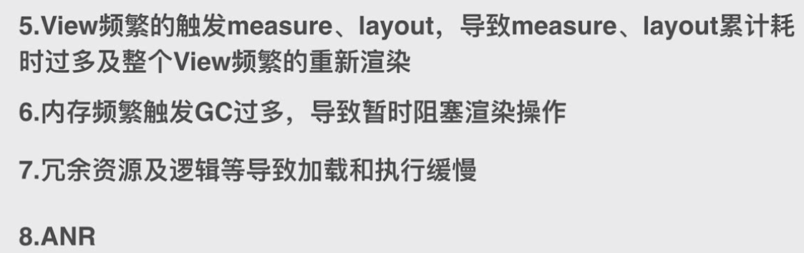

 

# anr

应用程序的响应性是由Activity Manager 和 WindowManager系统服务监听的。

问题：原理是什么？


# OOM

当前占用的内存加上我们申请的内存资源超过了 Dalvik虚拟机的最大内存限制就会抛出的Out of memory异常

**内存溢出/内存抖动/内存泄漏**


bitmapFactory的方法都是通过jni方法实现的，所以bitmap加载到内存是包含了Java和C两部分的

bitmap对象可以由虚拟机释放，但是c那部分的资源虚拟机是无法释放的，必须调用recycle来释放。


#### bitmap recycle

```
 /**
     * Free the native object associated with this bitmap, and clear the
     * reference to the pixel data. This will not free the pixel data synchronously;
     * it simply allows it to be garbage collected if there are no other references.
     * The bitmap is marked as "dead", meaning it will throw an exception if
     * getPixels() or setPixels() is called, and will draw nothing. This operation
     * cannot be reversed, so it should only be called if you are sure there are no
     * further uses for the bitmap. This is an advanced call, and normally need
     * not be called, since the normal GC process will free up this memory when
     * there are no more references to this bitmap.
     */
    public void recycle() {
        if (!mRecycled && mNativePtr != 0) {
            if (nativeRecycle(mNativePtr)) {
                // return value indicates whether native pixel object was actually recycled.
                // false indicates that it is still in use at the native level and these
                // objects should not be collected now. They will be collected later when the
                // Bitmap itself is collected.
                mNinePatchChunk = null;
            }
            mRecycled = true;
        }
    }
```

会释放和bitmap有关的native对象，同时会清理数据对象的引用。并不是立即清理，只是通知垃圾回收器。不可逆操作。可以不主动调用，垃圾回收期会处理。

#### LRU

最近最少使用


#### UI卡顿

60fps -> 16ms

overdraw 大量重叠





#### 内存泄漏

常见内存泄漏：

1，单例

2，匿名内部类

3，handler

4，避免使用static变量（如果进程常驻，那么会增加进程的内存使用，且容易被回收）

5，资源未关闭造成的内存泄漏

6，Asynctask造成的内存泄漏


#### 内存管理

 


